# 主成分分析(PCA)很简单！

> 原文：<https://medium.com/mlearning-ai/principle-component-analysis-pca-is-easy-f3ce0d64507f?source=collection_archive---------4----------------------->

# 介绍

这篇文章回顾了主成分分析( **PCA** )概念。PCA 是一种**特征**或**维度**缩减技术。特征是用于训练的每个数据样本的值。考虑下面的例子，我们希望有一个机器学习( **ML** )模型，用于根据房屋的其他特征预测其价格。这些特征被称为**特征**。特征也被称为尺寸。每个特征也可以被认为是一个轴，所以称它们为维度是看待正在发生的事情的另一种方式。

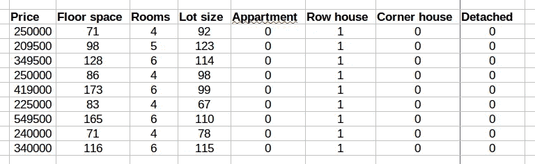

PCA 检测所有这些特征中最重要的特征。PCA 机制依赖于方差概念。在底线，主成分分析显示了 M 个主成分(最基本的特征)是否用于模型中，以及原始数据的多少方差将被保留。但是在这个介绍之后，每个人都会问我们为什么使用 PCA？

> PCA 是一种特征减少技术，因此我们将有一个较小的模型，因为我们检测到这些特征中的一些不影响我们的预测。知道这些之后，我们就可以收集和搜集更少的数据。从计算的角度来看，它可以提高效率和速度。简而言之，PCA 有助于在保持预测质量的同时减少所需的计算。

至此，我们知道 PCA 为什么好了。这是因为我们要为我们的模型做更少的计算。这种特征减少机制检测并显示保持数据方差的基本特征。下一步是看看它是如何工作的，以及当 PCA 总是伴随着方差时意味着什么。因此，在讨论 PCA 如何工作之前，需要回顾方差、协方差和协方差矩阵的概念。此外，很好地理解特征值和特征向量是必不可少的。

# 背景

本节回顾了一个人完全理解 PCA 所需的所有基本概念。

## 方差和标准差

方差是离差(分散)的度量，它度量一组数字从它们的平均值分散开多远。

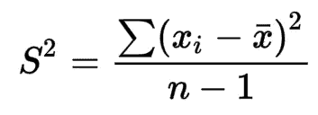

以下示例显示了红色和蓝色数据集如何偏离其平均值。标准差是方差的平方根。

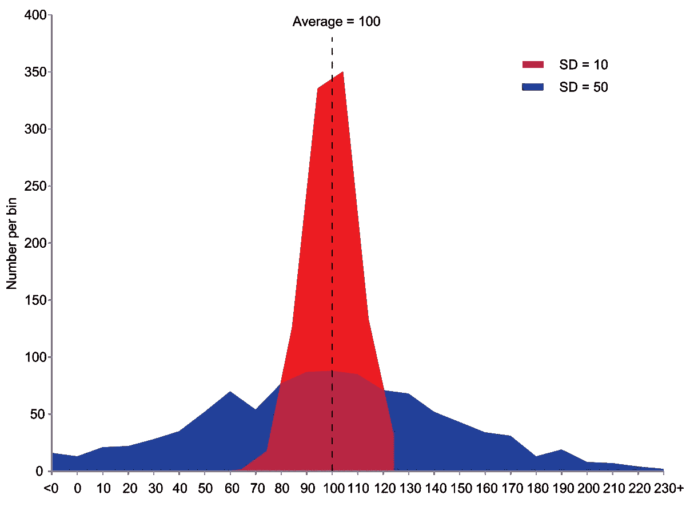

## 协方差

协方差是 co+方差。当“ **co** ”前缀与一个单词一起出现时，就给这道菜增加了一个集合的意思。协方差是两个变量的**联合可变性**的度量。

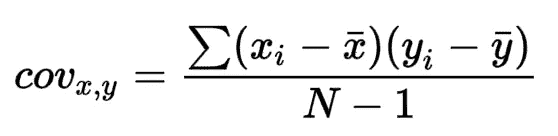

不同的协方差值说明了独立变量的数据是如何分散的。

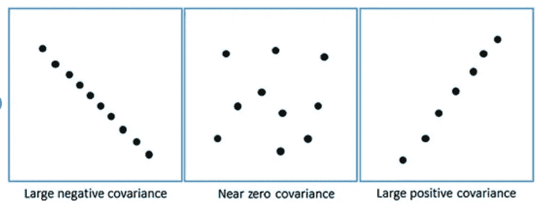

[https://www.researchgate.net/figure/52-Examples-of-covariance-for-three-different-data-sets_fig6_308007227](https://www.researchgate.net/figure/52-Examples-of-covariance-for-three-different-data-sets_fig6_308007227)

## 相互关系

相关性是指一对变量线性相关的程度。它是两个变量的协方差除以它们的标准差的乘积。

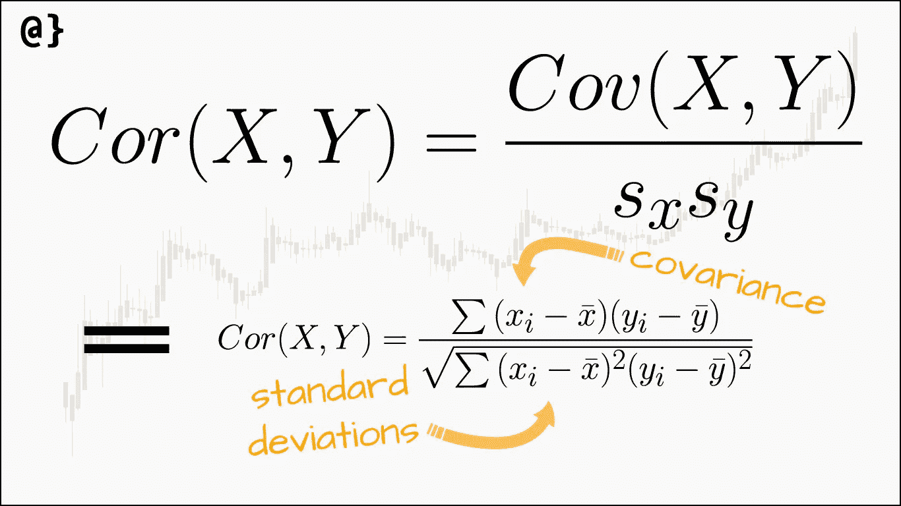

下图显示了相关性可以通过其值揭示什么。说到相关性，我们应该考虑**线性度**。


## 协方差矩阵

协方差矩阵是一个方阵，给出了一组给定变量(或向量/变量列表-特征)的每对元素之间的协方差。任何协方差矩阵都是对称的，其主对角线包含方差。请注意，每个变量与其自身的协方差就是该变量的方差。

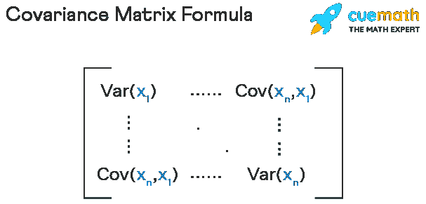

## 特征值和特征向量

变换(矩阵)的特征向量和特征向量显示了在该变换下这些向量缩放的向量和缩放因子。

将所有特征向量保存在一个矩阵中，以每列是一个特征向量的方式，我们建立一个变换矩阵，它的轴是特征向量。

# PCA 是如何工作的？

至此，我们已经回顾了掌握 PCA 工作原理所需的所有基本概念。

## 步骤 1:计算平均向量

第一步计算每个特征的所有样本的平均值。这是需要的，因为稍后我们会有一个协方差矩阵的特征向量系统。因此，在转换中，我们将需要数据集的平均值来移动新的坐标系。如果我们的数据集有 N 个特征，我们将有一个 N 元素平均向量。

## 步骤 2:数据集的协方差矩阵

在此步骤中，计算数据集的协方差矩阵。由于在这个矩阵中考虑了离差，所以因为这部分，我们提到 PCA 把数据的方差作为关键。如果我们有 N 个特征，我们将有一个 **N*N** 协方差矩阵。

## 步骤 3:计算数据集的特征向量和特征值

接下来，计算协方差矩阵的特征向量和特征值。我们将有一个 **N*N** 矩阵保持特征向量。然后，基于特征向量的特征值的大小对特征向量进行排序。这很重要，因为特征值显示了每个特征向量上的方差，我们称之为主分量( **PC** )。例如，下面的公式显示了每个特征向量关于其特征值的方差。它被称为**变化部分**。

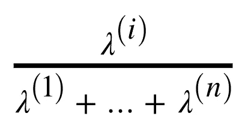

下面的公式显示了保留前 k 个主成分可以保留多少方差。它被称为**累积方差**。

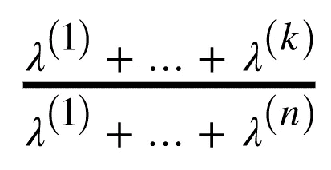

将保留特定数量的主成分的效果可视化后，该图如下所示:

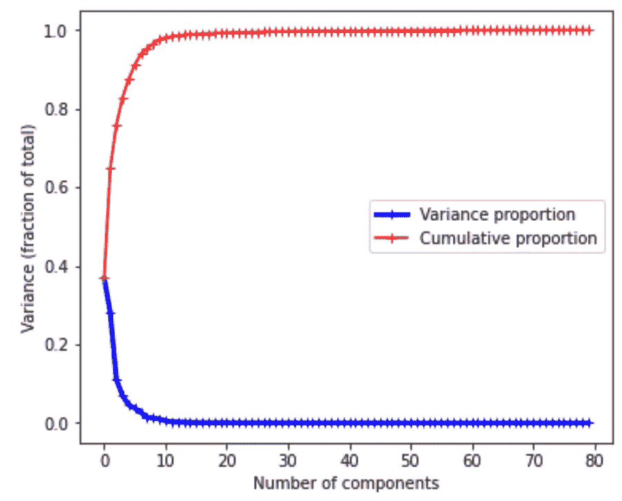

## 第四步:转换到潜在空间

在决定了用于保持原始数据的期望方差的主成分数之后，下面的公式显示了原始数据是如何变换的。使用均值向量的原因是协方差矩阵的特征向量需要代表数据集。因此，数据集被移动到新坐标系的中间。

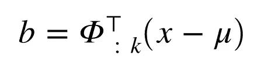

对于转移回原始空间:

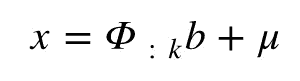

在下面的例子中，您可以发现如何使用 python 和 NumPy 库进行 PCA。

```
**def** mean_vec(dataset):
    mean_vector = []

    **for** i **in** range(dataset.shape[0]):
        tmp_mean_vector = np.mean(dataset[i, :])
        mean_vector.append(tmp_mean_vector)

    mean_vector = np.array(mean_vector) **return** mean_vector

**def** pca(dataset, k):
    *''''*
 *step 1: mean of features of all samples (it is assumed that features are on rows)*
 *step 2: calculating covariance matrix*
 *step 3: calculating eigenvalues and eigenvectors and sorting based on the eigenvalues*
 *step 4: choosing k vector to form the transformation matrix*
 *step 5: transforming the dataset with the transformation matrix*
 *'''*
    ***# step 1***
    mean_vector = mean_vec(dataset)

    ***# step 2***
    covariance_matrix = np.cov([dataset[i,:] **for** i **in** range(dataset.shape[0])])

    ***# step 3***
    eig_val_cm, eig_vec_cm = np.linalg.eig(covariance_matrix)

    ***# Make a list of (eigenvalue, eigenvector) tuples***
    eig_pairs = [(np.abs(eig_val_cm[i]), eig_vec_cm[:,i]) **for** i **in** range(len(eig_val_cm))]

    ***# Sort the (eigenvalue, eigenvector) tuples from high to low***
    eig_pairs.sort(key=**lambda** x: x[0], reverse=**True**)

    ***# step 4***
    matrix_w = np.hstack([eig_pairs[i][1].reshape(dataset.shape[0], 1) **for** i **in** range(k)])

    **return** matrix_w# consider you have a spreedsheet of data as **dataset**matrix_w = pca(dataset, 10)transformed_dataset = matrix_w.T.dot((dataset - **mean_vector**).T)
```

为了理解它，读它几遍，并尝试测试一些东西。最后，作为总结，请看下图，该图显示了使用 PCA 如何通过使用红色和蓝色作为新系统的基向量来将维度降低到 2。绿色的方差可以忽略不计，所以它是被搁置的候选者。

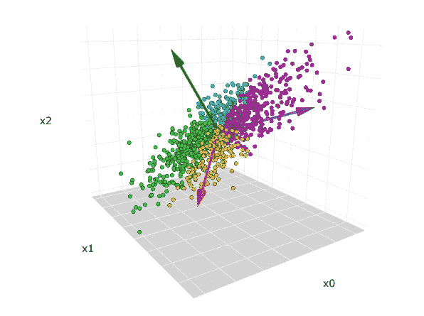

# 参考

[](https://en.wikipedia.org/wiki/Variance#:~:text=Variance%20is%20a%20measure%20of,fit%2C%20and%20Monte%20Carlo%20sampling) [## 方差-维基百科

### 在概率论和统计学中，方差是随机变量的方差的平方的期望值。

en.wikipedia.org](https://en.wikipedia.org/wiki/Variance#:~:text=Variance%20is%20a%20measure%20of,fit%2C%20and%20Monte%20Carlo%20sampling) [](https://en.wikipedia.org/wiki/Correlation) [## 相关性-维基百科

### 在统计学中，相关性或依赖性是两个随机变量之间的任何统计关系，无论是否是因果关系

en.wikipedia.org](https://en.wikipedia.org/wiki/Correlation) [](https://en.wikipedia.org/wiki/Covariance_matrix) [## 协方差矩阵-维基百科

### 在概率论和统计学中，协方差矩阵(也称为自协方差矩阵、离差矩阵…

en.wikipedia.org](https://en.wikipedia.org/wiki/Covariance_matrix) [](/mlearning-ai/mlearning-ai-submission-suggestions-b51e2b130bfb) [## Mlearning.ai 提交建议

### 如何成为 Mlearning.ai 上的作家

medium.com](/mlearning-ai/mlearning-ai-submission-suggestions-b51e2b130bfb)