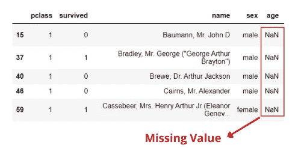
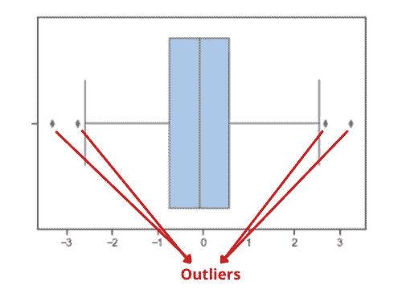
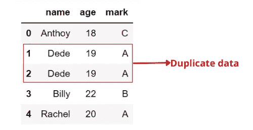

# 你应该知道的数据清理原则

> 原文：<https://medium.com/mlearning-ai/principles-of-data-cleaning-that-you-should-know-a5be9860e23?source=collection_archive---------1----------------------->

## 理解、原则和指南

Photo by [Towfiqu barbhuiya](https://unsplash.com/es/@towfiqu999999?utm_source=unsplash&utm_medium=referral&utm_content=creditCopyText) on [Unsplash](https://unsplash.com/s/photos/cleaning?utm_source=unsplash&utm_medium=referral&utm_content=creditCopyText)

# 介绍

在我们进行数据分析或创建机器学习模型之前，有一个非常关键的阶段，那就是**数据清洗**。数据清理是通过清除数据中的缺失值、离群值、数据重复等来提高数据质量的一个步骤。大多数数据科学家花费几乎 80%的时间清理数据以提高数据质量。

也许你们大多数人都读过术语*“垃圾进，垃圾出”*。因此，数据清洗非常重要，因为如果我们使用低质量的数据进行数据分析或创建模型，那么我们也会进行错误的分析，甚至产生糟糕的机器学习模型。执行数据清理可以让你的数据分析时间更加有效，防止你做出错误的结论。

本文将讨论在数据清理过程中必须做的关键事情，比如缺失数据、异常值、不一致数据、重复数据和无效数据。

# **1。缺失数据**

Figure 1\. Missing value (Image by author).

缺失数据是已经获得的一些数据的丢失。缺失数据在数据分析和现实世界的数据集中经常出现。这个问题可能是由多种原因造成的，例如由于记录错误或数据损坏导致的数据不完整。我们处理这个问题的解决方案是什么？我们不能就这样离开它，就像在我们的屋顶上留下一个洞。

我们首先必须观察数据中缺失的值，如零或 0、NAN、null、none、空字符串、NA 等。在你能够识别数据中缺失的值之后，然后问你自己，“缺失的值是否告诉了我一些有价值的东西？”。如果你认为答案是否定的，那么下面的方法可以帮助你处理缺失值:

*   删除包含缺失值的列或行。如果一行中缺少没有价值的值，那么您可以立即删除该行(例如，`age`、`gender`、`annual _income`、`spending_score`)。如果一列几乎完全被缺失的值填满，那么就删除它。但是，这种方法仅在缺失值与数据集相比很小的情况下有效，例如在 50000 的总数据量中有 20 个缺失值。
*   如果不想删除某些包含缺失值的列或行，可以使用插补方法。插补是一种用“最佳猜测”来填充缺失值的方法。插补方法分为两类:单一插补和多重插补。可以看这篇[文章](https://towardsdatascience.com/a-better-way-to-handle-missing-values-in-your-dataset-using-iterativeimputer-9e6e84857d98)了解更多关于插补的知识。
*   下一种方法是创建一个包含缺失值的新列。我们可以使用包含缺失值的新列作为新特征。

# **2。离群值**

Figure 2\. Spot outliers using a box plot (Image by author).

除了缺失值之外，离群值偶尔会出现在现实世界的数据集中。异常值是指超出预期范围且不同于其余数据的值(通常具有非常高或非常低的值)。异常值可能出现的几个原因，例如读取一百摄氏度的室温的传感器错误、输入数据(即儿童两米的身高)的错误以及无法避免的极端数据的存在。

我们如何识别我们的数据集是否包含异常值？有 3 种常用的方法来检测异常值，如使用 Z 分数的归一化、IQR(四分位间距)法和使用箱线图的可视化。在我们确定数据中的异常值后，可以使用以下方法来处理异常值:

*   从我们的数据中删除它们。在我们的数据中有离群值会搞乱我们的分析以及我们的机器学习算法的性能。使用 1.5 (IQR)上下移动从数据中删除它们。
*   将数据分段，使异常值位于单独的组中，或者我们可以将它们标记为异常值，并将其作为一个新要素包含在内。
*   保留异常值，并使用统计方法转换数据以减少异常值的影响。

# **3。数据不一致**

数据一致性至关重要；不一致的数据会阻碍我们的工作。`Banana`、`banana`、`bananas`意思相同，但写法不同。人类可能会理解`Banana` 与`banana`(大写问题)相同，后者与`bananas`(拼写错误问题)相同，但计算机认为这三者指的是三种不同的东西。人为错误可能导致数据不一致(即，没有输入数据的特殊规则)。

那么，我们如何发现不一致的数据呢？发现相同元素的不一致数据的最佳方法是可视化它们。通过每个类别的条形图或通过按类别计算行数来可视化数据。当发现数据中的不一致时，将所有元素标准化为相同的格式。

# **4。重复数据**

Figure 3\. Duplicate data (Image by author).

术语“重复数据”是指对于相同的观察点重复相同的值。重复数据在机器学习模型的开发中可能是无效的，并且它还可能导致模型曲解。合并来自同一来源的数据，用户提交两次或更多次信息，以及我们的数据收集代码关闭并多次插入相同的记录都可能导致数据重复。

当您在数据中发现重复项，并且意识到这些重复项没有价值时，您可以删除它们。另一种方法是比较相似的数据并获得最相关的信息。

# **5。无效数据**

数据清理过程中最不需要注意的就是无效数据。无效数据很难被计算机检测到，必须由人类来检测。例如，在我们的平台上花费了-5 个小时的用户，或者一个年龄为 180 岁的人。数据处理问题可能会导致无效数据(通常在要素准备或数据清理期间)。清除无效数据需要修改导致数据无效的函数和转换。如果这不可能，无效数据将被删除。

# **结论**

数据清理是任何数据分析或机器学习模型开发的关键步骤。现实世界的数据集并不总是干净的。因此，我们必须通过寻找缺失数据、异常值、不一致数据、重复数据和无效数据来清理数据。

# **参考文献:**

[1]阿尔邦，C. (2018)。机器学习与 Python 食谱:从预处理到深度学习的实用解决方案。奥莱利媒体。

[2]麦金尼，W. (2017)。用于数据分析的 Python:与 Pandas、NumPy 和 IPython 的数据争论。奥莱利媒体。

[3]罗德里克·J·利特尔和唐纳德·B·鲁宾(1986)。“有缺失数据的统计分析”。美国纽约州纽约市约翰·威利父子公司。

 [## 深度学习:使用 LSTM 预测确诊的新冠肺炎阳性病例

### 描述用于预测印度尼西亚新冠肺炎阳性病例的深度学习方法中的每个步骤

pub.towardsai.net](https://pub.towardsai.net/deep-learning-forecasting-of-confirmed-covid-19-positive-cases-using-lstm-8100fa230c7d)