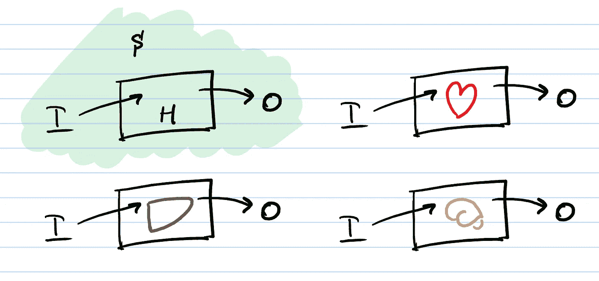
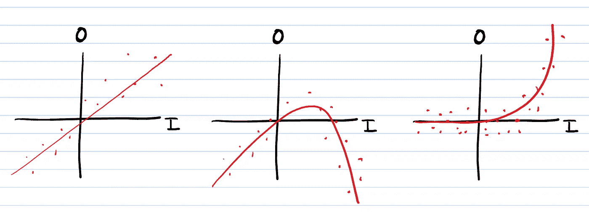
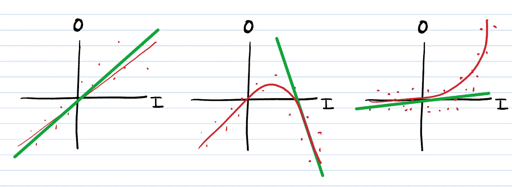
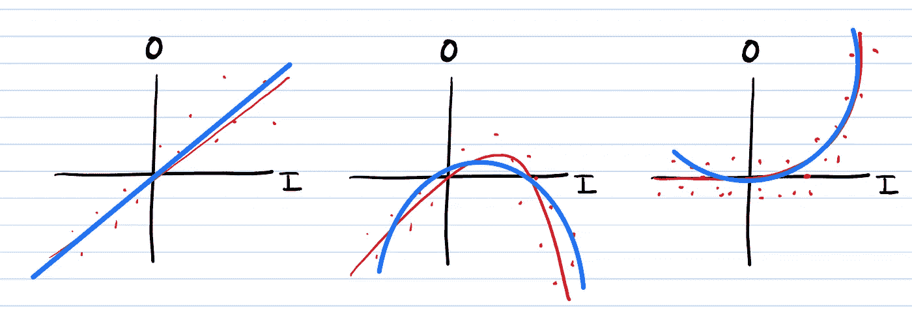

# 第 1 部分:系统综述

> 原文：<https://medium.com/mlearning-ai/principles-of-medicine-for-engineers-14b48dfb8e7c?source=collection_archive---------6----------------------->

## 工程师医学原理

## 更细致地研究医学体系

我刚刚完成第二步的学习，最近发现我通过了。虽然在 COVID 开始时我决定不申请住院医师资格，但在看到只能被描述为小丑车的东西后，我确实喜欢作为一名工程师接受医学培训。

Source: [https://tenor.com/view/steampunk-mechanical-heart-gif-3579322](https://tenor.com/view/steampunk-mechanical-heart-gif-3579322)

这很难，但我坚持自己的直觉:一小套基本原则应该足以解释我被告知要记住的大部分内容。

因此，这一系列是努力把我的新鲜出董事会考试的想法写下来。

## 本系列文章的目标是

这个系列文章只有一个目标:把我目前的 USMLE 后的大脑状态写在纸上，这样我就可以更好地组织它们，以备最终的教科书使用(lol sure)。或者至少在图表中回忆。

Source: [https://www.popsci.com/science/article/2010-09/q-can-brain-freeze-cause-long-term-brain-damage/](https://www.popsci.com/science/article/2010-09/q-can-brain-freeze-cause-long-term-brain-damage/)

我不会担心修饰，我会尽力组织概念，但我会尽量避免任何可能会减缓我短暂的医疗实力的完美主义。

所以让我们开始吧…

## 模糊模型

工程师是分阶段建立理解的，而不是零敲碎打。这意味着我们试图看到所有部分如何一起跳舞，然后稳步地使编舞越来越详细。但是，在所有阶段，我们都着眼于全局，而不是局部。

Engineers look at the full picture (or word) and then steadily bring it into focus. The blurry version can be considered a “first-order” understanding, while the crisp word is a higher-order. Image from: [https://giphy.com/gifs/work-focus-clear-l4FGHqrRZNPkfoLCw](https://giphy.com/gifs/work-focus-clear-l4FGHqrRZNPkfoLCw)

我想学习尽可能多的一阶原理。如果事情需要*二阶原理*或者更复杂，我笑着继续我的生活。

但是什么叫一阶而不是二阶呢？这些基本原则对系统级医学有什么意义？这些原则真的成立吗，或者它们只是应试的产物？

## 什么是系统？

首先，真正理解什么是*系统*是很重要的——他们可能不会真的在医学院教你这个，即使他们称他们的课程为“基于系统的医学”。

A system is a box around something you care about, which transforms a set of inputs into a set of outputs. We can do this with things like the heart, the liver, even the brain.

一个系统很简单:它是一个围绕着你认为你关心的东西的盒子，它是这个盒子的输入，也是这个盒子的输出。

## 什么是一阶原理？

该系统将输入转换成输出。所以我们可以说盒子*将*能量或信息从输入端转移到输出端。

这个*传递函数*可以采用多种形状中的一种:

Three different systems, each transforming an input I into an output O in a different way.

一阶原理很简单——从字面上看——因为它们是直线。让我们看看上面的三种形状，并对它们分别进行“一阶理解”。

First order (green) understandings of each system. Notice how the line has a little bit where it does a really good job. But when the system itself isn’t a line, it starts to wander away a little, then a lot.

在这三个系统中，我们看到可以添加一阶理解。但是，除非系统本身是一条线，否则一阶理解可能会非常非常错误。

很多时候，这样是可以的。但有时这并不好…

## 什么是二阶原理？

二阶原理是任何高于一阶原理的东西——任何比一条简单的线更复杂的东西。

我喜欢用这个比喻把东西放在多项式的空间里:我的二阶原理是二次函数。

Second-order principles (blue) have an extra term in them that lets them bend around more. This means that they can be straight lines by setting the bend = 0\. Or they can bend to better capture our more curvy systems. The keen observer will note that the blue lines are not parabolas — my drawing software has its limitations…

二阶原理有一个额外的部分:柔韧性。这种灵活性可以用来弯曲成数据，并更好地跟踪它。重要的是，二阶原理**包含所有一阶原理**。我可以让二阶原理看起来像一阶原理。

这看起来很琐碎，但实际上是解决问题过程中非常重要的一部分。我们以后再看。

## 摘要

在第一篇文章中，我概述了什么是系统，以及如何用一阶和二阶原理来理解系统。

我们还没有讲到药物部分，所以你可能会非常非常困惑，这和药物，甚至是第二步有什么关系。

接下来我们将开始构建医学的基本原理:[(病理)生理学](https://virati.medium.com/part-2-physiology-and-its-pathological-perturbations-636c436cddca)。

 [## Mlearning.ai 提交建议

### 如何成为 Mlearning.ai 上的作家

medium.com](/mlearning-ai/mlearning-ai-submission-suggestions-b51e2b130bfb)