# 机器学习的概率

> 原文：<https://medium.com/mlearning-ai/probability-for-machine-learning-339ab0d575bc?source=collection_archive---------4----------------------->

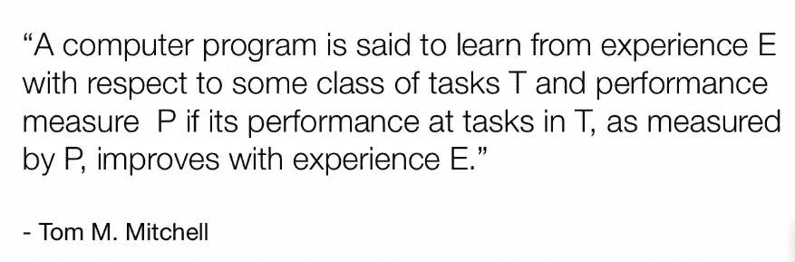

# 概率论

概率论为不确定性的量化和处理提供了一个一致的框架。我们必须用什么方法来处理不确定性？

*   我的测量不确定，因为有噪音
*   与数据集有限大小相关的不确定性

当我们谈论概率论时，我们可以假设:

*   一种**频率主义者的解释**，在这种情况下，概率被定义为一个事件在实验中发生的次数的分数。我们将观察随机变量，我们只需计算特定事件发生的次数——然后这就定义了一个概率，你可以用它来预测未来
*   一种**贝叶斯方法**，在这种情况下，概率具有合理性或信念强度的量化意义——在某种程度上，这是一种更基于建模的方法，也更通用一些

当我们谈论概率时，我们是在处理**随机变量**。这些是从一组可能的结果中取样的随机变量，这意味着每次我对这样的 x 进行观察时，它会出现在这组可能的值 x 中的一个值。这个变量可以是离散的，也可以是连续的，它总是带有一个概率分布，该分布为特定事件 x 的发生分配概率。

概率在机器学习中对我们很重要，因为泛化的思想是过去是未来的预测。也就是说，我们真的相信我们可以查看一堆训练数据，并对我们从未见过的数据做出有趣而有用的预测。

那么，为什么泛化是可能的呢？这是可能的，因为我们愿意致力于构建我们期望一次又一次看到的数据。也就是说，为了概括，我们必须对世界的结构做出假设。有许多不同的方式来说明这些类型的假设，但最强大的框架之一是概率计算

思考噪音和不确定性在这样的问题中发挥作用的所有不同方式是有帮助的。

*   我们可能有嘈杂的数据
*   环境可能是随机的
*   由于训练数据有限，不确定最佳参数应该是什么
*   你的模型不可能完美地代表你正在研究的东西
*   进行预测的计算量有限

> 事实证明，根据随机变量和概率来推理这些过程非常有帮助。

即使在相对简单的分类设置中，我们仍然喜欢谈论概率。例如，设想为动物构建一个简单的图像分类器。在训练和测试时，能够用概率来表示它的预测，而不是说“肯定是一只猫”或“肯定是一只狗”，这是很有帮助的。相反，这些分类器将概率分布放在不同的可能标签上。理想情况下，当遇到一个合理的模糊数据时，分类器可以表示它的不确定性。

回归提供了另一种思考方式。想象一下，我们正试图模拟一个用虚线表示的真实函数。我们观察到三个用黑圈表示的数据。鉴于我们只有三个观察值，有许多不同的函数可以解释这些数据。不要只致力于一个功能，尝试表示证据支持的所有可能的功能是有帮助的。然后，当我们做预测时，我们考虑了所有这些对世界的可能解释。事实证明，这也为我们提供了一个很好的方法，用新的观察来更新旧的信息，理想情况下，我们能够将所有这些假设归结为我们可能在新位置看到的事物的分布。

# 概率密度和质量函数

概率论使我们能够对我们的不确定性进行推理。决定我们如何处理特定随机变量的一个关键区别是它是离散的还是连续的。

如果我们在处理一组有限的可能值，比如动物分类模型中的分类标签，那么这就是一个离散的随机变量。但是离散随机变量也可以应用于无限的目标空间，特别是可数无限的，就像自然数一样。

我们在日常生活中对概率的一些直观概念转移到了离散概率上，我们可以将分配给每个可能状态的概率视为该特定状态可能发生的次数的一部分。例如，假设很晚了，我们又累又饿，我们从冰箱里随机挑选一个水果，挑选任何一个特定水果的机会都是均等的。如果我们有三个苹果，一个梨和四个橘子，选择每种水果的概率分别是 3/8，1/8 和 1/2。

我们用概率质量函数或 PMF 来表示这些，本质上是每个可能状态的概率列表。对于任何离散分布，概率必须都在 0 和 1 之间，并且总和为 1。关于符号的快速注释。我们用这两个来表示随机变量大 X 取特定值小 X 的概率:

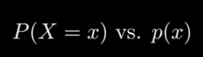

当我们有多个离散随机变量时，我们可以把联合分布想象成一个表，其中“ij”项包含“Xi”和“Yj”出现的概率。如果我们定义一个新的随机变量 Z 为元组(X，Y)，那么 Z 的目标空间是 X 和 Y 的目标空间的笛卡尔乘积。

连续随机变量可能比它们的离散对应物稍微复杂一些。我们用概率密度函数或 PDF 来表示连续设置中的分布。概率密度函数告诉我们如何计算区间上的概率；我们说 X 在值 A 和 B 之间的概率是从 A 到 B 的 PDF 的积分——也就是从 A 到 B 的函数下的面积。

*和概率质量函数一样，概率密度函数也带有一些约束条件。PDF 必须总是非负的，并且 PDF 在所有实数上的积分必须等于 1。*

# 概率空间和随机变量

我们构建一个概率空间，以便正式推理不同结果的渐近频率的种类。有三个主要成分，因此，概率空间有时被称为概率三元组。

第一个要素是一个*样本空间*，我们用ω表示，这是所有可能发生的事情的集合；它可以是一个有限或无限的集合，当它是一个无限的集合时，它可以是可数或不可数的。第二个要素是我们所谓的*事件空间*，这里表示为书法 A；这是样本空间ω中的一组集合。最后一个要素是*概率度量*，它是一个函数，将事件空间的成员转化为 0 到 1 之间的数字，我们将其解释为概率:

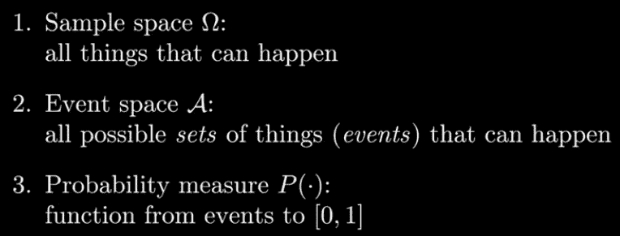

*   有限样本空间的一个例子是滚动两个六面骰子的所有可能结果的集合；不可数无限样本空间的一个例子是沿着单位圆边缘的所有点的集合
*   事件空间是ω的子集的集合。ω的两个非常重要的子集是空集和ω本身
*   概率度量只是一个函数，它获取事件空间的成员，并为它们分配一个介于 0 和 1 之间的大小。尺寸的概念需要满足一些直观的性质:

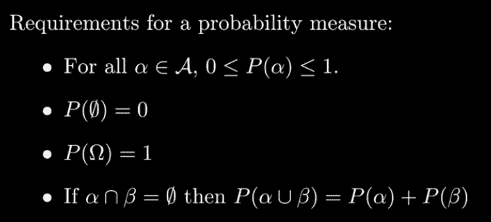

每一个事件空间都包含空集和所有的 Omega，它们分别需要有测度 0 和 1。我们需要的另一个性质是，如果我们有两个不相交的集合，那么它们的并集的概率测度必须等于分别采取的两个概率测度之和。

对于一个有限的样本空间，通常将事件空间视为样本空间的幂集，即ω的所有子集的集合。然后，我们可以通过给 Omega 的每个成员分配一个概率来完全指定概率度量——这就是我们通常所说的概率质量函数。

连续样本空间中的情况当然要复杂一些；这里，我们需要某种函数，它可以取ω的任何表现良好的子集，并产生一个介于 0 和 1 之间的数

现在我们已经构建了一个概率空间，我们最终可以构建一个随机变量。随机变量是从ω到另一个空间的函数。我们将随机变量与概率联系起来的方式是，我们考虑 T 的任何子集的原像。如果 T 的某个子集 s 的概率我们想要推理，那么我们考虑它在映射 X 下的ω中的原像，也就是说，我们看ω的子集，如果你应用 X 将导致集合 s，我们把它表示为函数 X 的逆，所以当我们谈论集合 s 的概率时，我们谈论的实际上是ω中的原像的概率，我们倾向于理所当然地认为原像是事件空间的成员。

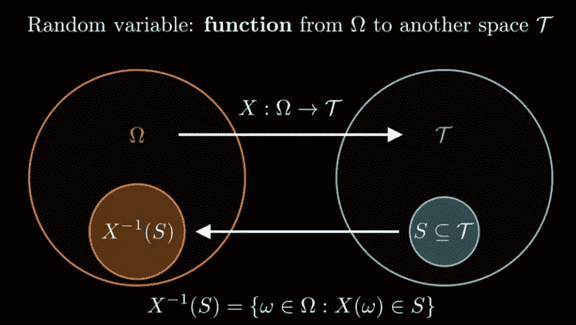

# 联合概率基础

当谈到多个变量的概率分布时，我们最基本的概念之一就是边缘化。

当我们计算联合概率分布中某个变量子集的边际分布时，我们计算的是，如果我们只关注那个变量子集，我们会得到的分布。也就是说，想象一下，你有来自 x 和 y 的样本，但是有人把所有的 y 都扔掉了。最终的分布将是 X 上的边际分布:如果我忽略 Y，我会得到 X 的什么分布？

如果我们有两个变量 X 和 Y 的联合分布 P(X，Y ),那么我们可以得到的两个边际是 P(X)和 P(Y)。对于离散分布，我们通过对我们不感兴趣的变量求和来计算边际。这有时被称为概率求和规则:

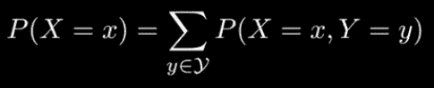

这个橙色表面代表 X 和 y 上的联合概率密度函数。如果我们在两个轴上分别积分这个 PDF，我们将得到两个概率密度函数，分别代表 X 和 y 的边界 P

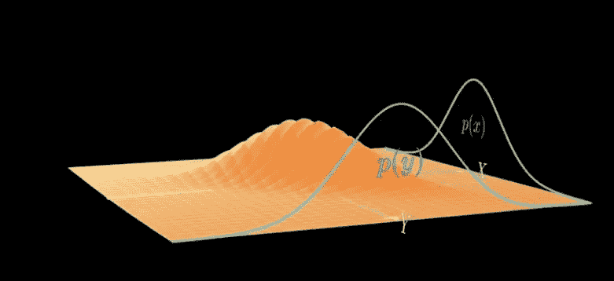

已经建立了边际分布的概念，我们现在可以定义条件分布。条件分布固定变量的子集，然后询问剩余变量的最终密度。对于离散和连续变量，我们通过将联合分布除以相关边际得到条件分布。唯一的区别是我们是求和还是积分来计算边际:

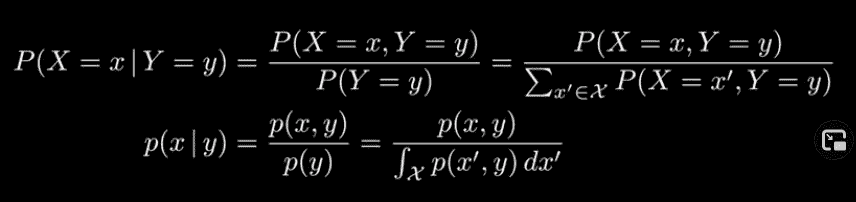

当我们讨论条件分布时，我们会说，给定 Y，X 的概率，我们用竖线来表示。P(X|Y)。

通过将联合分布除以边际来计算条件分布也可以称为乘积规则:

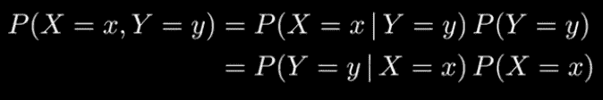

我们将两边乘以 Y 的边际 P，当然，我们也可以通过调整 X 来进行分解。著名的贝叶斯法则实际上就是取右边的两位，然后除以 Y 的边际值:

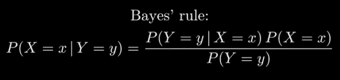

贝叶斯规则在统计学和机器学习中得到很多关注的原因更多的是关于随机变量的解释，而不是方程本身。具体来说，当有人谈到贝叶斯时，他们说的是他们愿意使用贝叶斯规则来构建参数的分布:

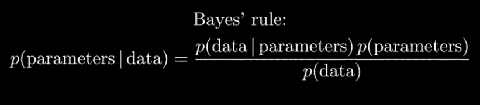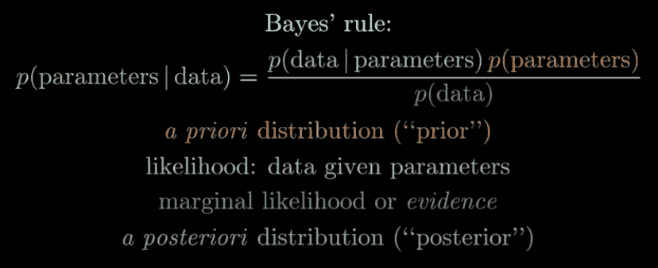

也值得谈一谈期望。概率分布下函数的期望值是从该分布中抽取样本时该函数的平均值。对于离散随机变量，你对 f(X)的所有可能值取一个 P(X)加权的和:

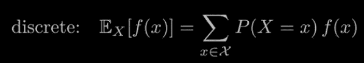

在连续的情况下，您可以进行积分:

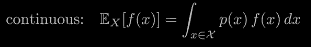

期望有一些重要的属性，你应该一直记在心里。第一个是期望是线性的。也就是说，加权和的期望是期望的加权和:

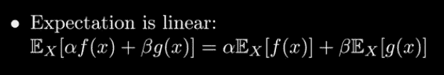

另一件要记住的事情是，两个随机变量的乘积的期望通常不等于期望的乘积。重要的情况是当两个随机变量是独立的:

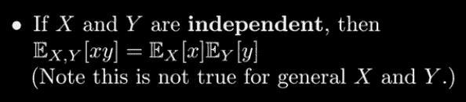

机器学习中经常出现的期望值的另一个属性是詹森不等式。它说应用于期望的凸函数总是小于或等于该函数的期望:

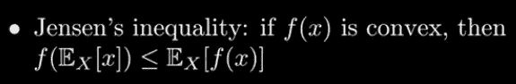

我们也来谈谈方差的性质。

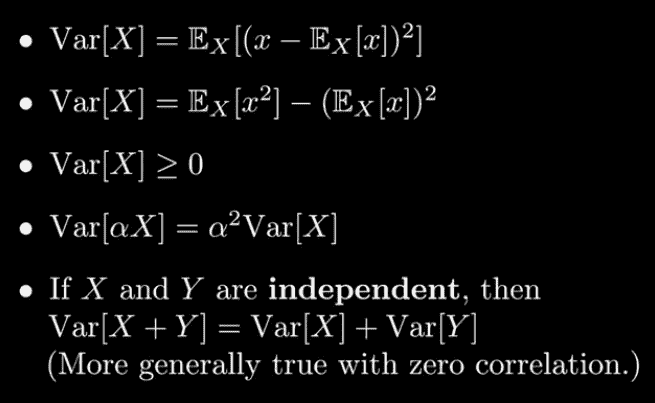

*   方差是均值的预期方差
*   方差等于期望的平方和期望的平方之差
*   差异总是非负的
*   方差通常不是线性的，如果我把一个随机变量的方差乘以一个标量，那么我得到的是这个随机变量的方差乘以这个标量的平方
*   知道独立随机变量之和的方差等于两个独立随机变量的方差之和也是有用的

最后说一下协方差。在概率中，协方差是两个随机变量的联合概率的度量。它描述了这两个变量如何一起变化。它被表示为函数 cov(X，Y)，其中 X 和 Y 是所考虑的两个随机变量。协方差计算为期望值或每个随机变量与其期望值之差的乘积的平均值，其中 E[X]是 X 的期望值，E[Y]是 Y 的期望值。

cov(X，Y) = E[(X — E[X])。(Y — E[Y])]

# 独立和依赖

随机变量之间的独立性是指这两个变量互不影响；形式上，这意味着两个随机变量的联合分布分解成两部分。这两部分中的每一部分都是一个变量的分布:

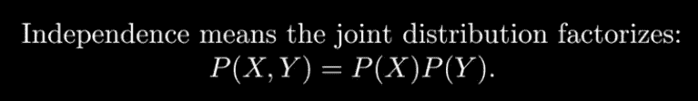

这也意味着两个条件分布等于它们的边际。这与直觉一致，即知道两个变量中的一个并不能说明另一个。

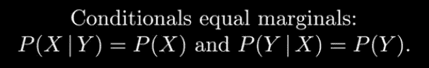

为什么？

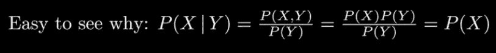

独立性也意味着两个随机变量的乘积的期望等于期望的乘积:

 [## Mlearning.ai 提交建议

### 如何成为 Mlearning.ai 上的作家

medium.com](/mlearning-ai/mlearning-ai-submission-suggestions-b51e2b130bfb)