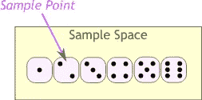
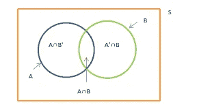
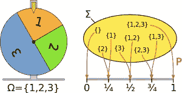
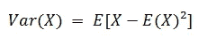
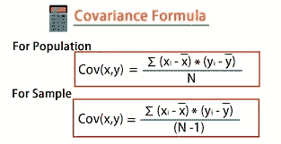
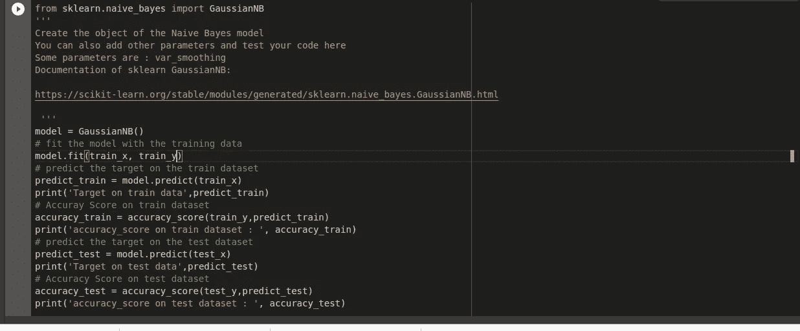

# 概率——机器学习算法的基石。

> 原文：<https://medium.com/mlearning-ai/probability-the-bedrock-of-machine-learning-algorithms-a1af0388ea75?source=collection_archive---------2----------------------->

Probability of an event occurring

概率、统计和线性代数是机器学习中最重要的数学概念之一。它们是机器学习算法的基础。在这篇文章中，我将讨论概率，它在机器学习中的应用以及概率在朴素贝叶斯算法中的作用。

概率在机器学习中的应用在现实世界中非常重要，因为我们需要在信息不完全的情况下做出决策。我们需要能解释不确定性的东西，通过概率，我们可以对不确定性的元素建模。

当数据科学家做出预测时，他们是在处理概率。这就是为什么学习概率和统计概念对数据科学家如此重要。当你理解了*为什么会起作用*时，你就更容易为你试图解决的问题找到正确的统计技术或计算方法。让我们深入研究概率及其在数据科学和机器学习中的一些应用。

# **什么是概率？**

概率是事件发生的可能性。概率论是一种数学框架，它允许我们以逻辑合理的方式分析偶然事件，如掷骰子的结果、掷硬币的结果、明天的天气、NBA 比赛的结果等。为此，我们将感兴趣的现象建模为具有几个(可能是无限个)互斥结果的实验。通过将实验结果映射到数字上，概率可以用数字来表示。这个数字始终介于 0 和 1 之间，其中 0 表示不确定性，1 表示确定性。

# 概率空间

概率空间由样本空间、事件集和概率测度组成。

## 样本空间(ω):

这是所有可能结果的集合。数学中的集合是元素的独特集合。比如骰子的样本空间是:S= {1，2，3，4，5，6}，一个股价运动的样本空间可以是 S ={Increase，Same，Decrease}。样本空间可以是一个无限集合。例如，一个国家的人口是不断变化的，它是一个具有无限可能性的随机数。

Sample Space

## 事件集(F *):*

这是一个包含结果组合的集合。这意味着，如果我们给某些事件分配一个概率(*明天多云或者明天晴朗*)，我们也必须给它们的补充分配一个概率(*明天不会多云或者明天不会晴朗*)以及它们的结合(*明天多云或者晴朗*)。它是样本空间子集的集合。

A set that contains a combination of outcomes

## 概率测度(P):

这为事件集中的事件分配了概率。概率可以是 0 到 1 之间的任何值。需要记住的主要一点是，它是一个不能大于 1 的非负数。值 1 意味着该事件肯定会发生，而值 0 意味着该事件永远不会发生。例如，掷出一个不偏不倚的公平骰子可以产生 6 种可能结果中的一种，这意味着每种结果都有 1/6 的概率。所以得到 5 的概率是 P(5) = 1/6。事件发生的可能性越大，概率度量就越大。

P depicts Probability Measure in this image

# 重要的概率规则

*   当掷一枚标准的公平硬币时，正面的概率 P(正面)是 0.5，反面的概率 P(反面)是 0.5。正面和反面都是两种可能的结果。概率度量的总和是 1
*   事件的补(事件不发生的概率)是 1-P(e)。其中 P(e)是事件发生的概率。
*   一个事件*多云*或*晴朗滑雪发生*的概率是 P(A) U P(B) = P(A) + P(B)
*   天空*多云*和*下雨*的概率是 *P(C 和 R) = P(C) x P(R|C)。*这是贝叶斯法则，是用于构建机器学习算法的公式之一。 ***|'*** 它暗示天空多云和下雨*的概率是天空多云*的概率乘以天空下雨*的概率*假定是*多云*。P(R|C)是条件概率。**

## 期望:

期望提供了一种对中心性的衡量。随机变量的期望值是一个试图捕捉随机变量分布中心的数字。更准确地说，它被定义为随机变量支持中所有可能值的概率加权和，

> *∑ ₓ pₓ(x)*

如果随机变量是连续的，那么期望是

> ∫ *xf(x)dx*

## 方差和协方差:

方差是随机变量与其均值或期望值的偏差的平方。

Variance formula

协方差是两个随机变量之间关系的度量。该指标评估变量一起变化的程度。换句话说，它本质上是两个变量之间方差的度量。

Covariance formula

# 概率在机器学习中的一些应用

## 采样—处理非确定性过程

概率是抽样的基础。在机器学习中，不确定性可能以多种方式出现，例如，有噪声的数据。概率为不确定性建模提供了一套工具。噪声可能是由于观测值的可变性、测量误差或其他来源引起的。

除了样本数据中的噪声，我们还应该考虑偏差的影响。即使对观测值进行了均匀采样，即采样中没有假设偏差，其他限制也会引入偏差。例如，如果我们从特定的比赛中选择一组参与者。根据定义。样本偏向那个种族。我们可以通过在数据中包含更多的种族来扩大样本范围和数据的变化。我们需要平衡方差和偏差，以便选择的样本能够代表我们试图建模的任务。

## 模式识别

模式识别是机器学习的另一个重要部分。我们可以从贝叶斯的角度将机器学习视为模式识别问题。在模式识别中——Christopher Bishop 采用贝叶斯观点，并针对精确答案不可行的情况提出了近似推理算法。出于上面列出的相同原因，概率论是模式识别的关键部分，因为它有助于适应噪声/不确定性和样本的有限大小，还可以将贝叶斯原则应用于机器学习。

## 训练—用于最大似然估计

像最大似然估计(MLE)这样的许多迭代机器学习技术都是基于概率论的。MLE 用于线性回归、逻辑回归和人工神经网络等模型的训练。

## 开发特定的算法

概率构成了像朴素贝叶斯分类器这样的特定算法的基础。我们将在本文中简要讨论这个分类器。

## 超参数优化

在神经网络等机器学习模型中，超参数是通过网格搜索等技术来调整的。贝叶斯优化也可以用于超参数优化。

## 模型评估

在二元分类任务中，我们预测一个单一的概率分数。模型评估技术要求我们根据预测的概率来总结模型的性能。例如，像[测井损失](http://wiki.fast.ai/index.php/Log_Loss)这样的聚合测量需要理解概率论。

# **朴素贝叶斯分类器中的概率**

朴素贝叶斯分类器是在给定一组属性的情况下预测类值的程序。对于每个已知的类值，分类器执行以下操作:

*   根据类值计算每个属性的概率
*   使用乘积规则获得属性的联合条件概率。
*   使用贝叶斯规则推导类变量的条件概率。

一旦对所有的类值都完成了这一步，它将输出概率最高的类。

A pictorial representation of Naive Bayes classifier in action

感谢您的阅读，请在评论区留下您的评论。这篇[文章](https://www.datasciencecentral.com/profiles/blogs/understanding-the-applications-of-probability-in-machine-learning#:~:text=Probability%20is%20a%20measure%20of,make%20decisions%20with%20incomplete%20information.&text=Using%20probability%2C%20we%20can%20model,and%20many%20other%20business%20processes)参考了概率在机器学习中的应用。