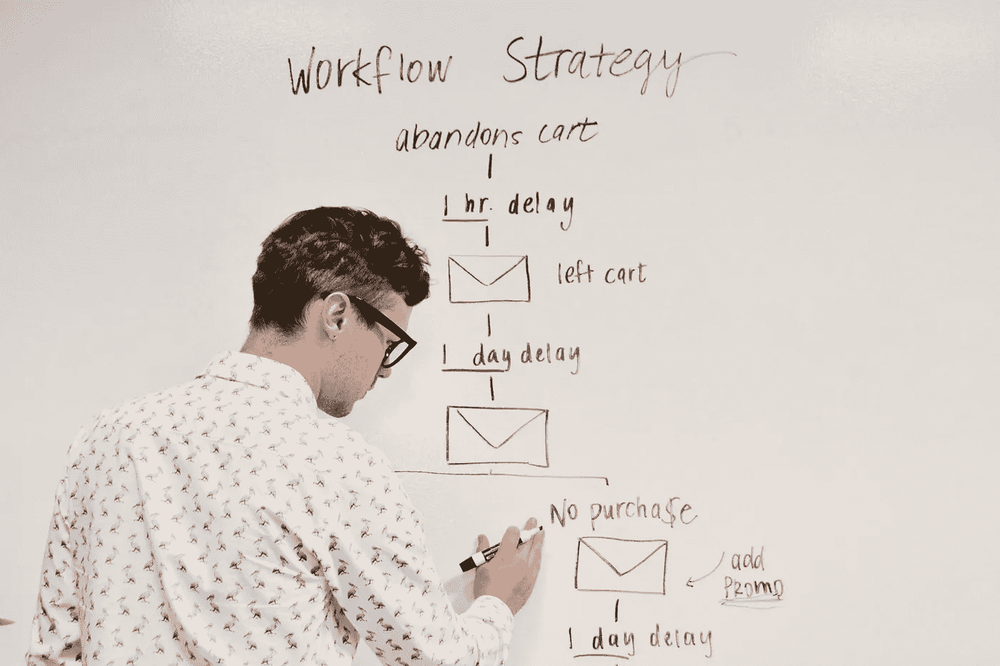
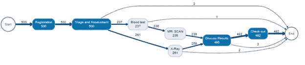
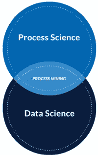

# 流程挖掘

> 原文：<https://medium.com/mlearning-ai/process-mining-1b275783f85e?source=collection_archive---------2----------------------->

Photo by [Campaign Creators](https://unsplash.com/@campaign_creators) on [Unsplash](https://unsplash.com/)

# 什么是流程挖掘？

随着互联设备的爆炸式增长,“物联网”或“IoT”一词已广为人知，但随着公司信息系统和数据的持续快速增长，与其业务流程中的活动相关的数据记录也在快速增长。这些活动的特定发生或实例被称为事件，并且可用事件数据的不断增长的广度被称为“IoE”或“事件互联网”。随着公司寻求了解如何最好地提取和理解与业务及其流程相关的 IoE，他们发现传统的业务流程管理方法和工具(BPM、BI 等)。)不仅昂贵费时，而且可能过于理想化，与现实脱节。如果公司想要可靠地分析、改进和管理他们的过程，他们需要能够依靠更具体的信息和分析来源。这就是流程挖掘的用武之地。在本文中，我们将涵盖什么是流程挖掘，如何利用它，以及它与其他关键学科(如流程自动化)的关系，以加速业务转型。

Hospital visit process map*

作为过程科学[1] **更广泛学科的一部分，过程挖掘可以理解为一种分析技术或工具，它利用数据挖掘[2]和基于模型的过程分析，通过分析事件数据来发现或“挖掘”以前隐藏的关于业务过程当前状态的洞察力。**

如前所述，事件是活动的特定实例，虽然其中一些活动是定义的业务流程模型中的工作单元，但许多不是。根据被 Gartner 称为“流程采矿之父之一”的 Wil van der Aalst 教授的说法[3]，

> 事件可能发生在机器内部(例如，x 光机、ATM 或行李处理系统)、企业信息系统内部(例如，客户下订单或提交纳税申报单)、医院内部(例如，血液样本分析)、社交网络内部(例如，交换电子邮件或 twitter 消息)、运输系统内部(例如，登记、买票或通过收费站)等。事件可以是“生活事件”、“机器事件”或“组织事件”。[4]

由于这些事件几乎可以在任何地方发生，事件数据通常从各种来源收集，但最常见的是数据库、消息日志、ERP、CRM、BPMG 等。然后，这些数据被进一步组织、丰富和过滤到称为事件日志的特定视图中，这些视图可以作为流程挖掘的起点或“原材料”。数据挖掘更广泛地从各种类型的数据集开始，流程挖掘特别从事件日志数据集开始，但也利用高级数据科学方法和工具(AI、ML 等)。)并从模型驱动、过程科学的角度应用它们。作为过程科学和数据科学方法的混合的过程挖掘的独特方法是 Wil van der Aalst 教授称之为过程挖掘的原因，

> "一种弥合数据科学和过程科学之间差距的方法."[4]

# 应用和优势

使用这种方法，流程挖掘允许公司通过提取事件数据可靠地了解其业务中发生的事件，然后将这些数据与定义的流程模型相关联，或者实际发现并生成新的流程模型(ABPM)。

通过将事件日志数据与流程相关联，企业不仅可以自动发现和生成新的流程模型(“ABPD”，即自动化业务流程发现)，还可以评估和增强现有模型，并持续有效地管理这些模型。从识别和诊断流程偏差和瓶颈到制作动画或生成预测模型，甚至更准确地记录流程，流程挖掘帮助企业更好地了解和掌握他们的流程。

> 流程挖掘的思想是通过从当今系统中容易获得的事件日志中提取知识来发现、监控和改进真实的流程(即，不是假设的流程)
> 
> **——威尔·范德阿尔斯特【4】**

过程挖掘的另一个主要好处是它与过程自动化和工作流管理的过程科学工具的联系。由于流程挖掘有助于提供现实和最新的流程洞察，公司可以更有效地确定其组织中哪些流程将产生最大的自动化 ROI。Gartner 的“流程采矿市场指南”指出，

> “在大多数情况下，任务是流程和操作的一部分，变化是其最常见的特征。通过准确地评估这些任务所属的过程，我们可以识别组织中的“热点区域”,在这些区域中，大量的努力被浪费在重复的任务中。然后，我们可以看看这些任务是否可以通过 RPA 部分或完全自动化。这就是**流程挖掘可以完美补充 RPA 的地方，以提供更广泛的背景并帮助实施该任务自动化**，从而产生长期可持续的业务价值，并避免当前着眼于大量一次性成本节约的缺点”[3]

因此，流程挖掘不仅有助于初步确定自动化哪些任务或流程以产生最大的投资回报，而且有助于可持续的投资回报设计，因为它为公司提供了更广泛的背景，使其自动化任务可以预先运行，并提供有效的性能和一致性分析，以便自动化任务可以在实施后得到更好的管理，并根据需要快速进行微调。

> “流程挖掘通过可视化和理解流程上下文提高了任务级自动化(如 RPA)的成功率，因此当流程发生变化时，自动化任务可以适应，并且不会失去相关性。此外，流程挖掘有助于发现并优先考虑任务级自动化的机会。”[3]

# 结论

总之，如果公司希望获得一个现实的视图并更牢固地掌握他们的流程，他们将需要在某种程度上采用流程挖掘，并通过将流程挖掘的一些主要优势(即自动化流程发现和准确的性能和一致性分析)与 RPA 等流程自动化工具相结合，公司可以超优化他们的流程建模、监控和执行，从根本上转变他们的运营和业务方式。

# 参考

*作者使用 R 语言创建的医院就诊流程图，显示了流程中的活动以及它们之间的流程。节点的颜色和箭头的粗细表示最频繁的活动和流程流。

[1]“过程科学”是指结合信息技术知识和管理科学知识来改进和运行操作过程的更广泛的学科[阿尔斯特·韦尔·范德。过程挖掘数据科学在行动。斯普林格，2016。](https://mysticriverconsulting-my.sharepoint.com/:b:/g/personal/tyler_teschon_mysticriver_consulting/EQfg1N7pVOxIqjAX2-ByACgBVIXHyAU5bZZ30axZIvwalg?e=DtadKa)

[2]“数据挖掘可以定义为“对(通常是大型的)数据集进行分析，以发现未被怀疑的关系，并以对数据所有者既可理解又有用的新颖方式对数据进行总结”。过程挖掘数据科学在行动。斯普林格，2016。

[3] [凯瑞曼斯，马克。"流程采矿市场指南."高德纳，2018 年 4 月 3 日](https://mysticriverconsulting-my.sharepoint.com/:b:/g/personal/tyler_teschon_mysticriver_consulting/EeDI8vMKxy1Gnnyn4sG4MvEB8XMRDddvQ5AvRp4595Xcvw?e=4ri5an)，[www.gartner.com。](http://www.gartner.com.)

[4] [阿尔斯特，威尔·范德。过程挖掘数据科学在行动。斯普林格，2016。](https://mysticriverconsulting-my.sharepoint.com/:b:/g/personal/tyler_teschon_mysticriver_consulting/EQfg1N7pVOxIqjAX2-ByACgBVIXHyAU5bZZ30axZIvwalg?e=qcMbWR)