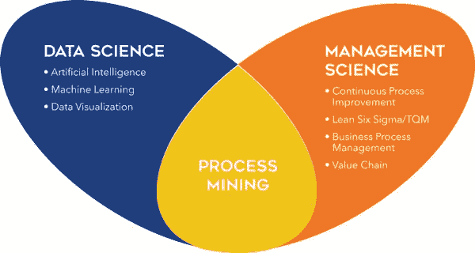
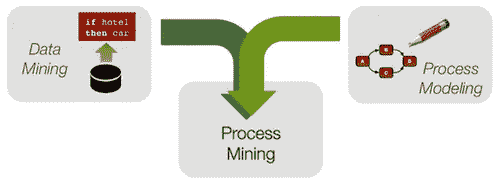
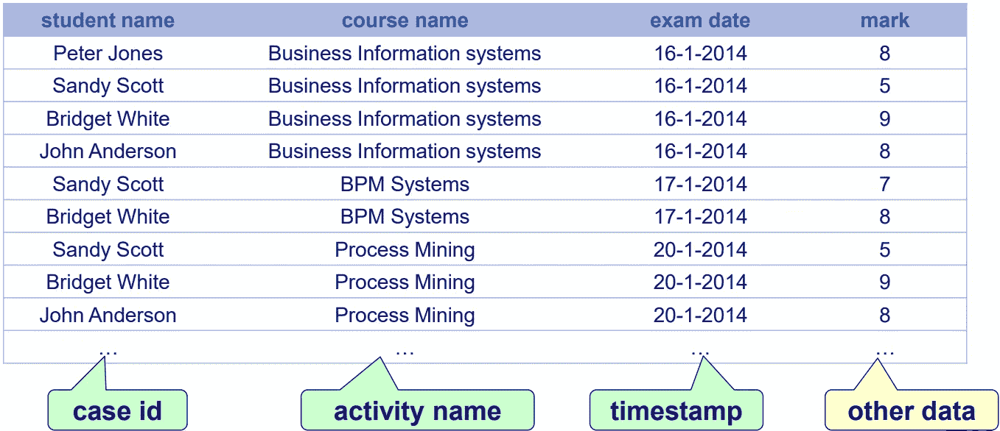
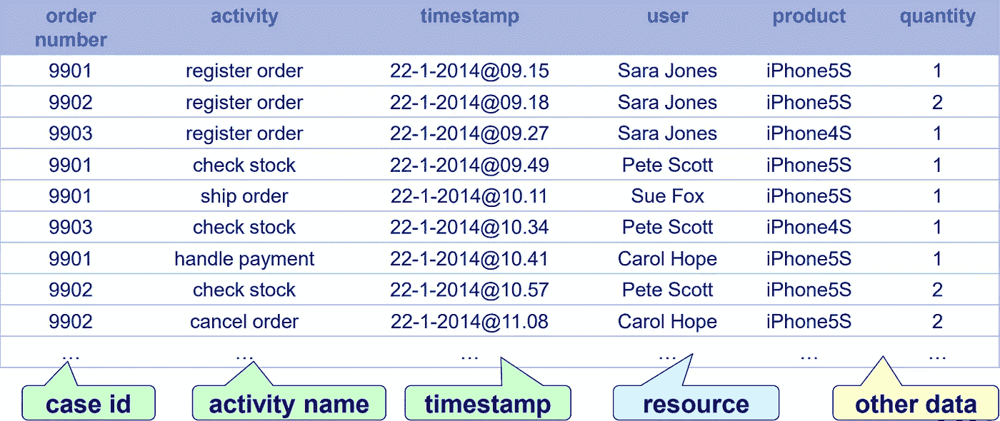
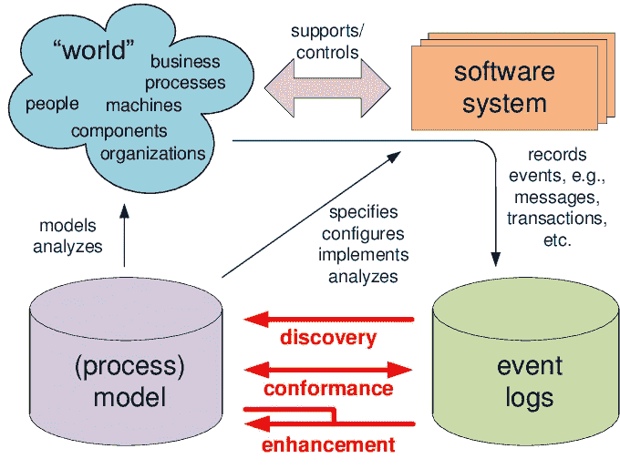
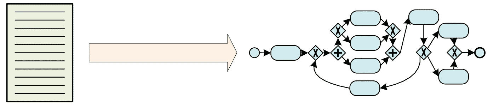
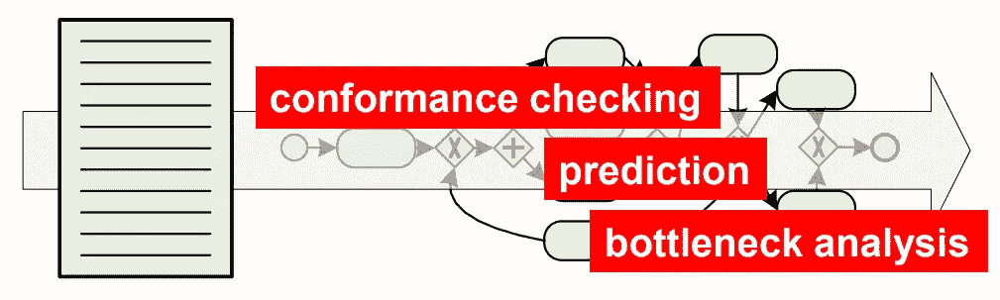

# 流程挖掘——数据科学在行动

> 原文：<https://medium.com/mlearning-ai/process-mining-data-science-in-action-445bc33fb59e?source=collection_archive---------8----------------------->

**定义**

**流程挖掘**是一系列与[数据科学](https://en.wikipedia.org/wiki/Data_science)和[流程管理](https://en.wikipedia.org/wiki/Business_process_management)领域相关的技术，用于支持基于事件日志的操作流程分析。

流程挖掘的目标是将事件数据转化为洞察力和行动。流程挖掘提供了新的见解，可用于识别操作流程采取的执行路径，并解决其性能和合规性问题。

[**什么是流程挖掘？60 秒解说— YouTube**](https://www.youtube.com/watch?v=kIXvsQhZnAw)

**数据挖掘与流程挖掘的区别**

数据挖掘分析在分析时可用的静态数据信息。流程挖掘分析数据实际上是如何创建的。

流程建模与数据挖掘相结合，为流程改进提供见解。

**流程挖掘需要考虑的数据**

我们假设存在一个事件日志，其中每个事件都涉及一个案例、一个活动和一个时间点。事件日志可以被视为案例的集合。一个案例可以被看作是事件的轨迹/序列。

**Example Event Log**

**Example Event Log**

事件数据可能来自以下方面:

1.  数据库系统(例如，医院中的患者数据)
2.  逗号分隔值(CSV)文件或电子表格
3.  交易日志(例如，交易系统)
4.  商务套件/ERP 系统(SAP、Oracle 等)。)
5.  消息日志(例如，来自 IBM 中间件)
6.  一个开放的 API，提供来自网站或社交媒体等的数据。

**流程挖掘**

流程挖掘技术能够从当今信息系统中常见的事件日志中提取知识。这些技术为发现、监控和改进各种应用领域中的过程提供了新的手段。

**进程发现**:

这是一种从观察到的行为中学习过程模型的**游戏**技术。

发现过程模型类似于一个孩子学习一门新语言。一听到新单词，孩子就会开始形成该语言的心理模型。当孩子听到新单词或句子时，它开始提炼代表语言的模型，并使其越来越复杂。

**Play-In**

[***过程发现视频***](https://www.youtube.com/watch?v=sR9Z3CcE34Y) ***(更多信息)***

**一致性检查和增强**:

一致性检查是过程模型与现实对抗的**重演**过程。

它有助于确保识别所有与目标流程或参考模型的流程偏差。这包括跳过、复制或执行未计划的流程活动。

这些流程偏差会导致审计问题或违反法律或其他法规。此外，流程偏差可能需要更多资源，或者对产品或服务质量产生负面影响。因此导致经济损失。

公司对识别所有未计划的过程序列以引入适当的预防措施非常感兴趣。

**增强**通过识别瓶颈来帮助性能分析。

因此，这些技术有助于预测。

**Re-Play**

[***一致性检查视频***](https://www.youtube.com/watch?v=zh42K9XIhLU) ***(了解更多信息)***

[***性能分析视频***](https://www.youtube.com/watch?v=-LE4t8HON90) ***(更多信息)***

**用于流程挖掘的工具/软件**

**流程挖掘中使用的算法**

过程挖掘算法分为三类:
-确定性算法
-启发式算法
-遗传算法

确定性像α-算法(alpha)为变量的特定输入提供恒定输出。

启发式算法通过反复试验提供了更好的解决方案。

当问题从任意点开始，并通过引入随机变量试图找到更好的解决方案时，使用遗传算法

**参考文献**

**注**:本文所有内容仅来自以下来源。

1.  Wil van der Aalst 所著的《过程挖掘:数据科学在行动》一书
2.  [https://www.wikipedia.org/](https://www.wikipedia.org/)
3.  [https://fluxicon.com/blog/](https://fluxicon.com/blog/)
4.  [https://appian.com/](https://appian.com/)
5.  [https://www.researchgate.net/](https://www.researchgate.net/)
6.  [http://www.processmining.org/](http://www.processmining.org/)

**接下来是什么**

你喜欢我的文章吗？
如果是，**关注**我获取未来更新；并提供你的**喜欢**和**评论**。

 [## Mlearning.ai 提交建议

### 如何成为 Mlearning.ai 上的作家

medium.com](/mlearning-ai/mlearning-ai-submission-suggestions-b51e2b130bfb)