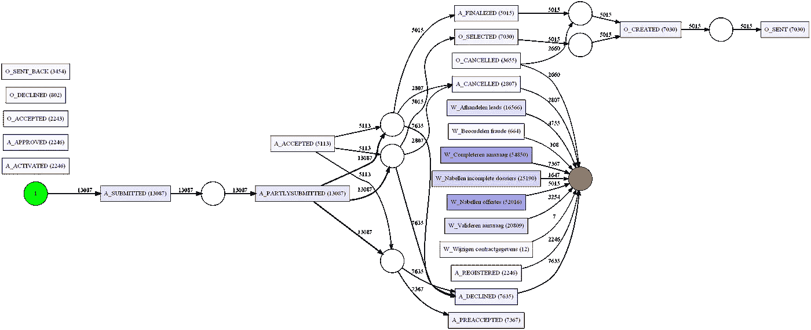
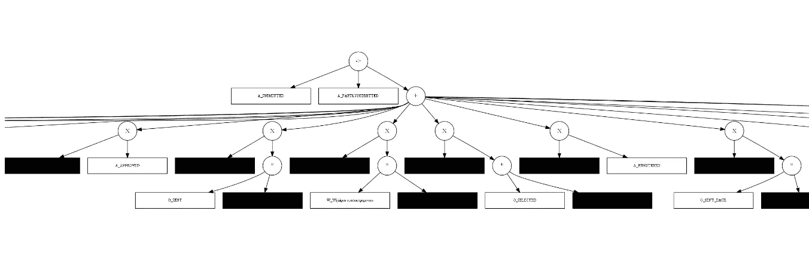
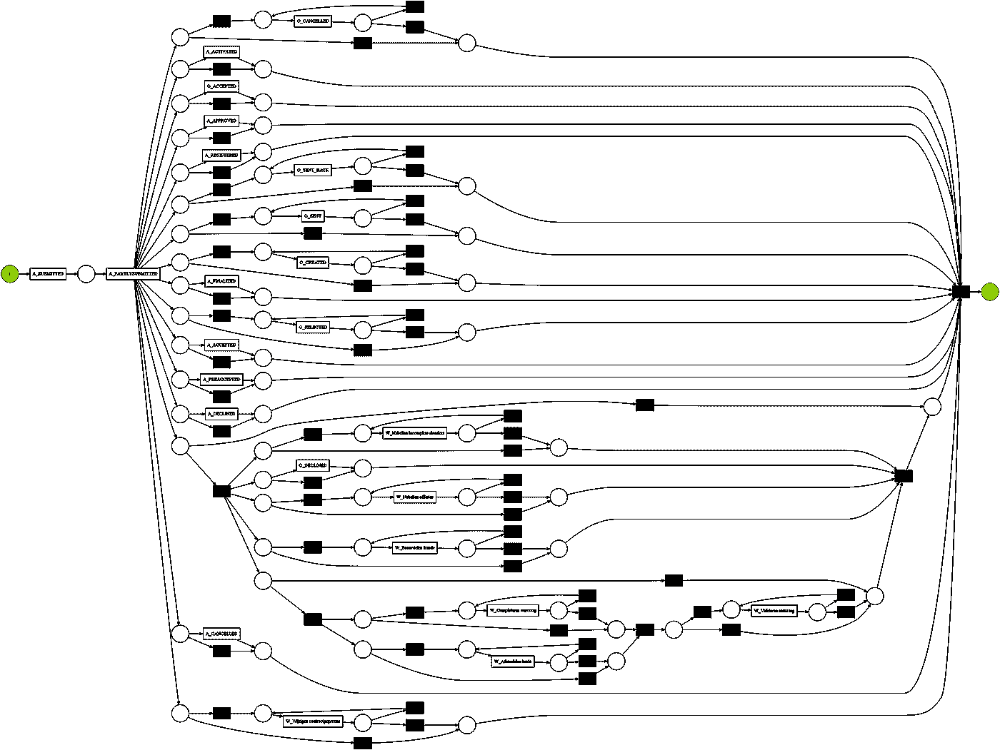
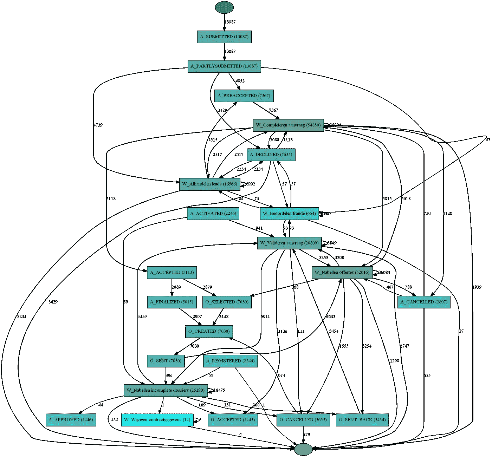
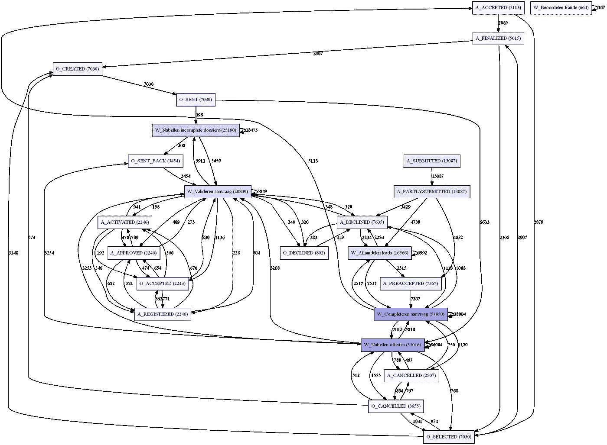

# 使用 Python 进行流程挖掘

> 原文：<https://medium.com/mlearning-ai/process-mining-with-python-6ca1d733b3e6?source=collection_archive---------0----------------------->

流程挖掘是流程管理领域的一系列技术，支持基于事件日志的业务流程分析。在过程挖掘期间，专门的数据挖掘算法被应用于事件日志数据，以便识别由信息系统记录的事件日志中包含的趋势、模式和细节。

流程挖掘旨在提高流程效率和对流程的理解。它从整个组织的任意数量的系统中捕获“数字足迹”,并以显示完成该过程的旅程的每一步以及与“预期路径”的任何偏差的方式组织它们。

我经常收到评论:

> O ***只有数据科学家才能理解这些复杂的术语！或者你需要购买昂贵的软件许可证来执行过程挖掘。***

不尽然！虽然我仍然提倡使用商业工具(市场上有很多),因为它很容易并且通常有很好的指导和支持，但是你仍然可以使用免费的技术，比如 Python 或 r。

在本教程中，我将介绍一个强大的流程挖掘“开源”库，名为使用 python 的 **PM4PY** ，以及从任何事件数据中提取信息的技术。您不仅会学到惊人强大的分析技术，还可以直接使用这里提供的代码/信息来改进流程和系统，诊断偏差，并了解您自己流程中的瓶颈。

** *有关参考资料和更多信息，请访问 PM4PY 页面，下面提供的大部分代码来自* [*PM4PY*](https://pm4py.fit.fraunhofer.de/documentation#importing) *官方文档* **

本教程中使用的数据是从[https://www.win.tue.nl/bpi/doku.php?id=2012:challenge&redirect = 1id = 2012/challenge](https://www.win.tue.nl/bpi/doku.php?id=2012:challenge&redirect=1id=2012/challenge)获得的真实日志

正如他们的网站所描述的:这是一个全球性荷兰金融组织的贷款申请流程数据(个人贷款或透支)。目标是试图发现他们过程中的弱点和低效之处。

对 python 有非常高的理解肯定会有所帮助。创建单独的环境并安装所需的软件包后:

1.  加载所需的包

```
import pandas as pd
from pm4py.objects.conversion.log import converter as log_converter
from pm4py.objects.log.importer.xes import importer as xes_importer

# process mining 
from pm4py.algo.discovery.alpha import algorithm as alpha_miner
from pm4py.algo.discovery.inductive import algorithm as inductive_miner
from pm4py.algo.discovery.heuristics import algorithm as heuristics_miner
from pm4py.algo.discovery.dfg import algorithm as dfg_discovery

# viz
from pm4py.visualization.petrinet import visualizer as pn_visualizer
from pm4py.visualization.process_tree import visualizer as pt_visualizer
from pm4py.visualization.heuristics_net import visualizer as hn_visualizer
from pm4py.visualization.dfg import visualizer as dfg_visualization

# misc 
from pm4py.objects.conversion.process_tree import converter as pt_converter

pd.set_option('display.max_columns', None)
pd.set_option('display.max_rows', None)
```

2.加载数据集:这里我加载的是 XES 文件格式，不过你也可以用 CSV 做同样的事情(代码略有不同，更多信息请参见 PM4PY 文档或联系我，我会尽力帮助你):

```
log = xes_importer.apply('financial_log.xes.gz')
```

3.检查日志

```
## Printing the first trace
log[0] ## printing the first event in first trace
log[0][0]  

Outputs:

{'attributes': {'REG_DATE': datetime.datetime(2011, 10, 1, 8, 8, 58, 256000, tzinfo=datetime.timezone(datetime.timedelta(seconds=7200))), 'concept:name': '173691', 'AMOUNT_REQ': '5000'}, 'events': [{'org:resource': '112', 'lifecycle:transition': 'COMPLETE', 'concept:name': 'A_SUBMITTED', 'time:timestamp': datetime.datetime(2011, 10, 1, 8, 8, 58, 256000, tzinfo=datetime.timezone(datetime.timedelta(seconds=7200)))}, '..', {'org:resource': '10809', 'lifecycle:transition': 'COMPLETE', 'concept:name': 'W_Valideren aanvraag', 'time:timestamp': datetime.datetime(2011, 10, 10, 14, 17, 34, 633000, tzinfo=datetime.timezone(datetime.timedelta(seconds=7200)))}]}

{'org:resource': '112', 'lifecycle:transition': 'COMPLETE', 'concept:name': 'A_SUBMITTED', 'time:timestamp': datetime.datetime(2011, 10, 1, 0, 38, 44, 546000, tzinfo=datetime.timezone(datetime.timedelta(seconds=7200)))}
```

4.一些高级分析:

```
from pm4py.algo.filtering.log.start_activities import start_activities_filter
from pm4py.algo.filtering.log.end_activities import end_activities_filter

log_start = start_activities_filter.get_start_activities(log)
end_activities = end_activities_filter.get_end_activities(log)
log_start  # Printing the start activity in our log

Outputs:
{'A_SUBMITTED': 13087}

end_activities  # Printing the end activity in our log

Outputs:

{'W_Valideren aanvraag': 2747,
 'W_Wijzigen contractgegevens': 4,
 'A_DECLINED': 3429,
 'W_Completeren aanvraag': 1939,
 'A_CANCELLED': 655,
 'W_Nabellen incomplete dossiers': 452,
 'W_Afhandelen leads': 2234,
 'W_Nabellen offertes': 1290,
 'W_Beoordelen fraude': 57,
 'O_CANCELLED': 279,
 'A_REGISTERED': 1}
```

看起来我们的流程有一个开始活动和多个结束活动。我们所有的 13087 个案例(贷款)都以“A_submitted”开头，而大多数以“A_declined”或“W_Valideren aanvraag”结尾

流程变体是我们的贷款申请从流程的最开始到最后所采用的唯一路径——这里我们看到我们以 4366 种不同的方式处理了我们的 13087 贷款！

```
from pm4py.algo.filtering.log.variants import variants_filter
from pm4py.statistics.traces.log import case_statistics
variants = variants_filter.get_variants(log)

print(f"We have:{len(variants)} variants in our log")

Outputs:

We have:4366 variants in our log
```

让我们试着了解一下那些变种有多少个案例(贷款申请)？

```
variants_count = case_statistics.get_variant_statistics(log)
variants_count = sorted(variants_count, key=lambda x: x['count'], reverse=True)## Printing the top 10 variants by case number
variants_count[:10] 

Outputs:

[{'variant': 'A_SUBMITTED,A_PARTLYSUBMITTED,A_DECLINED', 'count': 3429},
 {'variant': 'A_SUBMITTED,A_PARTLYSUBMITTED,W_Afhandelen leads,W_Afhandelen leads,A_DECLINED,W_Afhandelen leads',
  'count': 1872},
 {'variant': 'A_SUBMITTED,A_PARTLYSUBMITTED,W_Afhandelen leads,W_Afhandelen leads,W_Afhandelen leads,W_Afhandelen leads,A_DECLINED,W_Afhandelen leads',
  'count': 271},
 {'variant': 'A_SUBMITTED,A_PARTLYSUBMITTED,W_Afhandelen leads,W_Afhandelen leads,A_PREACCEPTED,W_Completeren aanvraag,W_Afhandelen leads,W_Completeren aanvraag,A_DECLINED,W_Completeren aanvraag',
  'count': 209},
 {'variant': 'A_SUBMITTED,A_PARTLYSUBMITTED,A_PREACCEPTED,W_Completeren aanvraag,W_Completeren aanvraag,A_DECLINED,W_Completeren aanvraag',
  'count': 160},
 {'variant': 'A_SUBMITTED,A_PARTLYSUBMITTED,A_PREACCEPTED,W_Completeren aanvraag,W_Completeren aanvraag,A_CANCELLED,W_Completeren aanvraag',
  'count': 134},
 {'variant': 'A_SUBMITTED,A_PARTLYSUBMITTED,W_Afhandelen leads,W_Afhandelen leads,A_PREACCEPTED,W_Completeren aanvraag,W_Afhandelen leads,W_Completeren aanvraag,W_Completeren aanvraag,W_Completeren aanvraag,A_DECLINED,W_Completeren aanvraag',
  'count': 126},
 {'variant': 'A_SUBMITTED,A_PARTLYSUBMITTED,A_PREACCEPTED,W_Completeren aanvraag,W_Completeren aanvraag,W_Completeren aanvraag,W_Completeren aanvraag,A_DECLINED,W_Completeren aanvraag',
  'count': 93},
 {'variant': 'A_SUBMITTED,A_PARTLYSUBMITTED,A_PREACCEPTED,W_Completeren aanvraag,W_Completeren aanvraag,W_Completeren aanvraag,W_Completeren aanvraag,A_CANCELLED,W_Completeren aanvraag',
  'count': 87},
 {'variant': 'A_SUBMITTED,A_PARTLYSUBMITTED,W_Afhandelen leads,W_Afhandelen leads,A_PREACCEPTED,W_Completeren aanvraag,W_Afhandelen leads,W_Completeren aanvraag,W_Completeren aanvraag,W_Completeren aanvraag,W_Completeren aanvraag,W_Completeren aanvraag,A_DECLINED,W_Completeren aanvraag',
  'count': 74}]
```

这个很有意思！在我们事件日志中的 13087 笔贷款中，有 3429 笔(即 26%)属于 1 个变体。4366 中只有一个变体，当我们仔细检查该变体时，它是一个 3 步变体，最有可能是针对不合格贷款的，因为它被直接“拒绝”—也许通过在流程开始前实施一个步骤来过滤掉那些申请(不合格),我们可以减少我们贷款申请渠道的一些压力。

让我们看看我们的事件日志中有哪些活动？包括它们的频率并考虑所有案例/贷款(不应用任何过滤器)

```
from pm4py.algo.filtering.log.attributes import attributes_filter
activities = attributes_filter.get_attribute_values(log, "concept:name")
activities

Outouts:
{'A_SUBMITTED': 13087,
 'A_PARTLYSUBMITTED': 13087,
 'A_PREACCEPTED': 7367,
 'W_Completeren aanvraag': 54850,
 'A_ACCEPTED': 5113,
 'O_SELECTED': 7030,
 'A_FINALIZED': 5015,
 'O_CREATED': 7030,
 'O_SENT': 7030,
 'W_Nabellen offertes': 52016,
 'O_SENT_BACK': 3454,
 'W_Valideren aanvraag': 20809,
 'A_REGISTERED': 2246,
 'A_APPROVED': 2246,
 'O_ACCEPTED': 2243,
 'A_ACTIVATED': 2246,
 'O_CANCELLED': 3655,
 'W_Wijzigen contractgegevens': 12,
 'A_DECLINED': 7635,
 'A_CANCELLED': 2807,
 'W_Afhandelen leads': 16566,
 'O_DECLINED': 802,
 'W_Nabellen incomplete dossiers': 25190,

 'W_Beoordelen fraude': 664}
```

很少有突出的活动:

*   " W_Completeren aanvraag "
*   " W _ Nabellen offertes "
*   " W_Nabellen 不完整的档案"

他们有很多行动，这可能是某种自我循环或返工或其他原因，当然，但显然我们应该做些什么来防止他们变成瓶颈。

让我们找点乐子，开始应用一些已知的算法。

1.  Alpha Miner:Alpha Miner 算法的起点是排序关系(当然是按时间戳排序),所以我们不考虑频率，也不考虑其他属性(事件日志中的其他特性，如执行动作的资源等)

```
net, initial_marking, final_marking = alpha_miner.apply(log)
gviz = pn_visualizer.apply(net, initial_marking, final_marking)
pn_visualizer.view(gviz)

## Adding frequency will make it more informative.

parameters = {pn_visualizer.Variants.FREQUENCY.value.Parameters.FORMAT: "png"}
gviz = pn_visualizer.apply(net, initial_marking, final_marking, 
                           parameters=parameters,
                           variant=pn_visualizer.Variants.FREQUENCY,
                           log=log)
pn_visualizer.view(gviz)
```



2.归纳挖掘器:根据 PM4Py 文档，归纳挖掘器的基本思想是检测日志中的“切割”(例如顺序切割、平行切割、同时切割和循环切割),然后在应用切割找到的子日志上重复，直到找到基本案例。直接跟随的变体避免了子日志上的递归，而是使用直接跟随的图。

*   “*”是循环
*   “->”是序列运算符
*   “X”是唯一的选择

```
tree = inductive_miner.apply_tree(log)

gviz = pt_visualizer.apply(tree)
pt_visualizer.view(gviz)
```



图像太大了，但这就是它的样子:)我们也可以使用下面的代码将归纳挖掘器转换成 petri 网:

```
net, initial_marking, final_marking = pt_converter.apply(tree, 
variant=pt_converter.Variants.TO_PETRI_NET)
gviz = pn_visualizer.apply(net, initial_marking, final_marking)
pn_visualizer.view(gviz)
```



3.启发式挖掘器:这是一种作用于直接跟随图的算法。启发式挖掘器的输出是一个启发式网络

```
heu_net = heuristics_miner.apply_heu(log, 
parameters={heuristics_miner.Variants.CLASSIC.value.Parameters.DEPENDENCY_THRESH: 0.5})

gviz = hn_visualizer.apply(heu_net)
hn_visualizer.view(gviz)
```



在这里，我们可以清楚地看到我们在所有步骤中的不足或返工的程度，例如，在阶段“W _ Nabellen offertes”中，我们有 52016 个事件(即活动)，其中 36084 个正在重新处理(自循环)，在另一个世界中，我们的贷款申请在进入下一个阶段之前在同一阶段中处理了几次，当我们说已处理时，我们指的是在此贷款申请上发生了一个操作，这也可能只是状态变化，它被限定为“操作”。

4.DFG——带频率和时间的直接流图:这个算法是大多数商业工具正在使用的。这篇[论文](https://www.sciencedirect.com/science/article/pii/S1877050919322367)描述了这种简单算法的优缺点，因此建议进行流程挖掘项目的人至少对这些算法如何创建模型有高水平的理解

```
dfg = dfg_discovery.apply(log)

from pm4py.visualization.dfg import visualizer as dfg_visualization

gviz = dfg_visualization.apply(dfg, log=log, variant=dfg_visualization.Variants.FREQUENCY)
dfg_visualization.view(gviz)
```



同样的算法，但是现在增加了时间而不是频率


这就有意思了！我们指出“W _ Nabellen offertes”阶段存在一些效率低下和返工的问题，从该图中我们可以看出，贷款申请通过该阶段平均需要 1 天，而其他阶段平均需要几分钟。

我们可以通过以下方式将网络转换为工作流网络:

```
from pm4py.objects.conversion.dfg import converter as dfg_mining
net, im, fm = dfg_mining.apply(dfg)
gviz = pn_visualizer.apply(net, im, fm)
pn_visualizer.view(gviz)
```

这些代码是在 jupyter notebook 中实现的，当然你可以在你选择的任何 IDE 中运行它们。

希望这能有所帮助，关于这里使用的算法和代码的更多信息，我建议查阅 PM4PY 文档或取得联系，我很乐意提供帮助

[](/mlearning-ai/mlearning-ai-submission-suggestions-b51e2b130bfb) [## Mlearning.ai 提交建议

### 如何成为 Mlearning.ai 上的作家

medium.com](/mlearning-ai/mlearning-ai-submission-suggestions-b51e2b130bfb)