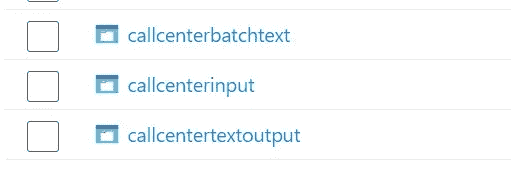
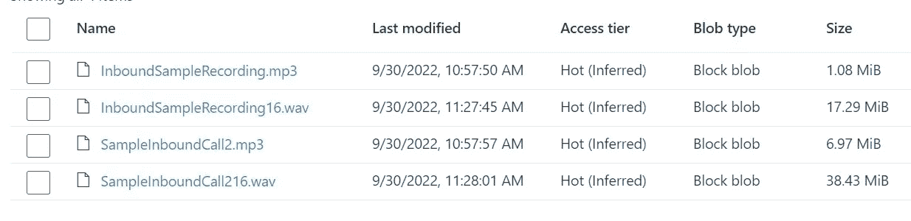
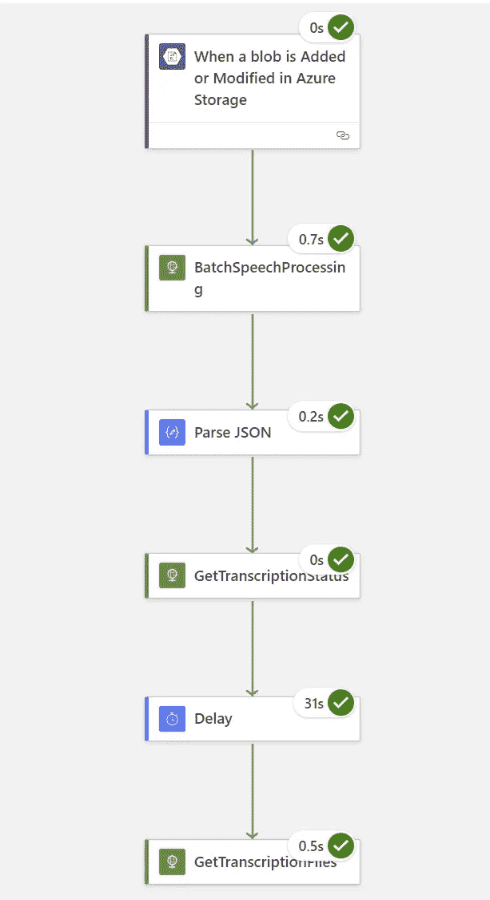
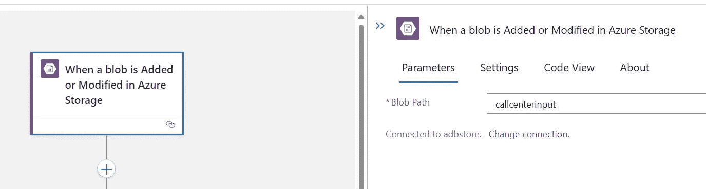
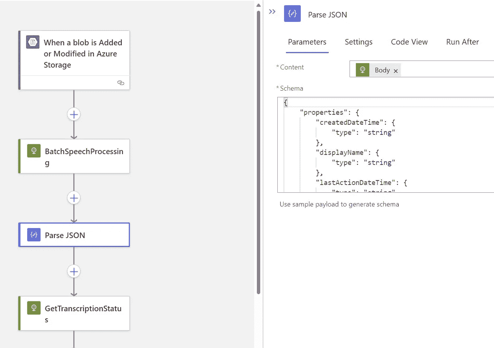
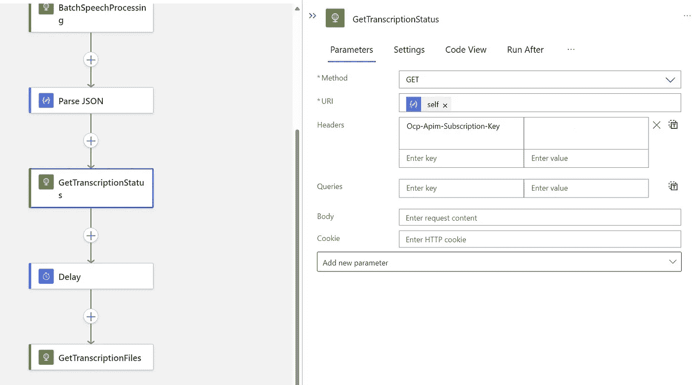
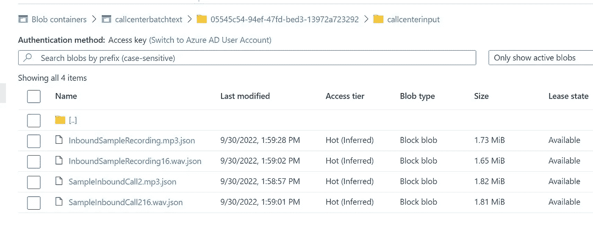

# 使用 logic 应用程序和 Azure 认知语音服务批量处理语音到文本

> 原文：<https://medium.com/mlearning-ai/processing-speech-to-text-in-batch-using-logic-apps-and-azure-cognitive-speech-service-540f9ae88b25?source=collection_archive---------7----------------------->

# 批处理音频到文本的转录

# 要求

*   Azure 存储
*   样本音频文件
*   Azure 认知服务—语音转文本
*   带读取和列表的音频文件容器 SAS 密钥
*   用于存储 json 输出的输出容器，在 SAS 键中具有读、写和列表权限
*   将样本音频文件上传到容器



*   这里是输入文件在容器中的时间



```
Note: create the sas key for input container with read and list permission, otherwise you will get invalid container URI error
```

*   创建一个逻辑应用程序来处理音频文件
*   当任何新文件添加到容器中时，使用 Blob 连接器触发逻辑应用程序
*   这是整个过程



*   现在用连接字符串配置 blob 存储帐户
*   还要指定输入容器



*   现在我们需要引入 HTTP actvitity 来调用语音转文本 API


*   将方法用作帖子
*   URI:[https://. API . cognitive . Microsoft . com/speechtotext/v 3.0/transcriptions](https://.api.cognitive.microsoft.com/speechtotext/v3.0/transcriptions)
*   现在是标题
*   Ocp-Apim-Subscription-Key:来自认知服务帐户的密钥
*   内容类型:应用程序/json
*   现在身体

```
{
  "contentContainerUrl": "https://adbstore.blob.core.windows.net/callcenterinput?sp=rl&st=2022xxxxxxxxxxxxxxxxxx",
  "displayName": "audiobatch1",
  "locale": "en-US",
  "model": null,
  "properties": {
    "destinationContainerUrl": "https://storagename.blob.core.windows.net/callcenterbatchtext?sp=rwl&st=2022xxxxxxxxxxxxxxxxxxxxxx",
    "wordLevelTimestampsEnabled": true
  }
}
```

*   我提供存储帐户来存储输出的 json 文件
*   在这种情况下，我们可以处理大量文件
*   接下来是解析 JSON 输出



*   确保选择上方的几何体作为输入
*   这里要解析的 json 是模式

```
{
    "properties": {
        "createdDateTime": {
            "type": "string"
        },
        "displayName": {
            "type": "string"
        },
        "lastActionDateTime": {
            "type": "string"
        },
        "links": {
            "properties": {
                "files": {
                    "type": "string"
                }
            },
            "type": "object"
        },
        "locale": {
            "type": "string"
        },
        "model": {
            "properties": {
                "self": {
                    "type": "string"
                }
            },
            "type": "object"
        },
        "properties": {
            "properties": {
                "channels": {
                    "items": {
                        "type": "integer"
                    },
                    "type": "array"
                },
                "diarizationEnabled": {
                    "type": "boolean"
                },
                "profanityFilterMode": {
                    "type": "string"
                },
                "punctuationMode": {
                    "type": "string"
                },
                "wordLevelTimestampsEnabled": {
                    "type": "boolean"
                }
            },
            "type": "object"
        },
        "self": {
            "type": "string"
        },
        "status": {
            "type": "string"
        }
    },
    "type": "object"
}
```

*   现在使用转录 api 来获取转录的状态
*   使用解析 JSON 输出中的解析输出第二个自身变量
*   提供订阅密钥


*   上面的输出应该正在运行。如果失败，检查错误消息



*   现在检查目标容器中的输出



原文位于—【github.com】samples 2022/speech batch . MD

[](/mlearning-ai/mlearning-ai-submission-suggestions-b51e2b130bfb) [## Mlearning.ai 提交建议

### 如何成为 Mlearning.ai 上的作家

medium.com](/mlearning-ai/mlearning-ai-submission-suggestions-b51e2b130bfb)