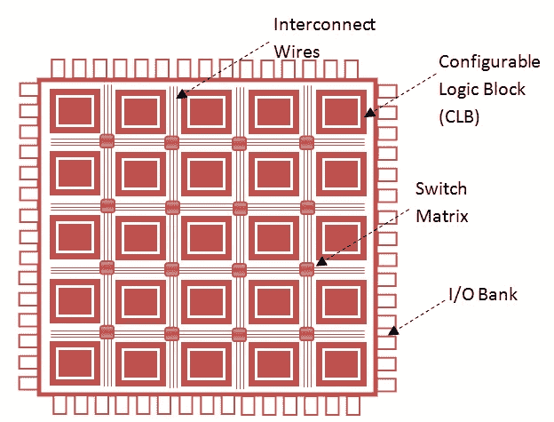
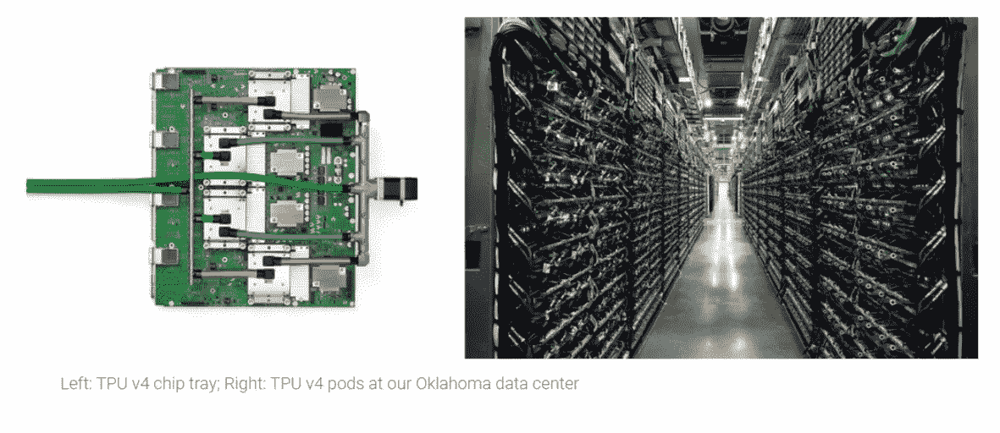
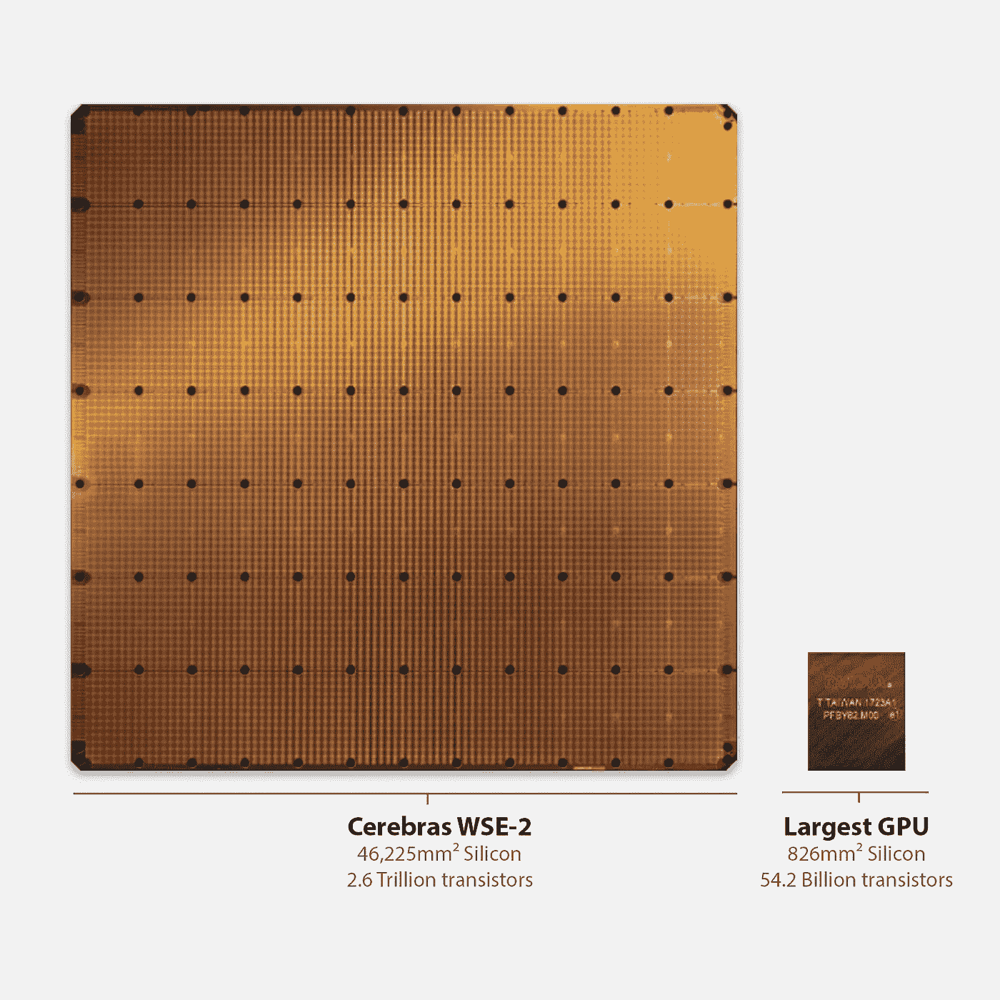
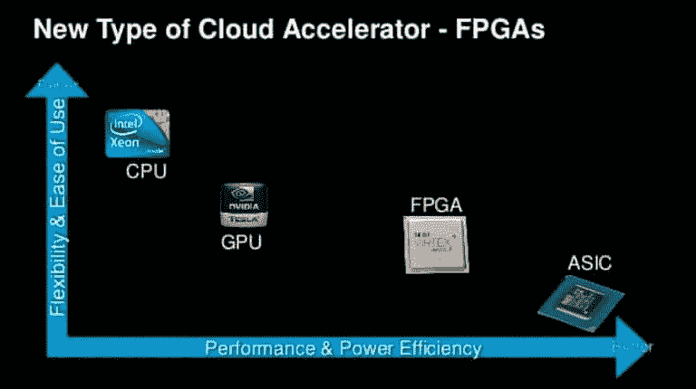

# 处理器:CPU、GPU、FPGA、加速器

> 原文：<https://medium.com/mlearning-ai/processors-cpu-gpu-fpga-accelerator-8bfc3a73333c?source=collection_archive---------1----------------------->

**注 1** :这个帖子是一个介绍性的视频，对于没有上过任何计算机架构和硬件方面的课程，想学习的纯软件/算法/数据科学的人来说可以很有用。此外，它可以为计算机工程和科学学士学生提供信息。

**注 2**:Xilinx 公司作为全球最大的 FPGA 厂商之一，从**2022 年 2 月** **14 日**就属于 AMD[查看此处](https://www.amd.com/en/corporate/xilinx-acquisition)。之所以提到它，是因为在视频中，Xilinx 是作为一家独立公司提到的。

# 介绍

计算机科学人士已经多次听说 GPU 是当前深度学习热潮的主要推动者。下面的视频回顾了标题中提到的处理器，并进一步介绍了 CPU 的工作原理。此外，它还区分了它们。

CPU, GPU, FPGA, Accelerator

# 中央处理器

CPU 代表**C**entral**P**processing**U**nit。“**中央**”源于这些处理器是负责整个系统的主要设备。这意味着操作系统在它们上面运行。此外，它们还处理整个系统的数据流。当这个处理器将它的一些工作卸载给它们时，其他处理器如 GPU 或其他专用处理器来帮助这个处理器。

CPU 被设计成能快速执行顺序程序。与其他处理器相比，CPU 可以非常快地执行顺序程序，因为它提供了高工作频率。此外，该优点的另一个原因是所采用的复杂硬件结构，例如无序执行、高速缓存层次结构、流水线和分支预测单元。

现代 CPU 从存储在内存中的程序中取出几条指令，并隐式地并行执行它们。实际上，CPU 利用了程序员对此一无所知的 **I** 指令**L**level**P**并行性( **ILP** )。然而，如今，如果程序员打算以并行的方式思考和开发他们的程序，CPU 拥有更多的内核，并且一次可以执行多个线程。此外，与 GPU 等相比，CPU 提供了细粒度和高效的分时技术。由于这种能力，它可以轻松地在线程之间切换，并让所有线程都满意它的执行速度。

# **GPU**

GPU 代表 **G** 图形 **P** 处理 **U** nit。它们作为图形应用程序的协处理器出现。但是，随着 2006 年 **Nvidia** 推出 **CUDA** 和**特斯拉架构**，这些设备进入了通用计算领域。与 CPU 相比，这些设备包含许多更简单的内核，这使它们能够一次启动大量线程。这就是他们擅长执行并行程序的原因。它们是并行处理器，与 CPU 相比工作在较低的时钟频率。CPU 中可用的细粒度共享和许多其他机制在这些并行处理器中是找不到的。下图显示了 CPU 和 GPU 示意图，展示了它们的架构差异。

CPU, GPU Schematic [[https://cvw.cac.cornell.edu/GPUarch/gpu_characteristics](https://cvw.cac.cornell.edu/GPUarch/gpu_characteristics)]

# 现场可编程门阵列 （Field Programmable Gata Array 的缩写）

FPGA 代表**F**field-**P**可编程 **G** ate **A** rray。与 CPU 和 GPU 相比，这些设备在内部电路的连接方面提供了灵活性。在 FPGA 中，设计者用 Verilog 或 VHDL 等硬件描述语言描述目标电路。设计者指定输入、输出以及输入将通过它变成输出的电路。最好把 CPU 和 GPU 看作是指令的执行者，它们的电路是在制造过程中固定和构建的。然而，FPGAs 有一个逻辑单元网格，设计人员可以连接并构建他们想要的东西。下图显示了 FPGA 的架构。FPGA 提供的灵活性的含义是，在 FPGA 内部构建一个电路后，程序员可以擦除它并构建另一个电路。

FPGA Architecture [[https://allaboutfpga.com/fpga-architecture/](https://allaboutfpga.com/fpga-architecture/)]

# 加速器

这些设备是实现硬件电路(如如何构建 CPU 和 GPU 电路)的专用设备，用于解决特定问题，例如深度学习推理。这些器件如何获得输入并通过电路传递这些输入由它们的设计者决定。 **Google TPUs** 和 **Cerebras WSEs** 是深度学习加速器的例子，旨在快速高效地运行深度学习工作负载。

[[https://www.trendsmap.com/twitter/tweet/1394735176412921858](https://www.trendsmap.com/twitter/tweet/1394735176412921858)]

[[https://cerebras.net/chip/](https://cerebras.net/chip/)]

# 比较

为了从灵活性、易用性、性能和能效角度比较前面讨论的处理器，下图是一个代表性的演示。

灵活性意味着用户可以在处理器上运行的不同程序的数量，而不会面临任何严峻的挑战。

易用性意味着开发一个程序所需要的努力。

CPU 提供了最高的灵活性和易用性，因为用户可以选择像 Python 这样的高级语言来开发他们需要的东西。虽然他们做了更多的工作来完成计算，以尽可能实现最高的灵活性，但从性能和能效的角度来看，他们是最差的。另一方面，ASIC 或加速器器件为应用构建物理电路，可提供最高的性能和功效。但是，它们是特定于应用程序的，使用它们需要知道它们到底是什么。

[[https://www.napatech.com/road-to-fpga-reconfigurable-computing/](https://www.napatech.com/road-to-fpga-reconfigurable-computing/)]

 [## Mlearning.ai 提交建议

### 如何成为 Mlearning.ai 上的作家

medium.com](/mlearning-ai/mlearning-ai-submission-suggestions-b51e2b130bfb)