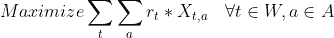
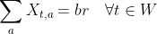
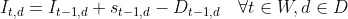
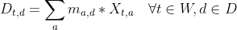
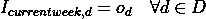
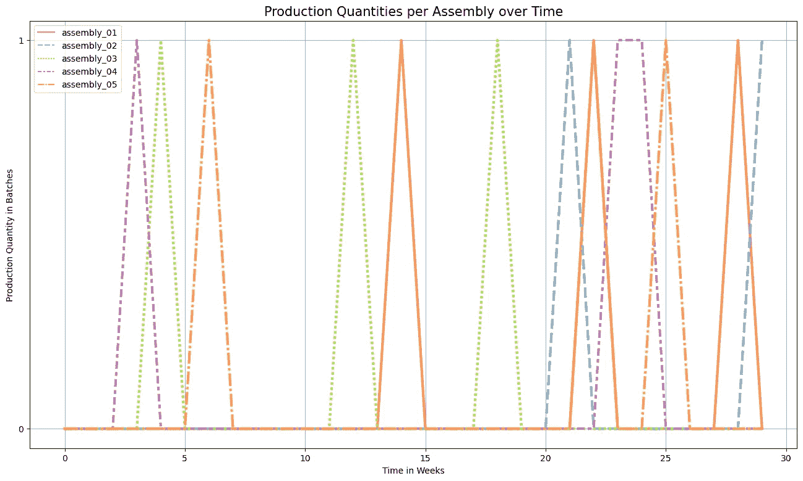
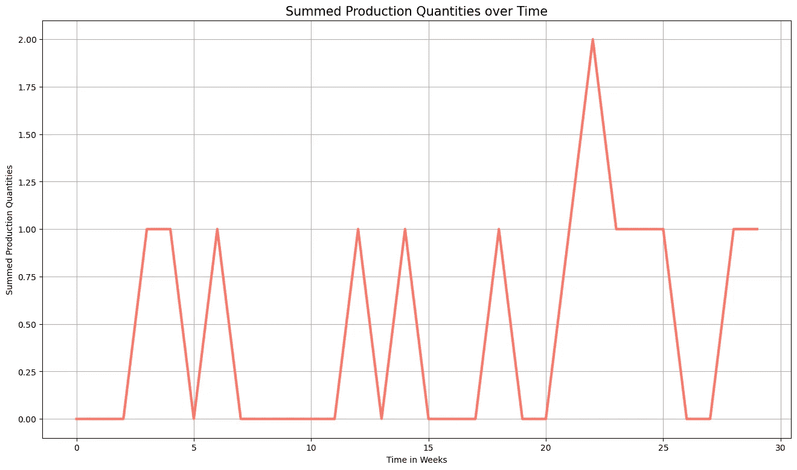
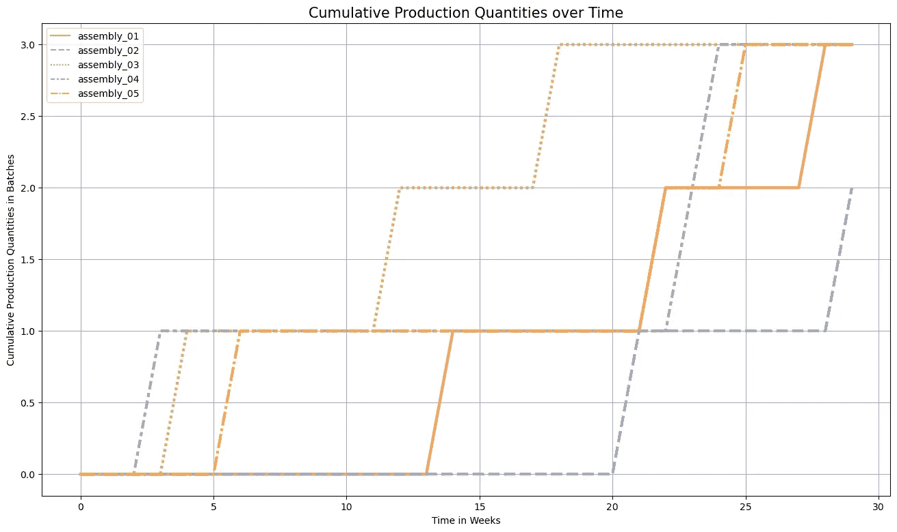
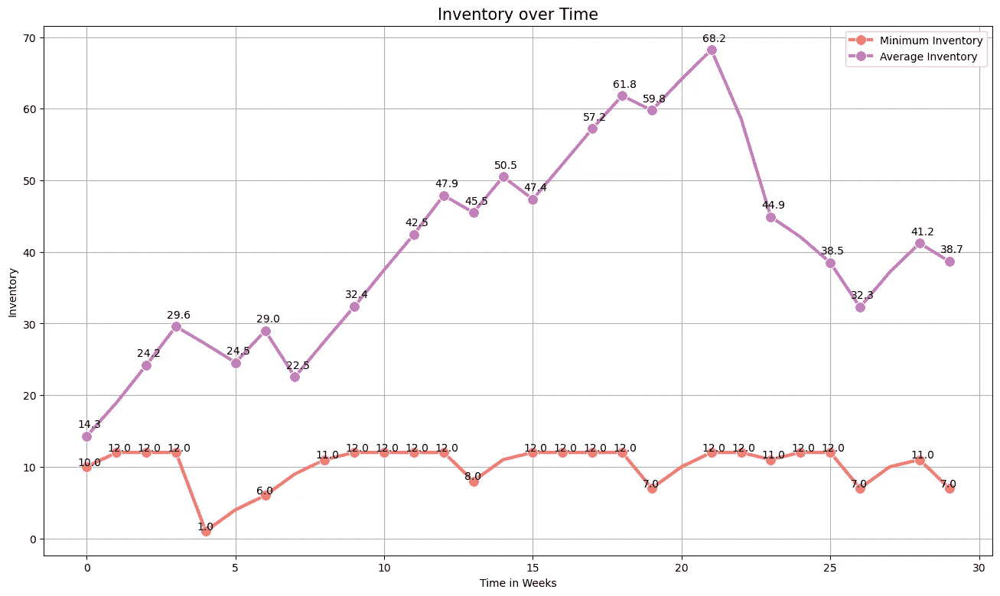

# 高科技制造企业的生产计划优化

> 原文：<https://medium.com/mlearning-ai/production-planning-optimisation-at-a-high-tech-manufacturing-firm-116c78f09742?source=collection_archive---------7----------------------->

## 如何在给定供应的情况下最大化产量？

Photo by [Marcin Jozwiak](https://unsplash.com/@marcinjozwiak?utm_source=medium&utm_medium=referral) on [Unsplash](https://unsplash.com?utm_source=medium&utm_medium=referral)

COVID19 导致了全球供应链的大规模中断。需求模式发生了变化，企业在材料和劳动力方面可支配的资源减少了。尤其是生产医疗保健产品、消费电子产品和家用电器的公司举步维艰。这些行业的公司面临着大量的积压订单，并承受着满足不断增长的需求的巨大压力[1]。这些事件强调有效的资源分配。如何利用我们的产能和供应，使我们能够最大限度地提高产量？这就是优化发挥作用的地方。

最优化是工业中经常使用的一种技术，用来解决最优资源分配的问题。它可以用于各种问题。例如，运输问题、生产调度以及许多生产计划问题都可以用最优化技术来解决。最著名的技术之一是线性规划(LP)或其变体整数线性规划(ILP)。这里我们将把 ILP 应用到一家高科技制造企业面临的装配问题中。

我在位于荷兰的一家制造企业遇到了这个优化资源分配的问题。该公司是高科技行业的原始设备制造商。像许多公司一样，它感受到了新冠肺炎的影响。对医疗保健产品和消费电子产品需求的增加，加上产能的下降，给公司带来了高效分配资源的巨大压力。客户要求交货，并为未来几年设定了更高的目标。这种 ILP 公式有助于该公司有效地规划其资源，并在面临约束的情况下最大限度地提高产量。

因此，目标是在给定资源的情况下最大化生产。我们观察材料的流入并决定最佳生产计划。不同的组件需要不同的材料，因此有可能通过在正确的时间生产正确的组件来找到最大化生产的情况。在许多实际情况下，这种灵活性是不可用的。生产与客户需求相关联，客户需求需要某种产品组合，甚至更有可能是每种产品类型的特定数量。然而，新冠肺炎让这种情况成为现实。我工作的公司面临着不同类型产品的大量积压。因此，与严格遵守产品组合要求相比，它更倾向于高效生产。鉴于资源有限，它试图生产尽可能多的产品。

## 该配方

目标函数既有利于数量又有利于速度。它最大限度地提高产量，同时强调最小化交付周期的需要。为了在目标函数中包含这两个因素，我们建立了生产的产品数量乘以权重向量的线性组合模型，该权重向量有利于早期生产而不是晚期生产。

这个目标受到许多限制。首先，对于给定的材料，时间 *t* 的生产不能超过当时的库存。这个约束条件包含在下面的不等式中。

第二，生产数量不能超过生产设施的瓶颈率。每种制造情况都被限制在某个瓶颈率上，这种情况也是如此。下面的公式根据最大装配数量定义了瓶颈率。这假定每种装配类型的处理时间相等。在许多情况下，这可能是不切实际的，因为处理时间可能因程序集类型而异。然而，在这种情况下，它是适用的。

第三，尽管在一定范围内，需求被认为是灵活的。一种类型的程序集的总生产量之和不能超过上限。

第四，公式需要一个库存平衡方程。库存平衡方程确保在每个阶段为库存中的每种产品确定正确的库存水平。它是前期库存、进入前期的供应和前期需求的函数。库存可以用多种方式定义，最常见的是在某个时期的开始或结束时。在这个公式中，某个期间的库存被定义为该期间开始时的现有库存。

第五，生产决策应该与库存要求相联系。装配类型的生产与物料需求相关联，物料需求可以与当前库存水平进行比较。

第六，应规定初始库存水平。

最后，假设决策变量为非负整数。

## 结果

以上公式产生了一组生产决策。在特定时间生产什么组件？生产决策可以在图 1 中看到，它表明哪个装配是在什么时间进行的。根据要求，每次生产数量取整数值。对于表中的结果，请查看我的 GitHub 存储库(见本文底部)。

Figure 1: Production Quantities per Assembly over Time

另一个限制是每周三次组装的瓶颈率。图 2 显示，在某些情况下，容量可能会受到限制。但是，在这几周的大部分时间里，都有空闲容量。短期能力不足是由输入材料的波动引起的。材料流入波动越大，就会出现越多的短期产能短缺。导致平均等待时间增加，尽管材料的平均流入量可能比货物的平均流出量低很多。

Figure 2: Summed Production Quantities over Time

为了确保不会一直制造单一类型的组件，我限制了一种组件类型的产品数量。这个数字被设定为八。然而，从图 3 中可以看出，这个量对于单个组件来说不是限制性的。

Figure 3: Cumulative Production Quantities over Time

在图 4 中，我们可以看到平均库存水平和最低库存水平。平均库存随着时间的推移而波动，但不会失控地增加或减少到零。这表明投入材料按比例到达(不是偶然的，因为产生供应时考虑到了这一点)。然而，在正常运行的实际生产情况下，这种行为也是预期的，因为从长期来看，产品的平均流入量应该等于产品的平均流出量。其次，我们可以观察到最低库存水平保持在合理的低水平。库存水平最低的产品通常是限制因素(并非总是如此，因为其他投入材料可能有更高的材料需求)。低水平的最低库存和闲置产能(图 2 显示生产保持在 2 的瓶颈率以下)表明投入材料的供应是有限的，需要有效的资源分配来优化生产。

Figure 4: Inventory over Time

## 结论

优化技术在工业中起着重要的作用。许多资源分配问题可以使用 LP 和 ILP 等简单方法进行优化。由于新冠肺炎事件，这家高科技公司面临着富有挑战性的资源分配问题。该公式有助于公司建立最佳生产计划，以便在这些不利事件下更好地满足需求。

## 参考

[1][https://www . nytimes . com/interactive/2021/12/05/business/economy/supply-chain . html](https://www.nytimes.com/interactive/2021/12/05/business/economy/supply-chain.html)

## 密码

 [## GitHub-DennisatGit/Production Planning:整数线性规划在生产计划中的应用

### 整数线性规划在生产计划中的应用。这本笔记本是基于在一个…

github.com](https://github.com/DennisatGit/ProductionPlanning)  [## Mlearning.ai 提交建议

### 如何成为 Mlearning.ai 上的作家

medium.com](/mlearning-ai/mlearning-ai-submission-suggestions-b51e2b130bfb)