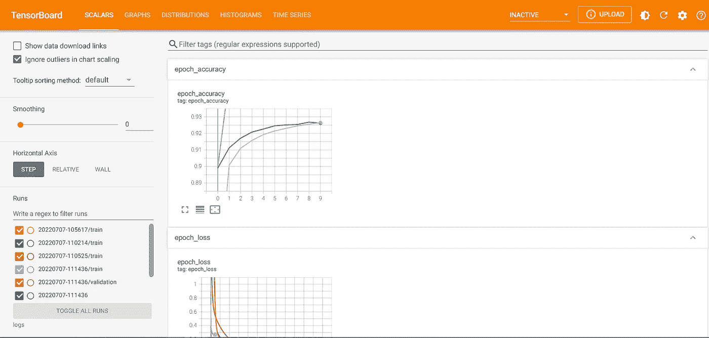
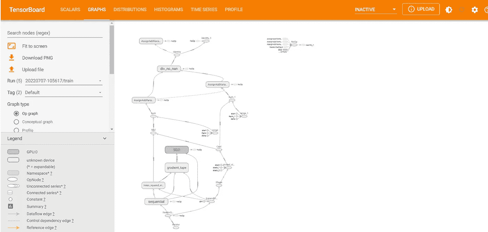
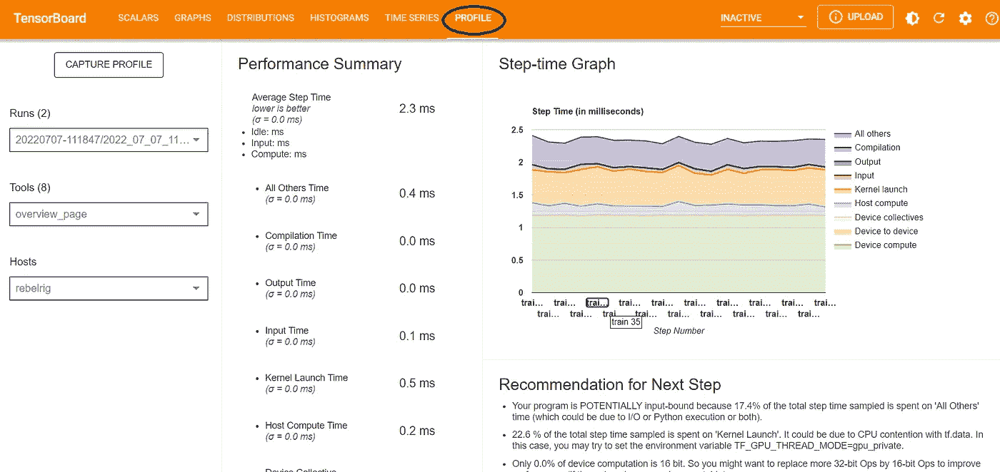
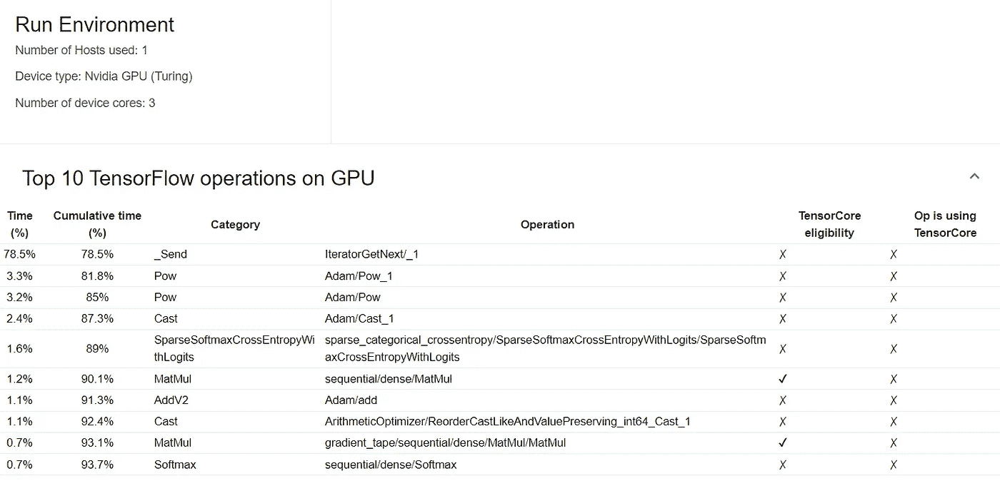
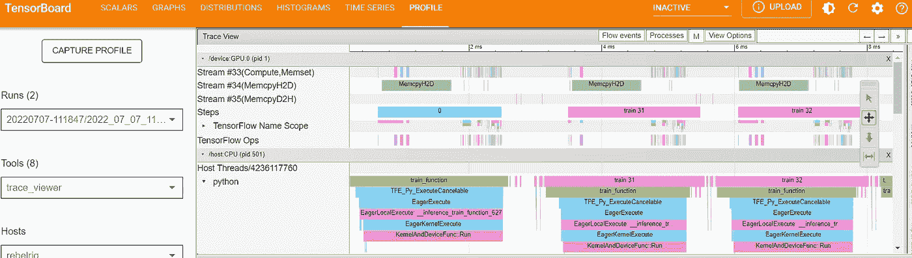
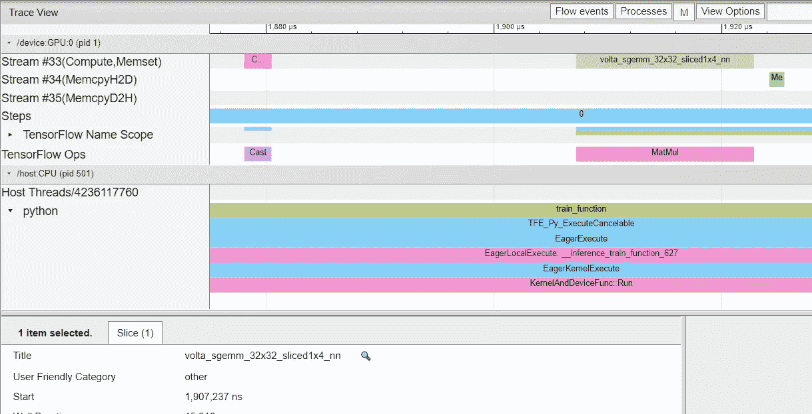

# 张量流剖面

> 原文：<https://medium.com/mlearning-ai/profiling-with-tensorflow-9eaa283e8c3?source=collection_archive---------4----------------------->

这篇文章简要回顾了分析概念以及如何使用 TensorFlow 分析深度学习模型。

# 为什么要侧写？

剖析一个计算机程序旨在更多地了解它的行为。通过了解程序的行为，开发人员可以进行优化，从而提高性能。此外，通过分析一个程序，开发者可以发现程序的瓶颈。例如，假设对于一个模型，在对它进行概要分析之后，我们发现它 90%的执行时间都花在了等待预处理的输入数据上。在这种情况下，它表明数据预处理是瓶颈。如果我们能够优化这一步，我们将获得巨大的加速。对于另一个场景，考虑大部分执行时间花在浮点运算等计算上。在这种情况下，像混合精度这样的优化技术可以显著加快速度，因为它们在保持可接受的计算质量的同时进行更少的计算。

# 先决条件

对于使用 TensorFlow 进行分析，需要以下软件包:

```
**pip install tensorboard** **pip install -U tensorboard_plugin_profile**
```

要在本地浏览器上远程查看 TensorBoard，请查看以下帖子。

[](/mlearning-ai/remote-tensorboard-viewing-on-your-local-browser-b0dc5c5a634a) [## 在本地浏览器上远程浏览 Tensorboard

### 张量流是流行的机器学习框架之一。它减轻了 ML 开发者的生活…

medium.com](/mlearning-ai/remote-tensorboard-viewing-on-your-local-browser-b0dc5c5a634a) 

# 如何用 TensorFlow 进行侧写？

对于使用 TensorFlow 进行概要分析，我们需要创建一个回调并添加到模型的 fir 函数中。考虑下面的例子。

```
**import tensorflow as tf
import tensorflow_datasets as tfds
import keras
import numpy as np
import datetime
from datetime import datetime
from packaging import version
import os** print(“TensorFlow version: “, tf.__version__)
device_name = tf.test.gpu_device_name()
if not device_name:
   raise SystemError(‘GPU device not found’)
   print(‘Found GPU at: {}’.format(device_name))tfds.disable_progress_bar()
(ds_train, ds_test), ds_info = tfds.load(‘**mnist**’, split=[‘train’, ‘test’], shuffle_files=True, as_supervised=True, with_info=True) def normalize_img(image, label):
“””Normalizes images: `uint8` -> `float32`.”””
    return tf.cast(image, tf.float32) / 255., labelds_train = ds_train.map(normalize_img)
ds_train = ds_train.batch(128)
ds_test = ds_test.map(normalize_img)
ds_test = ds_test.batch(128) model = tf.keras.models.Sequential([
tf.keras.layers.Flatten(**input_shape=(28, 28, 1)**),
#tf.keras.layers.Dense(**128**,activation=’**relu**’),
tf.keras.layers.Dense(**10**, activation=’**softmax**’)
]) model.compile(
loss=’sparse_categorical_crossentropy’,
optimizer=tf.keras.optimizers.Adam(0.001),
metrics=[‘**accuracy**’]
) # Create a TensorBoard callback
**logs** = “logs/” + datetime.now().strftime(“%Y%m%d-%H%M%S”)**tboard_callback** = tf.keras.callbacks.TensorBoard(log_dir = **logs**, histogram_freq = 1, profile_batch = ‘500,520’)model.fit(ds_train, epochs=10, validation_data=ds_test, callbacks = [**tboard_callback**])
```

# 用 TensorFlow 做侧写能得到什么？

在浏览器上打开 TensorBoard，会出现以下窗口。



以下子菜单用于分析模型指标，通常用于分析模型的性能:

1.  **标量和度量**(开发人员可以添加定制的度量来随时间监控，例如，学习率。点击这里的[查看如何记录自定义标量或度量)](http://Logging custom scalars)
2.  **图像/文本数据**(要查看输入的图像/文本数据，首先需要写入日志文件。[如果您想显示图像，甚至创建您的混淆矩阵或查看文本数据，请在此处选择](https://www.tensorflow.org/tensorboard/image_summaries)查看图像，在此处选择[查看文本](https://www.tensorflow.org/tensorboard/text_summaries)
3.  **使用 HParams 仪表板调节超参数**(应记录它们；否则，您将不会在其仪表板中看到任何信息)。检查这里的[和](https://www.tensorflow.org/tensorboard/hyperparameter_tuning_with_hparams)。
4.  **嵌入可视化器**用于显示高维嵌入(此处勾选)
5.  计算图(此图显示了 TensorFlow 中的模型如何完成所需的运算。)



点击阅读更多关于 Tensorboard】提供的工具。

但是，对于概要分析，我们需要概要分析仪表板:



在“概述”页面上，TensorFlow 提供了性能改进建议。此外，还显示了 GPU 上的前 10 个张量流操作:



在分析页面的左侧有一些用于分析的工具。

1.  **输入管道分析器**对模型的输入管道给出分析和建议。
2.  **内核统计**:列出 GPU 内核及其硬件需求，如寄存器数量、共享内存字节数等。
3.  **内存配置文件**选项卡显示内存使用情况的时间线图，提供以下信息
4.  **TensorFlow stats** :包含显示不同部分花费时间的饼图。此外，TensorFlow 操作具有出现次数、总时间等。，以表格形式提供。
5.  **跟踪查看器**:显示内核和操作的时间线执行。它揭示了大量关于 TensorFlow 如何执行神经网络的信息。

跟踪查看器工具的一个示例:



更多缩放:



# 结论

在这篇文章中，我们在 Tensorboard 的帮助下回顾了 TensorFlow 中的分析。完成分析是为了找到目标程序的优化潜力，以获得加速。

# 参考

[](https://www.tensorflow.org/tensorboard/get_started) [## TensorBoard | TensorFlow 入门

### 在机器学习中，为了改进某些东西，你通常需要能够测量它。TensorBoard 是一款提供…

www.tensorflow.org](https://www.tensorflow.org/tensorboard/get_started) [](/mlearning-ai/mlearning-ai-submission-suggestions-b51e2b130bfb) [## Mlearning.ai 提交建议

### 如何成为 Mlearning.ai 上的作家

medium.com](/mlearning-ai/mlearning-ai-submission-suggestions-b51e2b130bfb)