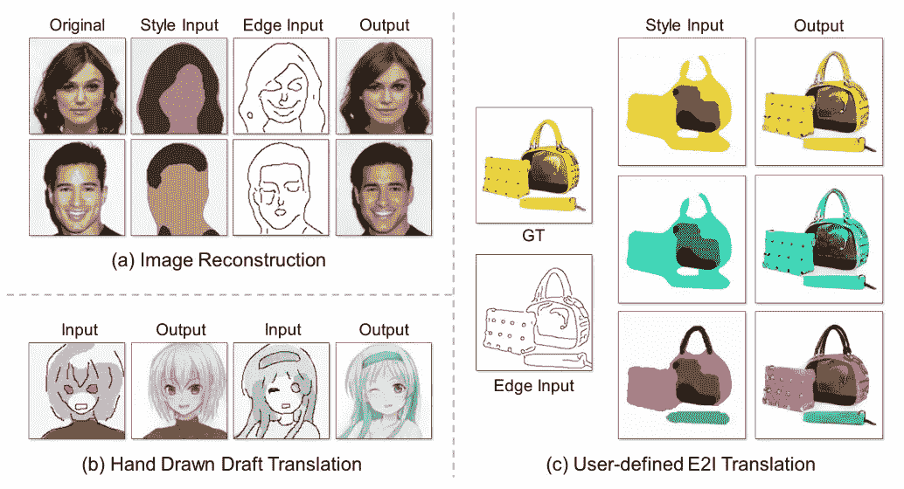
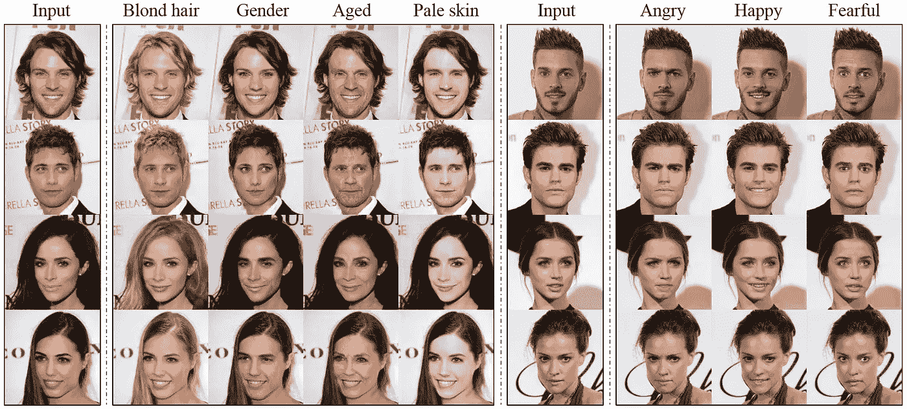
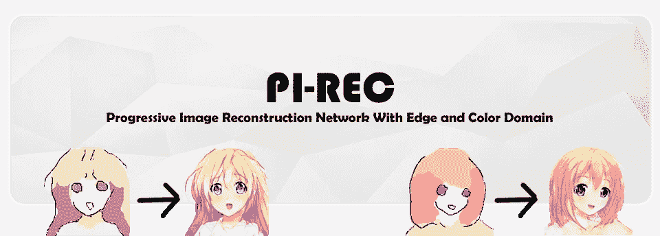
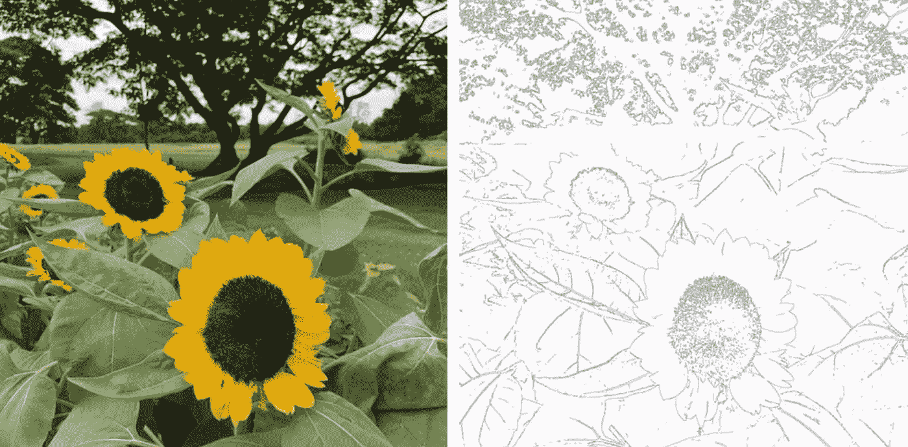
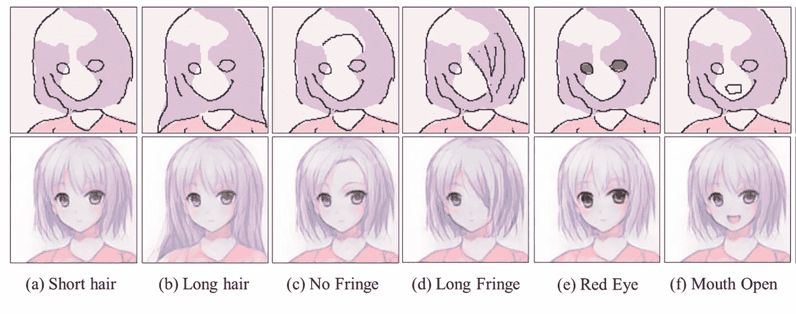
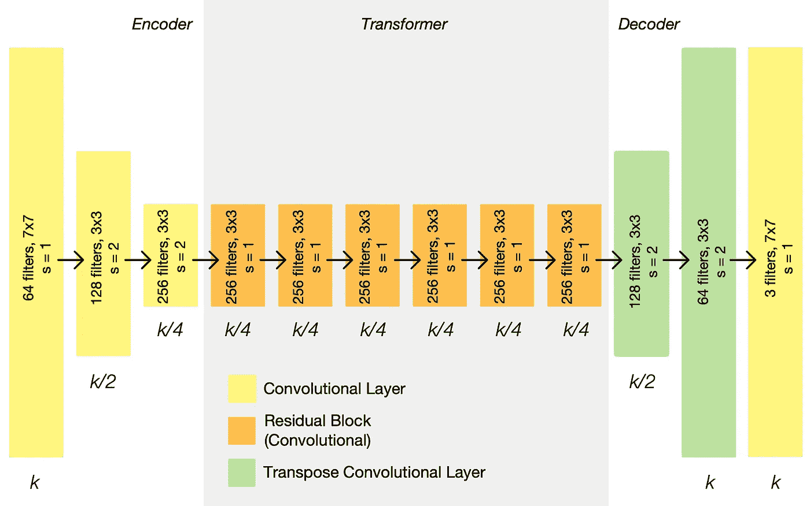
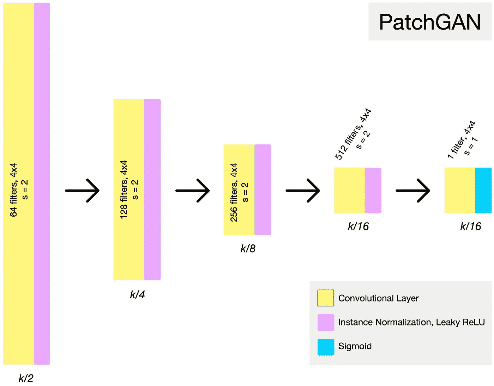
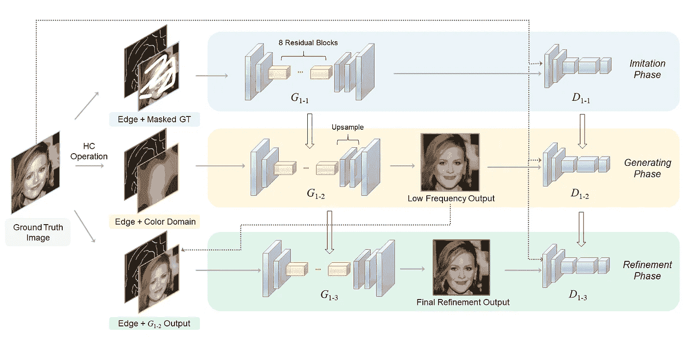

# 渐进图像重建

> 原文：<https://medium.com/mlearning-ai/progressive-image-reconstruction-gan-d1f56dad573e?source=collection_archive---------7----------------------->

Image reconstruction on different kinds of edges and colour domains [(source)](https://github.com/youyuge34/PI-REC/blob/master/files/s_banner4.jpg)

# 什么是图像重建？

图像重建是**计算机视觉**中的一种风格转移任务，目的是从给定的信息中重建图像缺失的部分。😄

近年来，在引入深度神经网络之后，重建图像的质量有了显著的提高。下面展示的是在风格转移领域表现显著的**深度学习(DL)** 模型:

[**Pix2Pix**](https://arxiv.org/abs/1611.07004) **:** 第一个统一的图像到图像(I2I)翻译框架

[**cycle gan**](https://arxiv.org/abs/1703.10593)**:**引入了循环一致性丢失，并提供了**两个不同域之间的双向映射**

[**StarGAN**](https://arxiv.org/abs/1711.09020)**:**通过应用条件标签，StarGAN 可以将样式转移到**多域**

image generated by star GAN [source](https://github.com/yunjey/stargan/blob/master/jpg/main.jpg)

# 渐进图像重建网络

[source](https://github.com/youyuge34/PI-REC/blob/master/files/banner3.png)

渐进图像重建网络(PI-REC)最早由尤等人(2019)在论文“ [*PI-REC:带边缘和色域的渐进图像重建网络*](https://arxiv.org/abs/1903.10146) ”中提出。

PI-REC 是一种**风格的传输网络**，就像以前的模型(例如 cycleGAN)一样，旨在解决**草图到图像** (S2I)或**图像到图像** (I2I)的转换。然而，PI-REC 与其他模型的最大区别在于，PI-REC 重建的图像基于**稀疏边缘**输入，而不是**密集边缘**输入。

## 为什么稀疏边缘输入很重要？

image generate by cycleGAN [(source)](https://subscription.packtpub.com/book/big-data-and-business-intelligence/9781788629416/7/ch07lvl2sec23/principles-of-cyclegan)

上图是使用 cycleGAN 进行的**边缘到照片的转换**。我们可以看到，要在左侧生成一幅向日葵图像，我们需要像右侧一样绘制边缘数据。然而，**对于大多数人来说，用如此详细的信息画出一条边是非常困难的**，尤其是对于像我这样只会画棍子的人来说。😢 😢

Image generated by a sparse edge ([source](https://github.com/youyuge34/PI-REC))

PI-REC 提出了一种新的方法，允许我们通过输入上图所示的**稀疏边缘**和**色域**来生成高质量的图像。

# 体系结构

PI-REC 是一个基于 GAN 的模型，有两个组件:一个**发生器**和一个**鉴别器**。

对于什么是甘，欢迎阅读我之前的帖子: [**动漫形象按风格生成甘**](/@s125349666/anime-image-generation-by-style-gan-b566db5a4f2e) **😄**

architecture of cycle gan ([source](https://towardsdatascience.com/cyclegan-learning-to-translate-images-without-paired-training-data-5b4e93862c8d))

PI-REC 的发生器类似于 **cycle gan** 和 **U-net** ，由编码器、变压器和解码器模块组成。

唯一不同的是作者在**解码器**中用(**上采样+卷积**)代替了**反卷积层**，解决了上采样时出现的 ***棋盘格伪影*** 问题。

discriminator of patch gan ([source](https://towardsdatascience.com/cyclegan-learning-to-translate-images-without-paired-training-data-5b4e93862c8d))

**PI-REC 鉴频器使用了贴片 GAN 结构**，它输出一个 N*N 矩阵，而不是一个标量。

# 培养

因为**稀疏边缘**或**色域**与真实图像相比具有巨大的数据差距。对于模型来说，仅仅从边缘和色彩域学习是非常困难的。😢

因此，作者提出了一个三阶段的训练过程来解决这个问题: ***模仿阶段、生成阶段和细化阶段*** ，训练时只有一个生成器和一个鉴别器。

the architecture of PI-REC ([source](https://github.com/youyuge34/PI-REC))

> 很多有志青年艺术家一开始就被建议通过临摹大师来学习。
> 
> 在初步绘画期间，草图和背景绘画提供基本元素和结构信息。
> 
> 在微调阶段，作品逐渐细化细节，色彩层越来越浓，增加了光影效果。
> 
> 尤等(2019)

类似于这样的绘画过程，细节重建方法如下所示:

## ***模仿阶段:***

在模仿阶段，模型的输入是**边缘**和**被遮罩的地面真实图像**，而输出是没有遮罩的**地面真实图像** (GT 图像)。

通过随机覆盖地面真实图像，**将迫使生成器学习被覆盖部分的细节**。同时，网络考虑了边的输入。

*   *模仿阶段也可以被视为图像修复任务。*

## ***生成阶段***

在**仿制阶段**网络**收敛**后，我们将在**同型号**上继续训练下一阶段。生成阶段是训练的主要阶段，输入(**边缘+色域**)和输出 **GT 图像**。

## ***细化阶段***

最后，在训练**收敛**后，我们将采集生成阶段的**输出图像(上图中的**G1–2**)作为该阶段的输入，同时输出也是 GT 图像。**

> 综上所述，我们可以看到，在培训的不同阶段，我们只是**改变模型**的输入。我们首先从**简单任务**(图像修补)开始，然后到**主任务**(图像重建)，最后我们添加一个**细化阶段**来生成更多高频细节。
> 
> 有了这个**渐进策略**，我们可以期待训练会变得更稳定，表现会变得更好👐

# 结论

在这篇文章中，我们探索了一种新的渐进模型 PI-REC，用于图像重建任务。通过应用**三阶段**训练，PI-REC 成功地保证了图像的内容或风格可以容易地由输入数据控制(**备用边缘**和平坦色域)。

我简单介绍了 PI-REC 的模型结构和训练过程。不过我没有提到的是**损失函数**和**输入数据的增强**这也是 PI-REC 的重要部分。

如需了解更多信息，强烈建议阅读以下报纸:

*   [***PI-REC:带边缘和色域的渐进图像重建网络***](https://arxiv.org/abs/1903.10146)*🥀⏳*
*   *[***EdgeConnect:生成式图像修复与对抗性边缘学习***](https://arxiv.org/abs/1901.00212)*🐶 🐶**

** [## Mlearning.ai 提交建议

### 如何成为 Mlearning.ai 上的作家

medium.com](/mlearning-ai/mlearning-ai-submission-suggestions-b51e2b130bfb)**