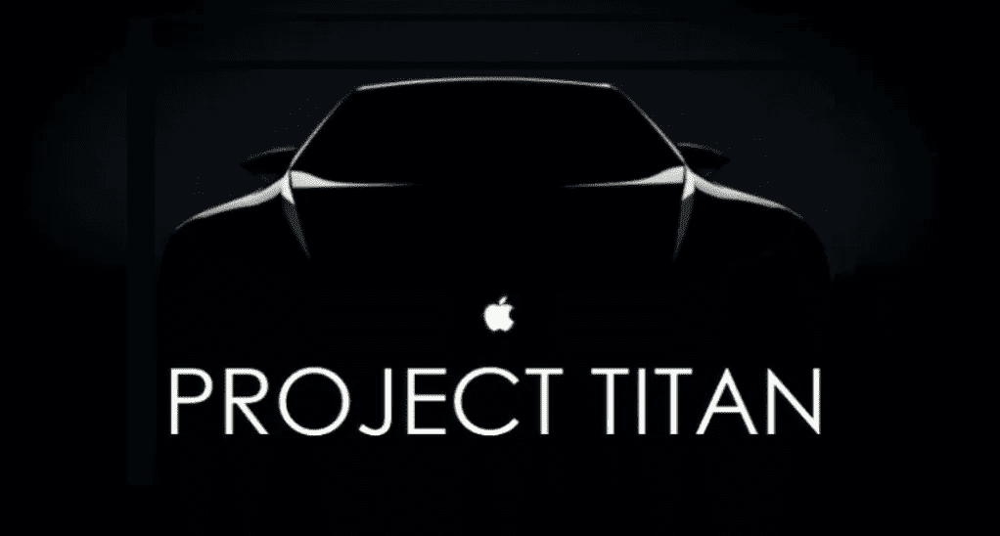
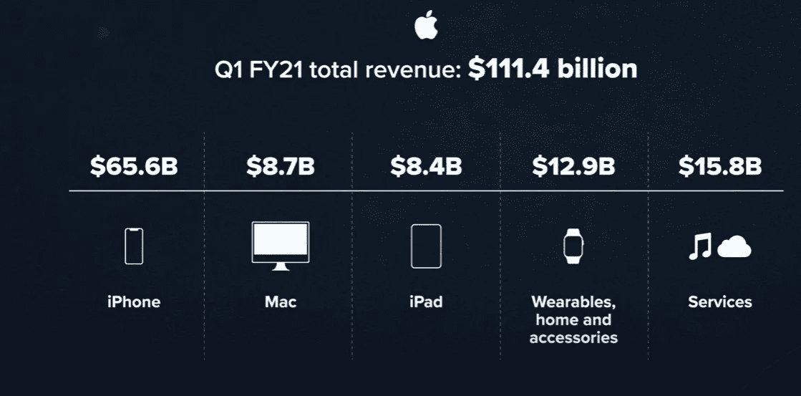
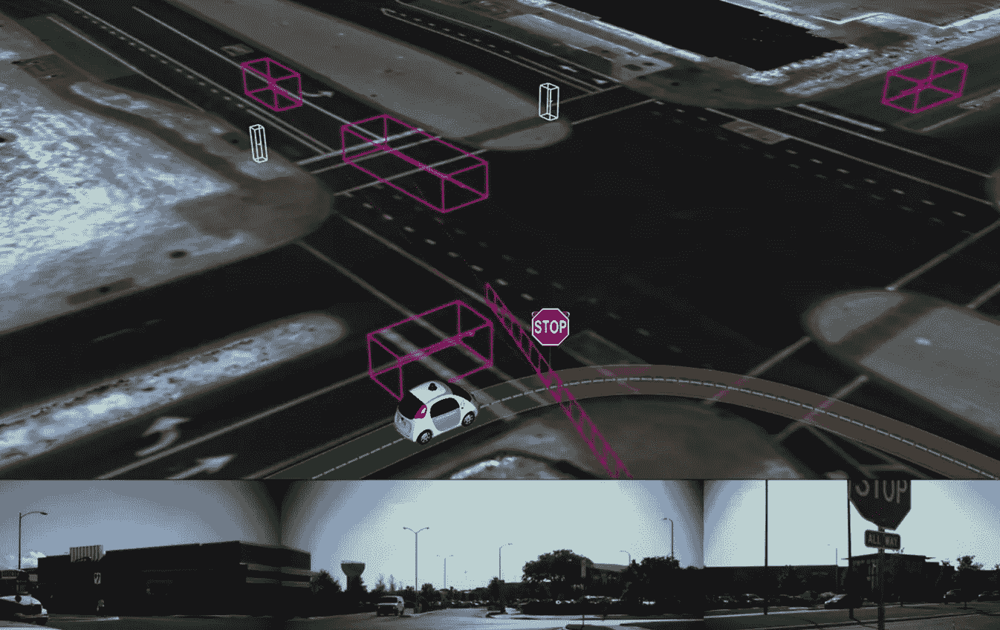

# 泰坦计划

> 原文：<https://medium.com/mlearning-ai/project-titan-c628ad635c91?source=collection_archive---------1----------------------->

什么是泰坦计划:

泰坦计划是一个秘密项目，苹果公司在没有公开宣布的情况下，开始与内部和一些外部资源合作。

从 2014 年开始，苹果开始致力于“泰坦计划”(Project Titan)，超过 1000 名员工在库比蒂诺总部附近的一个秘密地点开发电动汽车。

# 背景:

我们对苹果的惊喜并不陌生，该公司以前就让我们震惊过。从 iPod 到新一代 iPhone，它震惊了消费者和科技巨头。

苹果已经创造了自己的品牌价值，iPhone X 将智能手机市场推向了一个千元以上手机的新时代。

在 2021 年的第一个财政季度，iPhone 和 iPad 的销售首次推动苹果的收入超过 1000 亿美元。

多个新闻报道称，在 2021 年的 Q1，苹果手头有 1950 亿美元。由于手中有如此高的现金流，苹果将永远不会放弃进入另一个领域或业务。

2016 年，苹果已经向中国优步的竞争对手滴滴出行投资了 10 亿美元，这有助于加强苹果与移动行业和自动驾驶技术领域的联系。

苹果已经开始从黑莓、美国国家航空航天局和其他受委托从事泰坦项目的公司招聘人才。他们还增加了被吸引到 Project Titan 的前特斯拉员工，包括前特斯拉自动驾驶仪、动力系统、机械设计、固件工程师和全球供应链经理。这已经制造了谣言让人们相信有大事要发生了。

# 期望:

在过去几年的时间里，苹果汽车项目经历了多次反复。早期的传言称，苹果将制造一辆完整的汽车，但后来领导斗争、开发问题和内部纷争导致传言称，该项目已被缩减，并将专注于自动驾驶技术。

在 2019 年和 2020 年，我们开始听到新的传言，称该项目再次转向，苹果将继续寻求苹果品牌的汽车，然后在 2020 年底的多个传言证实，苹果仍在与多家不同的供应商就面向消费者的完整苹果品牌汽车进行合作和谈判，并计划与现有的汽车制造商合作。

苹果客户对一家建立在信任和产品质量基础上的公司有很高的期望。由于现金流和已知的品牌价值，苹果有一条直接进入商业的途径，但由于缺乏汽车行业的经验，它也不会遇到什么重大挑战。

# 挑战:

任何想进入汽车行业的公司总是会遇到重大挑战，因为这是一个发展缓慢的行业，除了特斯拉，许多知名公司都已经经营了很长时间。特斯拉是在最短时间内盈利的汽车行业的最新成员。

毫无疑问，苹果必须与不同行业的多家公司合作才能进入这个行业。像特斯拉一样，一家新的汽车公司将面临建立汽车制造业务这一极其昂贵的任务的融资问题。

特斯拉已经花了 10 亿美元在全球制造电池和生产设备。但我们忘记了，这些财务挑战可能不会出现在苹果的道路上，因为它手中有大量的现金流。

# 从技术角度看，泰坦项目是什么样的:

苹果正在研发无人驾驶汽车，谷歌和其他科技巨头也在研发。不同的公司正在使用人工智能和机器学习作为自动驾驶汽车中物体检测的一部分。

Waymo 是一家美国自动驾驶技术开发公司，已经与捷豹达成了自动驾驶汽车交易。

因此，苹果必须设计或开发自己的团队或软件来设计和测试自动驾驶，苹果已经开始这样做了。仅在 2020 年，Waymo 在加州就行驶了近 629，000 英里，而苹果只行驶了近 19，000 英里。

# 结论:

汽车行业受科技行业的影响很大，因为苹果是非常突出的科技行业。苹果是一个科技巨头，因此其他公司也在做同样的事情，但这非常值得注意，因为在财政资源和研发方面，苹果毫无疑问拥有所有这些。

当苹果进入智能手机业务时，市场上也有其他科技巨头，但苹果推出了一款如此独特和用户友好的产品，以至于改变了该行业十多年。如果苹果能在汽车上做同样的事情，这可能会是一个巨大的成功。

苹果可能在 2024 年开始生产，并计划在 2025 年至 2027 年推出。这些都是猜测，直到苹果方面的官方消息，直到我们可以静观其变。

# 参考:

[https://www . CNBC . com/2021/02/03/apple-and-Hyundai-KIA-driving-on-deal-on-apple-car . html #:~:text = After % 20 years % 20 of % 20 speculation % 20 that，向% 20CNBC % 20on 简要介绍了% 20 计划](https://www.cnbc.com/2021/02/03/apple-and-hyundai-kia-driving-towards-deal-on-apple-car.html#:~:text=After%20years%20of%20speculation%20that,briefed%20CNBC%20on%20the%20plan)

https://www.macrumors.com/roundup/apple-car/