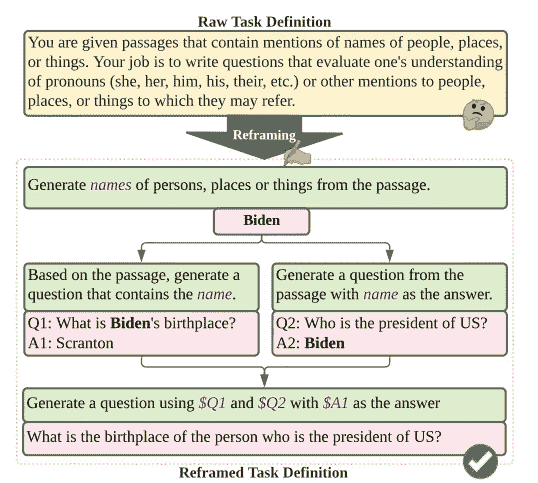
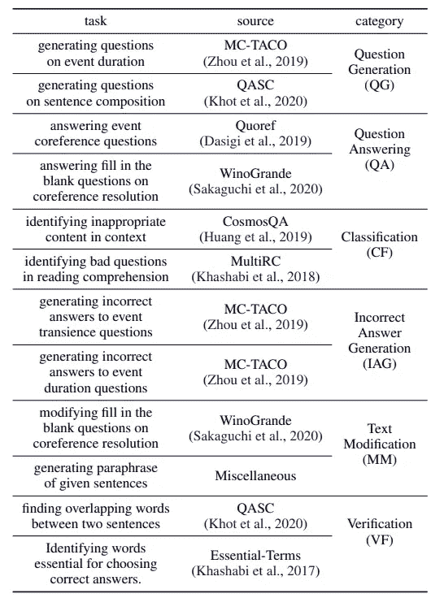
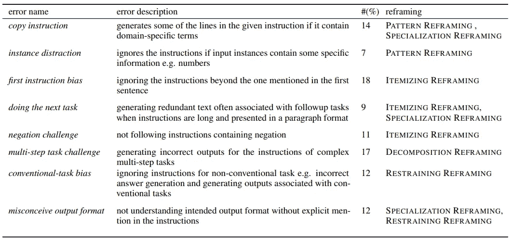

# 快速重构:让你的 GPT 更容易

> 原文：<https://medium.com/mlearning-ai/prompt-reframing-make-it-easier-for-your-gpts-79232e618413?source=collection_archive---------5----------------------->

这是来自亚利桑那州立大学和华盛顿大学的研究人员的论文“[重构 GPTk 语言的教学提示](https://arxiv.org/pdf/2109.07830.pdf)”的摘要。我大量借用了报纸上的描述和图表。如需更详细的解释，请随时查看。

# 介绍

GPT 模型接受一个指导性的提示，并根据提示生成一段文字。我自己以前用 GPT3 api 尝试过，发现尽管模型可以使用类似人类的指令来执行任务，但它很可能无法捕获重要信息。(必须生成几次并选择最佳结果。)

现在你已经可以感觉到预算在飞速增长。NLP 研究的一个主要分支是使现有的预训练大型模型更有效/更道德，而不是为新模型进行训练。本文就是其中之一。

本文发现，与原始指令相比，重构后的指令在不同大小的 LMs 上有显著的改进。根据他们的结果，重构的提示将 GPT3 的少数镜头性能提高了 12.5%。

Figure 1 in paper; The yellow section is a harder and lengthier prompt compared to the dissected green instructions. The latter ones are simpler for they use several steps to perform a larger task.

# 详细信息:数据集-设计指南-分析

## 数据集— [链接](https://instructions.apps.allenai.org/)

该数据集被称为 ***自然指令*** ，它由许多任务的自然众包指令组成，具体来说:61 个不同的任务，它们的人类创作的指令，以及 193k 个任务实例(输入-输出对)。他们建立这个数据集来测试在特定数据集上训练的模型是否能够推广到看不见的数据集。由于我们在本文中没有讨论这一点，所以我把他们的结果放在这里:*当根据对看不见的任务的概括进行评估时，模型受益于指令(利用指令的模型好 19%)。*

回到我们的重点，本文使用了上述数据集中的 12 个任务，并在两种设置下测试语言模型(LM):用原始数据进行推理(更难和更长)与用重构数据进行推理(多步简单指令)。

这 12 项任务又进一步分为 6 类:**问题生成、问题回答、分类、错误答案生成、文本修改、**和**验证**。

Table 2 in paper;

## 快速重构的设计指南

本文的贡献有三个方面:

1.  确定几个指导方针来重新构建教学提示；
2.  用大量实验支持上述指导方针；
3.  量化激励技巧的贡献

那么长指令有什么问题呢？通常，为了准确地指代抽象的事物，人们倾向于在描述中包含重复的信息、抽象的概念、类比和复杂的陈述。虽然它对我们来说工作得相当好，但它包含了 NLP 领域中的几个复杂任务，这使得模型首先更难理解问题。因此，我们希望根据以下五个原则将提示分解成更简单的指令:

> (C1)使用低级模式:不要使用需要背景知识才能理解的术语，而是使用关于预期输出的各种模式。
> 
> (C2)逐项说明:将描述性属性转换为项目符号列表。如果有否定语句，就把它们变成断言语句。
> 
> (C3)分解:尽可能将一项任务分解成多个更简单的任务。
> 
> (C4)强制约束:添加输出约束的显式文本语句。
> 
> (C5)专门化指令:定制指令，以便它们直接与预期输出对话。
> 
> —直接引自[报](https://arxiv.org/pdf/2109.07830.pdf)

根据这些原则，作者提出了五种重构技术，即:模式重构、分项重构、分解重构、抑制重构和专门化重构。我们将在下面逐一介绍。

## 模式重构

**坏榜样**:

> 精心设计一个需要常识来回答的问题。基于给定的上下文，设计一个常识性的问题，尤其是那些长的、有趣的、复杂的问题。目标是写出人类容易，AI 机器难的题！要创造这样的问题，这里有一些建议:a .一个事件可能(也可能不是)是什么似是而非的原因？b .事件发生之前(或之后，或期间)可能(或不可能)发生什么？c .关于某人(或某事)什么可能(或不可能)是可信的事实？d .如果一个事件发生了(或没有发生)，会(或不会)发生什么？您还可以创建其他类型的问题。
> 
> 输入:上下文:<>预期输出:问题:<>

**重新架构**:

> 用‘可能会发生什么’，‘会…？’、'为什么可能'、'什么可能导致了'、'什么可能是真的'、'什么可能是真的'、'什么必须'以及类似的短语。
> 
> 输入:上下文:<>预期输出:问题:<>

在糟糕的例子中，我们要求模型理解一些抽象的描述，如:“常识”、“复杂”、“对人类来说容易，对 AI 机器来说难”等。除此之外，一些隐藏的任务就像:“创建这样的问题…”或“其他类型的问题”，这需要模型首先识别会议(这很难)。

在重构的例子中，我们直接告诉模型在生成的问题中使用哪种模式。当我们使用这些模式(作者称之为低级模式)时，输出的问题可能是“常识性的”和“复杂的”，如前所述。

> 要点:通过告诉 GPT 直接用低级模式做什么来删除抽象描述。

## 明细重构

**不好的例子:**

> 按照说明用给定的上下文单词生成输出。做<>。做<>。不要<>。
> 
> 输入:上下文单词<>预期输出:长文本<>

本例中有三条指令按顺序列出。我们将其更改为以下内容，

**重新架构:**

> 按照下面的说明，根据给定的上下文单词生成输出。
> 
> —做<>
> 
> — Do <>
> 
> — Do <>
> 
> 输入:上下文单词<>预期输出:长文本<>

更直观但理论上理解较少。简单地将指令重新排列成要点可以提高性能。否则，模型会忽略第二条和第三条指令。

> 要点:要点比顺序说明更好。

## 分解重构

**不好的例子:**

> 在这个任务中，根据给定的上下文单词，你需要创建一对句子，每个句子包含一个空格(_)和相应的答案。句子对应该看起来相似，并且应该是关于两个相关但不同的对象；例如“奖杯”和“手提箱”。此外，句子在触发词(例如，“小”和“大”)方面必须不同，这些触发词表达了关于两个对象的对比属性。
> 
> 输入:上下文单词:<>
> 
> 预期输出:问题 1: <>答案 1: <>问题 2: <>答案 2: <>

类似于模式重构的例子，上面的例子有许多共同的引用。作者没有输入上下文单词并让模型生成多个问题和配对答案，而是将其分成 5 个子任务。每个子任务都有更直接的提示。

**重构:**

> 子任务 1。根据给定的上下文单词写出两个物体。
> 
> 输入:上下文单词:<>预期输出:对象:<>
> 
> — — — — — — — — — — — -
> 
> 子任务 2。用动词连接宾语来造句。
> 
> 输入:对象:<>预期输出:句子:<>
> 
> — — — — — — — — — — — -
> 
> 子任务 3。在句子中的填空题中，用物体 1 来填空。
> 
> 输入:对象 1: <>，句子:<>预期输出:问题:<>
> 
> — — — — — — — — — — — -
> 
> 子任务 4。改变给定的问题，使答案翻转到问题中的对象 2。
> 
> 输入:对象 2: <>，句子:<>，问题:<>预期输出:问题:<>
> 
> — — — — — — — — — — — -
> 
> 子任务 5。生成问题和答案:
> 
> 输入:问题 1: <>对象 1: <>问题 2: <>对象 2: <>预期输出:问题 1: <>答案 1: <>问题 2: <>答案 2: <>

我确实对最后一个子任务有一些疑问，其中的描述对我来说似乎不完整。但是这里的重构技巧是很明显的:分解复杂的任务，这样模型就不必处理困难的 NLP 任务，比如同现检测，来执行指令。此外，我的假设是:当描述需要模型解析多个句子时，总是比较困难。

> 外卖:简短的子任务与简单明了的投入分别超过长期困难的任务。

## 抑制重构

**不好的例子:**

> 与给定问题相对应的答案是什么类型？数字、日期或跨度？…
> 
> 输入:段落:<>。问题:<>预期产出: <number>…</number>

**重新架构:**

> 与给定问题相对应的答案是什么类型？数字、日期或跨度？…
> 
> Input: Passage: <> Question: <>回答数字、日期或跨度？预期产出:

注意，我们在输入中增加了一条指令，告诉模型确切地生成什么: ***回答数字、日期或跨度？***

这对一代人来说是一种约束，这样模型就不会即兴发挥太多。(比如回答一个包含数字/日期/Span 的句子来回答你的问题)

> 要点:确切地告诉模型用约束生成什么。

## 专业化重构

**不好的例子:**

> 回答以下问题……<not so="" important="" text="">…</not>
> 
> 输入:问题<>预期输出:答案<>

**重新架构:**

> 计算以下问题的答案。你需要加上或减去与问题中出现的两个物体相关的数字。
> 
> 输入:问题<>预期输出:答案<>

正如我们在此示例中看到的，“计算以下问题的答案”比“回答以下问题”更具体，因为它告诉模型生成过程是一种计算。模型忽略不太常见(例如，分配一个弱的注意力分数)。

> 要点:明确说明，这样模特就不会忽略它。

## 给制作团队的提示:错误和可以用来解决它的技术

Table 4 from paper;

这个表格告诉我们，逐项重构技术对常见错误的贡献最大，而限制重构帮助最小。

# 参考

*   重构 GPTk 语言的教学提示[https://arxiv.org/pdf/2109.07830.pdf](https://arxiv.org/pdf/2109.07830.pdf)
*   通过自然语言众包指令进行跨任务概括[https://arxiv.org/pdf/2104.08773.pdf](https://arxiv.org/pdf/2104.08773.pdf)

 [## Mlearning.ai 提交建议

### 如何成为 Mlearning.ai 上的作家

medium.com](/mlearning-ai/mlearning-ai-submission-suggestions-b51e2b130bfb)