# 关于时间序列预测的正确描述

> 原文：<https://medium.com/mlearning-ai/proper-picture-of-time-series-forecasting-5dccc53436bc?source=collection_archive---------3----------------------->

5 分钟内无故障概念。


# 什么是时间序列预测？

它是基于以前的观察值来预测未来值的模型。它在每个时间点都有一定的数据点。

# 时间序列应用:

时间序列广泛应用于非平稳数据，如

> 股票价格、天气预测、经济、零售销售等…

# 处理时间序列数据的几个方面:

1.  平稳性
2.  季节性
3.  自相关

那么，这些方面代表了什么呢？？

# 平稳性:

时间序列的平稳性很重要，只有当时间序列的统计特性不随时间变化时，才称其为平稳的。最重要的是保持恒定的均值和方差。

> 平稳性:它的行为不会随着时间而改变。
> 
> 非平稳性:它的行为随着时间而变化。

# 季节性:

季节性是指数据的周期性波动。例如，一家服装店会在特定的季节(如节日、结婚等)获得高销售额，而在其他时间则是低销售额。这在数据上叫做季节性。

# 自相关:

自相关是观测值之间的相似性，是它们之间时滞的函数。

但是，我们如何知道我们的数据是否是稳定的呢？？

不要担心有一个著名的测试来检查数据。

测试？？我的天啊


> ***统计检验— ADF 检验(或)Dickey Fuller 检验。***

通过 ADF 测试，我们可以判断数据是否是平稳的。

*   ADF 检验中的零假设— **非平稳**
*   ADF 检验中的替代假设— **平稳**
*   ADF 统计< Critical value — **拒绝零假设**
*   ADF 统计>临界值— **无法拒绝零假设**

## 时间序列的组成部分

时间序列数据有许多组成部分，但最成功使用的是:

1.  ***级别*** :时间序列数据在直线上时的基值。
2.  ***趋势*** :趋势是系列数据随时间的增减行为。
3.  ***季节性*** :季节性是指数据的周期性波动。
4.  ***噪声*** :模型无法解释的观测值(系列数据)中的扰动。

## **建模时间序列:**

时间序列建模不过是通过移动平均、指数平滑将数据序列可视化。

## **移动平均线:**

在移动平均线中，我们可以将数据可视化，这样我们就可以通过数据的季节性和趋势性来了解系列数据。我们可以使用窗口大小来实现数据的适当可视化。

*   时间序列建模的简单方法。
*   它陈述了未来的观察结果，即所有过去观察结果的平均值。
*   用于识别数据中有趣的趋势。
*   它平滑了时间序列。
*   窗口越长，趋势就越平滑。

## **指数平滑:**

*   类似于移动平均线。
*   随着我们离现在越来越远，观察的重要性就越来越小。

# ARIMA |萨里玛

# (自回归积分移动平均)

# (季节性自回归综合移动平均数)

# 季节性(P、D、Q、S):

*   s 是季节的长度
*   P & Q 类似于宝洁公司
*   d 是季节积分的阶数，代表从序列中去除季节性所需的差异数。

# 自回归模型(AR) (p):

*   时间序列向自身的回归。
*   当前值依赖于它的前一个值，有一些滞后。
*   取代表最大滞后的参数(p)。
*   使用偏自相关(PACF)来预测(p)。
*   使用自相关来预测(q)。

# 综合(一)(四):

*   这意味着我们不是采用原始目标值，而是对它们进行差分。例如，我们的销售预测模型将尝试预测明天的销售变化(即，明天的销售减去今天的销售)，而不仅仅是明天的销售。

# 移动平均线(MA) (q):

*   参数(q)代表最大滞后，在此之后，其他滞后在自相关图上不显著。

OMG！！理论到此为止…


Enough with theory….

让我们看看实际情况

因此，我们正在处理安讯士银行的股票数据..

导入必要的包

```
import pandas as pd
import numpy as np
from matplotlib import pyplot as plt
import seaborn as sns
```

加载数据集

```
df=pd.read_csv('AXISBANK.csv',index_col=['Date'],parse_dates=['Date'])
df.head()
```

数据清理

```
df.isnull().sum()
df=df[df.Symbol!='UTIBANK']
```

绘制数据

```
plt.figure(figsize=(17,8))
plt.plot(df.Close)
plt.title('Closing price of Axis Bank')
plt.xlabel('Trading day')
plt.ylabel('Closing price')
plt.grid(False)
plt.show()
```

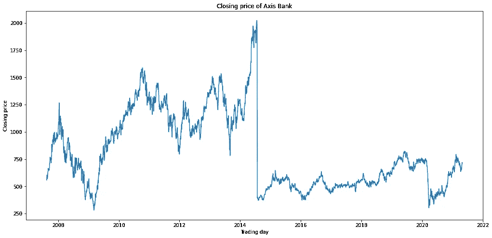

## 对系列数据建模以进行可视化

**移动平均线**

```
# Moving Average to smooth our timeseriesdef plot_moving_average(series,window,plot_intervals=False,scale=1.96):
    rolling_mean=series.rolling(window=window).mean()

    plt.figure(figsize=(17,8))
    plt.title('Moving average\n window size={}'.format(window))
    plt.plot(rolling_mean,'g',label='Rolling mean trend')
    plt.legend()
    plt.grid(True)plot_moving_average(df.Close,30)
```

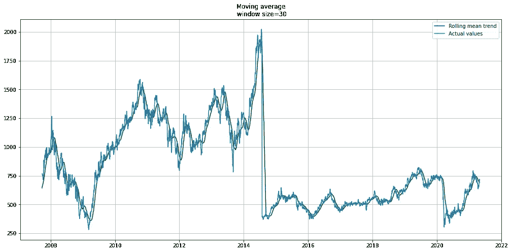

Moving average with window size of 30

**指数平滑**

```
def exponential_smoothing(series,alpha):
    result=[series[0]] # first value is same as in series
    for n in range(1,len(series)):
        result.append(alpha * series[n] + (1-alpha) * result[n-1])
    return result def plot_exponential_smoothing(series,alphas):
    plt.figure(figsize=(17,8))
    for alpha in alphas:
        plt.plot(exponential_smoothing(series,alpha),label='Alpha {}'.format(alpha))
    plt.plot(series.values,'c',label='Actual')
    plt.legend()
    plt.title('Exponential Smoothing')
    plt.grid(True) plot_exponential_smoothing(df.Close,[0.5,0.02])
```

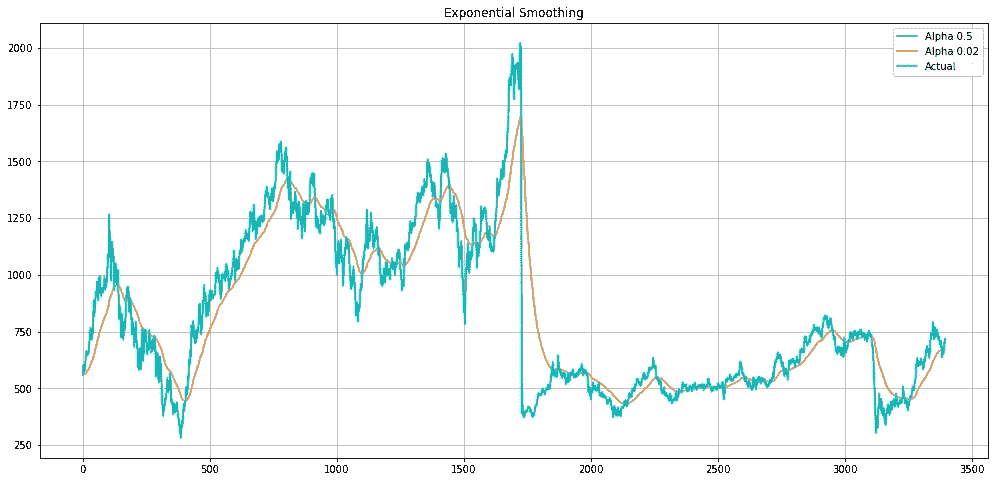

Exponential Smoothing with two alpha values

迪基-富勒检验——检查数据的平稳性

```
# To check whether the model is stationary or not then use Dickey-Fuller test
# Statinorityfrom statsmodels.tsa.stattools import adfullertest_result=adfuller(df['Close'])
```

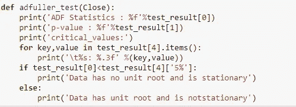

ADF tester

ADF 测试结果

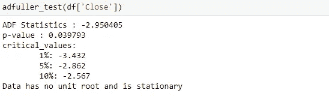

Test results

哇…我得到了稳定的数据。

但是如果我们得到非平稳数据呢？？

为此，请使用差异…

```
# As my timeseries is in stationary no need of making difference over here.
# But just made this diff dataframe for future references, what if it is not stationary then it would help.df_diff = df.Close-df.Close.shift(1)# As the timeseries is in seasonal we should difference with seasonal value of 12 monthsdf_seasonal_diff = df.Close-df.Close.shift(12)
```

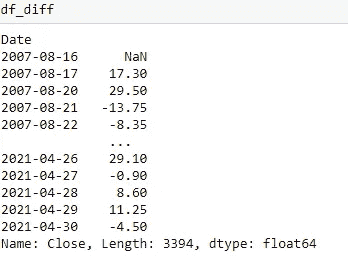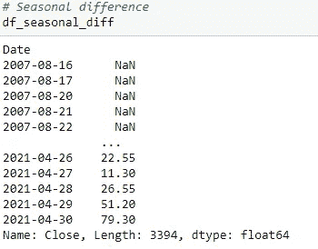

One shift for normal diff & twelve shift for seasonal diff

## ARIMA 模型

ARIMA 模型与 ACF 和 PACF

时间序列观测值与先前时间步长的相关性称为滞后。

> ACF:用滞后的时间序列数据绘图称为 **A** uto **C** 或 relation **F** 函数。
> 
> PACF:时间序列数据中的一个观测值与前一时间步的观测值之间的关系的汇总，其观测值之间的关系被称为**P**artial**A**uto**C**或 relation **F** 函数。

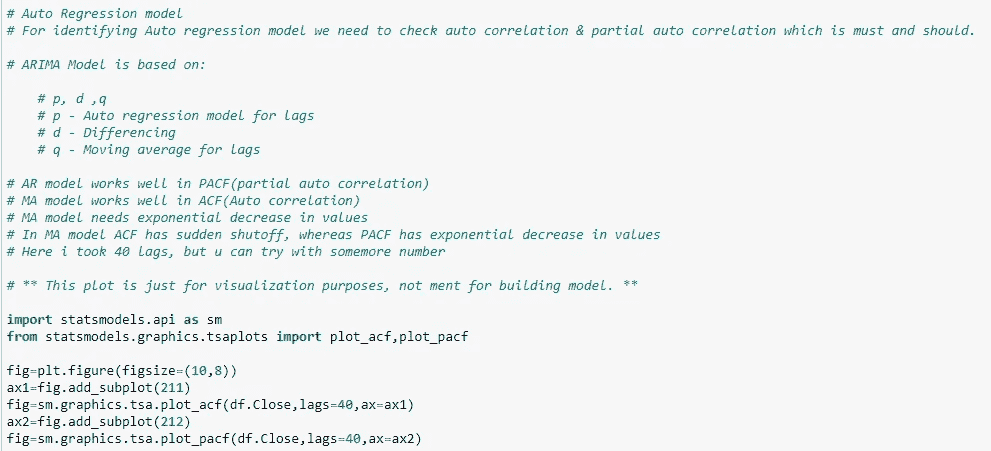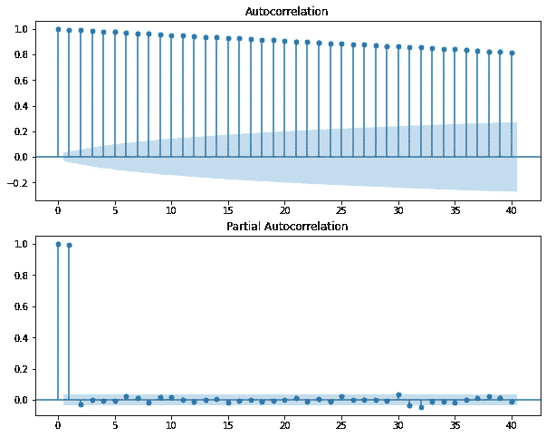

ACF & PACF of ARIMA Model.

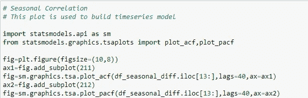

Seasonal ARIMA.

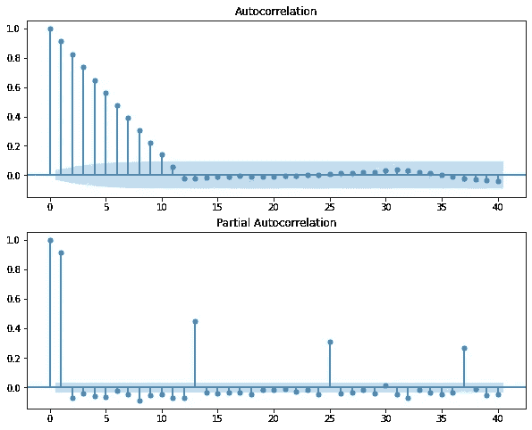

ACF & PACF of SARIMA Model.

# 指标:

$误差=预测值-实际值$

$mse = np.square(错误)。平均值()$

$rmse = np.sqrt(mse)$

$mae = np.abs(错误)。平均值()$

$mape=np.abs(errors/x.valid)。平均值()$

# 处理时间序列预测的高级模型

*   萨里马克斯
*   VARMAX
*   美国有线新闻网；卷积神经网络
*   RNN
*   LSTM
*   雷斯内特


## 要记住的几点:

> ARIMA 模型的基础是:
> p，d，q
> 
> p —滞后的自回归模型
> d —差分
> q —滞后的移动平均
> 
> AR 模型适用于 PACF(部分自相关)
> MA 模型适用于 ACF(自相关)
> MA 模型需要值呈指数下降
> 在 MA 模型中，ACF 会突然关闭，而 PACF 的值呈指数下降

感谢您的阅读和关注。

如果你喜欢我的文章，点击拍手图标…