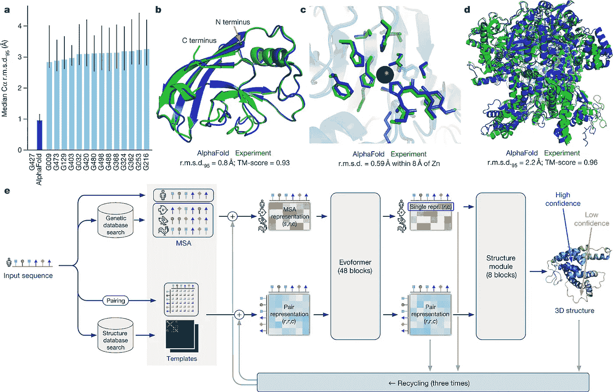

# 蛋白质折叠:生物学的大挑战仍未解决？

> 原文：<https://medium.com/mlearning-ai/protein-folding-the-grand-challenge-of-biology-is-still-unsolved-52b01ac22756?source=collection_archive---------10----------------------->

“蛋白质”这个词是从哪里来的，为什么？1838 年，Berzelius 在他写给 Mulder 的信中讨论了他们对白蛋白和纤维蛋白的基本分析结果，他从希腊语“proteios”中创造了蛋白质一词，意思是主要的或最重要的，因为他认为蛋白质是动物营养中的主要物质。

基本上，蛋白质是具有三维形状的生物分子。蛋白质在动物生物学中起着至关重要的作用。简而言之，他们是动物生物学的实干家。蛋白质的用途我就不多赘述了。但是需要记住的重要一点是，我们会在讨论中反复提到，蛋白质是由氨基酸组成的。这些氨基酸相互连接形成一条长的直链，称为多肽链。这种线性链也被称为蛋白质的一级结构。蛋白质需要折叠成三维形状才能具有生物功能。蛋白质的功能仅由它的三维形状决定。通过实验确定蛋白质结构是一种昂贵的方法，每个蛋白质大约 100，000 美元。通过计算确定蛋白质结构是唯一可行的方法。对于那些结构已经被实验确定的蛋白质来说没有问题，但是对于那些结构还没有确定的新蛋白质来说，成本是一个问题。我们必须找到实验的替代品。但是如果我们不能通过实验确定蛋白质的形状，那么我们怎么能想到知道蛋白质的三维形状和它的功能。如果我们不能在实验上做到，那么我们如何在计算上做到，我们的输入是什么？

是的，通过实验确定蛋白质结构确实很昂贵，但是确定蛋白质中的氨基酸序列相对便宜，大约 1000 美元。它被称为全基因组测序。对于一种新的蛋白质，我们可以很容易地知道该蛋白质的基因组序列是什么，但我们很难知道它的三维结构。知道蛋白质的基因组序列是没有用的，因为只有形状决定蛋白质的性质，而不是序列。那基因组序列没用吗？

# 蛋白质折叠的挑战

1950 年，Christian Anfinsen 的一系列发现表明，将多肽链折叠成明确定义的生物功能构象所需的信息严格编码在其氨基酸序列中。此后，生物学家从理论上认识到，我们只需要一个氨基酸序列就可以知道蛋白质的三维结构。我们至今仍不知道蛋白质折叠原理的物理化学描述。换句话说，我们不知道蛋白质如何从一级结构折叠成最终的三维形式，这是蛋白质折叠的挑战

好的，现在如果我们没有一个潜在的原则，通过实验来确定蛋白质的结构在经济上也是不可行的，那么现在该做什么呢？我们已经通过实验发现了许多序列的三维结构，但是我们无法从这些序列的模式中学到任何东西，所以我们开始使用机器来学习这些模式。机器学习模式的这一过程被称为机器学习

# 简而言之，机器学习(对于那些没有想法的人)

机器学习是一个过程，通过这个过程，我们教会机器(计算机)从给定数据中的模式进行学习。根据训练过程，机器学习可以分为三类；有监督，无监督和强化。监督学习是指当我们有输入和来自该输入的预期输出时，我们训练我们的机器，以便它可以学习预测正确的输出，以达到本次讨论的目的。这就是我们所需要的一切。机器学习由三部分组成:输入、模型和输出。我们给模型(或计算机算法)一些输入，然后模型给我们输出，最初它不擅长预测，所以我们有一个训练过程，在这个过程中它从错误中学习，最后它学会给出正确的预测。为了执行机器学习，我们需要数据(越大越好)，并且在我们的输入和预期输出之间应该有一些关联。如果我们不知道相关性，机器会找到的。

到目前为止，我们所拥有的

1.  蛋白质的三维结构严格由其氨基酸序列决定
2.  我们不知道蛋白质折叠的基本原理，所以我们不能从它的序列预测它的结构
3.  通过实验寻找蛋白质序列是昂贵的，所以我们试图通过计算找到它
4.  机器学习可以应用于我们有数据的任何地方，并且在输入和输出之间存在一些相关性，从第一点我们就知道存在一些相关性

现在很容易，我们有数据，我们可以告诉机器学习这些数据，问题就解决了。找到了。

但事实并非如此。理论上，上面的句子是正确的，但实际上，现在还不可能。简单的原因是我们没有足够的数据。我们目前拥有的数据是巨大的，因为 2020 年蛋白质数据库中的总残基是 150423，但这对机器学习来说是不够的。

那么，我们该何去何从呢？

在机器学习领域，有很多这样的情况，我们没有足够的数据。但是，在机器学习领域有许多不同的技术可以应用，这些技术不能给出完美的结果，但确实比我们现在拥有的或比人类更好。机器学习在蛋白质结构预测领域的应用无疑是解决这个问题的又一步。

所以现在让我们探索机器学习在蛋白质结构预测领域的应用

广义上，蛋白质结构预测中的机器学习可以分为两类

1.  基于模板的预测:我们将这种方法用于在蛋白质数据库中有同源序列或结构的蛋白质
2.  从头蛋白质结构预测:对于孤儿蛋白质，我们使用这种方法。在这里，我们必须从头开始构建蛋白质结构

# 输入

理论上，你只需要氨基酸序列就可以预测蛋白质的三维结构，但实际上这是不可能的，因为我们没有足够的数据，所以我们使用一些额外的信息作为模型的输入。这个附加信息是什么？不同的机器学习算法使用不同的输入。最新的模型大多使用原始 MSA 作为输入，也有一些使用模板。什么是 MSA 和模板？

多序列比对(MSA)是序列上彼此相似或进化上彼此相关的所有序列的集合。我们这样做是为了有更多的模式可以借鉴。MSA 并不完美，它有自己的缺陷，就像很多时候它包含进化上不相关或无关的信息。最初的尝试产生了不同的结果，但 AlphaFold-2 使用原始 MSA 获得了前所未有的效率。(这将在“模型”一节中详细讨论原因和方法)

职位特定评分矩阵(PSSM)也称为职位权重矩阵(PWM)，职位特定权重矩阵(PSWM)。在 PSSM，我们计算 MSA 中每个残基位置上不同氨基酸的观察频率。PSSM 告诉我们哪些残基位置是高度保守的，以及它们的残基位置

在一些模型中，MSA 也被转换成马尔可夫随机场(MRF)

模板是同源蛋白质或与我们的目标蛋白质进化相关的蛋白质的结构。我们将这些结构作为网络的输入，预测我们蛋白质的结构。在机器学习模型一节中详细描述了这些过程

# 用于蛋白质结构预测的不同方法

# 基于模板的建模

基于模板的建模可以用 4 个步骤来描述

1.  寻找同源结构(与目标蛋白质序列相关的模板)
2.  将靶序列与模板结构进行比对
3.  通过复制对齐的区域或通过满足模板的空间限制来构建结构框架
4.  构建非对齐环并添加侧链原子

在称为穿线(或折叠识别)的单一程序中，我们执行前两个步骤，因为正确的模板依赖于精确的对齐。最后两个步骤是同时进行的，因为核心和环区域的原子接近完整

# 在神经网络出现之前

-在神经网络之前，使用依赖于物理知识的方法。Rosetta 就是这种模式的一个例子

# 蛋白质结构预测中机器学习的开始

最初的机器学习算法用于获取蛋白质序列并搜索同源家族。这些信息被用来制定特派任务生活津贴。这个 MSA 是用来做 MRF 的。这些 MRF 是一种称为卷积神经网络(CNN)的神经网络结构的输入。在 2015 年初，二维 MRF 被视为图像，这样我们就可以利用计算机视觉中开发的技术。他们返回二进制联系图作为他们的输出

# 猛禽 x

RaptorX 将 Resnet 引入蛋白质结构预测。在 Resnet 的帮助下，CNN 开始大幅提高联系人地图的质量。ResNets 帮助训练了具有数百层的非常深的 CNN，实现了更宽的感受域和更大的表达能力。因此，与旧方法相比，接触图更加精确。RaptorX 改变了每个人对在蛋白质结构预测中使用深度学习技术的看法，每个人都被激励去探索更多深度学习在蛋白质结构预测问题中的应用。RaptorX 是 2020 年之前所有型号的首选架构。RaptorX 之后的所有型号都是在 RaptorX 架构上制造的，只是在输出方面有一些变化

# AlphaFold 1

AlphaFold 1 在发布时取得了巨大的成功，它的表现优于当时可用的许多不同算法。AlphaFold1 使用 Resnet 预测蛋白质结构。AlphaFold1 预测了任意两个残基之间距离的概率分布。它输出距离图和方位图

尽管有了这些重大改进，我们还不能说蛋白质折叠问题已经“解决”了

# 阿尔法折叠 2

Alphafold2 在 CNN 或 ResNets 上使用了一个转换器。AlphaFold2 不再仅使用原始 MSA 作为输入，而是使用 MSA 和模板作为系统的输入，AlphaFold2 的一个更大的变化是它开始输出欧几里得空间中一致的 3d 结构。对于进化信息可用的结构，AlphaFold2 预测的结果非常准确。但是对于没有进化信息的结构，AlphaFold2 表现不佳

随着 AlphaFold2 的成功，我们可以说，对于其进化信息可用的蛋白质，我们可以预测其 3D 结构

如果您有任何反馈/建议，请发电子邮件至 patilabhishekb25902@gmail.com 给我

订阅我的新闻信了解更多信息

 [## 机械和智能

### 讨论 ML、技术和科学相关的话题。在我的博客里，我从直觉开始，然后讨论…

machineryandintelligence.substack.com](https://machineryandintelligence.substack.com/)  [## Mlearning.ai 提交建议

### 如何成为 Mlearning.ai 上的作家

medium.com](/mlearning-ai/mlearning-ai-submission-suggestions-b51e2b130bfb)