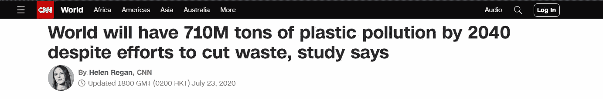

# 公开数据。2 分钟阅读自发的想法

> 原文：<https://medium.com/mlearning-ai/public-data-2mins-read-of-spontaneous-thought-97a4b22a8a09?source=collection_archive---------10----------------------->

你知道，有趣的是，新一代人在他们的父亲之后，开始改善他们留下的错误。

我们如何确保我们不会再次陷入那个怪圈，我们的解决方案似乎最适合我们的时代，下一代将面临修复我们解决方案中我们从未想到或考虑过的错误的任务。即使我们已经想到了这些未来可能会提出的问题。没有采取行动是因为我们没有足够的背景来描述未来人们的生活会是什么样子。

问题来源于语境，如果我们没有足够的未来语境怎么办。来提出将来会被问到的问题？

我们没有考虑的事情有哪些？要么是因为我们遗漏了什么，要么是不知道将来会提出什么问题。

我们针对提出的问题或观察到的问题解决问题。关于我们的解决方案，将来会提出哪些问题？

我只是说，就像塑料发生的事情一样。

Image from CNN

Image from NBC News

关于数据，我们没有问的问题是什么？希望我们没有把这个地方搞得一团糟，希望我们正在创建可重用的数据(如果有这样的东西的话),因为我们可能正在解决今天的大问题，同时也在为未来制造更大的问题。就像塑料一样。

我只是说，数据可能是未来最大的问题之一。

我想我们会把明天的问题留到明天，因为我们还没有得到它。引用—昨天。这是他们工作的模式。

我刚刚丢掉了另一个数据。

 [## Mlearning.ai 提交建议

### 如何成为 Mlearning.ai 上的作家

medium.com](/mlearning-ai/mlearning-ai-submission-suggestions-b51e2b130bfb)