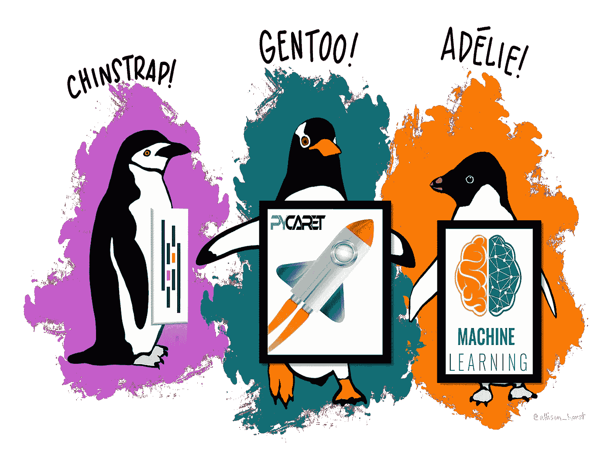
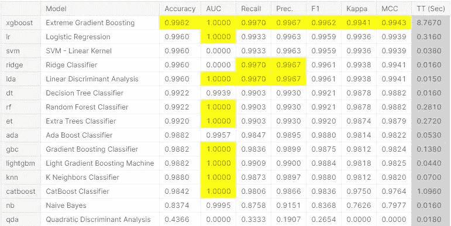
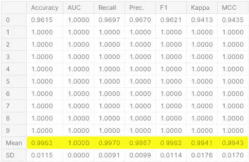
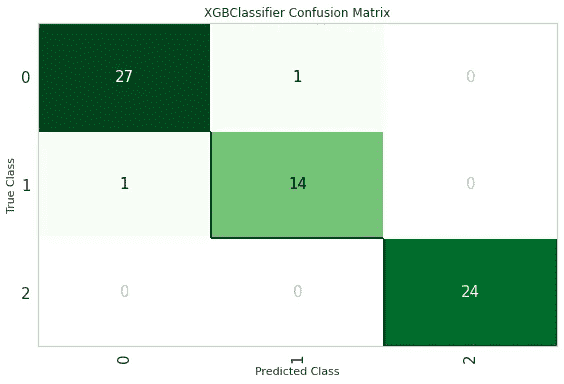
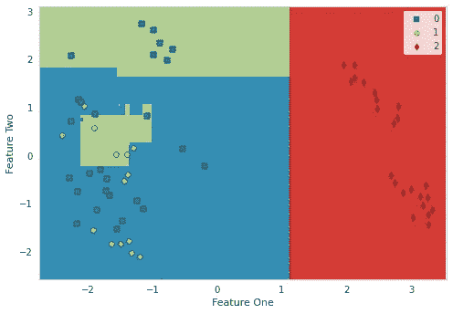
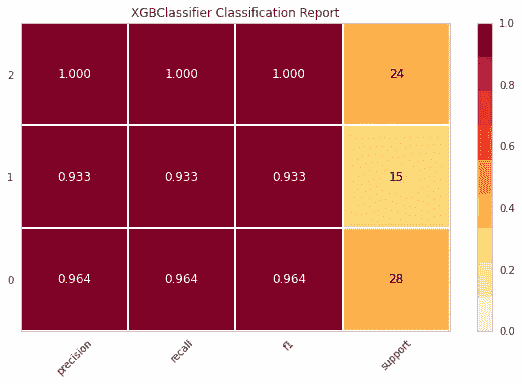
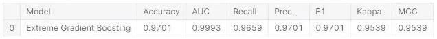

# PyCaret

> 原文：<https://medium.com/mlearning-ai/pycaret-73b519e2d4d6?source=collection_archive---------1----------------------->

## 开源机器学习库。

## 自动化评估和比较机器学习算法的关键步骤。



ML-Classification Study with PyCaret

处理数据的人曾经说过，他们花了大部分时间清理数据。有时候我们会抱怨没有时间实现机器学习模型。我们试图找到许多问题的答案，例如，我应该使用哪种机器学习模型，哪种模型能给我最佳结果，哪些参数能给出最高结果，如何调整它们…等等。
在这篇文章中，我将写一个神奇的 python 库，它将帮助你解决所有这些问题，并用几行代码节省大量时间。你已经注意到了文章的标题，并且猜到我会提到 **PyCaret。**

[**PyCaret**](https://pycaret.org/) 是一个开源的 python 机器学习库，灵感来自 [caret R 包](https://topepo.github.io/caret/)。我们可以从 PyCaret 自己的主页上简单说以下内容。

*"PyCaret 是一个开源的、Python 中的* ***低代码*** *机器学习库，允许您在自己选择的笔记本电脑环境中，在几分钟内从准备数据到部署模型...这是一个简单易用的机器学习库，将帮助您用更少的代码行执行端到端的 ML 实验...”*[**](https://pycaret.org/)

*该库的优点是，用很少的代码行和很少的手动配置就可以完成很多工作。PyCaret 库自动化了机器学习项目的许多步骤，例如定义要执行的数据转换、评估和比较标准模型、调整模型超参数等等。*

*PyCaret 基本上是几个机器学习库和框架的 python 包装器，如 scikit-learn、XGBoost、CatBoost、LightGBM、spaCy、Optuna、Hyperopt、Ray 等等。此外，所有这些图书馆都被很好地组织在一起。*

*现在让我们测试一下这个 python 库可以在一个示例数据集上做什么。我将把所有模型应用到由 Allison Horst 作为 R 包发布的帕尔默企鹅数据集上。它也成为了可爱的虹膜数据集的替代品。*

*一如往常首先我们 [**安装 pycaret**](https://pycaret.readthedocs.io/en/latest/installation.html) 和**导入**必要的**库**。*

```
*#!pip install pycaret[full]import numpy as np
import pandas as pd
from pycaret.regression import **
```

*下一步是用 python 熊猫库加载企鹅数据集。*

```
*df = pd.read_csv('penguins.csv')
df.info()RangeIndex: 333 entries, 0 to 332
Data columns (total 7 columns):
 #   Column             Non-Null Count  Dtype  
---  ------             --------------  -----  
 0   species            333 non-null    object 
 1   island             333 non-null    object 
 2   bill_length_mm     333 non-null    float64
 3   bill_depth_mm      333 non-null    float64
 4   flipper_length_mm  333 non-null    int64  
 5   body_mass_g        333 non-null    int64  
 6   sex                333 non-null    object 
dtypes: float64(2), int64(2), object(3)*
```

*数据集由 4 个数值特征、2 个分类特征和 1 个目标特征组成。*

*PyCaret 工作流总是从准备整个机器学习管道环境的**设置功能**开始。因此，**设置**必须在任何其他功能之前执行。*

```
*clf = **setup(**
            data=df, 
            target='sex', 
            session_id=44, 
            train_size=0.8
           **)***
```

*我们可以按照您的意愿定制设置功能，它有许多参数。默认值也很好，所以我只是通过给出必要的参数来启动这个函数。setup 函数执行所有的数据预处理步骤。它还将数据分成训练集和测试集。*

*在这之后，PyCaret 的魔力就开始了，一行代码`**compare_models()**`中的**比较了**近 20 个模型，并以表格的形式返回结果。*

```
***best_model =** **compare_models()***
```

**

*Results of compared models*

*该功能训练模型库中的所有模型，并使用度量评估的 **k 倍交叉验证**对其进行评分。输出会打印一个评分表，显示所有折叠的平均结果(默认为 10)以及训练时间。*

## *创建最佳模型*

*在任何模块中创建模型就像编写 **create_model 一样简单。**它只有一个参数，即型号名称作为字符串。*

```
**# create an Extreme Gradient Boosting model*
xgboost = create_model("xgboost")*
```

## *超参数调谐*

**当使用 create_model 函数创建模型时，它使用默认超参数来训练模型。* ***要调整超参数*** *，使用* `**tune_model()**` *功能。**

```
*tuned_xgboost = **tune_model(**xgboost**)***
```

**

*Results after tuning the parameters*

*该功能使用`Random Grid Search`预定义的搜索空间自动调整模型的超参数。输出打印一个得分网格，按折叠显示结果。要使用定制的搜索网格，您可以在`tune_model`函数中传递`custom_grid`参数。*

## *分析模型*

*分析经过训练的机器学习模型的性能是任何机器学习工作流程中不可或缺的一步。分析模型性能就像写`**plot_model()**`一样简单。该函数将训练好的模型对象和绘图类型作为函数`plot_model()`中的字符串。*

```
*plot_model(tuned_xgboost, plot = 'confusion_matrix'*
```

**

```
*plot_model(tuned_xgboost, plot = 'boundary')*
```

**

```
*pplot_model(tuned_xgboost, plot = 'class_report')*
```

**

## *预测并最终确定模型*

*测试由 PyCaret 在设置中自动分割的剩余 20%的数据组成，重要的是要看到模型没有过度拟合。现在我们将使用`**predict_model()**`函数，该函数用于对未知数据集进行预测。*

```
**# Make predictions on the test set*
predict_model(tuned_xgboost)*
```

**

*Results of unseen data*

*`**finalize_model()**`函数将模型拟合到完整的数据集上，包括测试/保留样本(本例中为 20%)。该函数旨在将模型部署到生产环境之前，在完整的数据集上对其进行训练。*

```
**# Finalize the model*
finalized_xgboost = finalize_model(tuned_xgboost)*
```

*当使用最终确定模型时，包括测试/保留集在内的整个数据集将用于定型。如果在使用了`finalize_model()`后，该模型用于对拒绝集的预测，结果将会误导，因为您试图预测的数据与用于训练的数据相同。*

## *保存并加载模型*

*PyCaret 的内置函数`**save_model()**`允许我们**将模型**以及整个转换管道和经过训练的模型对象保存为可转移的二进制 **pickle** 文件以备后用。*

```
**# Save the final model*
**save_model(**finalized_xgboost, 'penguins_xgboost_v4'**)***
```

***为了在将来的某一天在同一个或另一个环境中加载一个已保存的模型**，我们将使用 PyCaret 的`**load_model()**`函数，然后轻松地将已保存的模型应用于新的未知数据进行预测。*

```
*(Pipeline(memory=None,
          steps=[('dtypes',
                  DataTypes_Auto_infer(categorical_features=[],
                                       display_types=True, features_todrop=[],
                                       id_columns=[],
                                       ml_usecase='classification',
                                       numerical_features=[], target='species',
                                       time_features=[])),
                 ('imputer',
                  Simple_Imputer(categorical_strategy='not_available',
                                 fill_value_categorical=None,
                                 fill_value_numerical=None,
                                 numeric_stra...
                                interaction_constraints='', learning_rate=0.4,
                                max_delta_step=0, max_depth=8,
                                min_child_weight=3, missing=nan,
                                monotone_constraints='()', n_estimators=140,
                                n_jobs=-1, num_parallel_tree=1,
                                objective='multi:softprob', random_state=44,
                                reg_alpha=0.1, reg_lambda=1e-07,
                                scale_pos_weight=12.100000000000001, subsample=1,
                                tree_method='auto', use_label_encoder=True,
                                validate_parameters=1, verbosity=0)]],
          verbose=False),
 'finalized_xgboost_model_2021-04-11 12:39.pkl')*
```

*如果你有时间和高计算处理系统(GPU 或 TPUs)，你可以很容易地用 PyCaret 尝试和应用系综和堆栈模型。*

*您可以从[资源](https://github.com/pycaret/pycaret/blob/master/docs/source/index.rst)中访问所有这些测试以及更多内容。开心点，继续用 PyCaret 编码…*

***资源:***

*   *[https://www.pycaret.org](https://www.pycaret.org/)*
*   *[https://pycaret.readthedocs.io/en/latest/](https://pycaret.readthedocs.io/en/latest/)*
*   *【https://www.kaggle.com/ml-classification-study-with-pycaret】*