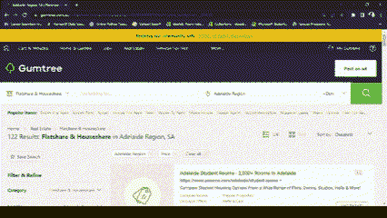
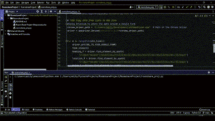

# 用于房间租赁数据集创建的数据挖掘

> 原文：<https://medium.com/mlearning-ai/python-code-for-finding-room-for-rent-1cedc7e9e644?source=collection_archive---------9----------------------->

这个标题有点误导，不过更具体地说，我将展示如何编写一个 python 脚本来获取阿德莱德的 Roomshare 出租房产列表。

搬到一个外国城市接受高等教育从来都不容易，获得专门的学生住宿特别容易，尽管不是很划算。我问了这样做过的学生，他们有一些网站，然后在网上搜索出租房产。分析的唯一标准是来自大学的愿望和租金。


Photo by [Marcus Loke](https://unsplash.com/@marcusloke?utm_source=medium&utm_medium=referral) on [Unsplash](https://unsplash.com?utm_source=medium&utm_medium=referral)

几个月后，我对 python 有了相当的了解，也知道去哪里找。因此，对于这个“个人”问题，我们将使用

1.  BeautifulSoup 软件包获得阿德莱德的出租物业，获得关于位置，价格
2.  使用谷歌的距离矩阵 API 来查找从广告位置到大学的距离。
3.  使用 Selenium Web driver 将数据添加到 google 工作表中。

下面是仅包含 TODO 语句的代码

```
 # TODO 1\. Get the roomshare data from Gumtree Website

# TODO 2\. Get distance from the advertisements address to University

# TODO 3\. Copy data from lists to a Google form 
```

将完整的问题语句分成多个待办事项列表是最好的方法之一，另一个好的做法是为所有待办事项列表定义函数，减少代码中的冗余。我计划在下一次推送中更新。

继续 TODO 1。我们必须从 Gumtree 网页获取数据

因此，我们在应用过滤器后获得链接，这也可以通过引入用户输入和更改我们提供给 Selenium 驱动程序的网址来更改，但是我们的重点是

城市——阿德莱德，

价格——每周低于 200 美元，

物业类别—公寓和房间

我们获取链接，使用 Beautiful soup 获取网页的 HTML 数据，并使用我们的 Web 抓取技能来确定如何获取所需变量(在本例中为列表)中的数据。



Website’s Source Code, for particular Ad

下面是获取广告链接、广告标题、租金、位置和广告发布日期等数据的代码。

```
from bs4 import BeautifulSoup
import requests

header = {"User-Agent": "Mozilla/5.0 (Macintosh; Intel Mac OS X 10_15_5)
    AppleWebKit/537.36 (KHTML, like Gecko) Chrome/84.0.4147.125 Safari
    /537.36","Accept-Language": "en-GB,en-US;q=0.9,en;q=0.8"
}
response = requests.get("https://www.gumtree.com.au/s-flatshare-
           houseshare/adelaide/c18294l3006878?sort=price_asc&
            price=__200.00",headers=header)
data = response.text
soup = BeautifulSoup(data, "html.parser")

all_link = []
all_heading = []
all_price = []
all_location = []
all_listed_date = []
all_distance = []
for listings_wrapper in soup.find_all("div", class_="user-ad-collection
                                      -new-design__wrapper--row"):
    for listing in listings_wrapper.find_all("a",class_="user-ad-row-new-
                    design link link--base-color-inherit link--hover-
                    color-none link--no-underline"):
        # Getting the Link, Heading, Price, Location, Listed Date 
        link = listing.get("href")
        heading, price, third = listing.get("aria-label").split("\n")
        location, listed_date = third.split(". Ad listed ")
        # Storing them in a list after some basic data cleaning
        all_link.append(f"https://www.gumtree.com.au{link}")
        all_heading.append(heading[:-2])
        all_price.append(price[16:-1])
        all_location.append(location[18:]+" ,SA")
        all_listed_date.append(listed_date[:-1])
```

我本来可以使用字典来存储所有的变量，但是为了简单起见，我使用了多个列表。

对于 TODO 2。我们需要得到从广告位置到大学的距离，这听起来很简单，但事实并非如此。手动距离计算将涉及获得坐标，并与大学进行比较，我将不得不使用道路旅行的距离。因此，我们使用距离矩阵 API 来获得从郊区到大学的道路距离。(我们不是在搜索酒店和大学之间的确切距离)

请注意:谷歌距离矩阵 API 提供了推荐的路线距离和时间等，是谷歌的付费服务。请在探索之前阅读文档。

下面是获取 TODO 2 的代码

```
import GoogleMaps

GOOGLE_API_KEY = #Insert your Google API Key 

gmaps = googlemaps.Client(key=GOOGLE_API_KEY)
for locs in all_location:
    my_dist = gmaps.distance_matrix(locs, 'Ingkarni Wardli, Adelaide SA')
                                    ['rows'][0]['elements'][0]
    # We assign the distance between the ad location and the University
    all_distance.append(my_dist['distance']['text'])
```

代码很短，但它要求你在 Google 的云控制台上创建一个 Google API 密钥，设置一个计费帐户，设置配额，并使用 distance_matrix 方法从 JSON 获取所需的数据，这是一项付费服务。尽管根据谷歌地图平台网页，每个计费账户每月可获得 200 美元的谷歌地图平台信用。

对于 TODO 3。我们需要将数据存储在 excel 表中，这可以通过创建一个 google 表单并使用 Selenium Web 驱动程序填充每个字段来实现。(挺整齐的，嗯！)尽管在我们使用 web 抓取创建的数据集上有如此多的方法或数据可视化可能性，但我们坚持使用一种非常原始的方法，即使用 excel 表。

```
from selenium import webdriver
import time

#Using Selenium to store the data inside a Google Form
chrome_driver_path = "C:/Users/adity/Development/chromedriver.exe"  
driver = webdriver.Chrome(executable_path=chrome_driver_path)

for n in range(len(all_link)):
  driver.get(URL_TO_YOUR_GOOGLE_FORM)
  time.sleep(2)
  heading_f = driver.find_element_by_xpath('//*[@id="mG61Hd"]/div[2]/
              div/div[2]/div[1]/div/div/div[2]/div/div[1]/div/div[1]/
              input')
  location_f = driver.find_element_by_xpath('//*[@id="mG61Hd"]/div[2]/
              div/div[2]/div[2]/div/div/div[2]/div/div[1]/div/div[1]/
              input')
  price_f = driver.find_element_by_xpath('//*[@id="mG61Hd"]/div[2]/
            div/div[2]/div[3]/div/div/div[2]/div/div[1]/div/div[1]/input')
  listed_date_f = driver.find_element_by_xpath('//*[@id="mG61Hd"]/div[2]/
                  div/div[2]/div[4]/div/div/div[2]/div/div[1]/div/div[1]/
                  input')
  link_f = driver.find_element_by_xpath('//*[@id="mG61Hd"]/div[2]/div/
           div[2]/div[5]/div/div/div[2]/div/div[1]/div/div[1]/input')
  distance_f = driver.find_element_by_xpath('//*[@id="mG61Hd"]/div[2]/
               div/div[2]/div[6]/div/div/div[2]/div/div[1]/div/div[1]
                /input')
  submit_button = driver.find_element_by_xpath('//*[@id="mG61Hd"]/div[2]/
                  div/div[3]/div[1]/div/div')
  heading_f.send_keys(all_heading[n])
  location_f.send_keys(all_location[n])
  price_f.send_keys(all_price[n])
  listed_date_f.send_keys(all_listed_date[n])
  link_f.send_keys(all_link[n])
  distance_f.send_keys(all_distance[n])

  submit_button.click()
driver.quit()
```

在上面的代码中，我们使用 Selenium web 驱动程序将数据自动输入到 google 表单中，首先需要创建一个 google 表单来接受数据。然后，我们为从广告网站中挖掘的变量找到每个文本框的 XPath，之后我们只需通过一次发送一个条目来填充表单。



Output

您可以使用包含所有相关数据的 Excel 来分析和决定将哪栋房子出租给您。


代码非常简单，可以在很多地方重构，问题是我所面临的一个真正的问题，我通过编码解决了这个问题。

> 估计我现在是程序员了。

下面是 GitHub 上的完整代码

[](/mlearning-ai/mlearning-ai-submission-suggestions-b51e2b130bfb) [## Mlearning.ai 提交建议

### 如何成为 Mlearning.ai 上的作家

medium.com](/mlearning-ai/mlearning-ai-submission-suggestions-b51e2b130bfb)