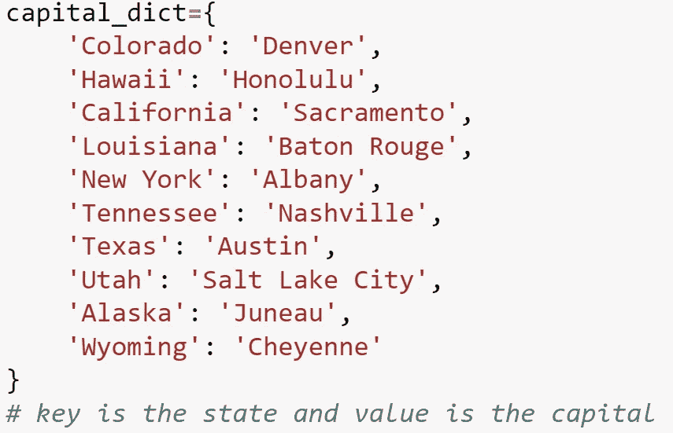
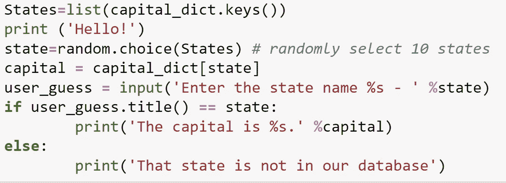
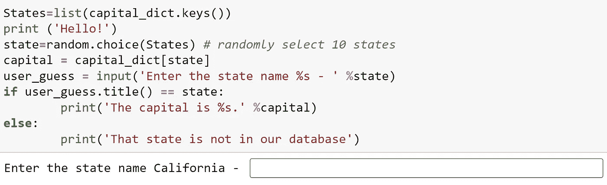
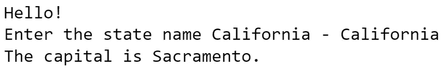
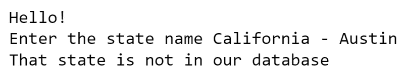

# 使用 If-else 语句的 Python 字典

> 原文：<https://medium.com/mlearning-ai/python-dictionary-using-if-else-statement-aca32a2ad5e4?source=collection_archive---------2----------------------->

这篇文章将讨论在 Python 中对字典使用 if-else 语句。

在我们开始之前，我们应该讨论一下什么是字典。字典是一个集合，其中存储了一组键和值之间的映射。键是不可变的(不可改变的)项目。值是可变的项目。这里显示了一个示例:

Keys are shown on the left side. Values are shown on the right side. Here, ‘Colorado is the key, and ‘Denver’ is its state capital.

现在我们已经创建了字典，我们将创建一个程序，当用户输入州名时，它将打印这些州的州府。这就是使用 if-else 语句的地方。

让我们用上面的例子。

这里，来自 capital_dict 的键列表将被定义为“States”。对于“州”，应该随机选取“州”。确保在代码的开头导入 random。对于“capital”，这将从 capital_dict 中拉出“state”。转到 user_guess，它定义了将在屏幕上显示的输入语句。在这种情况下，语句“首都是% s”。%表示州的通配符。现在，我们可以跳到 if-else 语句。在这里，如果 user_guess 是列表中的任何一个州，例如 California，那么输入将如下所示:

在空白处，我们将键入 California，因为 California 在左边。一旦我们按下回车键，它的大写字母就会显示出来。

至于 else 语句，如果输入一个没有在 capital_dict 列表中提到的不同的州或首府，则该语句为假语句。输出如下所示:

感谢你阅读这篇文章！我希望你从这篇文章中学到了一些技巧。请随时提供反馈。

 [## Mlearning.ai 提交建议

### 如何成为 Mlearning.ai 上的作家

medium.com](/mlearning-ai/mlearning-ai-submission-suggestions-b51e2b130bfb)