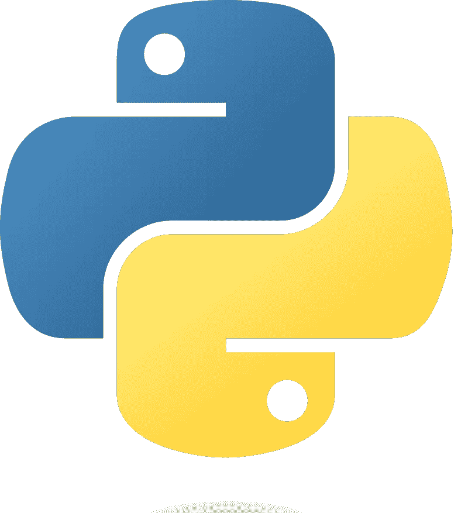

# Python:使用熊猫达到中级水平的最快方法(1/3)

> 原文：<https://medium.com/mlearning-ai/python-fastest-way-to-intermediate-level-1-3-3115fb00b05f?source=collection_archive---------4----------------------->

你不需要安装任何软件或下载任何数据。你现在就可以开始学习真正的函数式 Python。

关于如何学习 Python 的教程有数百万种，每一种都采用不同的方法，但大多数都花很多时间在基础上，就像语言老师重复字母表，而不是教授一些真正好的语言用法…