# Python 在 Power BI 中的应用

> 原文：<https://medium.com/mlearning-ai/python-in-power-bi-66a80590ecc0?source=collection_archive---------0----------------------->


# ❓为什么用巨蟒发电匕？

M 微软动力 BI 支持两种不同的语言，M 语言和 DAX(数据分析表达式)。

然而，有时使用 Python 进行数据准备更方便，因为 Python 有 Python 库，这是一组有用的函数，无需从头开始编写代码。此外，熟悉 Python 的数据分析师可以很容易地将 Python 应用到 Power BI 中，用于 web 抓取或 EDA(探索性数据分析)过程。

# 本文内容

*   安装 Python
*   Power BI 中的 Python 设置
*   使用 Python 获取数据
*   在转换中使用 Python
*   使用 Python 可视化

# 📥安装 Python

在 Power BI 中使用 Python 之前，必须先安装 Python。我推荐安装 Anaconda，因为它易于管理 Python 库和环境。

1.  安装 Anaconda


去 https://www.anaconda.com/products/distribution 的。在你的电脑上下载并安装 Anaconda。

2.打开 Anaconda 提示符

搜索 Anaconda 提示符，点击打开。


你会看到一个黑屏弹出。


3.创建 Python 3.6 环境

Power BI 在使用高版本 Python 时可能会有问题(在我撰写本文时，最新的 Python 版本是 3.9)。为了避免技术问题，我创建了一个新的 Python 3.6 环境，我尝试了一下，没有遇到任何问题。

您可以直接降级您的 Python 版本，但不建议这样做，因为它可能会影响其他项目。您可以将 Anaconda 环境想象成一个包含特定 Python 包集合的工作箱。在这种环境下工作，不会影响其他项目。

在 Anaconda 提示符下，通过键入…
创建一个新环境(将 **< env_name >** 替换为您的环境名称，比如 python36)

```
conda create --name <env_name> python=3.6
```

然后，当您看到 Proceed ([y]/n)？，键入 y 并回车。

等待运行完成。

键入以下命令，检查是否成功创建了新环境

```
conda env list
```

您将看到 Anaconda 环境的列表。如果你看到一个新的环境，你就可以进入下一步了。

4.安装有用的 Python 库

在安装 Python 包之前，通过在 Anaconda 提示符下键入以下命令，确保您处于刚刚创建的环境中。

```
conda activate <env_name>
```

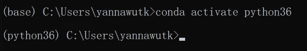

然后，您将在括号中观察到环境名称的变化。

您可以通过键入以下命令来安装将要在 Power BI 中使用的 Python 库/包。
(将 **< package_name >** 替换为您要安装的包的名称，如 pandas、numpy、matplotlib)

```
pip install <package_name>
```

# Power BI 中的⚙️ Python 设置

Python 安装完成后，就是 Power BI 的时候了！！

1.  打开电源 BI。
2.  点击右上角的文件。

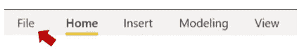

3.单击选项和设置。单击选项。

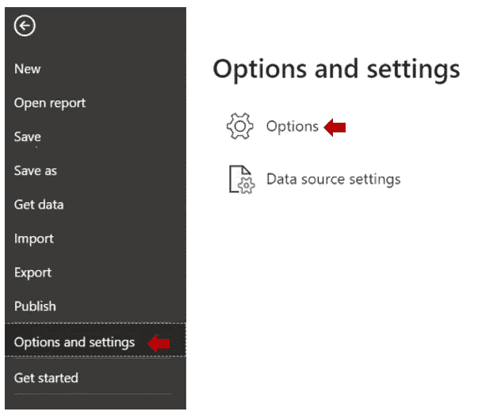

4.单击 Python 脚本

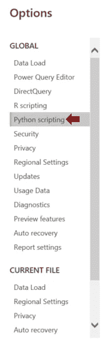

5.将检测到的 Python 主目录更改为 Other，并浏览在步骤 1 中创建的 Python 环境。

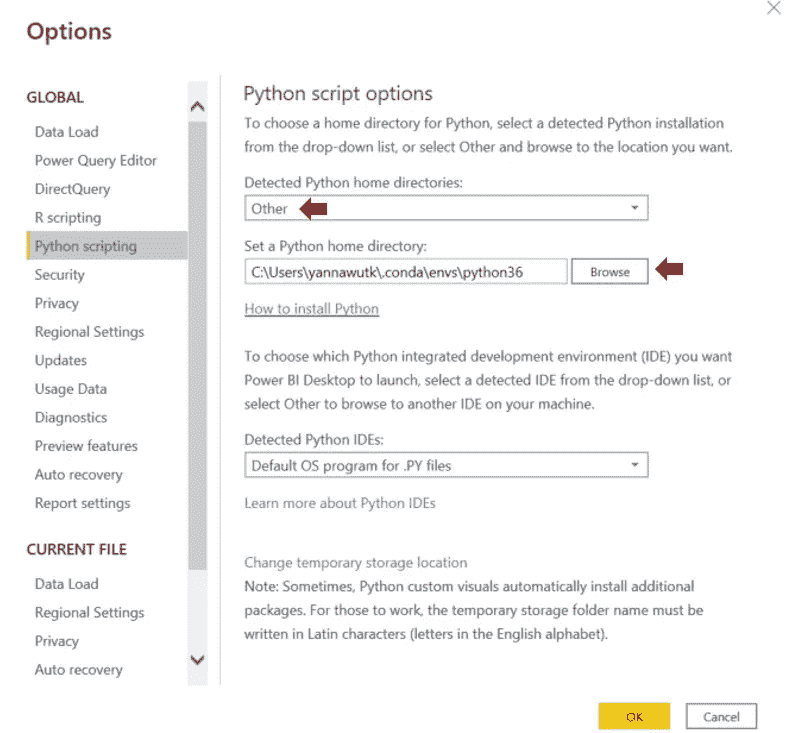

**提示:**查找环境目录。

*   打开 Anaconda 提示符
*   键入下面的代码(用您的环境名称替换 **< env_name >** )

```
conda activate <env_name>
```

*   键入以下代码以显示此环境的 python 位置。

```
where python
```

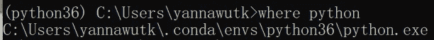

复制 python.exe 之前的路径

> **现在，你可以在 Power BI** 中使用 Python 了

> Python 至少可以在 3 个步骤中应用:获取数据、转换和可视化

如果你想了解这篇文章，你可以从[https://www . ka ggle . com/datasets/datatattle/新冠肺炎-NLP-text-classification/download](https://www.kaggle.com/datasets/datatattle/covid-19-nlp-text-classification/download)下载数据

# 🧺使用 Python 来获取数据

Python 可以用来获取数据。这有助于网络抓取(从网站获取数据)。

在这个例子中，我将创建一个 Python 文件来从两个源获取数据:一个 csv 文件和一个创建的 dataframe(一个包含行和列的表)。

1.单击获取数据


2.搜索 Python 脚本，然后单击打开新的编码窗口。

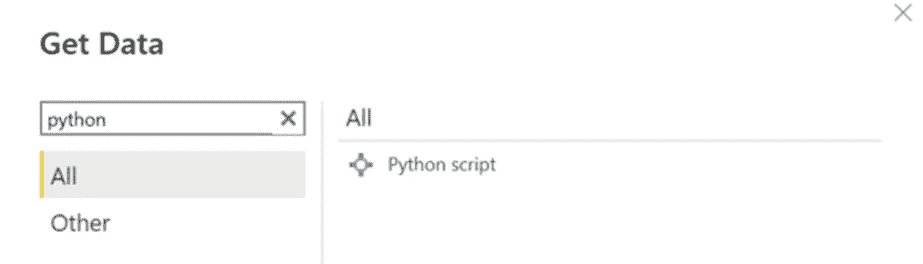

3.键入下面的代码，然后单击确定。

```
import pandas as pddf1 = pd.read_csv("C:/Corona_NLP_train.csv", encoding = "ISO-8859-1")
df2 = pd.DataFrame({'A': [1, 3, 6, 8],'B': [10, 30, 50, 90]})
```

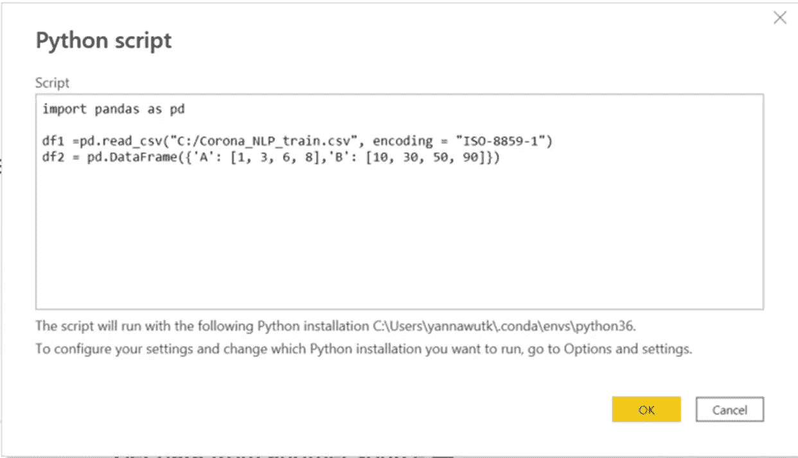

4.您将看到一个显示数据的导航器(类似于其他 get data 方法)。).选择要加载的数据。

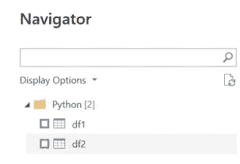

# 🔄在转换中使用 Python

Python 也可以用于数据转换步骤。大多数情况下，我将它用于正则表达式，从另一列中提取匹配定义模式的子字符串，比如从 Twitter 文本中获取标签。

在这个例子中，我将使用 Python 中的 len()函数来查找文本长度。

1.  单击转换数据


2.选择要转换的查询


3.在变换选项卡中，单击运行 Python 脚本


4.您将看到一个新的运行 Python 脚本窗口。在此处编写代码，然后单击“确定”。

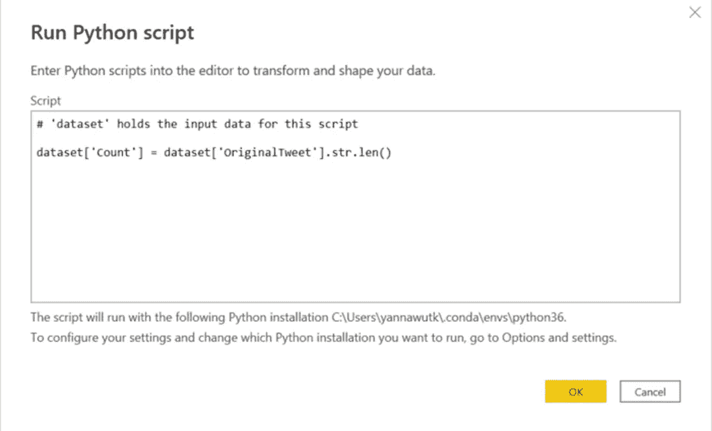

**关键概念**:数据将是一个“数据集”数据帧，所以你可以用 pandas 函数来操作它。

6.结果将是一个表格。单击以展开表格。确保未选中“使用原始列名作为前缀”。

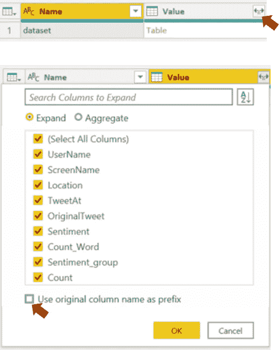

7.您将看到数据转换的结果，这些步骤被添加到应用步骤中。

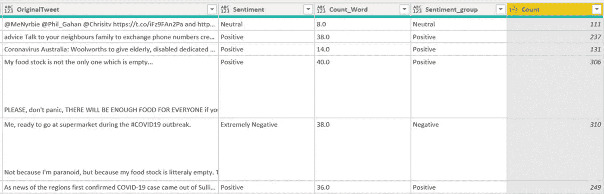

# 📊使用 Python 可视化

仅使用 Power BI 的可视化功能创建图可能会有一些限制，有些图在 Power BI 中可能不可用。

Python 将会派上用场，因为 Python 中有许多库可以按照您的意愿生成任何可视化。

目前常用的数据可视化 Python 库包括 Matplotlib、Plotly、Seaborn 和 GGplot。

虽然用 Python 写代码创建一个情节可能比 Power BI 的拖放概念更困难，但是有更多的情节定制和代码示例(可供复制)。

1.  在可视化平面中，单击 Py 图标(Python 的缩写)。


2.您将看到一个空的 Python 脚本编辑器区域。选择要可视化的列。

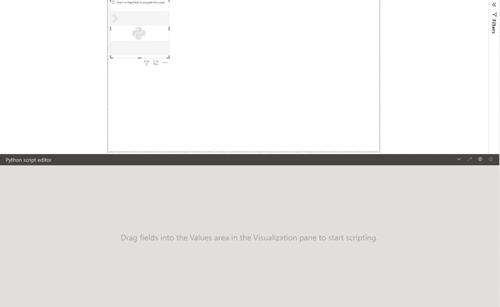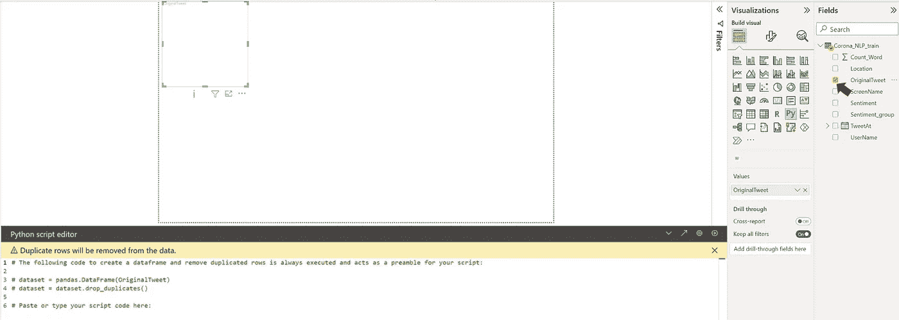

3.你会看到一个空的编码区。编写代码(不要忘记 plt.show()来显示图形)并单击 run 图标，然后等待结果。搞定了。！

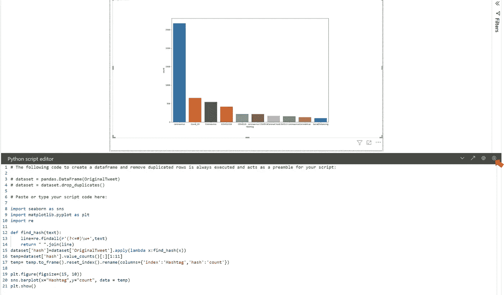

```
import seaborn as snsimport matplotlib.pyplot as pltimport redef find_hash(text):line=re.findall(r'(?<=#)\w+',text)return " ".join(line)dataset['hash']=dataset['OriginalTweet'].apply(lambda x:find_hash(x))temp=dataset['hash'].value_counts()[:][1:11]temp= temp.to_frame().reset_index().rename(columns={'index':'Hashtag','hash':'count'})plt.figure(figsize=(20, 15))sns.barplot(x="Hashtag",y="count", data = temp)plt.show()
```

**注意:**如果运行代码后显示错误，深呼吸，阅读错误信息。

# **结论**

本文将一步步展示如何在 Power BI 中应用 Python，这样您就可以同时获得 Power BI 交互式仪表板和 Python 灵活性的优势。您可以以多种方式应用 Python 代码，包括数据获取、转换和可视化。

希望你对在 Power BI 中使用 Python 有所了解。

如果您想阅读更多数据分析内容，请关注我。

[](/mlearning-ai/mlearning-ai-submission-suggestions-b51e2b130bfb) [## Mlearning.ai 提交建议

### 如何成为 Mlearning.ai 上的作家

medium.com](/mlearning-ai/mlearning-ai-submission-suggestions-b51e2b130bfb)