# 用于数据科学的 Python 库

> 原文：<https://medium.com/mlearning-ai/python-libraries-for-data-science-de597959bd96?source=collection_archive---------6----------------------->

Python 是当今使用最广泛的编程语言。在解决数据科学问题和挑战的同时，Python 不断给用户带来惊喜。大多数数据科学家已经在每天使用 Python 编程的可能性。Python 是易学易调试的语言，已经被广泛使用，面向对象，开源，功能强大。Python 已经构建了高性能的 Python 数据科学库，程序员每天都使用这些库来解决问题。

## **数据挖掘**

**刺儿头**

Scrapy 是一个快速、开源的网络抓取框架(蜘蛛机器人),用 Python 编写，用于大规模的网络抓取。它通常用于有效地从网页中提取数据，根据需要对其进行处理，并将其存储在首选结构中，并借助基于 XPath 的选择器进行格式化。例如，URL 或联系信息。Scrapy 是一个很好的工具，用于抓取 Python 机器学习模型中使用的数据。

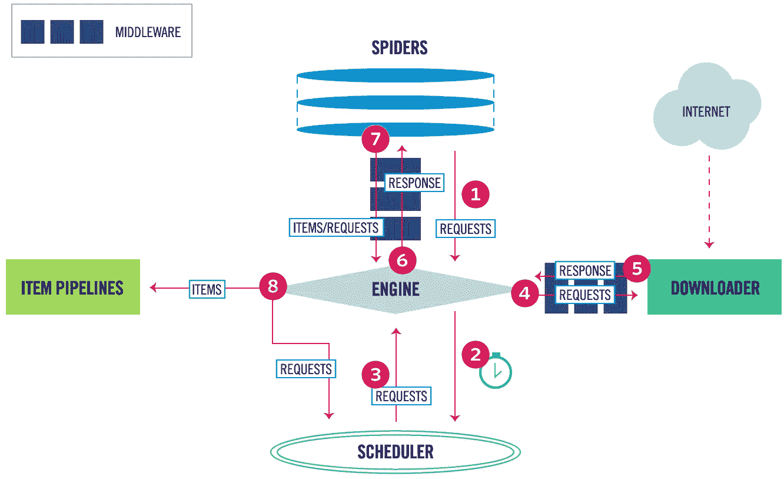

开发人员使用它从 API 收集数据。这个成熟的框架在其界面设计中遵循“不要重复自己”的原则。因此，该工具鼓励用户编写通用代码，这些代码可以重用来构建和扩展大型爬虫。

**美丽的声音**

Beautifulsoup 是一个 python 库，最广为人知的功能是 web 爬行和数据抓取。用户可以收集一些网站上没有合适的 CSV 或 API 的数据，这个库可以帮助他们收集数据并将其整理成所需的格式。

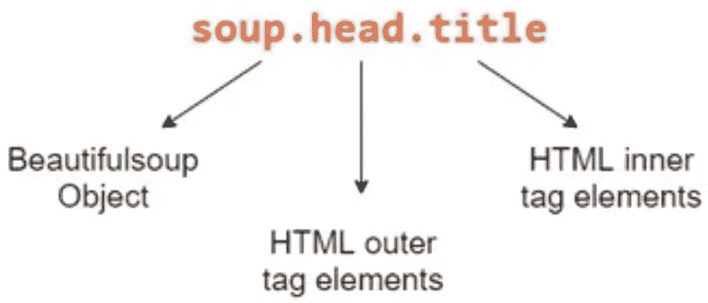

它是 Python 中的一个解析库，支持从 HTML 和 XML 文档中进行 web 抓取，自动检测编码，甚至可以优雅地处理带有特殊字符的文档。我们可以浏览一个经过解析的文档，找到我们需要的东西，这使得从网页中提取数据变得快速而轻松。

## **数据探索和可视化**

**熊猫**

[Pandas](https://www.simplilearn.com/tutorials/python-tutorial/python-pandas) (Python 数据分析)是数据科学生命周期中必不可少的，这是一个广泛用于数据科学的 Python 库，还有 matplotlib 中的 NumPy。GitHub 上有大约 17，000 条评论，有 1，200 名贡献者的活跃社区，它被大量用于数据分析、一般数据争论和清理。Pandas 提供了快速、灵活的数据结构，比如数据帧 CD，它被设计成非常容易和直观地处理结构化数据。

Pandas 是一个库，用来帮助开发人员直观地处理“标签”和“关系”数据。它基于两种主要的数据结构:“系列”(一维，像一个项目列表)和“数据框”(二维，像一个有多个列的表)。Pandas 允许将数据结构转换为 DataFrame 对象，处理丢失的数据，从 DataFrame 中添加/删除列，输入丢失的文件，以及用直方图或绘图框绘制数据。这是数据争论、操作和可视化的必备工具。

雄辩的语法和丰富的功能使您能够自由地处理丢失的数据，提供高级数据结构和操作工具。它允许创建自己的函数，并通过高级抽象在一系列数据上运行它。

**matplotlib**

Matplotlib 是一个 Python 绘图库，在 GitHub 上有大约 26，000 条评论，一个由大约 700 名贡献者组成的非常活跃的社区被广泛用于数据可视化。这个标准的数据科学库有助于生成数据可视化，如二维图表和图形(直方图、散点图、非笛卡尔坐标图)。它还提供了一个面向对象的 API，可用于将这些图嵌入到应用程序中。

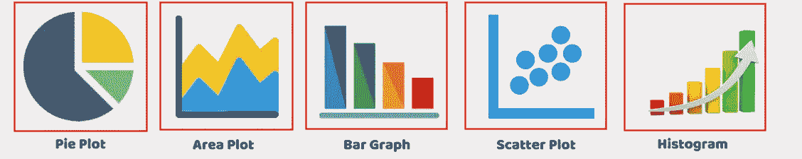

因为有了这个库，Python 可以和科学工具如 MatLab 或 Mathematica 竞争。然而，开发人员在使用这个库生成高级可视化时，需要编写比平时更多的代码。

主要用于变量的相关性分析、可视化数据分布以获得即时洞察、使用散点图检测异常值等。

**阴谋地**

Plotly 提供高质量、可出版的交互式图表。箱线图、热图、气泡图是可用图表类型的几个例子。

它是基于可视化库 D3.js、HTML 和 CSS 构建的最好的数据可视化工具之一。它是使用 Python 和 Django 框架创建的。

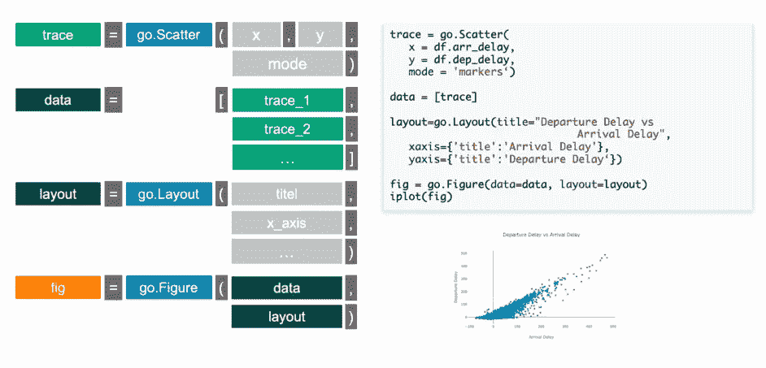

该库在交互式 web 应用程序中工作得非常好。它的创造者正忙于用新的图形和特性来扩展库，以支持多链接视图、动画和相声集成。

**Seaborn**

Seaborn 基于 Matplotlib，是一种有用的 Python 机器学习工具，用于可视化统计模型，即汇总数据和描述整体分布的热图和其他类型的可视化。许多数据科学家更喜欢 seaborn，而不是 matplotlib，因为它的高级接口可以绘制有吸引力的信息丰富的统计图形。

Seaborn 提供了简单的功能，有助于专注于情节，并受益于大量的可视化图库(包括时间序列、联合情节和小提琴图等复杂图库)。

**散景**

Bokeh 库是一个很棒的工具，可以使用 JavaScript 小部件在浏览器中创建交互式和可伸缩的可视化效果。它完全独立于 Matplotlib，Matplotlib 侧重于交互性，并通过类似于数据驱动文档(d3.js)的现代浏览器呈现可视化。它提供了一组图形、交互能力(比如链接图或添加 JavaScript 小部件)和样式。

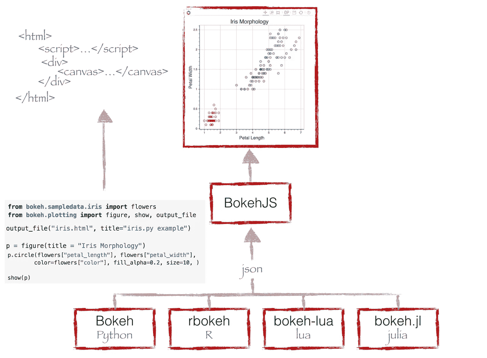

**pydot**

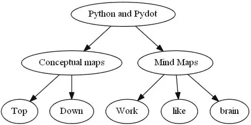

Pydot 帮助生成定向和非定向图形，作为 Graphviz 的接口。它用于显示图形的结构，这在您开发基于神经网络和决策树的算法时会很方便。

# 数学

**NumPy**

Numerical Python 是 Python 中执行基本和高级数组运算的数值科学计算的基础包。它被大量用于机器学习和深度学习的应用。它在 GitHub 上有大约 18，000 条评论，还有一个由 700 名贡献者组成的活跃社区。它有助于处理存储相同数据类型值的数组，并使对数组执行数学运算(及其矢量化)更加容易。NumPy 数组类型上数学运算的向量化提高了性能并加快了执行时间。

Numpy 构成了其他库的基础，如 SciPy 和 scikit-learn，当与 SciPy 和 matplotlib 一起使用时，它们是 MATLAB 的替代品。它是一个通用的数组处理包，提供了高性能的多维对象(称为数组)和使用数组的工具。NumPy 还通过提供这些多维数组以及提供在这些数组上有效操作的函数和操作符，部分地解决了速度慢的问题。

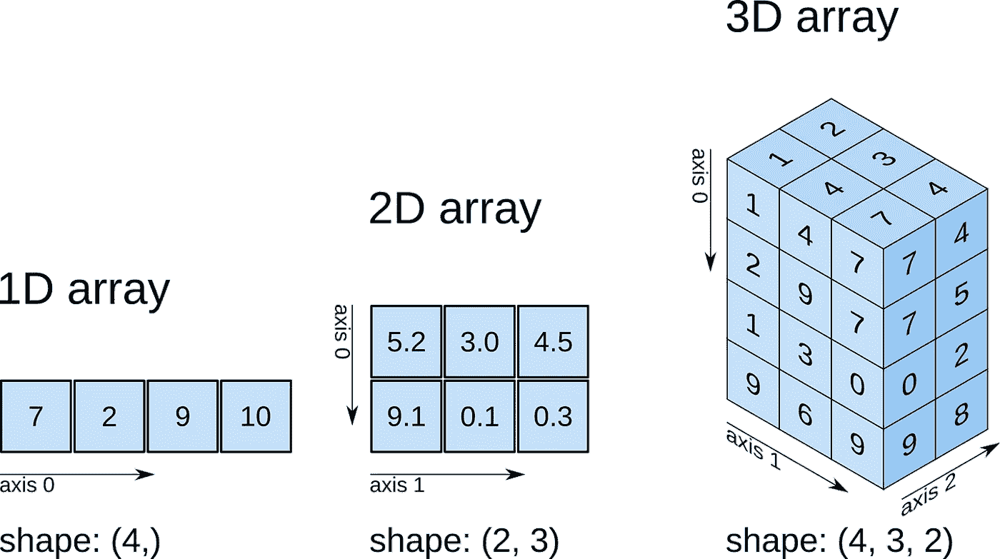

Numpy 为数值例程提供了快速的预编译函数，因为它遵循面向数组的计算以提高效率。它还支持面向对象的方法，通过矢量化实现更紧凑、更快速的计算。

**SciPy**

科学 Python 广泛用于高级计算，如科学和技术计算，因为它扩展了 NumPy 并为科学计算提供了许多用户友好和高效的例程。SciPy 在 GitHub 上有大约 19，000 条评论，并有一个大约 600 名贡献者的活跃社区。它在数学、科学和工程领域被大量使用。相当于使用 Matlab 这种付费工具。

这个有用的库包括线性代数、积分、优化和统计模块。它的主要功能是建立在 NumPy 之上的，所以它的数组使用这个库。SciPy 非常适合各种科学编程项目(科学、数学和工程)。它在子模块中提供了高效的数值例程，如数值优化、积分等。

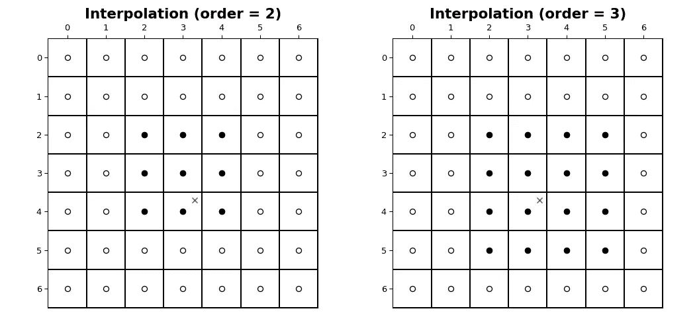

它还包括用于数据操作和可视化的高级命令，使优化算法成为其应用之一。其中一个主要特性是使用 SciPy ndimage 子模块进行多维图像处理。它包括用于求解微分方程和傅立叶变换的内置函数。

# **机器学习**

**张量流**

[TensorFlow](https://www.simplilearn.com/tutorials/deep-learning-tutorial/tensorflow) 是一个高性能数值计算框架库，用于机器学习和深度学习的各个科学领域，由谷歌大脑开发。它拥有大约 35，000 条评论和大约 1，500 名贡献者的活跃社区，是一个用于定义和运行涉及张量的计算的框架，张量是部分定义的最终产生值的计算对象。

TensorFlow 是一个端到端的机器学习库，包括工具、库和资源，供研究社区推动深度学习的最新发展，并供业内开发人员构建 ML & DL 支持的应用程序。它是对象识别、语音识别和许多其他任务的最佳工具。它有助于处理需要处理多个数据集的人工神经网络。该库包括各种层助手(tflearn、tf-slim、skflow)，这使得它的功能更加强大。TensorFlow 不断推出新版本，包括潜在安全漏洞的修复或 TensorFlow 和 GPU 集成的改进。

TensorFlow 提供了更好的计算图形可视化，并将神经机器学习中的错误减少了 50%至 60%。凭借谷歌支持的无缝图书馆管理，它还支持并行计算来执行复杂的模型。它对于语音和图像识别、基于文本的应用、时间序列分析、视频检测等特别有用。

**Keras**

[Keras](https://www.simplilearn.com/keras-vs-tensorflow-vs-pytorch-article) 类似于广泛用于深度学习和神经网络模块的 TensorFlow 库。Keras 同时支持 TensorFlow 和 Theano 后端，所以如果不想深入研究 TensorFlow 的细节，这是一个不错的选择。Keras 比 TensorFlow 更受欢迎，因为它的“用户体验”更好，因为它是用 Python 开发的，因此更容易被 Python 开发人员理解。

Keras 是用 Python 编写的深度学习 API，运行在机器学习平台 [TensorFlow](https://github.com/tensorflow/tensorflow) 之上。它的开发重点是支持快速实验。它使用起来非常简单，并为开发人员提供了很好的可扩展性。该库利用其他包(Theano 或 TensorFlow)作为其后端。此外，微软整合了 CNTK(微软认知工具包)作为另一个后端。

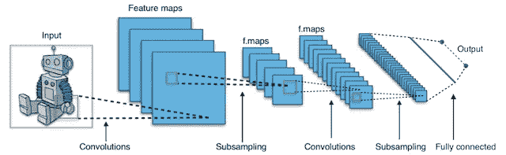

Keras 提供了大量预先标记的数据集，可用于直接导入和加载。它包含各种实现的层和参数，可用于神经网络的构造、配置、训练和评估。深度学习模型可以直接用于进行预测或提取其特征，而无需创建或训练自己的新模型。

**SciKit-Learn**

[Scikit-learn](https://www.simplilearn.com/tutorials/python-tutorial/scikit-learn) 提供了几乎所有制作机器学习模型所需的机器学习算法。它被设计为插入到 NumPy 和 SciPy 中，这使得它可能是 Python 中最有用的机器学习库。sklearn 库包含许多用于机器学习和统计建模的有效工具，包括分类、回归、聚类和维度缩减。

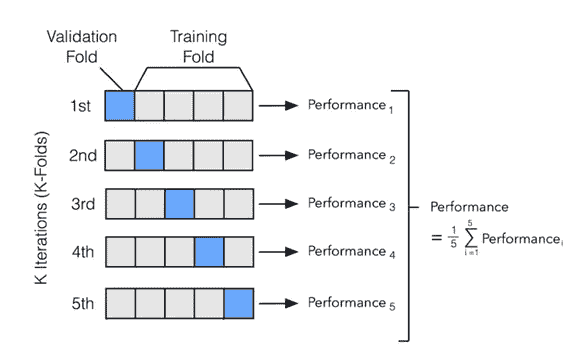

Scikits 是 SciPy 堆栈中的一组包，它们是为特定功能(例如图像处理)而创建的。Scikit-learn 使用 SciPy 的数学运算向最常见的机器学习算法展示了一个简洁的接口。数据科学家使用它来处理标准的机器学习和数据挖掘任务，如聚类、回归、模型选择、维度减少和分类。它提供了众多的应用，如聚类、分类、回归、模型选择、维数约减等。

**PyTorch**

PyTorch 是一个基于 Python 的科学计算包，它使用图形处理单元的能力。PyTorch 基于 Torch，这是一个用 C 实现的开源深度学习库，封装器在 Lua 中。

它是最常用的深度学习研究平台之一，旨在提供最大的灵活性和速度。它通过使深度学习模型的计算速度更快、成本更低，帮助加速了对深度学习模型的研究。它也用于其他任务，例如，创建动态计算图形和自动计算梯度。

一些功能，如强大的生态系统、云支持、分布式培训，使 PyTorch 因提供两个最高级的功能而闻名，这两个功能是具有强大 GPU 加速支持的张量计算和在基于磁带的自动签名系统上构建深度神经网络。

**PyCaret**

PyCaret 是 Python 中的一个开源机器学习库，可以帮助您从数据准备到模型部署。作为一个低代码库，它可以帮助你节省大量的时间。

这是一个易于使用的机器学习库，可以帮助您执行端到端的机器学习实验，无论是输入缺失值、编码分类数据、特征工程、超参数调整还是构建集成模型。

**XGBoost**

XGBoost 库用于实现梯度提升框架下的机器学习算法。它是可移植的、灵活的和高效的。它提供并行树提升，帮助团队解决许多数据科学问题。另一个优势是，开发人员可以在 Hadoop、SGE 和 MPI 等主流分布式环境中运行相同的代码。

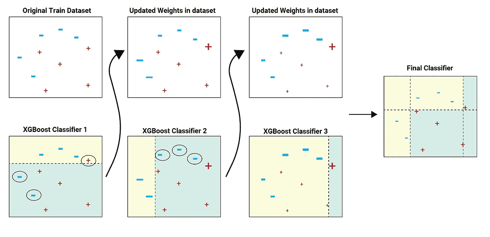

# 结论

这个列表绝不是完整的！Python 生态系统提供了许多其他有助于数据科学工作的工具。参与使用 Python 的数据科学项目的数据科学家和软件工程师将使用许多这些工具，因为它们对于用 Python 构建高性能 ML 模型是必不可少的。对于所有的机器学习任务来说，Python 是一种强大而简单的语言。