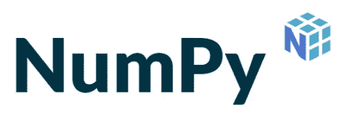
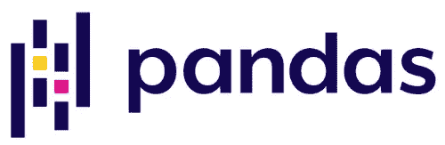
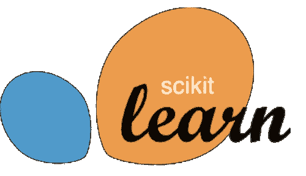
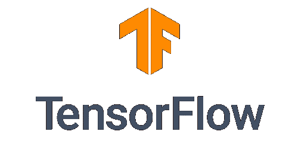
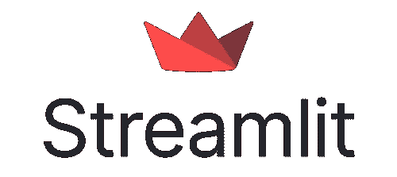

# 2022 年你必须知道的数据科学 Python 库

> 原文：<https://medium.com/mlearning-ai/python-libraries-for-data-science-that-you-must-know-in-2022-f2a5063ef58b?source=collection_archive---------4----------------------->

## 可以支持数据科学家的 python 库集合

Photo by fauxels from [Pexels](https://www.pexels.com/photo/colleagues-looking-at-survey-sheet-3183153/)

**数据科学**是当今大数据时代非常热门的领域。数据科学涵盖科学计算、数据分析、数据可视化、机器学习、深度学习等多个领域。

如果您作为数据科学家在工作中使用 python 编程语言，那么您肯定需要一些库来使您的工作在编写代码和节省时间方面更加容易。有了这个，我们就可以专注于理解算法，而不是专注于写复杂的代码。

在这篇文章中，我将介绍一些每个数据科学家都应该熟悉的 **python 库**。

# **1。NumPy**

Image from [NumPy](https://numpy.org/)

首先，我会把 NumPy 作为数据科学的 python 库。NumPy 是一个 python 库，广泛用于科学计算。NumPy 创建于 2005 年，是在 BSD 许可下发布的 100%开源软件。这个库也是其他几个 python 库的基础，比如 Scikit-learn、SciPy 等等。

NumPy 与数据科学领域密不可分有几个原因。首先，NumPy 的计算性能非常快，因为 NumPy 的核心是经过良好优化的 C 代码。第二，NumPy 的语法简洁，易于初学者阅读和使用。然后 NumPy 有许多支持科学计算的函数，比如随机数生成器、线性代数例程、傅立叶变换等等。最后，NumPy 有一个强大的 n 维数组，可以在 GPU 和稀疏数组库上运行。

你可以在这里阅读更多关于 NumPy [的内容](https://numpy.org/)。

# **2。熊猫**

Image from [Pandas](https://pandas.pydata.org/)

第二个地方，有 pandas 作为 python 库用于数据分析。熊猫最初是在 AQR 资本管理公司开发的，在 2009 年末成为一个开源项目。除了用于数据分析，pandas 还是一个强大而灵活的数据操作工具。

关于熊猫，还有一些你应该知道的事情。第一，就像 NumPy 熊猫因为是 C 或 Cyton 内置，所以性能快。第二，许多操作数据的功能，如集成索引、处理缺失值、能够读取各种文件格式、聚合或转换数据等等。最后，python 和 pandas 被用在各种领域，比如学术、商业、经济、统计，当然还有数据科学。

你可以在这里阅读更多关于熊猫的信息。

# **3。Matplotlib**

Image from [Matplotlib](https://matplotlib.org/stable/)

此外，在第三个位置有 Matplotlib，作为用于数据可视化的 python 库。Matplotlib 最初由 John D Hunter 编写，于 2003 年发布。到目前为止，Matplotlib 还在继续发展，并与许多用于其他数据可视化的库集成，如 Seaborn、ggplot 等等。Matplotlib 具有许多用于各种类型的数据可视化的特性。Matplotlib 中的数据可视化类型包括基本图、数组图、统计图和非结构化坐标图。

你可以在这里阅读更多关于 Matplotlib [的内容。](https://matplotlib.org/stable/)

# **4。SciPy**

Image from [SciPy](https://scipy.org/)

数据科学领域当然离不开算法。下一个位置是 SciPy，这是一个 python 库，包含了科学计算的各种基本算法。SciPy 也是 GitHub 上的科学 python 社区开发的一个开源项目。

SciPy 的流行有许多重要的特征。首先，Scipy 包含统计、优化、代数方程、微分方程等的基本算法。其次，就像 NumPy 和 pandas 一样，SciPy 是使用 Fortran、C 和 C++等低级语言构建的，因此它具有非常快的计算性能。最后，SciPy 具有简洁的语法，易于初学者阅读和使用。

你可以在这里阅读更多关于西皮[的信息。](https://scipy.org/)

# **5。Scikit-learn**

Image from [Scikit-learn](https://scikit-learn.org/stable/)

排在第五位的是 Scikit-learn，这是一个流行的用于机器学习任务的 Python 工具包。Scikit-learn 是一个简单的工具，有许多机器学习算法的实现。请注意，Scikit-learn 构建在 NumPy、SciPy 和 Matplotlib 之上。Scikit-learn 也是 BSD 许可的开源项目，可以商业使用。

这使得 Scikit-learn 在机器学习任务中非常受欢迎，因为它具有许多功能，如监督学习、非监督学习、模型选择评估、数据集转换、数据集加载实用程序等。

你可以阅读更多关于 Scikit-learn [这里](https://scikit-learn.org/stable/)。

# **6。张量流**

Image from [TensorFlow](https://www.tensorflow.org/)

第六个位置，有 Tensorflow 作为机器学习和深度学习任务的 python 库。TensorFlow 是由 Google brain 团队开发的库，于 2015 年在 Apache 2.0 许可下首次发布。除了可以在 Python 编程语言中使用，TensorFlow 还可以与 JavaScript、C++和 Java 编程语言一起使用。

TensorFlow 有几个特性使它在学术界很受欢迎。首先，建模简单，因为它可以使用高级 Keras API。第二，TensorFlow 提供机器学习和深度学习模型的直接生产线。最后，TensorFlow 非常容易用于研究，因为它提供了灵活性和控制功能，如 Keras Functional API 和用于构建复杂拓扑的模型子类 API。

你可以在这里阅读更多关于 TensorFlow [的内容。](https://www.tensorflow.org/)

# **7。PyTorch**

Image from [PyTorch](https://pytorch.org/)

然后还有一个来自 TensorFlow 的竞争对手，也就是 PyTorch。与 TensorFlow 类似，PyTorch 是一个用于机器学习和深度学习任务的库。PyTorch 由脸书人工智能研究实验室(FAIR)开发，于 2016 年 9 月在 BSD 许可下首次发布。Python 是用 Python、C++和 CUDA 编程语言构建的。与 TensorFlow 不同，PyTorch 更受工商界欢迎。

PyTorch 还具有许多功能，包括快速、灵活的实验，通过用户友好的前端进行高效的生产，分布式培训，以及在主要云平台上得到良好的支持。

你可以在这里阅读更多关于 PyTorch [的信息。](https://pytorch.org/)

# **8。Keras**

Image from [Keras](https://keras.io/)

在第八个位置，有 Keras 作为深度学习任务的 python 库，特别是在人工神经网络上。Keras 也是开源软件，于 2015 年首次发布，并在 Apache 2.0 下获得许可。根据 Kaggle 网站的说法，Keras 是深度学习中使用最广泛的库。

Keras 是使用最广泛的库的原因是它具有简单的语法和清晰的错误消息。然后，Keras 是最终 TensorFlow 2 生态系统的一部分。由于易于使用，Keras 是刚开始学习深度学习的人的解决方案。

你可以在这里阅读更多关于 Keras [的内容。](https://keras.io/)

# **9。流线型**

Image from [Streamlit](https://keras.io/)

最后，还有 python 库，您可以使用它为数据科学创建和共享漂亮的定制 web 应用程序。Streamlit 由 Adrien Treuille、Amanda Kelly 和 Thiago Teixeira 于 2018 年推出。尽管与其他库相比，Streamlit 看起来是最年轻的，但 Streamlit 有一个广泛增长的社区，并且被 Streamlit 组件的存在所证明。

我强烈推荐使用 Streamlit 来分享数据科学应用。我这样说的原因是，Streamlit 有能力显示和组织数据，绘制图表，绘制地图，添加交互式小部件，定制应用布局，计算缓存，定义自定义主题，还有 Streamlit 云。

你可以在这里阅读更多关于 Streamlit [的信息。](https://streamlit.io/)

# **结论**

Python 有几个库可以用来支持我们在数据科学领域的工作。每个库都有不同的功能和用途。当你想快速计算时使用 NumPy，当你想可视化数据时使用 Matplotlib，当你想操作数据时使用 Pandas，等等。

好吧，也许这就是我在这篇关于 python 数据科学库的文章中所能分享的全部内容。

**参考:**

[1][https://numpy.org/](https://numpy.org/)

[https://pandas.pydata.org/](https://pandas.pydata.org/)

[https://matplotlib.org/stable/](https://matplotlib.org/stable/)

[https://scipy.org/](https://scipy.org/)

[https://scikit-learn.org/stable/](https://scikit-learn.org/stable/)

[https://www.tensorflow.org/](https://www.tensorflow.org/)

[https://pytorch.org/](https://pytorch.org/)

[8][https://keras.io/](https://keras.io/)

[https://streamlit.io/](https://streamlit.io/)

 [## 数据科学家——从数据中发现黄金的人

### 数据科学简介，数据科学家的工作，以及数据科学应该使用哪种编程语言

medium.com](/mlearning-ai/data-scientist-someone-who-finds-gold-from-data-5c654ae350dd)