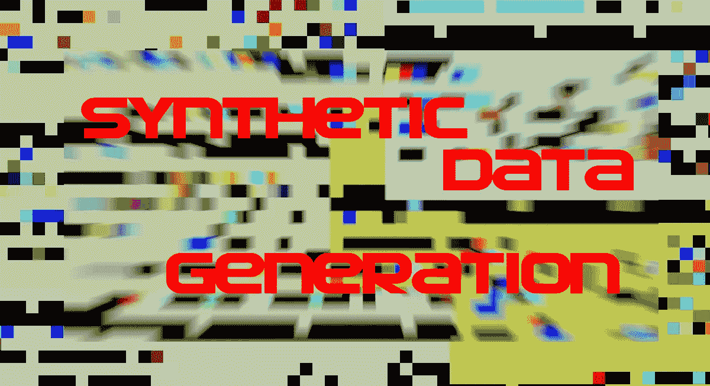
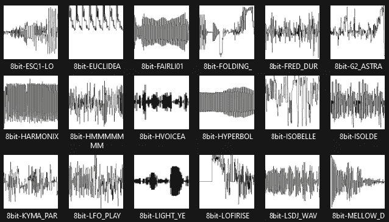
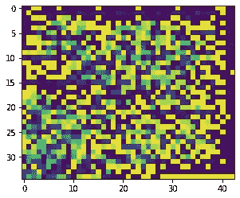
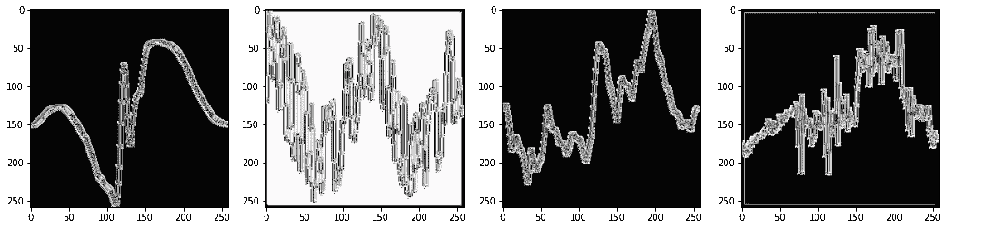
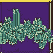
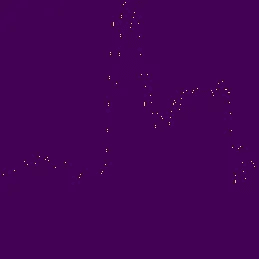
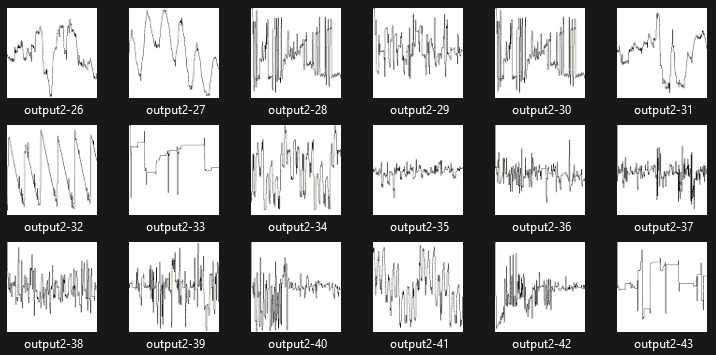
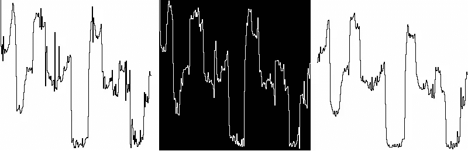
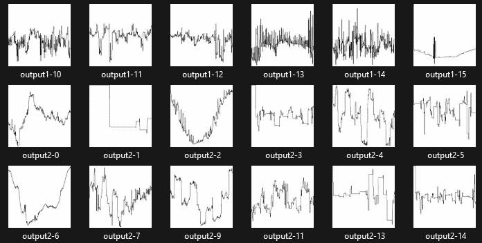

# Python、机器学习、GANs、合成数据和 Google Colab

> 原文：<https://medium.com/mlearning-ai/python-machine-learning-gans-synthetic-data-and-google-colab-5bb43491a8c7?source=collection_archive---------3----------------------->



*你想学习如何用机器学习和 GANs 制作人工生成的人脸吗？*我也没有。我想使用 GANs 从现有的二进制数据(我的训练数据)中学习，这样我就可以制作真实的合成数据。仅仅制造随机数据不足以满足我的需求。

顺便说一句，这次旅行不是没有一些糟糕的旅行。在这篇文章的最后一节看到我的经验教训，你可能会节省一些时间。

# 问题陈述

我想创建单声道、8 位音频样本(< 64KB) using a GAN, that I can load in an old hardware sample, the Ensoniq Mirage. I have already written the software that can load the samples onto a floppy disk- [见 Wavsyn Wiki](https://github.com/mogrifier/wavsyn/wiki) )，使它们真正易于使用。

我正在现有的样本上训练 GAN(主要是循环波形，但我也会尝试一些声音！)并看看它能产生什么。我的方法可能行不通

我不会像许多文章那样停止模型训练。我将使用经过训练的模型来生成更多图像，这是创建合成数据的全部目的。

# 让我们干杯

我正在寻找 Windows 相关问题的解决方案，无意中发现了 Google Colab。它看起来很有趣，是基于 Jupyter 笔记本的，就像 Kaggle 和 AWS Sagemaker 一样。我已经使用 Jupyter 笔记本好几年了，所以没有想到这一点让我觉得很愚蠢。我甚至将笔记本内置到我设计的产品中，我的团队为 DARPA 开发了该产品，以支持原型机器学习算法。

回到科拉布。Python 开发的 Jupyter 笔记本？检查。与 Google Drive 集成用于文件的输入/输出？检查。仍然从访问您的笔记本吗？检查。免费在云端使用 GPU？**检查**

[谷歌实验室网站](https://colab.research.google.com/)

笔记本还有其他优势。Python 模块在云中安装非常快，预装了许多关键模块。您也可以安装自己的模块。Colab 用的是 Ubuntu，所以很支持 Python 模块。您可以从任何可以访问网络的计算机上访问该笔记本。如果事情变得非常糟糕，只需重启您的会话，就好像扔掉一个虚拟机或云实例，但不必做任何相关的设置！

# 用于合成数据创建的 GAN

GAN 是一个生成性的对抗网络。两个神经网络被用来相互竞争。一个(图像生成器)试图根据输入的训练数据生成好看的数据。另一个(鉴别器)尝试确定数据是真实的还是来自 GAN。它会产生一个反馈回路，改进图像生成器，目标是创建欺骗鉴别器的结果。

请注意，在这次旅程中，我对不同数据类型的不同机器学习方法有了一些其他想法。在我的侧钻下面有一节讨论了这一点。

# 预处理

我选择 PyGAN 做这个练习。和其他许多软件一样，它是用来处理图像的。其他神经网络(如 CNN)也是面向图像的，所以我的技术也适用于此。我的初始数据不是图像，但我的数据是二进制的，所以它可以重新格式化，看起来像一个图像，以*欺骗 GAN 使用我的数据*。

在我的第一个方法中，我选择的数据失败了(但是可以用于其他数据类型！)，我为这篇文章创建了一个有效的位图头: [BMP 文件格式—维基百科](https://en.wikipedia.org/wiki/BMP_file_format)，并在我所有的训练数据文件前添加了一个 14 字节的位图头和一个 40 字节的 DIB 头。我忽略了颜色图，因为我真的只有关闭或打开的像素。像素颜色值无关紧要。然后，GAN 可以处理数据。

由于数据的限制，我切换到不同的数据类型(音频),并使用不同的技术来创建 GAN 所需的图像。我用我的 1d 音频数据创建了一个 2d 数组，并用它制作了一个位图。这就像音频程序通过将音频文件转换成振幅与时间的关系图来可视化音频文件一样，比如 Audacity。我的代码如下。

*注意——这个编辑器对预格式化的代码做了一件可怕的工作，Python 有非常严格的格式化规则(恶心)。这意味着制表符和空格被删除了，我已经试着把它们添加回去，这样你就可以很容易地复制和使用这段代码。*

```
import os
import sys
import numpy as np
import struct
import matplotlib.pyplot as plot
from PIL import Image, ImageDraw'''
Takes the data from an inputFile, which should be an 8-bit PCM file (no wave header). Reads it and processes into a 256 x 256 array for conversion to a bitmap. Writes the bitmap to the outputFile.
'''def sampleToBitmap(inputFile, outputFile):
    source = read_file_bytes(inputFile)
    rows = len(source)
    cols = 256
    a_2d = np.zeros((rows, cols), dtype=np.uint8, order='C')
    for i in range(rows):
        val = source[i]
        # reverse data to get it to look like audio file should
        a_2d[(rows -1) - i][val] = 10# compress the sample data down to 256 x 256\. Average the values.
compress = int(rows / 256)
a_2d = np.zeros((256, 256), dtype=np.uint8, order='C')
val = 0
for j in range(0, 256):
    val = 0
    for k in range(compress):
        val = val + source[j * compress + k]
        #average
        avg = int(val / compress)
        a_2d[j][avg] = 10# Need to draw the data and connect the points together, then output as a bitmap#Create Image object. L is for bitmap
im = Image.new('L', (256, 256), color = 'white')
pt1 = (0,0)
pt2 = (0,0)
for j in range(256):
    for k in range(256):
        if a_2d[j][k] > 0:
            pt1 = (j, k)
            if j < 255:
                if a_2d[j + 1][k] > 0:
                    pt2 = (j, k) #Draw line
    draw = ImageDraw.Draw(im)
    draw.line([pt1, pt2], fill=(0))im.save(outputFile)
```

我在包含音频样本训练数据的目录中循环调用了上面的代码，并为每个文件生成了一个位图。我的初始训练集有 186 个文件。这是 256x256 位图的音频文件示例:



Subset of training data bitmaps to be fed into the GAN

一旦位图制作完成，我就把它们上传到我的谷歌硬盘的一个文件夹里，以便在笔记本上使用。

# 其他方法

*【这是一个你可以稍后阅读的侧道】*其他类型的数据需要其他类型的机器学习方法。在我的第一次尝试中，我使用的数据集在转换为图像时不具备处理 GAN 所需的功能和结构。这些数据看起来非常随机，一点也不像图像。没有明确定义的特征供神经网络学习，因此没有什么可供 GAN 使用。结果没用。阿甘只是一个错误的选择。


Bitmap of test data from first attempt

在做了更多的阅读后，多层感知器网络会是一个更好的选择，因为我的数据集中的每个数据块都是一个 1D 向量，相当于 CSV 文件中的一行。将此转换为与 GAN 一起使用的位图无助于在生成的数据中创建新的特征，并且一般来说，在列之间几乎没有要学习的关系。为了让深度学习发挥作用，这些特征和关系需要存在。我从这种方法中获得的数据显示，所有数据都是平均的，在 0-255 个值的范围内，GAN 的输出将所有数据点大致放在 125-130 之间。这是没有用的。



GAN output

还有其他值得注意的软件问题，这些是真正的交易破坏者。我的数据在大小上有限制。它必须准确——每行数据有 1178 个字节。我开始用 PyGAN 和 Accel-Brain 软件处理图像(见[https://code . Accel-Brain . com/Generative-Adversarial-Networks/readme . html](https://code.accel-brain.com/Generative-Adversarial-Networks/README.html))。三个图像生成器中的两个正在生成图像中多了一些行和列的输出。虽然对于生成图像来说很好，但当我需要输出精确的字节数时，这是一场灾难。这些模块——GANImageGenerator，ebaeimagegenerator——重塑了数据。前者可能会产生错误的字节数输出，而后者会在形状不匹配时出错。沿着这条路继续走下去是没有意义的。EBGANImageGenerator 可以产生输出，但是数据点的范围很窄，没有用。

对于我使用音频数据的第二次尝试，你也可以使用 LSTM(长短期记忆)方法。LSTM 是递归神经网络的一个亚型。我没有试过这个，但我知道它们对视频和音频都有好处。LSTM 基于以前的数据创建新数据，所以像音频文件或流这样的数据是有意义的，因为它是按时间排序的。

## 这个故事的寓意

你选择的机器学习方法会极大地影响你的结果。您可能还需要尝试多种方法来找到最佳结果。

# 甘码

PyGan 有三种不同的算法可供选择用于 Gan。关于不同算法的信息见[生成对抗网络库:pygan-pygan 文档(accel-brain.com)](https://code.accel-brain.com/Generative-Adversarial-Networks/README.html)并见使用它们的样本代码。

下面的代码直接来自示例代码。为了测试我的方法，我特意设置了一个较低的学习迭代次数(iter_n = 20)。

```
import numpy as np
import os
import pygan
import sysfrom pygan.gan_image_generator import GANImageGenerator
from logging import getLogger, StreamHandler, NullHandler, DEBUG, ERRORlogger = getLogger("accelbrainbase")
handler = StreamHandler()
handler.setLevel(DEBUG)
logger.setLevel(DEBUG)
logger.addHandler(handler)#my fake 256x256 bitmaps are in "/content/drive/My Drive/patches/".gan_image_generator = GANImageGenerator(
    # `list` of path to your directories.
    dir_list=["/content/drive/My Drive/patches",],
    # `int` of image width.
    width=256,
    # `int` of image height.
    height=256,
    # `int` of image channel.
    channel=1,
    # `int` of batch size.
    batch_size=40,
    # `float` of learning rate.
    learning_rate=1e-06
)gan_image_generator.learn(
    # `int` of the number of training iterations.
    iter_n=20,
    # `int` of the number of learning of the discriminative model.
    k_step=10
)print(gan_image_generator.GAN.posterior_logs_arr)
arr = gan_image_generator.GAN.generative_model.draw()
```

你可能想知道神经网络在哪里？PyGAN 提供了一个默认的，但是您可以覆盖它。网络是在 [pygan.gan_image_generator 源代码](https://code.accel-brain.com/Generative-Adversarial-Networks/_modules/pygan/gan_image_generator.html#GANImageGenerator)中定义的，这给了你一个很好的模板来创建你自己的网络。

运行 GAN 时，您如何知道何时完成？训练模型产生关于误差量的输出，但是 GAN 具有两个模型(网络),使得这更加困难。

***填写读甘输出上的错误和学习成功的***

5 次迭代:[0.49988141 0.46187854 0.50002797 0.45569888 0.50001973 0.46612009 0.50014204 0.45283565 0.4996585 0.43780279]

20 次迭代:【0.50017167 0.55513453 0.50019184 0.55407137 0.49999906 45 0.5470007 77 0.50007 812 0.54849 999784 1 0.54999 786 0.5495

然后我运行了 250 次迭代，最终得到了如下的好值(0.50 很好):

… 0.49962118 0.50590265 0.50013419 0.50725633 0.50022006 0.51314133 0.49990247 0.5052942 0.4999769 0.50594449 0.50027339 0.50536716 0.49983954 0.50563681 0.49972819 0.50757897 0.50013671 0.50382507 0.50012222 0.50401735]

我确实对我的 GAN 神经网络做了一个改变。在鉴别器中，我将 activation_list 变量中的 sigmoid 改为 tanh。Tanh 应该是一个更好的函数。

# 如何从模型生成新图像

我需要使用 GAN 训练的模型来输出新的图像。这行代码告诉经过训练的生成模型这样做。

> arr = gan_image_generatorGAN.generative_model.draw()

连续的调用将从模型中输出一组新的图像，可用的数量等于批量大小。

# 从四维数组中读取二维图像

输出存储在名为“arr”的 4d NDArray 中。它的形状是(40，1，259，259)。40 是批次号，1 是图像通道号，图像形状是 259 x 259。请注意，输出形状略有不同，它有 3 个额外的行和列。通道与颜色通道的数量有关。RGB 颜色= 3 个通道。黑白= 1 个通道(所以每个像素只有一个值)。

训练结束后，您可以从“arr”中获取数据，如下所示。

```
from PIL import Imagefrom matplotlib import cm
from matplotlib import pyplot as plt
import mxnetfor i in range(10):
    image2d = arr[i, 0, :, :]
    # arr and image2d are instances of mxnet.ndarray.ndarray.NDArray
    # convert to a numpy ndarray for use with matplotlib
    img = image2d.asnumpy()
    # scale to 0-255
    img = img * 255
    img = img.astype(np.uint8)
    # colorizes if default color map of 'viridis' is not changed.
    # add argument cmap='gray' for grayscale. Data not changed.
    plt.imshow(img, cmap='gray')
    plt.show()
```



Output files from a very short training run at 256x256

这个数据显然比第一次尝试的随机数据好得多；然而，它并不完美，因为线条有点太粗了。我在图像中的训练数据行都是单个像素。另外，这些看起来和一些输入文件非常相似，尽管这是 GAN 应该做的。

线条的粗细是一个问题，这使得很难像在输入文件中那样提取出漂亮的线条画。我需要那张线条画。可能训练不够，所以我会看看更多的迭代做什么。

我在一个更真实的 64 x 64 的图像尺寸上做了另一次运行，但是为了比较只进行了 10 次迭代。超级丑又模糊。您还可以看到整形(由于卷积核大小或步幅)的影响，使图像变成 67x67，但只是在这些额外的区域放置了垃圾(黄线)。



GAN output from 10 training iterations

这些结果促使我更深入地研究 GAN 和我的代码产生的数据。我遇到了与缺乏正常化相关的严重问题。值的范围大约在-5 到+ 3 之间，而我期望的是-1 到+1，每个数据数组(代表一个图像)都有不同的最小值和最大值。当使用 numpy 转换为 uint8 时，超出范围的值被“包装”起来，在奇怪的地方增加了点。**一定要分析你的输出！**

在我的代码中，我现在处理每个图像的输出数组，并确保它在 0–255(uint 8)的范围内正常化。

```
for kk in range(20):
    image2d = arr[kk, 0, :, :]
    # arr and image2d are instances of mxnet.ndarray.ndarray.NDArray
    img = image2d.asnumpy()
    # scale to 0-255.
    max = img.max()
    min = img.min()
    for i in range (259):
        for j in range (259):
            val = img[i][j] + min
            if val < 0:
                val = 0
            val = (val / (min + max)) * 255
    img = img.astype(np.uint8)# then save the array, img.
```

图像现在清晰多了，可以使用了。



Properly Normalized Output

我开始后期处理，但很难从紫色中分离出黄色像素。似乎使用 matplotlib 将我的数据保存为位图的行为极大地改变了它，并使 numpy 数组中的每个字节都变成了 4 字节的值，即使我指定了灰度色图。这既奇怪又糟糕，所以我需要在保存为图像之前研究 numpy 数组(反正我不需要这个图像)。这段代码让我保存用于分析的数据数组。

```
# save numpy array as npy file
from numpy import asarray
from numpy import savefor kk in range(50): 
    image2d = arr[kk, 0, :, :]# arr and image2d are instances of mxnet.ndarray.ndarray.NDArray
    # convert to a numpy ndarray for use with matplotlib
    img = image2d.asnumpy()
    # scale to 0-255\. 
    max = img.max()
    min = img.min()for i in range (259):
        for j in range (259):val = img[i][j] + min
          if val < 0:
              val = 0val = (val / (min + max))    * 255img = img.astype(np.uint8)
    #result is 259 by 259 array of uint8# colorizes if default color map of 'viridis' is not changed.
    # add argument cmap='gray' for grayscale. Data not changed.
    plt.imshow(img, cmap='gray')
    plt.show()# I want to process columnwise, so transpose the array axes
    d2trans = np.transpose(img)
    # convert to a 1d array
    d1 = d2trans.flatten()
    # save to npy file
    name = f"/content/drive/My Drive/syntheticTANH250iter/output{kk}"
    save(name, d1)
```

处理 4 个字节的值并不困难，只要你知道这就是你所拥有的。

# 后加工

我的数据有限制，即它必须作为单声道音频文件使用，这是一个一维数组。这意味着有一些后处理要做，因为如果我只是打开这些图像文件，就好像它们是 PCM 音频数据，并播放它们，我得到的只是一个可爱的静态。对于您的特定数据需求，您可能会面临类似的挑战。数据处理，我的意思是管理，是机器学习的大部分工作，因为:

*   它对于需要定制编码的特定数据来说是非常具体的
*   机器学习算法，像其他任何东西一样，需要良好的输入

我在上面提到了预处理(将数据转换成位图)。我将给出从您创建的合成文件中获取数据的要点。

由于创建输出图像是将字节转换成 4 字节值，因此图像不是最佳选择，需要更多的处理。不过，它们看起来很好，可以看出事情是否正常。

*   将每组输出数据(离散图像数据)保存为 2d 数组
*   读取一整行数据
*   根据需要插入新数据(见下文)
*   将该行写入临时数组
*   将临时数组添加到用于保存所有数据的字节数组中
*   重复此操作，直到读取完所有行
*   将新数据的字节数组写入文件
*   检查数据(健全性检查)并测试(对我来说，这意味着将文件作为音频播放)

对我来说，结果是一个 8 位(无符号整数)PCM 音频文件(无波形头),供我的音乐硬件和软件使用。

## 数据插值

这在我的用例中是必需的，因为我首先对我的 8 位训练数据进行采样和压缩，以将音频样本降低到 256x256 位图。相反的过程需要通过插入中间值将数据从 256x256 扩展到任何原始样本长度。有几个算法你可以尝试，但他们分为几类:线性或曲线拟合。线性就是简单地连接这些点，并在 GAN 的输出之间插入新的数据点。曲线拟合需要查看几个点，并应用与它们匹配的曲线，这比较复杂。对于 8 位数据值，我认为线性可能就足够了。

# 成品呢？？

使用来自 GAN 输出的 8 位 PCM 文件和我的后处理代码(如上所述)，我制作了下面的位图。您将会看到与上面训练数据集图片的相似之处。PCM 音频文件在 Audacity 中也能正常播放，我将能够加载到我的采样器中。奇怪的是，播放我只是为了检查数据而制作的位图也在 Audacity 中“播放”，并创建了漂亮的脉宽调制方波(就像科幻电影声音中的电流)。用一点点音频工作是非常宽容的。



GAN output represented as bitmaps of the audio waveform

然而，数据不仅仅是相似。我用更高的训练迭代做了一些运行，看了大约 5000 张图像，所以你不必这样做！几乎所有的数据都来自训练数据，所以我正在经历一种叫做

> 模式崩溃

那么，我如何摆脱这种情况，让 GAN 给我新的数据呢？阅读建议调整学习速度。较小的批量也可能有所帮助。问题是你不知道从哪里开始或者什么会起作用。这意味着您需要创建一组想要调整的参数，并使用每个参数运行系统，保存输出和用于创建参数的参数列表(运行元数据)。然后，直观地检查输出，看看哪组参数做得最好。您可以使用 CNN 来自动检查，但有趣的是，您想要看起来不同的图像，而不是与您的训练集相同的图像，因此得分低的输出将是最好的输出！

# 解决模式崩溃

如果我第一次就把一切都做对了，我就不会发表这篇文章，所以这是解决模式崩溃的一个更新。改变学习速度是一个好计划。总的来说，较大的学习率对我有用，但是 YMMV。我用了 3e06，4e06，5e05。仍然有一些空数组，但是很少。我知道我正在从 GAN 获得良好的原始输出，因为我可以看到一些使用不同参数运行的相关图像，但正如您在下面看到的那样，它们只是略有不同。



Similar, but different

这里有一组数据，显示了使用不同学习率时的一些结果。



Good output from the GAN

这些数据集并不都是音乐上有用的，但有些有前途，现在我可以用 GAN 生成更多。

顺便说一下，批量大小 8 只给了我 0 的数组，不考虑其他参数。

*有一步我没有尝试，但也是推荐的，就是用不同的学习速率训练两个网络。*

# 保存 Colab 的输出

有很多方法可以做到这一点。我在下面展示了其中的几个。第一个是保存二进制数据(这是我的用例所需要的)。第二个将你的数据的 CSV 文件写入你的 Google Drive。

## 方法 1

我展示这个只是因为它是一个

> 不好的方式，不会工作的权利！！

```
from google.colab import filesfor i in range(40):
    name = f"output{i}.pcm"
    image2d = arr[i, 0, :, :].asnumpy()
    dst1d = image2d.reshape(1, 259 * 259)
    data = dst1d.tobytes()
    output = open(name, 'wb')
    output.write(data)
    output.close()files.download(name)
```

这适用于一些文件，但不是大规模的。我试了 40 个，只收到十几个。

## 方法 2

这是写入任意文件的最佳方式——使用您的挂载点将它们直接写入 Google Drive。*任何保存文件的库都可以保存到你的挂载点路径，就好像它是一个本地硬盘一样。*

```
from google.colab import drivedrive.mount('/content/drive')for i in range(40):
    name = f"/content/drive/My Drive/syntheticpatches/output{i}.pcm"
    image2d = arr[i, 0, :, :].asnumpy()
    dst1d = image2d.reshape(1, 259 * 259)
    data = dst1d.tobytes()
    output = open(name, 'wb')
    output.write(data)
    output.close()
```

您可能想知道方法 2 与 numpy.save 有何不同。答案是这种方法只保存没有 numpy 头的字节。使用 numpy.save 方法时，一个 128 字节的头放在文件的开头。这个头文件的存在使得 numpy 可以很容易地从以前保存的数组中加载二进制数据。头包括元数据，如顺序(C 或 Fortran)和数据的形状。如果没有这些额外的信息，numpy 就不知道保存数据的数组的形状。

## 方法 3

这使用 pandas DataFrame 功能来保存合成数据。熊猫模块已经和一个文件处理模块一起安装在 Colab 笔记本中。需要进行一些转换，如下所示。

```
from google.colab import files
import pandas as pd
#save data to a file
# 40 batches so that is how many images to savefor i in range(40):
    # this reads 2 dimensions from a 4-dimensional array
    image2d = arr[i, 0, :, :]
    # arr and image2d are instances of mxnet.ndarray.ndarray.NDArray
    # convert to a numpy ndarray for conversion to DataFrame
    img = image2d.asnumpy()
    # scale to 0-255
    img = img * 255
    img = img.astype(np.uint8)
    output = pd.DataFrame(img)
    output.to_csv(f"/content/drive/My   Drive/patches/synthetic2darray_{i}.csv")drive.flush_and_unmount()
print('All changes made in this colab session should now be visible in Drive.')
```

是的，我的文件保存了！但是它们都是错误的形状。GAN 图像生成器正在改变输入形状，我不知道为什么。也许是因为我需要使用默认的神经网络定义来提供我自己的神经网络定义。在任何情况下，我的数据都可以被重塑，我可以把它重塑回来。

保存到 CSV 很简单，但结果数据不是二进制文件。你可能需要更多的转换，这取决于你的假图像数据首先是什么。

# 多类合成数据

如果您只有一种类型的输入数据，并试图从其建模和创建新的合成数据，那么您应该感到幸运。如果有多类数据，则需要多类训练数据。如果您的数据还没有被分类，您还有一些额外的工作要做。聚类算法(非监督算法，如 k-means)应该可以做到这一点。一旦数据集被分成聚类(就像将每个聚类放在自己的文件夹中一样简单)，就可以对每个文件夹运行整个 GAN 过程，以创建特定于类的合成数据，而不是所有类的大杂烩。我可能需要更多的训练数据来填写每个类，但这是一个不同的问题。

# 天空中伟大的 GPU

你应该使用 GPU 运行你的代码，Colab 免费提供。我有一个图形处理器，但它是旧的，是镭龙制造的。使用 MxNet 和 AMD GPU 需要大量的设置，不值得。

*   导航至编辑→笔记本设置
*   从硬件加速器下拉列表中选择 GPU

启用 GPU 后，由于使用的是不同的服务器，任何安装的模块(通过 pip)都需要重新安装。会话结束时也是如此。只需将安装代码放入笔记本，然后重新运行所有程序。

```
!pip install pygan
!pip install mxnet    [cpu only]
!pip install mxnet-cu101     [gpu only]
```

**注意—** 启动新会话还需要您重新验证您的 google drive，因此也要重新运行，并单击运行此代码时出现的链接。

```
from google.colab import drive
drive.mount('/content/drive')
```

值得注意的是，Google Colab 的免费等级是有限制的。它们也没有很好的定义。我尝试了 400 次训练迭代，我因 GPU 过度使用而断开连接，但没有给出任何细节。当然，你可以付费购买 Colab Pro，重新回到游戏中。参见 [Google Colab 资源限制](https://research.google.com/colaboratory/faq.html#resource-limits)。我也可以试试我桌子上的 Nvidia Jetson，看看它是否能承受这样的负载。

# 你学到了什么？

这是一个具有挑战性的主题，但有像 Google Colab 这样的好工具。你知道如何将它与你的 Google Drive 整合，并从你的 Jupyter 笔记本中获取数据。您需要确保您的数据和问题适合 GAN。你需要准备尝试不同的方法。当数据看起来很奇怪时，深入挖掘，看看到底发生了什么。阅读源代码。观察模式崩溃，然后尝试修复它。

正确处理输入和输出数据比运行基本的 GAN 更困难。一旦您控制了 IO，您就可以轻松地为 GAN 使用其他代码。[查看 PyTorch 项目中的大量技术](https://github.com/eriklindernoren/PyTorch-GAN)。

# 未来

有一些相关的活动我会尝试。我已经提到了我的第一种方法，它不适用于 GAN，但应该适用于多层感知器网络。我还计划使用一些其他数据(MIDI 文件)，我可以预处理成图像文件，因此，将与 GAN 一起工作。

# 课程

以下是我从这一努力中学到的一些经验。

我第一次在 Windows 11(！)并尝试安装相同的库(PyGAN 和 Apache MxNet 之类的依赖项)并在本地进行开发。令人沮丧的几个小时后，我放弃了。根本问题是 Windows 11 安装了 Python 3.10(也可能是我安装的，因为是最新的)。无论如何，它在 2021 年 10 月才发布，Python 生态系统的其余部分都在支持它。我确实通过降级到 Python 3.9.7 并从我的路径中移除 3.10 来解决这个问题。这使得安装像 numpy 和 scipy 这样的好库变得可行(scipy 在 3.10 中已经破产)。我也可以安装 mxnet，尽管它确实把我的 numpy 安装版本降级到了 1.16.6。

最终，Google Colab 更简单，如果你没有 GPU，你可以使用 GPU，但你不能做很多迭代而不会因为过度使用而被踢出局。

我的第一轮 GAN 方法揭示了我的数据中一个有趣的问题。我有奇数行(31)。图像处理库不喜欢这样。MxNet(PyGAN 使用的)在试图操作我的数据时产生整形错误。有一些图像库可以将你的高度或宽度从奇数变为偶数。这对于图像处理来说可能没问题，但对于我的合成数据来说就不一样了。我确认问题出在 31 行，只需将它改为 30 行。不知道我的额外的数据行去了哪里，但甘跑了。

我仍然不确定我的 256 x 256 的图像尺寸是否有问题。这对于 GAN 来说很大(应该是一半或四分之一或更少)，但较小的图像会失去音频保真度，需要更多的插值。权衡比比皆是。甘是训练，虽然，但可能只是学习了太多的设置(如过度拟合)。

缺少许多 API 的文档，并且您不知道数据发生了什么。我在 matplotlib 中特别看到了这一点，所以我不再使用它进行一些处理。