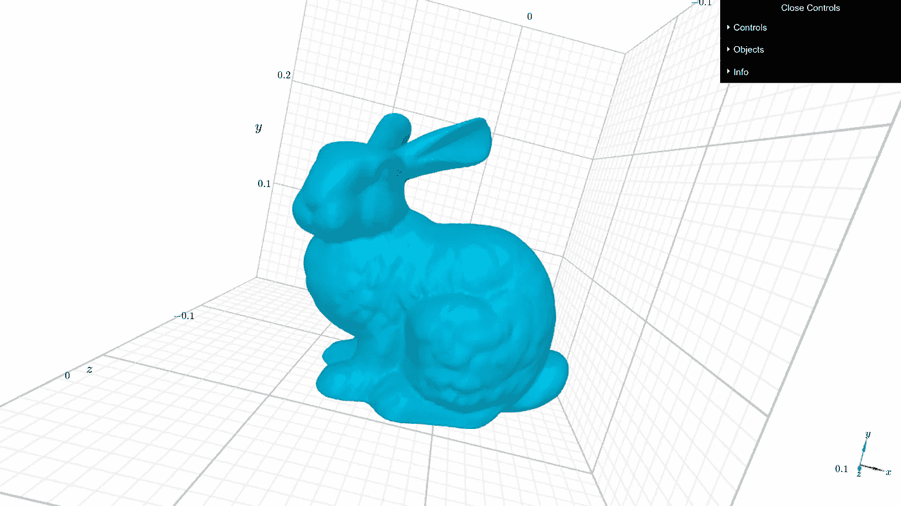
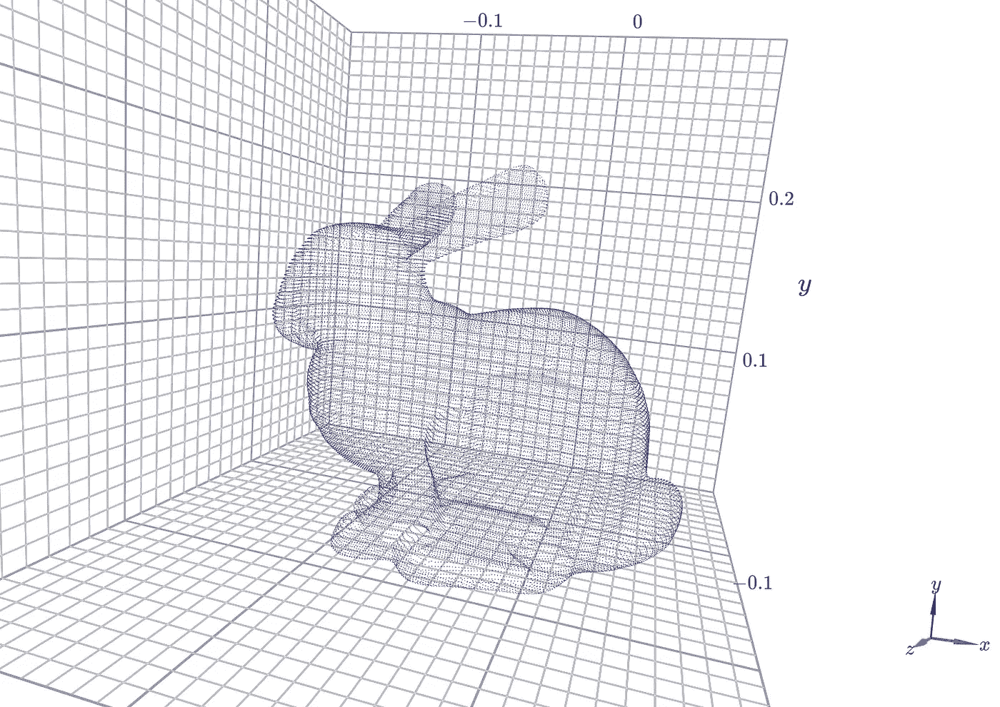

# 用于 3D 数据处理的 Python 多重处理

> 原文：<https://medium.com/mlearning-ai/python-multiprocessing-for-3d-data-processing-b657037479ff?source=collection_archive---------3----------------------->

今天我们将讨论如何使用 Python 多重处理来处理大量数据。我将讲述一些可能在手册中找到的一般信息，并分享一些我发现的小技巧，例如将`tqdm`与多重处理`imap`一起使用，以及并行处理档案。

那么我们为什么要求助于并行计算呢？处理数据有时会出现与大数据相关的问题。每次我们有不适合 RAM 的数据时，我们需要一点一点地处理它。幸运的是，现代编程语言允许我们产生能够在多核处理器上完美工作的多个进程(甚至线程)(注意:这并不意味着单核处理器不能处理多处理，[这里是关于该主题的](https://stackoverflow.com/questions/52465317/can-i-run-multiprocessing-python-programs-on-a-single-core-machine)堆栈溢出线程)

今天，我们将尝试经常性的 3D 计算机视觉任务，计算网格和点云之间的距离。例如，当您需要在所有可用网格中找到一个网格来定义与给定点云相同的 3D 对象时，您可能会遇到这个问题。

我们的数据由存储在`.7z`归档中的`.obj`文件组成，这在存储效率方面非常好。但是当我们需要访问它的确切部分时，我们应该做出努力。这里我定义了包装 7-zip 存档并提供底层数据接口的类。

MeshesArchive class

这个类几乎不依赖于`py7zlib`包，它允许我们每次调用`get`方法时解压数据，并给出存档中的文件数量。我们还定义了`__iter__`,这将有助于我们像在 iterable 上一样在那个对象上开始多重处理`map`。

这个定义为我们提供了迭代归档的可能性，但是它允许我们对内容进行随机并行访问吗？这是一个有趣的问题，我还没有在网上找到答案，但如果我们深入研究`py7zlib`的源代码，我们可以找到答案。

在这里，我提供了来自 [pylzma](https://github.com/fancycode/pylzma/blob/master/py7zlib.py) 的精简代码片段

Extract from pylzma source code, there’s a lot omitted

我相信，从上面的要点可以清楚地看出，无论何时同时读取多次，都没有理由阻止存档。

接下来，我们快速介绍一下什么是网格，什么是点云。首先是网格，它们是**顶点**、**边**和**面的集合。**顶点由空间中的 *(x，y，z)* 坐标定义，并分配有唯一的编号。相应地，边和面是点对和三元组的组，并且用提到的唯一点 id 来定义。通常，当我们谈到“网格”时，我们指的是“三角形网格”，即由三角形组成的表面。使用`trimesh`库在 Python 中处理网格要容易得多，例如，它提供了在内存中加载`.obj`文件的接口。要在`jupyter notebook`中显示 3D 对象并与之交互，可以使用`k3d`库。

因此，我用下面的代码片段来回答这个问题:“如何用`k3d`在`jupyter`中绘制一个`trimesh`对象？”

Plot trimesh mesh with k3d



Stanford Bunny mesh displayed by k3d (unfortunately not responsive here)

其次，点云，它们是表示空间中物体的 3D 点阵列。许多 3D 扫描仪产生点云作为扫描对象的表示。出于演示的目的，我们可以读取相同的网格，并将其顶点显示为点云。

Plot vertices as point cloud



Point cloud drawn by k3d

如上所述，3D 扫描仪为我们提供了一个点云。让我们假设我们有一个网格数据库，我们想在我们的数据库中找到一个网格，它与被扫描的对象即点云对齐。为了解决这个问题，我们可以提出一个简单的方法。我们将从我们的档案中搜索给定点云和每个网格点之间的最大距离。如果这样的距离对于某些网格来说小于`1e-4`，我们将认为这个网格与点云对齐。

最后，我们来到了多重处理部分。记住，我们的档案有大量的文件可能不适合一起在内存中，我们更喜欢并行处理它们。为了实现这一点，我们将使用多重处理`Pool`，它使用`map`或`imap/imap_unordered`方法处理用户定义函数的多个调用。影响我们的`map`和`imap`之间的区别在于`map`在将 iterable 发送到 worker 进程之前将其转换为 list。如果一个归档文件太大而无法写入 RAM，那么就不应该解压到 Python 列表中。在其他情况下，它们的执行速度是相似的。

```
[Loading meshes: pool.map w/o manager] Pool of 4 processes elapsed time: 37.213207403818764 sec
[Loading meshes: pool.imap_unordered w/o manager] Pool of 4 processes elapsed time: 37.219303369522095 sec
```

上面你可以看到从内存中的网格档案中简单读取的结果。

用`imap`继续前进。让我们讨论如何完成我们的目标，找到一个接近点云的网格。这是[数据](https://github.com/zetyquickly/mutliprocessing-manager/blob/master/data/meshes.7z)，我们有来自斯坦福模型的 5 个不同的网格。我们将通过向斯坦福兔子网格的顶点添加噪声来模拟 3D 扫描。

当然，我们之前在下面标准化了点云和网格顶点，以在 3D 立方体中缩放它们。

为了计算点云和网格之间的距离，我们将使用`igl`。为了最终确定，我们需要编写一个函数，在每个进程及其依赖项中调用。让我们用下面的片段来总结一下。

这里的`read_meshes_get_distances_pool_imap`是一个中心功能，完成以下工作:

*   `MeshesArchive`和`multiprocessing.Pool`已初始化
*   `tqdm`用于查看池进度，整个池的配置文件是手动完成的
*   执行结果的输出

请注意我们如何将参数传递给`imap`，使用`zip(archive, itertools.repeat(point_cloud))`从`archive`和`point_cloud`创建一个新的 itearable。这允许我们将一个点云数组粘贴到存档的每个条目上，避免将`archive`转换成一个列表。

执行的结果如下所示

```
100%|####################################################################| 5/5 [00:00<00:00,  5.14it/s]
100%|####################################################################| 5/5 [00:00<00:00,  5.08it/s]
100%|####################################################################| 5/5 [00:00<00:00,  5.18it/s]
[Process meshes: pool.imap w/o manager] Pool of 4 processes elapsed time: 1.0080536206563313 sec
armadillo.obj 0.16176825266293382
beast.obj 0.28608649819198073
cow.obj 0.41653845909820164
spot.obj 0.22739556571296735
stanford-bunny.obj 2.3699851136074263e-05
```

我们可以看出，斯坦福兔子是最接近给定点云的网格。还可以看到，我们没有使用大量的数据，但我们已经表明，即使我们在归档中有大量的网格，这种解决方案也是可行的。

多重处理允许数据科学家不仅在 3D 计算机视觉中，而且在机器学习的其他领域中实现巨大的性能。理解并行执行比循环内执行快得多是非常重要的。这种差异变得非常明显，尤其是当一个算法被正确编写时。大量的数据揭示了一些问题，如果没有创造性的方法来使用有限的资源，这些问题是无法解决的。幸运的是，Python 语言及其丰富的函数库帮助我们这些数据科学家解决了这些问题。