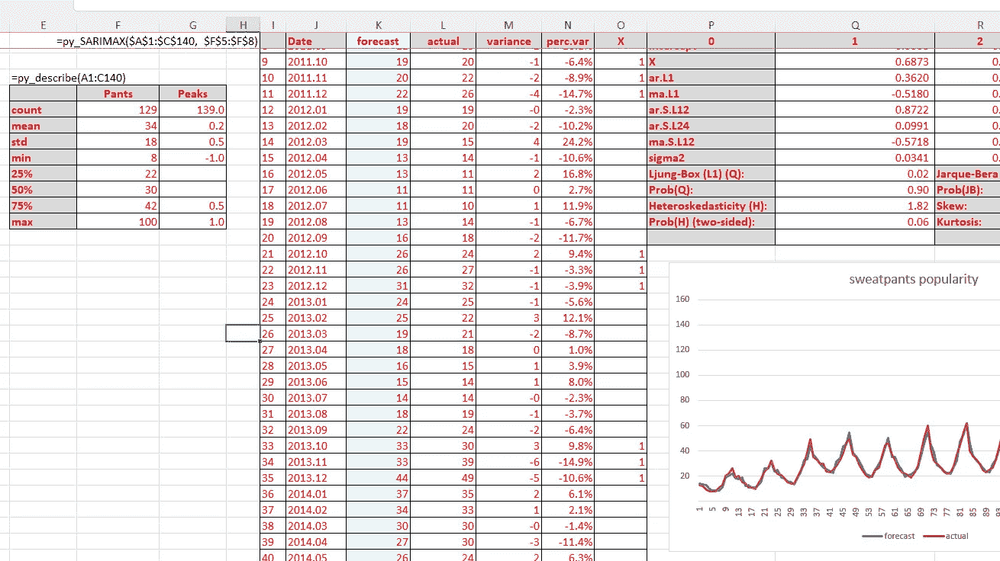

# Excel 中基于 Python 的数据科学函数

> 原文：<https://medium.com/mlearning-ai/python-powered-data-science-functions-in-excel-143be2f9a080?source=collection_archive---------2----------------------->

## 如何通过 xlwings 将 Excel 用作高级 Python 方法的前端

关于如何将 Python 数据科学方法(此处为 SARIMAX 预测过程)添加到 Microsoft Excel 的标准函数库的分步教程。

# 0.UpJetBaggies 公司——任务