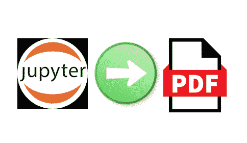
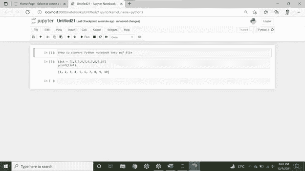
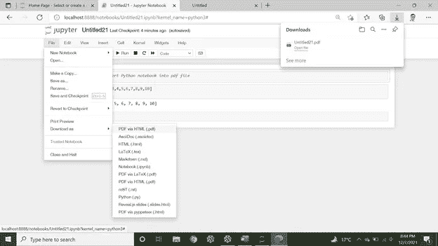

# Python 初学者编程第 15 部分

> 原文：<https://medium.com/mlearning-ai/python-programming-for-beginners-part-15-a9cc212dde36?source=collection_archive---------3----------------------->

(Jupyter 笔记本如何转换成 PDF 文件？)

嘿伙计们，

当我们在项目中工作时，很多时候我们需要分享我们处理过的数据集以及以表格、图表等形式获得的结果。并附有解释，以便当局能够容易地得出适当结果和意见。使用 jupyter 可以方便地将我们的 Jupyter 笔记本转换成 pdf 文件。我们需要进行一个超级简单的设置，这将使我们能够以 pdf 文件的形式访问我们的 python 笔记本。

Jupyter 笔记本如何转化成 PDF？让我想想…

有几种方法可以将笔记本转换成 PDF。我们将在这里讨论如何通过 HTML 将笔记本转换为 PDF。为了这个**目的**，我们需要安装必要的包，比如 notebook-as-pdf 和 pyppeteer。

**pdf 格式笔记本**

首先，我们需要安装 is noebook-as-pdf。它允许我们将 Jupyter 笔记本文件转换为 pdf 格式。我们可以在命令提示符下执行以下命令:

pip install -U 笔记本-as-pdf

**pyppeteer**

其次，我们还需要一个额外的铬设置。它用于完成 HTML 到 PDF 的转换。在代码提示符下执行以下代码。

pyppeteer-安装

它完成了我们所需软件包的安装。

现在，打开您想要转换成 PDF 的笔记本。例如，请参见下面的片段

在 Jupyter 笔记本中，单击文件菜单栏，然后选择下载为选项，然后选择 PDF via HTML 来转换笔记本

就这样，你已经有了一个 PDF 格式的笔记本。

**结论**

在这里，我们向您展示了一个将您的 Jupyter 笔记本转换为 PDF 文件的技巧。这是一个简单的方法来分享数据以及图表和评论。不用运行代码就能理解。

总结笔记时，请随意分享您的意见。您的喜欢和评论一定会帮助我以更好的方式呈现内容。下周见。