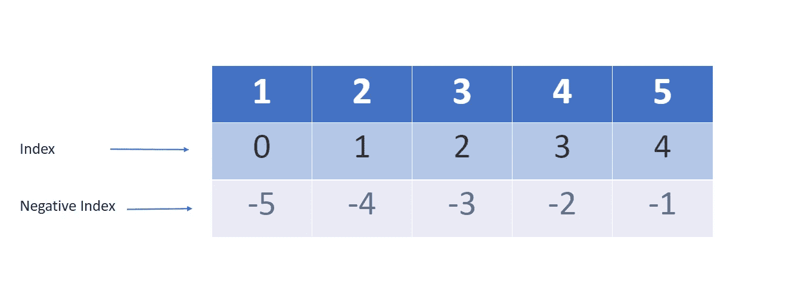

# Python 序列-列出了完整的指南

> 原文：<https://medium.com/mlearning-ai/python-sequence-lists-a-complete-guide-54ec7ed88323?source=collection_archive---------7----------------------->


Photo by [Luke Porter](https://unsplash.com/ja/@lukeporter?utm_source=medium&utm_medium=referral) on [Unsplash](https://unsplash.com?utm_source=medium&utm_medium=referral)

Python 提供了广泛的内置数据结构，包括序列。Python 中的序列通过它们的可变性来区分。可变序列可以更新或改变，而不可变序列一旦创建就不能改变。

列表是 Python 的四种内置序列类型之一，是 Python 的基本元素，广泛用于数据科学或机器学习。在本文中，我们来学习 Python 中的列表。在本文结束时，你将能够解释什么是 Python 列表、索引概念以及创建、添加或删除列表项的各种方法。

# 什么是 Python 列表？

Python 有几种数据结构，用于对其他值进行分组。Python 将这些数据结构称为`containers`。list 是 Python 的一个容器，用于以特定的顺序或序列存储同类值或对象。

列表中的每个值称为一个**项**。因为列表是按特定顺序排列的项目序列，所以列表中每个项目的位置都有一个标签或编号。该订单号被称为**索引**。



# 如何创建列表？

一个列表可以通过方括号`[]`中逗号分隔的项目数量来创建。

在 Python 中有多种方法可以创建列表。

*   ***使用内置构造函数*** `***list()***` ***。***
*   ***一对空方括号创建一个空列表。***
*   ***运用列表感悟。***
*   ***使用地图功能。***
*   ***使用过滤功能。***

语法:`list_name = [item_1, item_2, .., item_n]`

```
# Creating a list
numbers = [1, 2, 3, 4]

# Creating a empty list
empty_list = []
```

构造函数`list()`可以用来从 Python 的其他序列类型构建一个列表。

```
# empty list using `list()` built-in function.
empty_list = list()

# Converting string type in list using `list()`
string_val = "Python"
char_list = list(string_val)

print(char_list)
# output - ['P', 'y', 't', 'h', 'o', 'n']
```

该列表可以存储不同的数据项，包括序列类型。它不限于存储具有相似数据类型的数据。但是当您想要存储*同质数据*(具有相似数据类型的值)时，建议使用 ***列表*** ，使用 ***元组*** 存储*异质数据*(具有不同数据类型的值)。

```
# list with mixed data types
names = ['John', 'David', 'Liam', 'Joy']
ids = (1, 2, 3, 4)
users = [names, ids, 13.4]
```

# 如何从列表中访问元素

您可以使用 ***索引*** 和 ***切片*** 运算符来访问列表的元素。Python 的每个序列都有由非负数表示的有序索引集。索引允许列表是可迭代的，这意味着您可以按照列表中的项目在列表对象中出现的顺序来访问列表中的每个项目。

> **分度**

Python 内置函数`len()`返回序列的总项数。当列表长度为`n`时，索引集包含来自`0`、`1`、`..`、`n-1`的数字。您可以使用`list_name.index(value)`方法找到列表中特定值的索引。

在 Python 中，每个序列都遵循从零开始的索引，其中索引从`0`而不是`1`开始。索引`i`处的列表`a`的元素由`a[i]`选择。

```
# Access elements using index
>>> a = [11, 22, 33]

# Index of first element
>>> a.index(11)
0

# To get the length of list `a`
>>> len(a)
3

>>> a[0]
11
```

当您试图访问列表索引范围之外的元素时，Python 将引发一个名为`IndexError`的异常。

```
""" 
The length of list `a` is 3, index of the list is 0, 1, 2\. 
If you try to access value at index 3, which is not present in list `a`,
Then Python will raise indexError.
"""
>>> a[3]
Traceback (most recent call last):
  File "<pyshell>", line 1, in <module>
    a[3]
IndexError: list index out of range
```

Python 中序列数据类型的索引总是类型`integer`。如果您试图使用其他数据类型的索引来访问元素，Python 将引发一个名为`TypeError`的异常。

```
# Let's try to access element of list using float type instead of integer.
>>> a[1.0]
Traceback (most recent call last):
  File "<pyshell>", line 1, in <module>
    a[1.0]
TypeError: list indices must be integers or slices, not float
```

***负索引—*** Python 支持对其序列进行负索引。索引`-1`代表最后一个元素，`-2`代表倒数第二个元素，依此类推。

```
# Negative indexing
>>> a[-1]
33

>>> a[-3]
11
```

> **切片**

切片是从列表中提取元素的另一种方式。使用索引运算符，可以访问列表中的单个项目。但是，当您需要访问列表中的值范围时，可以使用切片操作符。

语法:`list_name[start:end:[step]]`

该语法用于从列表中提取值。这里，开始索引总是被包括，而结束索引总是被排除，并且步长是可选的索引指示两个索引之间的差异。

```
# Accessing elements using slicing from list a
a = [11, 22, 33, 44, 55]

# Returns entire list
>>> a[:]  
[11, 22, 33, 44, 55]

# Return all values from index 2
>>> a[2:]
[33, 44, 55]

# Return all values with step 2
>>> a[::2]
[11, 33, 55]
```

# 更新列表

由于列表是一个可变序列，我们可以改变或更新列表的元素。

> 赋值运算符— **(=)**

除了查询值之外，还可以通过使用赋值运算符为索引位置分配一个新值来使用索引更新列表中的项目。

语法:`list_name[index] = value`

```
# Create a list 
>>> a = [1, 2, 3, 4, 5]

# Update the first element.
>>> a[0] = 10
>>> a
[10, 2, 3, 4, 5]

# Update first three elements using slicing
>>> a[:3] = [11, 22, 33]
>>> a
[11, 22, 33, 4, 5]
```

> 列表**。**追加(值)&列表**。【iterable】扩展**方法

您可以使用*append()*&*extend()*方法在列表末尾添加值。

*   `append(x)`将单个指定对象`x`追加到列表末尾。

```
# Appending single number
>>> a = [1, 2, 3]
>>> x = 10
>>> a.append(x)
>>> a
[1, 2, 3, 10]

# Appending single item - list
>>> x = ['a', 'b']
>>> a.append(x)
>>> a 
[1, 2, 3, 10, ['a', 'b']]
```

*   `extend(iterable)`通过追加指定 iterable 中的所有元素来扩展列表。

```
>>> b = ['a', 'b', 'c']
>>> b.extend(['d', 'e'])
>>> b
['a', 'b', 'c', 'd', 'e']
```

> 列表**。插入(索引，值)**方法

还可以使用列表索引在要存储新值的特定索引位置插入新项目。可以使用 list 的 insert 方法将项目添加到特定的索引中。

```
# A single value
>>> c = [0.5, 1.0, 1.5, 2.5]
>>> c.insert(3, 2.2)
>>> c 
[0.5, 1.0, 1.5, 2.2, 2.5]

# iterable
>>> c.insert(1, (0.7, 0.8))
>>> c 
[0.5, (0.7, 0.8), 1.0, 1.5, 2.2, 2.5]
```

> 使用 **(+)** 运算符连接

您可以使用名为**串联**的 **+** 操作符来组合两个或多个列表。

```
>>> a = [1, 2, 3]
>>> b = [10, 20]
>>> a + b
[1, 2, 3, 10, 20]
```

> 使用( ***)** 运算符重复

您可以使用名为**重复**的 ***** 操作符多次重复一个列表。

```
>>> ['Hello'] * 3
['Hello', 'Hello', 'Hello']
```

# 删除列表项目

> 列表。**清除(值)**方法

类似地，我们可以使用 list 的 remove 方法从列表中删除数据。此方法将移除给定值的第一个匹配项。

```
>>> a = [1, 2, 3]
>>> a.remove(2)
>>> a
[1, 3]
```

> 列表。**流行(指数)**方法

此方法移除列表中给定索引处的元素并返回它。如果没有指定索引， ***pop()*** 删除并返回列表的最后一项。

```
>>> a = ['a', 'b', 'c', 'd']
>>> a.pop(1)
'b'
>>> a.pop()
'd'
```

> 列表**。clear()**

您可以使用 *clear()* 方法从列表中移除所有元素。

```
# using clear() method
>>> a = [1, 2, 3]
>>> a.clear()
>>> a
[]
```

> **德尔**声明

您可以使用带有 *del* 语句的列表索引来删除列表中给定索引号处不需要的项目。 *del* 语句也可以用来从列表中删除片或者清除整个列表，就像我们在上面的 clear 方法中所做的那样。

```
# using del to delete list
>>> a = [1, 2, 3, 4]

>>> del a[0]
>>> a
[2, 3, 4]

>>> del a[:2]
>>> a
[4]
```

你也可以使用 ***del*** 语句删除整个列表对象。如果您试图访问或读取已删除列表，Python 将至少引发 NameError，直到为它分配另一个值。

```
>>> del a
Traceback (most recent call last):
  File "<pyshell>", line 1, in <module>
    a
NameError: name 'a' is not defined
```

# 列出理解

您可以使用 list comprehension 创建一个列表，它提供了创建列表的最简洁和 Pythonic 式的方法。当您需要使用满足特定条件的列表或其他 iterable 或应用于列表中每个元素的一些操作来构造另一个列表时，可以使用它。

列表理解由包含表达式的括号组成，后跟用于子句的*，用于*子句的零个或多个*，或者用于*子句的*。结果将是一个新的列表，它是通过在随后的*和 *if* 子句的*上下文中评估表达式而得到的。*

创建方块列表的例子。

```
# Creating a list of using for loop
>>> squares = []
>>> for n in range(5):
...    squares.append(n**2)
...
>>> squares
[0, 1, 4, 9, 16]
```

使用 *for* 子句需要三行代码来创建一个方块列表。您可以使用 list comprehension 在一行中构建相同的列表。使用列表理解的主要好处是减少了单行代码的行数。

```
# Using list comprehension
>>> squares = [n**2 for n in range(5)]
>>> squares
[0, 1, 4, 9, 16]

# List comprehension with certain condition.
"""
Create list of even number in given range.
"""
>>> evens = [x for x in range(1, 10) if x%2==0]
>>> evens
[2, 4, 6, 8]
```

我们可以看到，列表理解比使用循环创建列表更具可读性和声明性。

# 地图功能

我们可以使用 ***map()*** 函数创建一个列表，该函数采用一个函数和一个 iterable。它返回一个迭代器对象，该对象是将函数应用于 iterable 的每个元素的结果。

语法:`list(map(*function, iterabel*))`

```
>>> def add10(n):
...    return n+10

>>> a = [1, 2, 3, 4]
>>> map(add10, a)
<map object at 0x00>
>>> list(map(add10, a)
[11, 12, 13, 14]
```

# 过滤功能

这是另一种使用类似上面函数 *map* 的高阶函数创建列表的方法，称为 ***过滤器*** 。就像映射一样，它需要函数的两个参数和一个 iterable。它从函数返回 true 的 iterable 元素中返回一个对象。

语法:`list(filter(*function, sequence*))`

```
>>> def gt3(n):
...    return n > 3

>>> a = [1, 2, 3, 4, 5, 6]
>>> filter(gt3, a)
<filter object at 0x00>
>>> list(fiter(gt3, a))
[4, 5, 6]
```

# 列出方法

列表是 Python 中最通用的数据结构，主要是因为它有各种各样的方法。到目前为止，我们只使用了创建或删除条目的方法，但是在处理列表时还有其他有用的方法。

> 列表。**计数(值)**

返回给定值在列表中出现的次数。

```
>>> a = [1, 2, 2, 3, 4, 2]

# Count the value 2 in list.
>>> a.count(2)
3
# Count the value 6 in list.
>>> a.count(6)
0
```

> 列表。**反转()**

颠倒列表中的元素并返回`None`。

```
>>> a = [1, 2, 3, 4]
>>> a.reverse()
>>> a
[4, 3, 2, 1]
```

> 列表。**排序(key=None，reverse=False)**

它就地排序一个列表并返回`None`，这意味着它修改并覆盖了原始列表。默认情况下，sort 函数按升序对数据进行排序。

```
>>> a = [3, 1, 2, 5, 6]
>>> a.sort()
>>> a
[1, 2, 3, 5, 6]

# Using reverse
>>> a.sort(reverse=True)
>>> a
[6, 5, 3, 2, 1]
```

> 列表。**复制()**

Python 中的赋值语句不复制对象；他们创建一个原始列表的视图。因此，在视图中所做的改变也会改变原来的列表，反之亦然。因此，可变的或包含可变项的容器需要原始列表的副本。

当您不想丢失原始数据内容时，可以使用列表的复制功能。这个函数复制列表并返回列表的浅层副本。

***copy()*** 功能相当于`**list_name[:]**`。

```
# without copy() function
>>> a = [1, 2, 3]
>>> b = a
>>> b
[1, 2, 3]

>>> b[0] = 10
>>> b
[10, 2, 3]
>>> a
[10, 2, 3]

# With copy() function
>>> a = [10, 20, 30]
>>> c = a.copy()
>>> c[0] = 1
>>> c
[1, 20, 30]
>>> a 
[10, 20, 30]
```

> **最小(**列表 **)** & **最大(**列表 **)** 功能

这些是 Python 的内置函数，

*   ***【max()】***函数从列表中返回最大值。
*   ***min()*** 函数从列表中返回最小值。

```
# Use min() function to find a minimum value of the list.
>>> a = [1.2, 1.102, 0.98]
>>> min(a)
0.98

# Use max() function to find a maximum value of the list.
>>> max(a)
1.2
```

*感谢您的阅读！*

> **参考文献—**

1.  [https://docs.python.org/3/tutorial/datastructures.html](https://docs.python.org/3/tutorial/datastructures.html)

[](/mlearning-ai/mlearning-ai-submission-suggestions-b51e2b130bfb) [## Mlearning.ai 提交建议

### 如何成为 Mlearning.ai 上的作家

medium.com](/mlearning-ai/mlearning-ai-submission-suggestions-b51e2b130bfb)