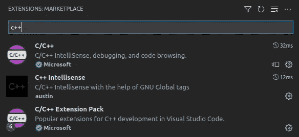
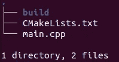

# Pytorch & C++ #1

> 原文：<https://medium.com/mlearning-ai/pytorch-c-1-5c4d0f7f27a4?source=collection_archive---------5----------------------->


# 介绍

在本系列中，我将尝试提供 Pytorch c++ API 的示例/实践/项目。如果你是这个系列的新手，可以在潜水前查看一下[第一篇博客](/@yozkose3/pytorch-c-intro-b50571762162)。在这个故事中，让我们通过 Torch 张量来熟悉 cpp 中的张量运算。了解了这个背景之后，我们将会更好地理解下面的项目&实践。所有代码都可以在[这个 Github repo](https://github.com/EmreOzkose/pytorch_cpp) 中获得。

[](https://github.com/EmreOzkose/pytorch_cpp) [## GitHub-EmreOzkose/py torch _ CPP:py torch CPP API 示例/实践

### 此时您不能执行该操作。您已使用另一个标签页或窗口登录。您已在另一个选项卡中注销，或者…

github.com](https://github.com/EmreOzkose/pytorch_cpp) 

# 内容

1.  描述环境。
2.  如何运行代码？
3.  编码。
    a .玩弄基本张量运算。
    b .举例:从零开始写焦损

# 环境

我在本系列的第一篇博客中提到了我是如何安装 Pytorch Cpp API 的。除此之外，我在 Ubuntu 20.04.3 上使用的是 VS Code 1.69.2。我安装了下面的 cpp 扩展。



## 扩展版本

*   C/C++ for Visual Studio 代码版本 1.11.5
*   C++智能感知 v0.2.2
*   C/C++扩展包 1.2.0 版

# 怎么跑

在这篇博客中，我们将只使用 1 个脚本。下面给出了运行步骤。

1.  创建一个文件夹来存储脚本和构建
2.  创建名为 main.cpp 的脚本

3.创建 CMakeFile

文件结构应该如下所示:



4.构建并运行:

```
cd build
cmake -DCMAKE_PREFIX_PATH=/path/to/libtorch ..
cmake --build . --config Release
./simple-tensor-operations
```

仅此而已！我们将只在下面的部分更改 main.cpp 文件。

# 编码

ATen 是一个张量库，你可以在 CPU 和 GPU 上进行操作。然而，Aten 张量类缺乏可微性。在这一点上，torch 定义了一个类似的张量类，其中这个张量类包括了 ATen 张量类的所有能力和可微性。这也叫[亲笔签名](https://pytorch.org/cppdocs/#autograd)。我们将使用 Torch::Tensor 类而不是 ATen::Tensor 来练习，因为除了可微性之外没有任何区别。

## 基本操作

Torch::tensor 包括 Python Tensor 类的所有功能。让我们定义 2 个随机张量。

我们可以做基本的数学运算。

张量类还提供管理给定张量的形状。您可以将 2D 矩阵转换为 1D 向量，或者删除/添加维度。

张量也可以叠加。

当然，设备操作也很重要。我们可以通过 torch::cuda 读取设备信息。

我们也可以将非线性函数应用于张量。

## 示例:从头开始编写焦点丢失

让我们从头开始练习写焦损所学的内容。我们将[原焦损函数](https://github.com/facebookresearch/fvcore/blob/main/fvcore/nn/focal_loss.py)转换为 cpp 版本。可以就此打住，自己试着写:)。

第一步是从头开始写 Sigmoid。

第二步是写二元交叉熵损失。

最后，焦点损失定义如下。

现在，让我们举几个函数的例子

## 结论

在这篇博客中，我们练习了 Pytorch cpp API 的基本操作。所有代码都可以在[这个 Github Repo](https://github.com/EmreOzkose/pytorch_cpp) 中找到。在本系列的后续博客中，我们将继续使用 torch::nn。

[](/mlearning-ai/mlearning-ai-submission-suggestions-b51e2b130bfb) [## Mlearning.ai 提交建议

### 如何成为 Mlearning.ai 上的作家

medium.com](/mlearning-ai/mlearning-ai-submission-suggestions-b51e2b130bfb)