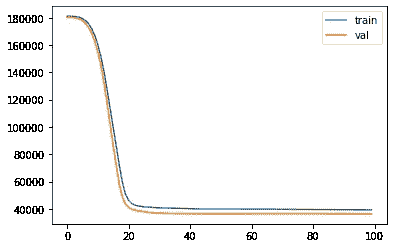

# Pytorch & C++ #3:房价预测

> 原文：<https://medium.com/mlearning-ai/pytorch-c-3-house-price-prediction-47696ad52e52?source=collection_archive---------4----------------------->


# 介绍

在本系列中，我将尝试提供使用 Pytorch c++ API 的示例/实践/项目。如果你是这个系列的新手，你可以在潜水前查看[的第一篇博客](/@yozkose3/pytorch-c-intro-b50571762162)。在这个故事中，我们将训练一个模型来预测给定地段面积和建造年份的房价。所有代码都可以在[这个 Github repo](https://github.com/EmreOzkose/pytorch_cpp) 中找到。

# 内容

1.  训练房价预测模型(Python)
2.  测试训练好的模型。(CPP)
3.  这个例子的下一步是什么？

# 训练一个房价预测模型

我们将使用[房价预测数据集](https://www.kaggle.com/competitions/house-prices-advanced-regression-techniques/data)，其中仅使用地块面积和建造年份值来训练模型。首先，我们应该加载数据并创建 Pytorch 数据集。

创建数据加载器之后，我们应该定义我们的预测模型。因此，这个博客旨在展示基本概念，而不是达到一个最佳模型，我们将使用一个只有 3 层的多层感知器。

现在，我们将训练我们的预测模型。我们将使用具有 0.01 学习率和 L1 损失的 Adam 优化器。可以用 SGD 来改变优化器，或者可以观察到不同的损失函数。

在培训结束时，我们得到了下面的损失图



损失值对我们教程来说似乎足够了:)。现在我们应该用`torch.jit.trace()`导出我们的模型。我们必须给出训练好的模型和一个例子给`trace()`函数。我从`test_dl`拿了一个样本。

# 测试训练好的模型

在这一节中，我们加载我们跟踪的模型，并在 cpp 文件中进行推理。首先，我们应该加载跟踪预测模型。

那么模型的输入定义如下。我们对数据样本进行了归一化处理，以便在训练过程中快速收敛。因此，我们也应该规范推理中的输入。我们定义了两个输入的平均值和标准差。其实在 Python 中定义为`statistics`变量。我们只将 Python 中的值复制粘贴到 CPP。

最后，我们将我们的输入提供给加载的预测模型。

CPP 代码可以按如下方式构建和运行

```
$ cmake -DCMAKE_PREFIX_PATH=/path/to/libtorch .. && cmake --build . --config Release && ./house-prediction 8414 1963
```

# 这个例子的下一步是什么？

*   平均值和标准值可以存储在 pt 文件中，也可以动态加载到 cpp 文件中。
*   可以进行时间分析来观察每个环境的推论之间的差异。

# 结论

在这篇博客中，我们用 Pytorch cpp API 练习了房价预测。所有代码都可以在[这个 Github Repo](https://github.com/EmreOzkose/pytorch_cpp) 中找到。在本系列的后续博客中，我们将继续使用 torch::nn。

[](/mlearning-ai/mlearning-ai-submission-suggestions-b51e2b130bfb) [## Mlearning.ai 提交建议

### 如何成为 Mlearning.ai 上的作家

medium.com](/mlearning-ai/mlearning-ai-submission-suggestions-b51e2b130bfb)