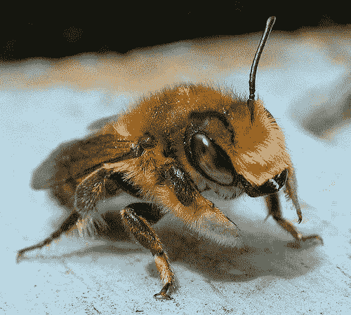

# Pytorch & C++ #5:用 C++服务 Torchvision 模型

> 原文：<https://medium.com/mlearning-ai/pytorch-c-5-serving-torchvision-models-in-c-a944156bc189?source=collection_archive---------2----------------------->


# 介绍

我试图在这个系列中提供 Pytorch c++ API 的例子/实践/项目。如果你是这个系列的新手，你可以在潜水前查看第一篇博客。在这个故事中，我们将使用 C++来服务 Alexnet，这是我们在之前的博客中使用的。为经过训练的深度学习模型服务也很重要，所以我认为这个博客会帮助你最终完成你的深度学习项目。所有代码都可以在[这个 Github repo](https://github.com/EmreOzkose/pytorch_cpp) 中找到。

# 内容

1.  以前的博客
2.  写入服务器
3.  编写客户端
4.  运行示例

# 以前的博客

[在之前的博客](/mlearning-ai/pytorch-c-4-using-torchvision-models-f12bd25f4744)中，我们在 Python 中用 Jit 格式导出了 Alexnet，并在 C++中用来推断一个蜜蜂形象。我们获得了一个程序，它采用一个图像路径，并根据 Imagenet 类预测这是什么。

# 计算机网络服务器

因为我们试图预测给定图像的类别，所以我们应该将图像数据从客户端发送到服务器。我使用[这个 repo](https://github.com/Dayof/opencv-socket) 作为发送和接收图像的模板。这是非常有用和基本的。首先，我们应该创建一个服务器对象

我们将创建一个服务器对象并等待图像。

```
auto server = SERVER();
auto img = server.receive_img(false);
```

函数 receive_img()获取一个原始图像，该图像在 Alexnet 转发之前应进行预处理。因此，我们将使用一个函数将接收到的图像转换为张量，并应用预处理。

之后，我们的输入被读取并提供给模型。

```
auto img_tensor = Mat2Tensor(img);
```

# 客户

现在，我们将把我们的客户机定义为类似于服务器结构。

现在，我们可以读取一个图像，并将其发送到服务器，如下所示

```
cv::Mat image = cv::imread(image_path);
cv::resize(image, image, cv::Size( IM_WIDTH , IM_HEIGHT ));client.send_image(image);
```

# 运行示例



Image source: [https://pytorch.org/tutorials/beginner/transfer_learning_tutorial.html](https://pytorch.org/tutorials/beginner/transfer_learning_tutorial.html)

在`server.cpp`中，我们应该定义我们的模型并等待接收图像。

```
Prediction: bee
```

# 结论

在这篇博客中，我们创建了服务器和客户端脚本，以使用我们导出的深度学习模型。所有代码都可以在[这个 Github Repo](https://github.com/EmreOzkose/pytorch_cpp) 中找到。

[](/mlearning-ai/mlearning-ai-submission-suggestions-b51e2b130bfb) [## Mlearning.ai 提交建议

### 如何成为 Mlearning.ai 上的作家

medium.com](/mlearning-ai/mlearning-ai-submission-suggestions-b51e2b130bfb)