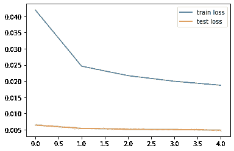
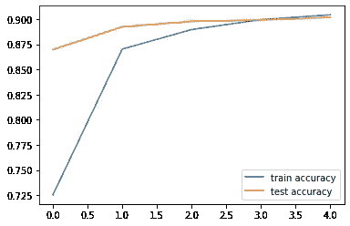
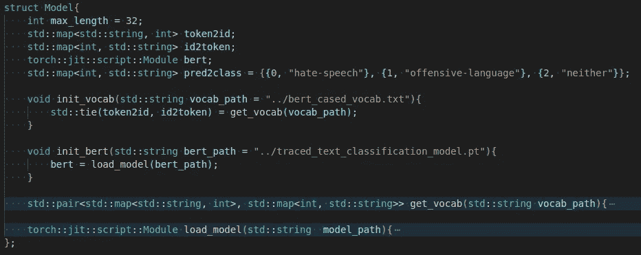

# py torch & c++ # 6:c++中的 Bert 文本分类

> 原文：<https://medium.com/mlearning-ai/pytorch-c-6-bert-text-classification-in-c-b5d94350f564?source=collection_archive---------1----------------------->

# 介绍

我试图在这个系列中提供 Pytorch c++ API 的例子/实践/项目。如果你是这个系列的新手，你可以在潜水前查看[的第一篇博客](/@yozkose3/pytorch-c-intro-b50571762162)。在这个故事中，我们将训练一个 Bert 模型来分类推文是否具有攻击性。所有代码都可以在[这个 Github repo](https://github.com/EmreOzkose/pytorch_cpp) 中找到。

# 内容

1.  用 Python 训练 Bert 模型
2.  C++中的推理

# 用 Python 训练 Bert 模型

我们将使用[仇恨言论检测数据集](https://github.com/t-davidson/hate-speech-and-offensive-language)。该数据集包含被标记为仇恨言论、攻击性语言或两者都不是的推文。

在将数据作为 pandas 数据帧读取后，我们应该创建数据加载器。

我们将使用预先训练的 Bert 和相应的标记器。

我们将用保存的`bert_cased_vocab.txt`创建一个 C++词汇表。在创建了数据库和模型之后，我们就可以开始训练了。

训练精度和损耗如下。

既然是教程，我觉得这些结果已经足够漂亮了。训练之后，我们应该导出我们的分类模型，以便在 c++中使用。

# C++中的推理

首先，我们将创建一个词汇表。为此，我们将读取`bert_cased_vocab.txt`并创建一个地图对象。

我们将把这个 vocab 存储在一个模型结构中。模型结构还包含加载模型函数和必要的变量。

现在，我们正在定义模型。

我们必须对给定的输入文本做一些预处理。

现在，我们已经准备好给模型输入这些信息了。

# 结论

在这篇博客中，我们训练了一个 Bert 模型来分类攻击性的推文，并在 c++中使用了这个训练好的模型。所有代码都可以在[这个 Github Repo](https://github.com/EmreOzkose/pytorch_cpp) 中找到。

 [## Mlearning.ai 提交建议

### 如何成为 Mlearning.ai 上的作家

medium.com](/mlearning-ai/mlearning-ai-submission-suggestions-b51e2b130bfb)