# Pytorch 适合初学者💫

> 原文：<https://medium.com/mlearning-ai/pytorch-for-beginners-d759cb85ff1a?source=collection_archive---------4----------------------->

## 第 2 部分:神经网络基础及其从头实现


本文将向您展示如何使用 Pytorch 从头开始创建一个简单的神经网络。如果您对如何在 Pytorch 中执行一些基本操作没有任何概念，我希望您查看本系列的第一部分。

[](/@akashjoshirm.aj/pytorch-for-beginners-62c3fcd75f69) [## Pytorch 适合初学者💫

### 第一部分:张量的基本运算

medium.com](/@akashjoshirm.aj/pytorch-for-beginners-62c3fcd75f69) 

在从头开始实现神经网络之前，你应该有关于自动升级的知识。

## 什么是汽车毕业生？

torch.autograd 是 PyTorch 的自动微分引擎，为神经网络训练提供动力

训练神经网络(NN)分两步进行:

正向传播:在正向传播中，神经网络对正确的输出做出最佳猜测。它通过每个函数运行输入数据来进行猜测。

反向传播:在反向传播中，神经网络根据其猜测的误差成比例地调整其参数。这是通过从输出向后遍历，收集误差 相对于函数(梯度)参数的 ***导数，并使用梯度下降优化参数来实现的。***

```
import torch
from torch.autograd import grad
import torch.nn.functional as F
```

创建两个分别值为 5 和 6 的张量。在创建张量时，我们将给出一个额外的参数 **requires_grad** 。该参数告诉 Pytorch 跟踪并创建变量的微分图。简单地说，如果你想进行微分，你必须在创建张量时传递这个参数。

```
a = torch.tensor([5.0] , requires_grad = True)
b = torch.tensor([6.0] , requires_grad = True)print(a , b)
```

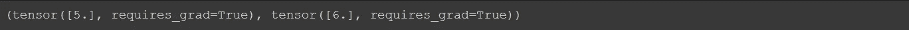

```
y = a**3 - b**2
y
```

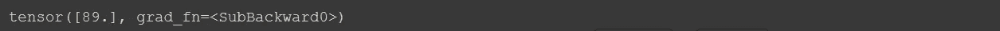

为了找出差别，你必须调用 **variable_name.grad** 方法。但是一开始，输出将是零。要计算微分，您必须调用 **variable_name.backward()** 方法。

```
print(a.grad) , print(b.grad)
```

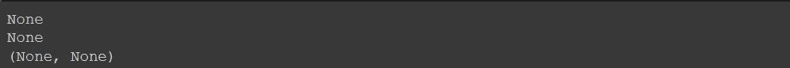

```
y.backward()
```

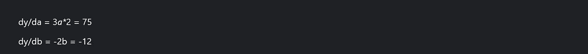

```
a.grad , b.grad
```

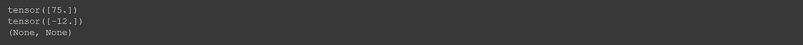

我们在这里使用了 **y.backward** ，因为我们想计算 y 相对于 a 和 b 的微分。

现在，您对 Auto-grad 已经很熟悉了，但为了让事情更清楚，我想再举一个例子:

```
x = torch.tensor([3\. ])
w = torch.tensor([2\. ] , requires_grad= True)
b= torch.tensor([1\. ] , requires_grad = True)
```

这里，我们创建了一个 **x** 张量，我们将把它作为输入。w 代表权重，b 代表偏差，我们希望跟踪 w 和 b，因为我们希望使用这两个变量来计算梯度。

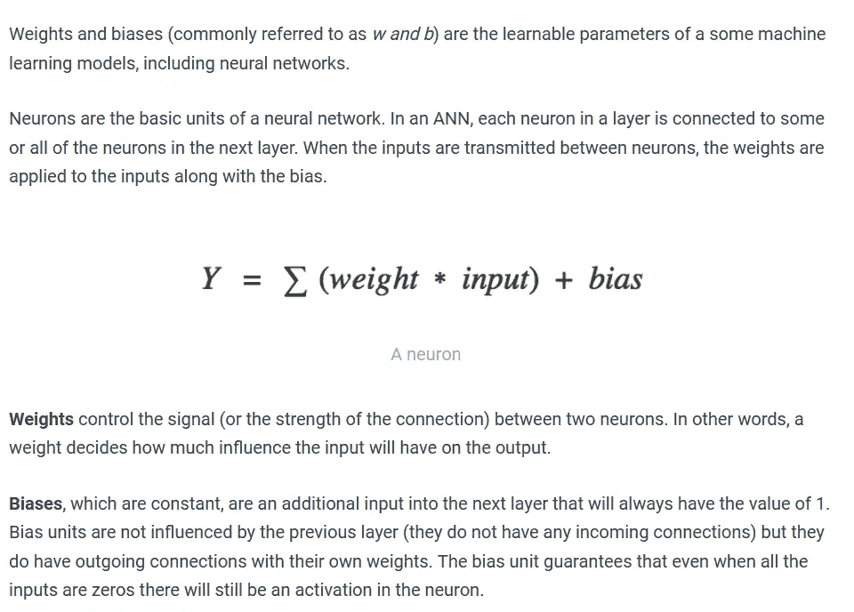

```
import torch.nn.functional as F
out = F.relu(w*x + b)
out
```

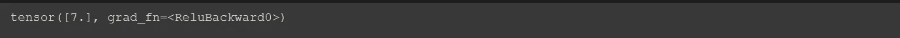

如果你不知道什么是热卢。不要担心，我们将来会看到什么是 relu，但现在，relu 代表**整流线性激活函数**或简称 **ReLU** 是一个分段线性函数，如果它是正的，它将直接输出输入，否则，它将输出零。

用简单的语言来说，如果值大于零，它将给出一个正值，如果值小于零，它将给出输出 0。

```
grad(out , w , retain_graph = True)
```

这也是计算梯度的一种方法。这仅仅意味着计算 out 相对于 w 的梯度。


```
grad(out , b )
```

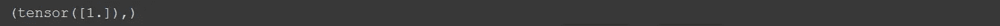

我希望现在汽车毕业生对你来说是清楚的，如果不感到自由在评论部分询问问题。


现在你已经准备好了！

让我们从头开始实现神经网络。我会试着向你解释所有这些概念，就好像你是一个完全的初学者，但是如果你已经知道这些概念，直接跳到编码部分。

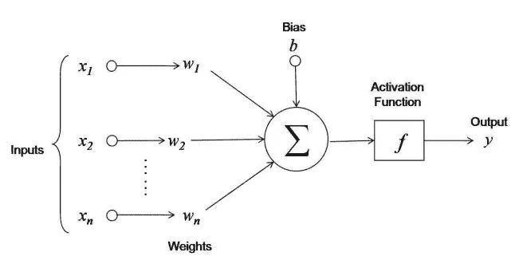

fig 1

图 1 显示了神经网络的单个神经元中实际发生的情况。这里我们有多个输入 x1，x2 …xn，则这些输入分别与被称为突触权重 w1、w2 … wn 的一些权重相关联。然后，这些值被传递给加法器函数(σ),所有这些值相乘，最后一项加上偏差。

因此，如果我们用向量表示所有这些操作，那么它将被写成(权重(转置)x 输入+偏差)

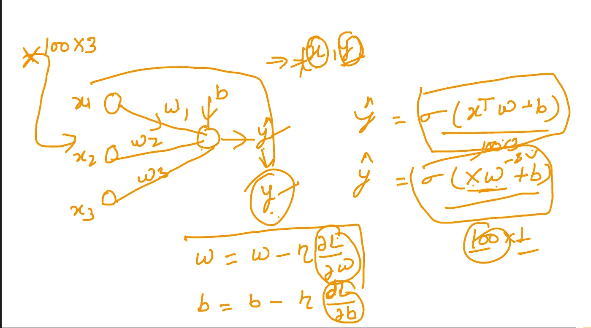

为了找到偏差和权重的值，我们将首先取一些随机值，然后在每次迭代中，我们将通过用(**学习速率** ) x ( **关于 w 和 b 的损失梯度**)减去当前偏差或权重来找到新值。然后这些值被传递给某个激活函数，然后我们得到输出。

我们将使用 torch.manual_seed 在每次运行中复制相同的输出

在这里，我们刚刚使用 sklearn.make_classification 方法在目标中创建了具有 1000 个样本、4 个特征和 2 个类的分类数据，并将 X 和 y 从简单数组转换为张量

看，现在我们将把数据分成训练和测试数据。您可以使用以下工具轻松执行此步骤:

*sk learn . model _ selection . train _ test _ train _ split():*

[](https://scikit-learn.org/stable/modules/generated/sklearn.model_selection.train_test_split.html) [## sk learn . model _ selection . train _ test _ split

### 使用 sk learn . model _ selection . train _ test _ split 的示例:scikit 的发布亮点-learn 0.23 发布亮点…

scikit-learn.org](https://scikit-learn.org/stable/modules/generated/sklearn.model_selection.train_test_split.html) 

但是我想当我们从零开始做每件事的时候，为什么不这样做呢？

现在，我们将把数据集中数值列的值更改为一个通用的标度，而不会扭曲值范围的差异，这就是通常所说的规范化

现在，您可以使用 sklearn 标准缩放器来缩放您的值，但我们将从头开始编写代码。

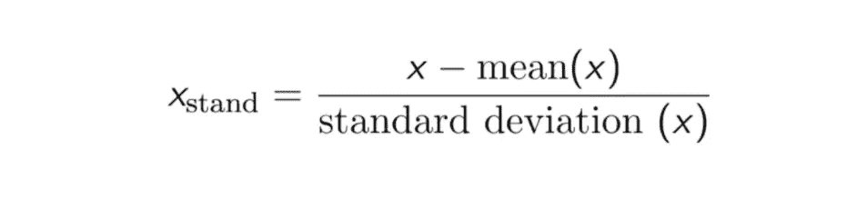

现在，我们将实现一个 NN 类，在该类中，我们将执行一个前向传递，其中我们将乘以输入和权重，然后我们将添加偏差(图 1)。我们从头开始实现所有的东西，但是对于向后传球，我们将会得到亲笔签名的帮助，因为从头实现自动升级可能会让我头疼，所以我们将简单地使用内置的自动升级🙂。

这里，我们创建了一个简单的类，在构造函数中，我们给出了一些输入作为参数，而不是用一些随机数初始化偏差和权重，我们用零初始化它们。

> 注意:损失函数是在类外定义的

为了计算损失，我们使用均方差。


如果你不知道什么是损失，那么损失只是一种计算预测和实际产量之间误差的方法。简而言之，我们必须降低这种损失的值，以获得更好的准确性，但不要担心神经网络(NN)会通过调整权重和偏差来自动为您完成这项工作。

现在是时候定义一个模型⌚了


冷静点。

我会试着一行一行地解释一切。在这里，我们定义了一个功能训练，它采用模型、X(输入)、Y(目标)、时期(时期是指我们希望向模型显示整个数据集的次数)、lr 是学习率，种子是手动种子，bsz 是批量大小(批量只是整个数据集的小块，这里 50 是指我们希望将整个数据集分成大小为 50 的小块)。

Look 1st for 循环针对的是 epochs (epochs 指的是我们希望向模型显示整个数据集的次数),在该循环下，对于不同的混洗索引，我们将整个数据集划分为多个批次，对于单个批次，我们执行正向传递并计算损失。然后我们计算偏差和权重的损失导数。我们需要这个推导来更新权重和偏差。

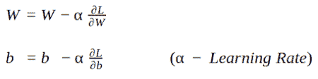

使用这个公式，我们可以更新权重和偏差。然后我们计算 yhat( Y 预测)并打印特定时期的当前损失。

让我们训练神经网络模型

让我们绘制图表

为了检查准确性

现在，如果你还记得，我告诉过你，在增加权重和偏差输入后，我们将输出发送到一些激活函数，但这里我没有实现任何函数。但这是另一篇文章的主题。但是现在，在这种情况下，激活功能是不需要的。

如果您有疑问或疑问，请提出来！

喜欢、分享和关注❤

[](/mlearning-ai/mlearning-ai-submission-suggestions-b51e2b130bfb) [## Mlearning.ai 提交建议

### 如何成为 Mlearning.ai 上的作家

medium.com](/mlearning-ai/mlearning-ai-submission-suggestions-b51e2b130bfb) 

🟠 [**成为作家**](/mlearning-ai/mlearning-ai-submission-suggestions-b51e2b130bfb)