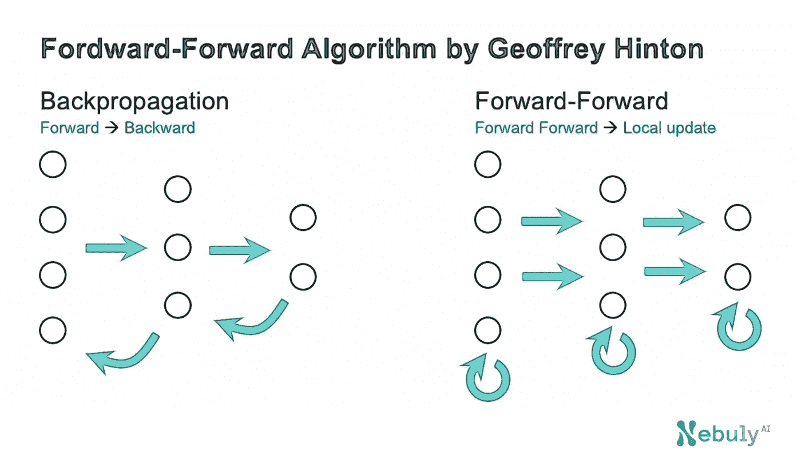
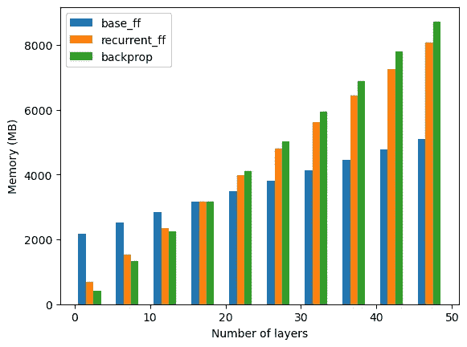

# Geoffrey Hinton 前向-前向算法的 PyTorch 实现及性能与反向传播的分析

> 原文：<https://medium.com/mlearning-ai/pytorch-implementation-of-forward-forward-algorithm-by-geoffrey-hinton-and-analysis-of-performance-7e4f1a26d70f?source=collection_archive---------0----------------------->

Image by Author

你是一个渴望测试 Hinton 的[向前向前算法](https://www.cs.toronto.edu/~hinton/FFA13.pdf)的人工智能研究人员吗？我也是，但是找不到任何完整的实现，所以我决定自己从头开始编码。好消息——您可以在这里访问 GitHub 上完整的 PyTorch 实现。如果你喜欢⭐项目，别忘了留下一颗星

[https://github . com/nebuly-ai/nebullvm/tree/main/apps/accelerate/forward _ forward](https://github.com/nebuly-ai/nebullvm/tree/main/apps/accelerate/forward_forward)

我一读这篇论文，就开始想知道 AI 如何受益于 Hinton 的 FF 算法(FF = Forward-Forward)。我对以下概念特别感兴趣:

*   本地培训。每一层都可以通过比较正流和负流的输出来训练。
*   无需存储激活。在反向传播过程中需要激活来计算梯度，但通常会导致严重的内存不足错误。
*   更快的权重层更新。一旦计算出一个层的输出，就可以立即更新权重，即不需要等待完整的向前(和部分向后)过程完成。
*   可选的良好度量标准。Hinton 的论文使用输出的平方和作为质量度量，但我预计在未来几个月内，科学文献中会出现替代的度量。

Hinton 的论文提出了两种不同的前向-前向算法，我称之为基本算法和递归算法。让我们检查这些算法的性能的 3 个关键方面，并与它们的替代方案反向传播进行比较。

Performance comparison of backprop, base, and recurrent Forward-Forward. Author’s image

# 1 —基本 FF 增加内存使用

第一个有趣的发现是，前向-前向算法的内存使用仍然会随着层数的增加而增加，但相对于反向传播算法而言会明显减少。这是因为前向-前向算法的内存使用量的增加只与网络参数的数量有关:每层包含 2000×2000 个参数，当使用 Adam 优化器对其进行训练时，大约占用 64 MB。n_layers=2 和 n_layers=47 之间的总内存使用差异约为 2.8 GB，相当于 64MB * 45 层。

# 2 —对于瘦型号，Base FF 的内存使用情况比 backprop 差

从图中我们看到，对于少数层，前向-前向算法比后向算法占用更多的内存(大约 2GB 对 400MB)。这可以通过考虑前向-前向算法的结构得到部分解释。对于 FF，我们需要按照可能的类的数量(在 MNIST 是 10)复制每个输入，这意味着有效的批量大小变成了原来的 10 倍。现在让我们来做一下数学计算:在评估网络时，我们以一个独特的批次(10，000 张图像)为模型提供整个验证集。考虑一个 2000 的隐藏维度，每个隐藏状态占用的内存是 80 MB(我们以 32 位精度运行模型)。这意味着有效的批量大小变为 100，000 个图像，推断过程中占用的内存约为 800MB。这种快速计算已经表明，与瘦模型的 backprop 相比，FF 使用了更高的内存，但它没有产生测试期间获得的 2 GB 以上的结果。需要进一步调查来解释 FF 的确切内存使用情况。

# 3 —递归 FF 没有很大的内存使用优势

与基本 FF 不同，递归 FF 与深度网络(15 层以上)的 backprop 相比没有明显的内存优势。这是故意的，因为递归网络必须在时间 t 保存每个中间步骤，以便在时间 t+1 计算随后的和先前的层输出。虽然在科学上是相关的，但循环 FF 在内存方面的性能明显不如基本 FF。

# 下一步是什么？

前向-前向算法实际上可以进一步优化，因为它不需要在训练时加载整个网络。事实上，前向-前向算法可用于单独训练网络的每一层，这意味着该算法的内存使用将只与被训练层的参数数量有关。

# 参考

*   [PyTorch 在 GitHub 上的实现](https://github.com/nebuly-ai/nebullvm/tree/main/apps/accelerate/forward_forward)
*   [前向-前向算法:一些初步研究](https://www.cs.toronto.edu/~hinton/FFA13.pdf)

# 推荐读物

*   [认识 ChatLLaMA:用有限的计算资源构建一个类似 ChatGPT 的助手](https://www.nebuly.com/blog/chatllama-0-0-2-release-notes)
*   [如何利用 NVIDIA 多进程服务(MPS)提高 Kubernetes 中的 GPU 利用率](https://www.nebuly.com/blog/how-to-increase-gpu-utilization-in-kubernetes-with-nvidia-mps)
*   [人类反馈强化学习(RLHF)——一个简化的解释](https://www.nebuly.com/blog/reinforcement-learning-from-human-feedback-rlhf-a-simplified-explanation)
*   [梅塔的美洲驼:打败巨人的小语种模型](https://www.nebuly.com/blog/metas-llama-a-small-language-model-beating-giants)
*   [PyTorch 实现 Geoffrey Hinton 的前向-前向算法](https://www.nebuly.com/blog/geoffrey-hinton-forward-forward)
*   [2023 年关于机器学习和人工智能的 10 大最佳时事通讯](https://www.nebuly.com/blog/top-10-newsletters-on-machine-learning-and-ai-in-2023)

 [## Mlearning.ai 提交建议

### 如何成为 Mlearning.ai 上的作家

medium.com](/mlearning-ai/mlearning-ai-submission-suggestions-b51e2b130bfb)