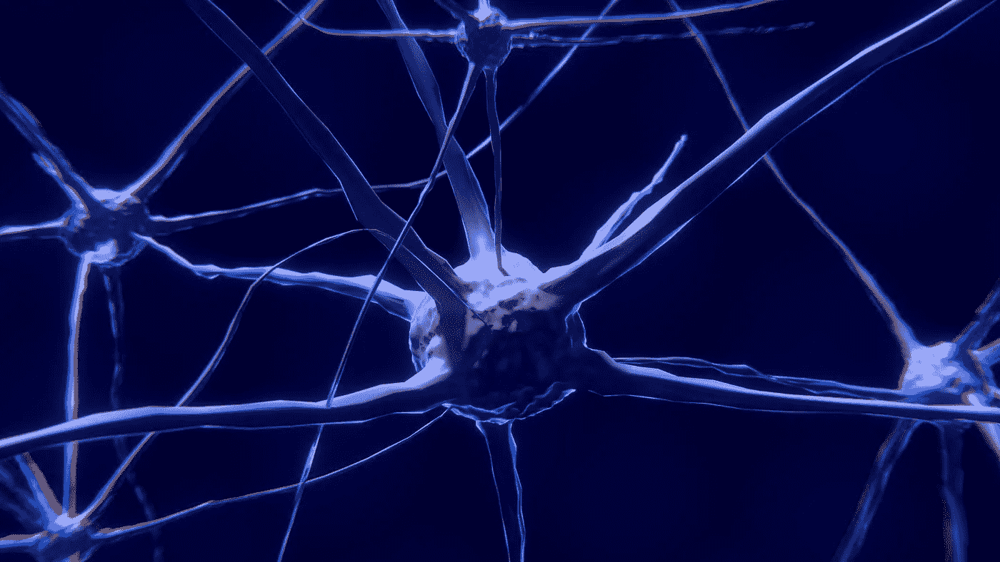
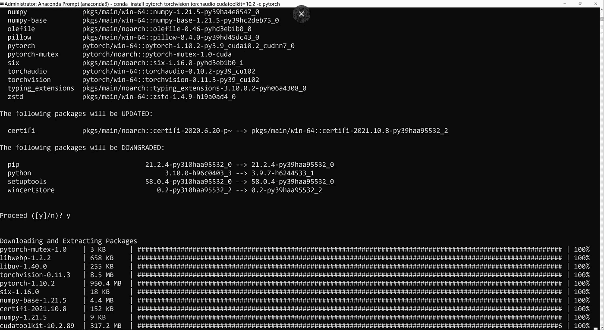

# PyTorch:概述和代码示例

> 原文：<https://medium.com/mlearning-ai/pytorch-overview-and-code-example-9d793c670a7f?source=collection_archive---------3----------------------->

PyTorch 是一个开源的深度学习库，由 Meta 的 AI 团队管理。PyTorch 是专门为 Python 构建的，如果您是开发 AI 项目的新手，这是一个简单的入门方式。

本文将向您很好地介绍它是如何工作的，并为您提供一个简单的例子，说明如何构建一个神经网络来帮助您前进。最后，如果你想了解 PyTorch 以及如何开发自己的 AI 项目，我为你提供一些资源。我们开始吧！

Artificial Neural Networks (ANNs) Attempt to Mimic the Human Brain (Image by [Colin Behrens](https://pixabay.com/users/colin00b-346653/?utm_source=link-attribution&utm_medium=referral&utm_campaign=image&utm_content=2213009) from [Pixabay](https://pixabay.com/?utm_source=link-attribution&utm_medium=referral&utm_campaign=image&utm_content=2213009))

# 什么是神经网络？

神经网络是一种受大脑工作方式启发的计算机系统。神经网络由一系列可以学习识别输入数据模式的算法组成。例如，您可以使用神经网络来识别手写数字。这个过程的第一步是在已知手写数字的数据集上训练神经网络。一旦神经网络被训练，你可以给它一个未知的手写数字，它会试图识别这个数字。

神经网络是人工智能最新进展的核心，包括自动驾驶汽车、面部识别、推荐引擎、聊天机器人、机器翻译等等。

# PyTorch 是什么？

您可以使用 PyTorch 来开发和训练神经网络。PyTorch 是用于训练神经网络的最流行的库之一，因为它易于使用并提供良好的结果。

PyTorch 基于 Torch 库，它最初是在 Lua 中开发的。然而，Python 版本已经完全重写，PyTorch 开发人员添加了许多特性和改进。此外，PyTorch 还与 Python 生态系统顺利集成，包括 NumPy 和 SciPy 等流行库。

# 开始开发 PyTorch 项目需要什么？

在开始之前，您需要一些东西:

*   Python 编程经验
*   安装在您电脑上的 PyTorch 最新版本
*   文本编辑器(Visual Studio 代码是一个不错的选择，而且是免费的)

# PyTorch 是如何工作的？

PyTorch 使用一种称为自动微分的技术来自动计算复杂神经网络的梯度。这意味着 PyTorch 可以通过时间和空间有效地反向传播，使其适合于递归神经网络和生成模型等应用。

# PyTorch 有哪些特点？

PyTorch 的一些关键特性包括:

*   对可用性和灵活性的强烈关注使得深度学习很容易开始
*   支持许多不同类型的神经网络，包括卷积、全连接和递归网络
*   用于数据处理、可视化和模型开发的丰富工具和库
*   一个活跃的开发人员社区，他们不断增加新的特性和改进

# 如何安装 PyTorch？

安装 PyTorch 的最快方法之一是使用类似于 [Anaconda](https://www.anaconda.com/) 的包管理器。一旦你安装了 Anaconda，你就可以直接去 www.pytorch.org 的[获取安装最新 PyTorch 版本所需的最新 conda 命令。如果你需要如何在 Windows 机器上安装 PyTorch 的教程，你可以在这里查看步骤(](http://www.pytorch.org)[如何配置你的 PC 进行 AI 编程](https://www.leaky.ai/configure-pc-for-ai-20-minutes))。

Installing PyTorch on a Windows Machine

# 我如何在 PyTorch 中建立一个神经网络？

使用 nn 模块在 PyTorch 中构建神经网络很容易。该模块为构建神经网络提供了一个高级 API。要在 PyTorch 中构建一个简单的全连接神经网络，您需要导入以下包:

Import PyTorch and the nn library

然后，您可以使用顺序方法定义您的模型，如下所示:

Create a simple neural network with input_size number of inputs and output_size number of outputs

最后，您可以使用 PyTorch 优化器和损失函数训练您的模型:

Train your neural network a 100 times

就是这样！现在，您已经在 PyTorch 中构建了一个简单的神经网络并对其进行了训练！

# 我如何了解更多信息？

有很多方法可以学习如何开始开发现实世界的人工智能项目。您可以找到许多在线课程、书籍和其他资源。但是最好的学习方法之一就是实践。这就是漏洞的来源。首先，我们建议您:

*   阅读关于人工智能的文章:阅读关于人工智能和机器学习的文章是一个很好的起点。你可以在网上找到很多文章和博客帖子。你也可以试试我们的 LeakyAI 博客来了解一些最新的趋势。
*   用人工智能做实验:学习人工智能的另一个好方法是自己做实验。有许多开源工具和框架可供你用来构建自己的人工智能系统，其中当然包括 [PyTorch](https://pytorch.org/) 以及 Google 的 [Tensorflow](https://www.tensorflow.org/) 。
*   **免费的人工智能编码教程**:你可以尝试几个免费的 Python 编码教程，包括[如何建立你的第一个神经网络](https://www.leaky.ai/buildyourfirstneuralnetwork)，你可以在 15 分钟内从零开始学习建立一个神经网络，或者进一步尝试[使用神经网络预测销售](https://www.leaky.ai/projectlemonade)，你可以建立一个可以预测柠檬水销售的神经网络！
*   参加在线课程:如果你想更进一步，自学在线课程是一个不错的选择。有许多在线课程可以教你关于人工智能的知识，包括来自 Udemy、SimplyLearn 和许多其他网站的课程。然而， [LeakyAI](http://www.leaky.ai/) 提供了一个独特的[动手人工智能编程课程](https://www.leaky.ai/introduction-to-ai-programming-with-pytorch-course-beginner)，它从头开始构建，专注于编码，而不是理论，使你能够快速学习，并精通开发人工智能项目。

# 结论

PyTorch 是一个强大的开源深度学习库，可以轻松开发 AI 项目。在本文中，您学习了如何安装 PyTorch 并构建一个简单的神经网络。你也可以通过在线阅读文章和教程或参加在线课程来了解更多信息。

 [## Mlearning.ai 提交建议

### 如何成为 Mlearning.ai 上的作家

medium.com](/mlearning-ai/mlearning-ai-submission-suggestions-b51e2b130bfb)