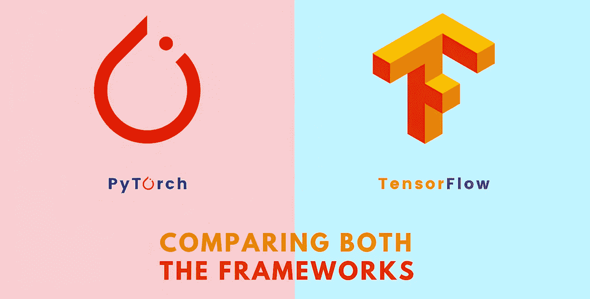

# 2022 年 PyTorch VS TensorFlow

> 原文：<https://medium.com/mlearning-ai/pytorch-vs-tensorflow-in-2022-9a7106b1f606?source=collection_archive---------0----------------------->

## 利弊以及哪个框架最适合您

Adapted from [ProjectPro](https://www.projectpro.io/article/pytorch-vs-tensorflow-2021-a-head-to-head-comparison/416)

> 机器和深度学习领域正在快速发展，其中一个原因是该领域所基于的框架。今天我想比较一下两个最常用的框架在 **2022** 中是如何相互比较的。