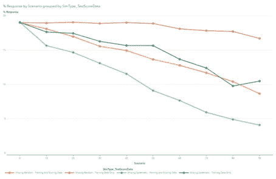
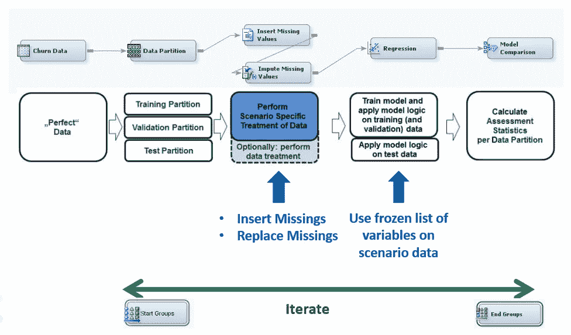
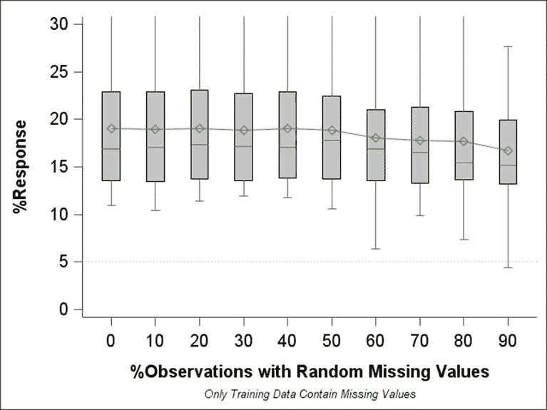
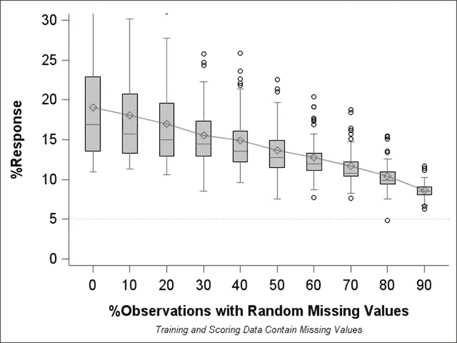
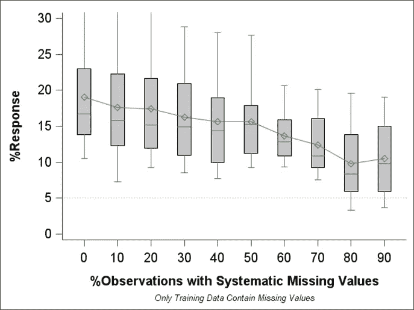
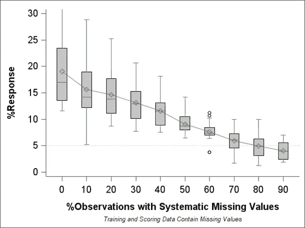

# 量化监督机器学习模型中缺失值对模型精度的影响

> 原文：<https://medium.com/mlearning-ai/quantifying-the-effect-of-missing-values-on-model-accuracy-in-supervised-machine-learning-models-8d47d7eca921?source=collection_archive---------2----------------------->

# 问题描述

许多监督机器学习技术，如回归方法或神经网络方法，不能使用具有缺失值的观察值。决策树可以处理输入数据中的缺失值，因为它们将这些值视为数据中的一个单独类别，并将它们分配给其中一个分支。

分析师面临的挑战是决定是否**跳过某个记录**进行分析，或者是否用替换值来估算缺失值。然而，在这里，分析师必须决定**给定变量的缺失值的百分比仍然可以估算**。输入 10%缺失值的变量不被视为问题。但是对于丢失 30%、50%或更多值的情况呢？

**已经进行了模拟研究**，以提供见解并给出估算的缺失值的不同比例如何影响模型质量的粗略指导。模拟研究还显示随机或系统缺失值之间是否存在差异，以及是否只有训练数据或训练和评分数据都包含缺失值。

# 结果摘要

*   **训练数据中随机缺失的**值只有有限的影响(红线)
*   同样出现在评分数据中的**缺失值具有更大的影响(橙色对红色，浅绿色对绿色)**
*   **系统缺失**值的影响更大(绿线)

## 外卖食品

不要只讨论数据中“缺失值的可接受百分比”。
讨论他们缺失的“原因”,以及这是否也会出现在评分中。

# 主要模拟场景

## 随机和系统缺失值

区分随机缺失值和系统缺失值非常重要。假设随机缺失值以相同的概率出现在每个分析对象中，而不考虑其他变量。对于每个分析对象，系统缺失值不会以相同的概率出现。

对于模拟，为简单起见，通过定义 10 个相同大小的分析对象集群，在数据中创建了系统缺失值。具体到相应模拟场景的定义，这些群集中的一个或多个群中的所有观测值的变量被设置为缺失。

## 评分数据分区中缺少值

为评估输入变量中缺失值的影响而执行的模拟必须根据用于评估模型质量的数据分区是否也插入了缺失值来区分。

对以下两种情况进行了模拟:

1.  **评分数据中没有插入缺失值。**

*   这个场景反映了模型应用中的完美世界，这意味着数据质量问题只发生在模型训练中。在模型的应用中，没有出现数据质量问题。
*   这种情况经常发生在以下情况:模型是基于从当前系统的不同操作或分析系统中提取的历史数据构建的，或者数据是从数据质量测量尚未到位的时间段中提取的。

2.**将缺失值插入训练数据和评分数据。**

*   这种情况指的是数据质量问题(如缺失值)不仅发生在模型训练阶段，还发生在模型应用期间。
*   这种情况反映了数据质量问题不能(还)被修复并且存在于训练和评分数据中的情况。
*   评分数据中缺失的值将被插补逻辑替换，插补逻辑已在模型训练阶段使用插补节点进行了定义。相应的插补逻辑是 SAS Enterprise Miner 分数代码的一部分。

# 模拟程序

## 预处理

对于模拟，使用了具有二元目标变量的监督机器学习任务。这些数据来自不同行业的四个真实数据集。

为了有一个用于模拟的“完美的”起始数据集，数据已经以下列方式进行了预处理。这导致了没有缺失值的训练数据集。

*   如果一个变量有超过 5 %的缺失值→该变量被删除
*   剩余变量的缺失值的观测值(≤ 5%的缺失值)将从分析中移除。

运行多个建模周期以检索具有良好预测能力的稳定模型。该变量的变量列表被冻结，以便在模拟中使用。

## 运行模拟

下图显示了模拟及其评估的程序。数据被分成训练和验证数据。测试分区被用作“评分数据”,以反映模型训练中未使用的数据集。这允许评估模型评分中缺失值的影响。

数据(仅训练数据、训练和评分数据)中引入了不同类型的缺失值(随机、系统)。在模拟运行中，缺失值的数量以 10%的步长增加(0%、10%、20%、… 90%)。

树代理插补(在 SAS Enterprise Miner 的插补节点中实现，在本文末尾找到更多详细信息)用于插补缺失值。

最后，基于该数据训练具有冻结变量集的回归模型，并评估结果。

**模拟场景中模型的可能偏差**

注意，在不同的模拟场景中为预测模型提供一组预定义的最佳变量会产生对过于乐观的模型性能的偏向。该模型不需要找到预测变量的最佳集合。对于存在数据质量问题的数据，例如观测值不足、大量缺失值、输入数据中的偏差以及最佳预测变量的选择可能不会产生最佳数据集。

数据质量会影响最佳输入的选择。因此，模拟场景受到这种先验变量选择的影响(并且因此受到先验知识的影响)。尽管如此，我们还是决定提供一组预定义的变量，以便进行比较，并消除变量选择差异可能导致的情景结果偏差。

# 模拟结果

各种情景的结果验证基于事件概率最高的 5%病例中的%响应。正确预测的事件案例占该组中所有案例的百分比用于比较场景之间的模型准确性。

## 仅在训练数据中随机缺失值

Box plot for %Response for different percentages of random missing values in the
training data

第一个模拟场景显示了训练数据中随机缺失值的影响。然而，在这里，得分数据不受缺失值的影响。如导言中已经提到的，这反映了数据已经具有良好质量的情况(例如，由于系统变化或先前的数据质量努力)；但是，需要用于模型开发(模型训练)的历史数据仍然包含无法追溯修复的缺失值。

从箱线图可以看出，随着缺失值百分比的增加，模型质量几乎没有下降。然而，这非常清楚地表明，真正的随机缺失值确实会在训练数据中产生一些噪声。然而，基于这些数据训练的模型逻辑仍然非常接近最佳模型。如果将应用模型的数据不包含缺失值，预测仍然会相当准确。

Patrick Hall 等人在他们的论文“SAS Enterprise Miner 的机器学习概述”中描述了去噪自动编码器的应用。他们还说明，向训练数据添加一些随机噪声可能会“加强”自动编码器，使其能够更好地处理新的和看不见的数据。在训练数据有偏差但只是随机偏差的情况下，可能会出现类似的情况。

## 训练和评分数据中的随机缺失值

Box plot for %Response for different percentages of random missing values in the training and scoring data

此处显示了评分数据(模型将在生产中应用于该数据)有缺失值的情况。可以看出画面变化很大。

虽然仅在 30%缺失值的情况下，训练数据中的模型质量几乎没有下降，但是当训练和评分数据都包含缺失值时，响应百分比已经从 19.0 大幅下降到 15.6。在相对数中，与没有缺失值的情况相比，模型质量下降到 81.9%。

## 仅在训练数据中系统缺失值

Box plot for %Response for different percentages of systematic missing values in
the training data

本节中的第一个模拟场景显示了只出现在定型数据中的系统缺失值的影响。如前所述，这反映了数据已经具有良好质量的情况(例如，由于系统变化或先前的数据质量努力)；但是，需要用于模型开发(模型训练)的历史数据仍然包含无法追溯修复的缺失值。

这里的箱线图表明，与随机缺失值的情况不同(见上文)，系统缺失值会影响模型质量，即使它们只出现在训练数据中。

随机缺失值会给数据带来模糊性，这仍可通过缺失值插补有效处理，而系统性缺失值会给数据带来无法通过缺失值插补替代的影响，因为这些方法依赖于值随机缺失的事实。

## 训练和评分数据中的系统性缺失值

当系统误差也出现在评分数据中时，情况会发生很大变化。与前一种情况不同，在前一种情况下，只有模型逻辑受到缺失值的影响，在这里，评分数据也包含缺失值。

该箱线图显示，随着缺失值百分比的增加，模型质量大幅下降。还可以看到，在缺失值为 70%和更多的情况下，响应率%甚至低于 5%(虚线)。5%线表示训练数据中的基线事件率，应该通过随机模型来实现。该范围内的系统缺失值对模型的影响如此之大，以至于它的预测甚至不如随机模型。

由于只有 10%的缺失值，响应率%下降到 15.6%，这意味着完美世界模型的预测能力几乎损失了 18%

# 结果讨论和多元量化

不同缺失值百分比的四条线的宽广范围说明了清楚地区分不同类型的缺失值是多么重要。

在分析中，缺失值的话题经常作为一个单一的主题来讨论。然而，这里的表格和图表中的数字，尤其是折线图，从视觉上清楚地表明，将所有缺失值视为相同是错误的。

在每次关于预测分析中缺失值的讨论中，您都应该记住

*   缺失值仅出现在训练数据中，还是在应用模型时也会出现在评分数据中
*   缺失值本质上是随机的或系统的

充分解决缺失值的问题非常重要，因为否则，缺失值的影响可能会被高估或低估。

第一点可能比第二点更容易限定。在许多情况下，分析师提前知道丢失值方面的不良数据质量是否只影响(历史)训练数据。

有时很难确定缺失值是随机出现的还是系统出现的。这里，需要执行业务专业知识以及对缺失值概况和缺失值指示与其他变量的相关性的更详细分析，以获得更多的洞察力。

## 多元量化

为了量化以下三个潜在影响因素对通过%响应测量的模型质量的影响，对这些数据运行了线性模型**响应= f(%缺失，系统 MV，评分 MV)**:

*   缺失值的百分比
*   二进制类别“随机或系统”缺失值
*   二进制类别“仅在训练数据中缺少值，或者在训练和评分数据中都缺少值”

每个变量的系数结果如下:

*   **截距:19.29** →这表示只有训练数据有偏差时，0%缺失值的估计值。
*   **缺失值百分比:-0.0996**→%缺失值每增加一个百分点，响应平均减少 0.1 个百分点。
*   **评分数据:-4.23**→%如果训练数据和评分数据都有偏差，响应平均下降-4.23 个百分点。
*   **Random systematic = Random:3.6**→%如果缺失值随机出现，响应率平均高出 3.6 个百分点。

# 计算业务案例

## 介绍

一个虚构的参考公司用于根据不同模拟场景的结果计算业务案例。模型质量的变化被转换为响应率，相应的利润以美元表示。

这样做是为了从业务角度说明不同数据质量变化的影响。需要注意的是，以美元表示的数字仅应被视为基于模拟情景假设和此处所述商业案例的粗略指标。在个别情况下，这些价值和关系有些不同。

## 参考公司质量数据通信

以下章节中的参考公司 Quality DataCom 在通信行业开展业务。该公司拥有 200 万客户，并开展活动来促进其产品和服务的交叉销售和追加销售。在一个典型的活动中，通常会联系大约 100，000 个响应概率最高的客户(客户群的 5%)。客户对报价(接受报价或产品升级报价)的平均反应代表 25 美元的利润。

假设您使用的分析模型正确预测了前 5%客户群中 19%的肯定回答。这里的“响应”是指营销活动联系人导致产品购买或升级。此次活动总共吸引了 19，000 名响应客户，创造了 475，000 美元的利润(19，000 x 25 美元)。

## 结果

对于参考公司，对缺失价值情景的分析揭示了以下内容:

*   缺失值从 50%减少到 30%意味着 47，500 美元的额外利润(每一个百分点 2，375 美元)。
*   缺失值从 30%减少到 10%提供了 62，500 美元的额外利润。这相当于每一个百分点 3 125 美元。
*   这些数字表明，对于参考公司来说，缺失值减少 10 个百分点相当于每项活动增加 20，000 到 30，000 美元的利润。

# 摘要

*   训练数据中随机缺失的值的影响有限
*   同样出现在评分数据中的**缺失值具有更大的影响**
*   **系统性缺失**值的影响要大得多

> 不仅仅讨论你的数据中“缺失值的可接受百分比”，用于监督机器学习。
> 讨论它们缺失的原因，以及它们缺失的事实是否也会出现在评分中。

# 网络研讨会演示

# 链接

上文显示了两个相关分析网络研讨会的链接。我的 [**数据科学的数据准备**](https://www.youtube.com/playlist?list=PLdMxv2SumIKsqedLBq0t_a2_6d7jZ6Akq) 网络研讨会包含更多关于该主题的内容。

中等文章:

*   [您的数据为数据科学做好准备了吗？—从一个帆船比赛分析例子引出这个话题](https://gerhard-svolba.medium.com/is-your-data-ready-for-data-science-motivating-this-topic-from-a-sail-race-analysis-example-7dde97a68e4d)
*   (坏)数据质量对监督机器学习中模型准确性的影响——模拟研究的结果(正在准备中，将于 2 月 24 日发表)

SAS 社区文章:[使用 SAS Enterprise Miner 进行预测建模模拟研究](https://communities.sas.com/t5/SAS-Communities-Library/Using-SAS-Enterprise-Miner-for-Predictive-Modeling-Simulation/ta-p/641560)

我的[幻灯片收藏](https://github.com/gerhard1050/DataScience-Presentations-By-Gerhard)中的第 102 号演示文稿包含更多关于这个主题的视觉效果。

我的 SAS 出版社书籍“[使用 SAS](https://github.com/gerhard1050/Data-Quality-for-Data-Science-Using-SAS#readme) 进行分析的数据质量”中的第 16 章和第 18 章更详细地讨论了这些主题。

# 附录:树替代插补

使用树替代方法，通过将每个输入作为决策树中的目标进行分析来估计替换值，并将剩余的输入和被拒绝的变量用作预测器。此外，还会创建代理拆分规则。代理规则是主分割规则的备份。当主分割规则依赖于缺少值的输入时，将调用下一个代理。如果缺失值阻止主规则和所有代理应用于观察，则主规则将观察分配给被分配接收缺失值的分支。

 [## Mlearning.ai 提交建议

### 如何成为 Mlearning.ai 上的作家

medium.com](/mlearning-ai/mlearning-ai-submission-suggestions-b51e2b130bfb)