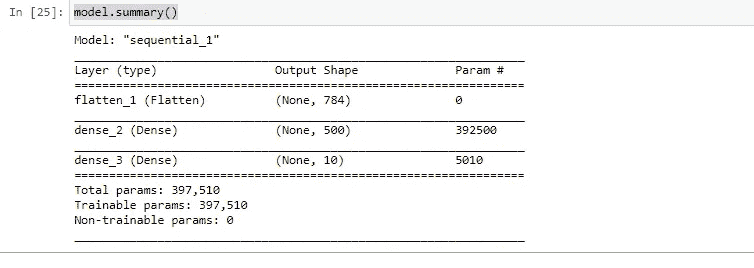
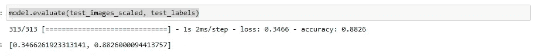
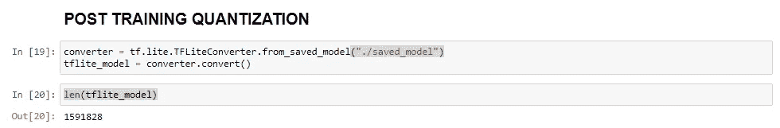
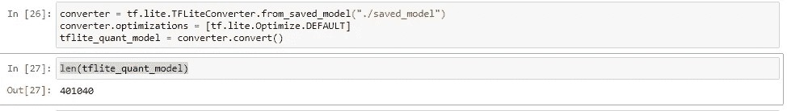
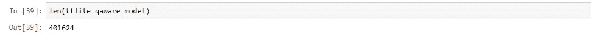
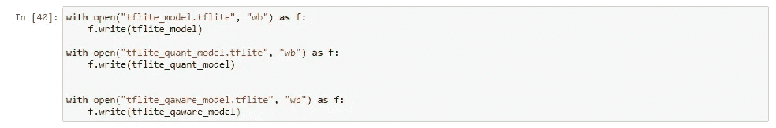
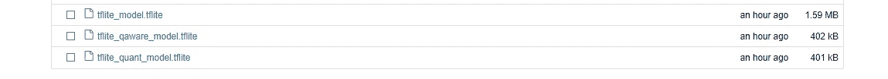

# 量化——ML 模型在边缘设备中的应用。

> 原文：<https://medium.com/mlearning-ai/quantization-the-way-of-using-ml-model-in-edge-devices-bdf74e48b4aa?source=collection_archive---------1----------------------->

在数据科学界，有很多关于使用 Spark、Hadoop 等大数据工具来扩展机器学习模型的讨论。与此同时，在数据科学中还有另一个与他们相反的有趣领域，即创建一个适用于边缘设备的轻量级机器学习模型。

微控制器、可穿戴设备(fit band、智能手表等)等设备过去的内存非常少，大多以 MB 为单位。它们通常被称为边缘设备。**量化**是一个减少模型大小的过程，这样就可以在边缘设备上运行。在这篇文章中，我们将看到量化是如何在高层次上工作的，以及相应的 python 代码。

**量子化:**

量化是一个通用术语，它涵盖了将大量输入值转换为较小集合中的输出值的许多不同技术。通常它会用其他类型的参数和输入替换 float32，如 float16，INT32，INT16，INT8，INT4，INT1 等。最常见的选择是 INT8。

有各种用于量化转换的技术，如比例量化、仿射量化等。网上有这方面的研究论文可供参考。因为我们更关注 python 实现，所以让我们看看下面的细节。

**有两种方法来执行量化。**

1.  **训练后量化(TF 模型→Tf.lite 转换→应用量化)**
2.  **量化感知训练(TF 模型→应用量化模型→再次训练并微调→Tf.lite.convert)**

如上所述，两种方法的区别在于何时应用量化技术。如果在最后一个阶段应用量化过程，我们习惯称之为**后训练量化**。如果我们在模型训练后立即应用量化，并再次微调量化模型，则称为**量化感知训练**。

我们采用现有的简单神经网络模型进行分析。各型号详情如下。

Model Summary

Model performance before conversion

**岗位培训量化:**

对于训练后量化，我们首先将模型转换为 tf-lite 模型。

Converting Model to tflite model

量化技术将应用于 tf-lite 模型，如下所示。

**量化感知训练:**

在量化感知训练中，首先将量化方法直接应用于模型。然后，相同的模型将被编译，并用少量的历元进行训练。

tensorflow_model_optimization 是单独的 tf lib，我们需要使用 PIP 命令安装它。下面给出了使用 tf lib 将神经网络模型转换成量化模型。

根据上面的截图，模型的性能也没有受到这种转换的太大影响。

第二步是将 quant 模型转换为 tf-lite 模型，下面给出了相应的 python 代码细节。

**观察:**

可以使用以下 python 代码将模型保存到本地机器。

下面给出了常规模型、训练后量化方法和量化感知训练方法之间的大小比较。

在这两种情况下，模型的大小几乎减少到四分之一。然而，为了良好的准确性，量化感知训练优于训练后量化方法。同时，岗位培训量化也是一个不可忽视的容易实现的途径。