# 量子数据及其嵌入#1

> 原文：<https://medium.com/mlearning-ai/quantum-data-and-its-embeddings-1-3b022b2f1245?source=collection_archive---------1----------------------->

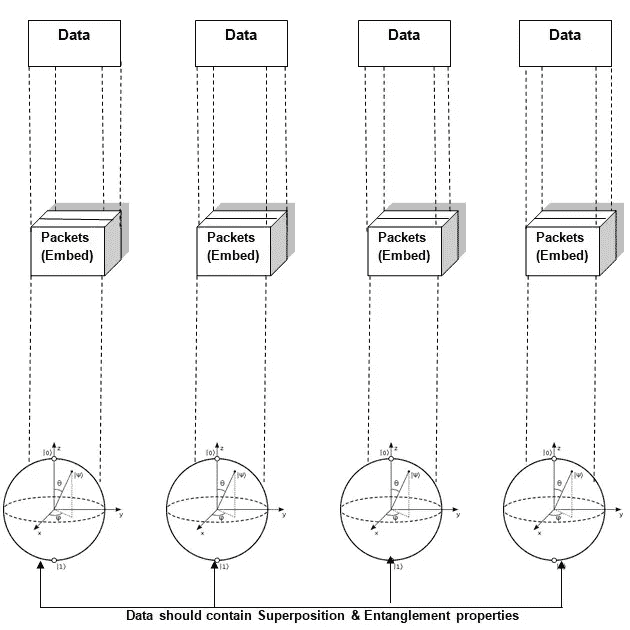

理解量子计算中的数据嵌入概念

本文深入浅出地描述了数据嵌入的基本原理，因此，它可能对量子算法和量子机器学习算法有用。用户应该熟悉[量子计算概念](/analytics-vidhya/quantum-computing-concepts-of-quantum-programming-b0318cc37cc4)。

正如我们所知，8085 是一个 8 位微处理器，并以 8 位的形式存储数据，以类似的方式，我们将数据嵌入量子位(量子位)进行量子计算，以便新的计算模型(QC)有效地执行我们的程序。

## 经典计算数据

位是在经典计算(二进制数字系统)中存储和处理的信息单位。

经典计算机使用二进制或 2 位系统。2 位是 1 和 0。2 位系统被认为是处理或计算来自用户的数据和指令或程序的计算机，并使用 0 和 1 来执行。经典计算机是我们今天使用的计算机。今天的传统计算机是智能手机、笔记本电脑、台式机和服务器。

## 量子计算数据

量子计算机引入 3 位或基数为 3 的系统。量子计算机是由量子物理定律组成的。量子计算机使用二进制位(0 和 1)以及该位同时为 0 和 1 的选项(叠加)，这创建了第三种状态。最终 3 种状态是 0，1 和 0-1。

量子比特是量子信息的基本单位，可以同时处于 0 和 1 的状态。第三种状态产生更多的处理能力。状态在下面描述的 3 位系统中是如何处理的。

## 量子计算机中的状态处理

如你所知，在量子计算中，如果有 n 个量子位，你就会有

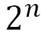

基本状态。这样，量子计算在一个时间内处理所有的基态。例如，如果 2 个量子位呈现其基础状态是 00、01、10 和 11，并且使用其振幅或概率处理所有这些状态如下。

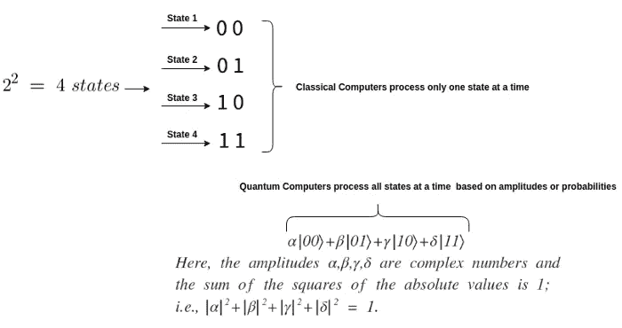

## 经典和量子系统中的数据表示

下图描述了如何将经典数据嵌入到单个量子位中。

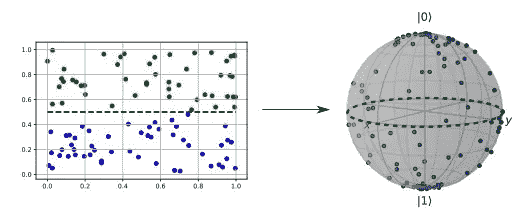

**Classical Data and Quantum Data representation**

因为布洛赫球被认为是代表一个量子位中的数据。布洛赫球是纯单量子位状态的几何表示，作为单位球上的一个点。

**量子计算机中的数据加载**

量子计算机不能应用于经典数据，为了获得它的能力，我们必须提供量子化的数据。有许多模式或编码或嵌入技术可以将经典数据载入量子计算机。

## 编码

在量子计算中，直接处理经典数据是不可能的，也是低效的。量子计算机必须与数据兼容，数据必须以量子法则的形式存在，比如叠加和纠缠。一些量子实验产生了遵循量子定律的数据，这些数据带有比特噪声，我们必须使用嵌入技术来净化这些数据，并以期望的格式提供给量子算法来进一步处理。

将数据加载到量子计算机中并不简单。要加载数据，必须用量子位(Qubits)进行编码。将经典数据点映射到 **n 量子位**量子态。

下图显示了编码概述及其在电路设计中的表现。

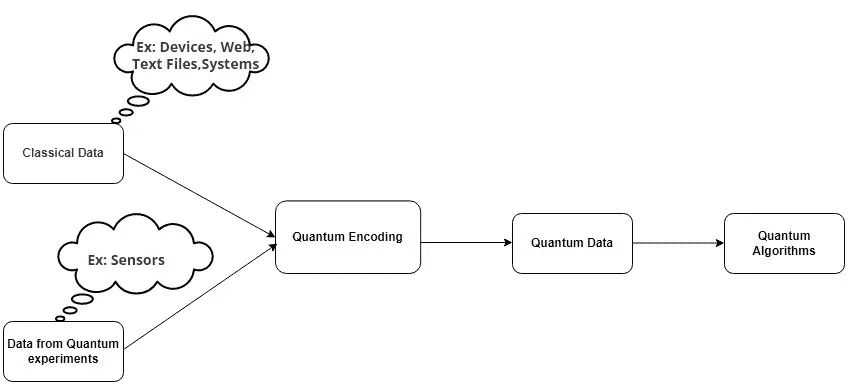

**Quantum Encoding and feeding process.**

## 处理

处理是量子嵌入式输入被处理的步骤。对任何量子算法(或量子人工智能算法)来说，它都是量子电路的形式，它可以是变分电路或量子程序。

## 测量或预测

这是预期结果出现的一步。最终，测量量子位并获得标量形式的结果。这一步成为任何量子算法的预测。

## 数据加载的定义

数据加载是将经典数据点映射到 **n 量子比特量子态**的功能。

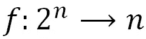

例如，如果有 8 个基态，并将其转换为 3 个量子比特的量子态。这个加载过程可以由量子电路处理(从机器学习的角度来看，它是量子神经网络(QNN))。

量子计算机自然地将数据映射到希尔伯特空间。执行嵌入的映射被称为量子特征映射。

## 量子嵌入是做什么的？

量子嵌入是将经典数据点**‘x’**表示为由特征图促进的量子状态。

## 量子特征图

将数据编码成量子态是一个特征图。特征映射通过特征映射将数据转换到一个新的空间，在这个空间中数据是线性的。线性代数中，新的空间叫做**希尔伯特空间**。

更正式地说，它被定义为将输入数据映射到特征空间的函数。

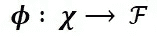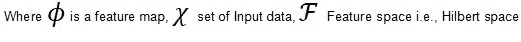

单个数据点上的映射输出被称为**特征向量**。即，

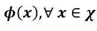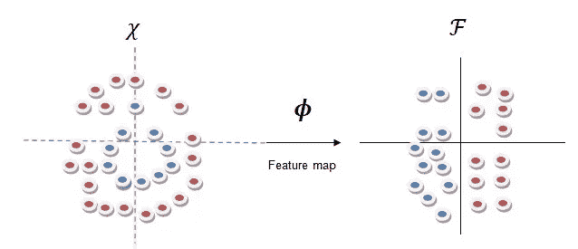

**Feature map can transform data into Hilbert space where it can be easily to separable**

在输出中，即，希尔伯特空间是向量空间，特征向量是**“量子态”**。这种映射可以通过酉变换的方式进行变换，即，

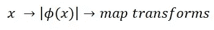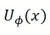

编码机制涉及线性代数中的分解方法。它包括位矩阵分解、酉变换、希尔伯特空间、内积等。,

## 希尔伯特空间中的数据是如何编码的？

我们知道特征空间是希尔伯特空间，需要看看数据是如何以量子位编码的。

训练嵌入，最后将数据存储在希尔伯特空间，即量子希尔伯特空间。在下面的例子中，图探索了嵌入量子希尔伯特空间的不同类型的经典数据。

## 示例 1

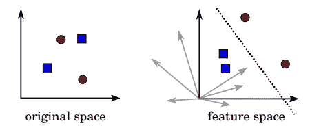

**Feature space is Hilbert space (Source from** [**Research paper**](https://arxiv.org/pdf/1803.07128.pdf)**)**

在这篇[的研究论文](https://arxiv.org/pdf/1803.07128.pdf)中，数据是如何嵌入希尔伯特空间的以及各种定义，ML 算法中的核方法等。，很好。

## 示例 2

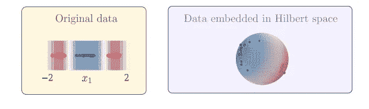

**Data in Hilbert space (Source** [**Research Paper**](https://arxiv.org/abs/2001.03622) **)**

在这个例子中，数据嵌入到希尔伯特空间中，并且可以被视为几何球，其将两类数据区分到 2 个希尔伯特空间中，并且最终将嵌入数据存储到包含 4 个基态的 2 量子位系统中。

**例三**

在下面的例子(第一部分描述)中，经典数据是如何针对各种数据点嵌入希尔伯特空间并相应地转换到唯一的希尔伯特空间的。(请注意，特征向量应该是量子态向量的形式)。有 3 种不同类型的数据点，并转换成 3 种不同的希尔伯特空间。因此，将数据存储嵌入到 3 量子位系统中，并在量子态中包含 8 个基态(即长度为 8 的量子态向量)。

第二部分涉及电路设计，即用于嵌入(预处理)和将新数据点分类为 3 类的量子电路。

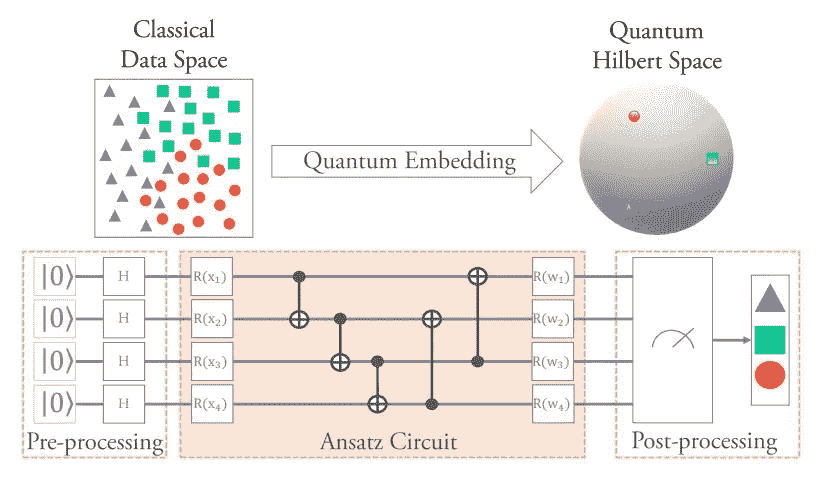

**Example from the** [**Research paper**](https://arxiv.org/pdf/2105.11853.pdf)

从第一个例子中，数据作为两个不同的希尔伯特空间嵌入向量空间。我们知道希尔伯特空间的定义是“一个有内积的完全空间”用狄拉克符号写成

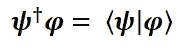

由于量子力学中概率解释的影响，状态向量(特征向量或量子状态向量)被归一化为 1。

## 量子神经网络中机器学习的二分类实例。—用于嵌入和分类的电路设计。

分别考虑标签 1 和 2 的数据点和相关类“A”和“B ”,并且必须预测不在训练集中的新输入“x”的标签。

下图显示了如何将数据嵌入隐藏层，然后转发到输出层对编码数据进行分类，所有这些都结合到神经网络中，即量子神经网络(QNN)。

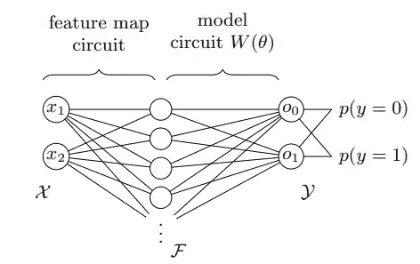

**QNN shows data embedding in Hilbert Feature Space and Binary class**

## 数据编码的空间和时间复杂度

让我们讨论经典和量子数据的符号，以便理解编码的空间和时间复杂性。通常，大“O”符号是估计空间和时间复杂性的首选。大“O”符号允许我们估计最好和最坏情况下的算法性能。

大“O”符号的妙处在于，它可以在各种领域中用于各种目的，但是，在量子计算中，大“O”用于确定嵌入所需的量子位数量。最终，我们从各种来源收集的经典数据必须被编码成量子数据，量子数据必须以量子位的形式存储和处理。

经典数据有‘M；数据点、特征是 x，标签是 y。每个输入都有“N”个特征，我们的任务是将每个数据点映射到 N 量子位量子态。

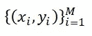

量子位定义为' **n'** ，量子位可以代表一个具有' **N'** 特征的数据点。这个公式以“**时间**的指数增加为代价，提供了“**空间**的指数节省。一般来说，这个量子态需要时间。

以对数为底 2 进行数据编码。举个例子，

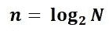

> 也就是说，一个 **n** 量子位的量子态代表一个具有 **N** 特征的数据点。

一般来说，这样的量子态需要量子比特(大 O 2 次方 n)公式来准备。即，

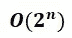

实际上，经典数据是通过状态准备电路进行编码的。从机器学习的角度来看，电路就是**量子神经网络**。

## 什么是数据加载技术？

在数据加载中使用了各种技术，它们是基本编码、幅度编码、角度编码、QuAM(量子关联存储器)、QSample 编码、分治编码、QRAM 和(量子随机存取存储器)以及更多变体。允许应用多种编码。

加载是通过从集合 X(经典数据包含数据点)到 n 量子位量子态的编码来完成的。

## 为什么我们转向数据嵌入模式？

因此，这种时间复杂度使得算法变得更差，为了克服这种类型的困难，涉及各种数据嵌入技术，并且我们需要选择适合我们算法的特定模式。例如，各种数据编码和它们的运行时间用图片描述。

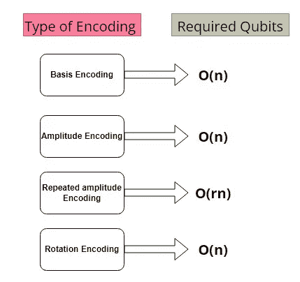

**Type of Encodings and required no of qubits for embedding**

数据嵌入技术或模式的执行时间比上面描述的要短。

数据嵌入技术以及空间和时间复杂性将在第二篇文章中讨论。

## 结论

希望读者清楚地了解状态处理、量子位数据编码、特征映射、希尔伯特空间数据，以及为什么我们需要移动其他数据编码技术。

感谢阅读我的文章。如果对你有帮助，请鼓掌，如果有错误，请告诉我。

 [## Mlearning.ai 提交建议

### 如何成为 Mlearning.ai 上的作家

medium.com](/mlearning-ai/mlearning-ai-submission-suggestions-b51e2b130bfb)