# 量子 AI/ML 算法的量子数据嵌入模式#2

> 原文：<https://medium.com/mlearning-ai/quantum-data-embedding-algorithms-for-quantum-ai-ml-ag-2-66e7e5e79ae4?source=collection_archive---------5----------------------->

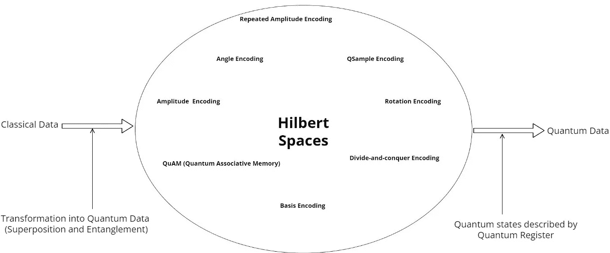

**Data Embedding techniques**

嵌入模式如何产生量子态向量

本文是量子数据及其嵌入#1 [文章](/mlearning-ai/quantum-data-and-its-embeddings-1-3b022b2f1245)的序列。

在这篇文章中，我们从数学的角度讨论了各种量子嵌入算法。量子编码允许我们理解数据并映射成量子比特，这样纠缠就存在于量子数据中。在量子算法(或 QML 算法)中，为了让量子计算机理解量子位形式的数据，预处理数据是必不可少的。

在预处理中有两个基本的编程任务:读取和加载数据[1]。

## 加载数据

它是在预处理步骤和任何量子算法的开始。在加载过程中，数据以量子位的形式使用任何编码或嵌入算法。量子算法期望使用某种编码，并通过执行计算来预处理数据。

加载数据可能在空间和时间复杂度上导致最坏和最好的性能，并且它并不总是被有效地完成。在最坏的情况下，加载过程需要指数级的时间，这导致总的运行时间也是指数级的。为了避免这个困难，我们使用对数或线性运行时间。

## 读取数据

从量子位读取数据，意味着必须以编程方式访问其量子状态，这是通过测量量子位来完成的。测量量子位意味着坍缩到状态|0 >和|1 >。

让我们概述一些重要的概念，你可以在这篇[文章](/analytics-vidhya/quantum-computing-concepts-of-quantum-programming-b0318cc37cc4)中找到 QC 概念。

**量子位**它是量子控制中的一个位，存储两种基本状态之一的信息，即|0 >或|1 >。有时它是两种状态同时组合的，叫做叠加态。

**量子寄存器**量子计算机中的多个量子位可以形成一个量子位寄存器。

**量子门**是对量子比特的操作，改变量子状态。

**量子电路**安排量子门为量子算法执行计算。

## 使用机器学习的编码技术

如今，机器学习是任何基于数学公式的任务的首选。机器学习结合神经网络实现非常有效和准确。编码过程可以使用神经网络来完成，即在量子世界中它是量子神经网络。

量子神经网络形式的量子电路设计和实现(QNN)。QNN 是机器学习算法的编码、预处理、格式化、训练和结果预测的基本公式。

量子计算机中的最小电路设计是最具挑战性和最活跃的研究领域。本文[6]探讨了使用深度强化学习来最小化电路设计。下图探索了 AI/ML 模型如何集成到量子电路中。

**Describing preprocessing in the Quantum Neural Network Circuit**

量子嵌入算法可以分为量子态准备和酉变换。

态制备和转换的量子电路。下图描述了这一点。

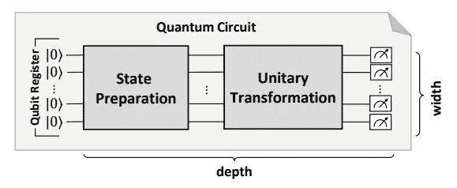

Source from Research Paper [4]

在本文中，我们只讨论量子态制备编码技术，主要有基编码、振幅编码、角度编码、量子编码和 QRAM 编码。本文的第二部分将讨论其他编码技术。

## 量子态制备(QSP)

该例程使用一种数据编码模式准备数据。QSP 对量子位寄存器进行操作，改变叠加态或纠缠态(量子的性质)。在叠加态下，量子寄存器所有可能的结果都是同等可能的。

在状态准备中，最初所有的量子位都被初始化为|0 >，因此整个量子状态可以表示为|000…0 >。

一旦状态准备好，数据就被载入量子计算机。量子计算机使用酉变换和表示为量子门的变换在量子寄存器上执行计算。

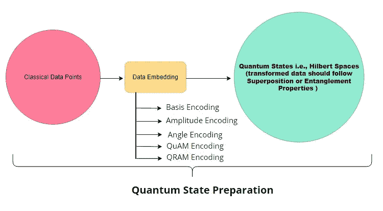

编码可以定义为将数据点从内存“加载”到量子状态，以便它可以被量子神经网络处理。

加载是通过从输入数据点到 n 量子位量子态的编码来完成的。

## 数据编码模式的注意事项

数据编码模式本质上是三个要点之间的权衡

1.  量子位的数量应该最小化以进行编码——因为当前的设备包含有限数量的量子位。
2.  为了最小化量子电路的宽度，并行操作的数量应该最小化。
3.  数据应该采用合适的方式或格式——非常适合运算，例如算术运算

在开始编码技术之前，让我们先定义几个术语。编码在模式中使用这些概念。

## 量子位寄存器

多个量子位可以形成一个量子位寄存器，其状态由高维复杂向量空间中的向量表示。数学上定义一个 n-量子位寄存器如下:

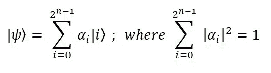

## 输入数据点

数据点是编码算法的实际输入，编码模式以量子寄存器的形式接受这些输入。量子寄存器(一组量子位)描述了量子状态。

## 状态向量

用量子态矢量表示的量子态。

# 编码模式

# 基本编码

这种编码主要适用于算术运算。在量子计算中，基态被表示为状态向量。

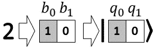

Image source from [6]

其表述如下:

每个二进制字符串都有唯一的整数表示，

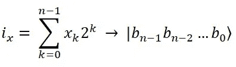

图示为每个输入数**‘x’**被公式化为二进制格式，并变成相应的基向量。即，

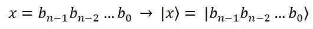

## 基本编码需要多少量子位？

它需要 **O(n)** 个量子位。

# 振幅编码

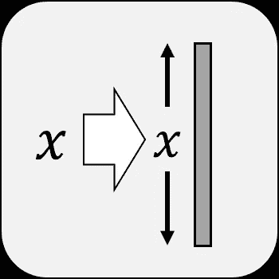

Image source from [6]

它也被称为波函数编码。每一个量子系统都可以通过它的波函数得到最好的描述，波函数也定义了测量概率。当量子态矢量不需要进一步计算时，这是有用的。其表述如下:

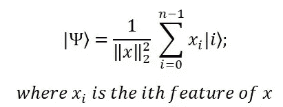

如果假设输入被归一化为 1，即，

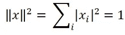

公式变成

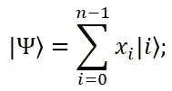

## 振幅编码需要多少量子位？

这种模式需要 log n 个量子位将数据编码成量子态。 **O(log n)** 在最好的情况下。

# 角度编码

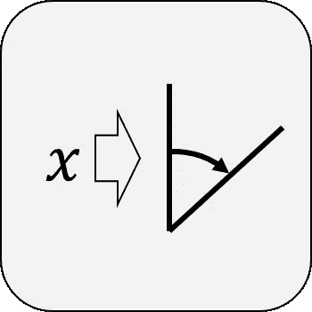

Image source from [6]

在这种编码技术中，每个数据点由一个单独的量子位表示。也被称为**量子位编码**。这种模式的结果是量子位没有纠缠。

它有像一般量子位编码和密集角度编码的变体。

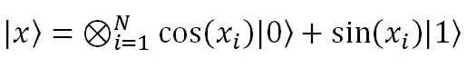

因为一个量子位可以处理一个具有许多特征的数据点

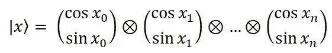

另一种策略是每个量子位编码一个特征，状态准备酉是

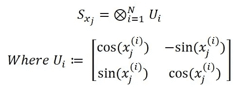

密集编码从这里通过利用相对相位自由度对两个特征的上述公式进行扩展而得到，它可以被定义如下:

## 角度编码需要多少量子位？

**O(1)** 每个数据点所需。

# 密集角度编码

特征向量 x，密集角度编码映射为

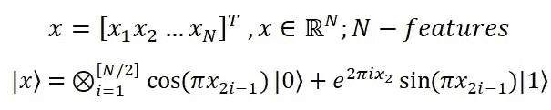

同样，上述内容可以被定义为两个特征或二维数据，其中单个量子位被公式化为特征 x1、x2

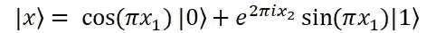

密度矩阵是

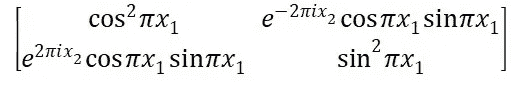

# 通用量子位编码

给定一个具有 N 个特征的特征向量‘x ’,一般量子位编码定义为

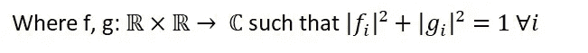

# 量子编码(量子联想存储器)

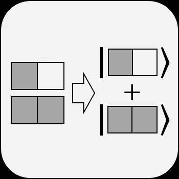

Image source from [6]

这种模式的主要直觉是在相同的量子位寄存器中准备基本编码值的叠加。量子寄存器在寄存器中的量子位之间提供基本编码值的等权重叠加。

QuAM 使用以下编码公式

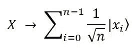

**QuAM encoding formula**

让我们考虑一个例子，使用基本编码对 3 个数据点进行编码，并最终在量子位寄存器中创建这 3 个数据点的叠加。

## QuAM 编码需要多少量子位？

**‘l’**要求用量子位来表示，**‘l’**可以用数字位数来表示’**n’**数。需要的是**O(‘l’)**量子位。在上面的例子中，总共需要 3 个量子位。

# QRAM 编码

Image source from [6]

QRAM 一次访问叠加数据值的特性。非常适合使用输入的数据值。它获取地址并给出相应数据值的数据值。它以寄存器的形式接收地址，并以寄存器的形式给出数据。

QRAM 编码使用下面的公式将数据编码成量子态矢量。

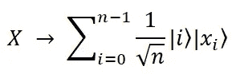

下面的例子说明了 QRAM 编码。

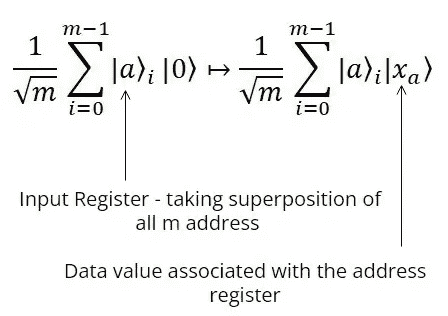

上述公式可以描述为取地址寄存器，该寄存器包含所有 m 个要加载到 QRAM 的地址的叠加，第二个寄存器的输出指定第 I 个数据值的地址，要加载到寄存器中的数据值是与该地址相关联的数据值。

## QRAM 编码需要多少量子位？

QRAM 需要 log n +l 个量子位来编码数据。 **O(log n +l )** 量子位。

## 结论

数据编码技术对于预处理数据、决定量子比特数、量子数据、设计量子电路和有效执行量子算法是最重要的。这篇文章有助于从数学的角度理解编码算法的内部内容。

感谢阅读我的文章。如果对你有帮助就鼓掌吧。给出你有价值的反馈，评论和分享。

## 参考

1.  量子计算的数据编码模式-【https://hillside.net/plop/2020/papers/weigold.pdf 
2.  量子分类器的鲁棒数据编码—【https://arxiv.org/abs/2003.01695 
3.  量子随机存取存储器(https://arxiv.org/pdf/0708.1879.pdf)——
4.  扩展量子算法的数据编码模式—[https://www . iaas . uni-stuttgart . de/publications/weigold 2021 _ expandingdataencodingpatterns . pdf](https://www.iaas.uni-stuttgart.de/publications/Weigold2021_ExpandingDataEncodingPatterns.pdf)
5.  深度强化学习的量子电路优化-[https://arxiv.org/abs/2103.07585](https://arxiv.org/abs/2103.07585)
6.  [https://quantumcomputingpatterns.org/](https://quantumcomputingpatterns.org/)

 [## Mlearning.ai 提交建议

### 如何成为 Mlearning.ai 上的作家

medium.com](/mlearning-ai/mlearning-ai-submission-suggestions-b51e2b130bfb) 

🟠成为一名 [**作家**](https://medium.com/mlearning-ai/mlearning-ai-submission-suggestions-b51e2b130bfbhttps://medium.com/mlearning-ai/mlearning-ai-submission-suggestions-b51e2b130bfbv)