# 量子数据嵌入电路设计#2

> 原文：<https://medium.com/mlearning-ai/quantum-data-embeddings-circuit-design-2-f2c6f6c89662?source=collection_archive---------5----------------------->

设计用于量子数据嵌入的量子电路

在量子计算或处理电路形式的量子信息中。在经典计算中，电路设计不在我们手中，而在量子计算中，电路设计是编程的关键概念。

为了设计电路，需要敏锐地理解量子位、门和寄存器。电路中最基本的部分是 Ansatz 电路。

## 什么是安萨兹电路？

Ansatz 电路是电路的基本架构，即一组作用于特定问题的门。Ansatz 电路类似于神经网络(深度学习)的架构。

基于电路的量子机器学习模型的核心组件是称为 Ansatz(复数 Ansaetze)的变分(参数化)电路。

## Ansatz 的类型

Ansatz 电路不是通用和独特的，它取决于所需的使用情况。一般来说，有三种不同的基本结构，即分层门 ansatz、交替算子 ansatz 和张量网络 Ansatz。—来源 [pennylane](https://pennylane.ai/) 文件。

## 分层门架构

一个层被定义为一系列重复的量子门。在训练算法时，一层重复的次数称为电路的超参数。这里我们使用块来划分层，并根据需要重复。下图显示了两个区块 A 和 b 中的图层。

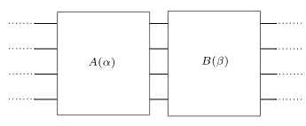

Layer is divided into two block A and B

基于参数化，层门 ansatz 可以有三种不同的方式。

1.  参数化和固定。参数可以不同的方式排列。

> a.块 A 是参数化的，B 是固定的。
> 
> b.块 A 和块 B 是参数化的。
> 
> c.块 A 是固定的，B 是参数化的。

2.A 区和 B 区使用的闸门类型

3.在 B 区安排大门

## 交替算子 ansatz

在这种类型的 ansatz 再次在层中使用块。与分层门架构的不同之处在于，该块表示为哈密顿量。块进化的时间很短，表示为

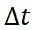

**time elapse execution between blocks**

A 和 B 的嵌段排列如下。

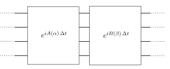

**Source from Pennylane documentation**

## 张量网络

张量网络不是由层组成，而是一个单一的固定结构，受张量网络启发的门序列。这种架构纠缠量子位元的子集。

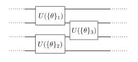

**Tensor network do not have layers**

另一个张量网络基于矩阵乘积态。电路单元可以有不同的排列方式，大小(单元数)对应矩阵乘积态的“键维数”——键维数越高，电路 ansatz 越复杂。

## 安萨兹电路的构造

通过堆叠多个相同的子层来形成 Ansatz 的构造，类似于基于神经元或细胞的神经架构设计的构造。

## 安萨兹电路的推广

没有通用的框架来为特定数据场景或特定用例设计最佳的 ansatz。

## 优化 Ansatz

优化 Ansatz 主要有两类，它们是电路简化和 Ansatz 优化。

**电路简化**

在这一类中，减少量子硬件的计算。在这里，我们可以用最合适的架构替换电路的局部或全局架构。

**安萨兹优化**

在这个类别中，目标是找到在给定任务上产生最佳性能的最佳 ansatz。考虑在特定任务上执行良好的启发式搜索，而不是减少计算。本文将贪婪启发式搜索应用于减少电路深度 QAOA。

优化的 Ansatz 电路在实际的量子算法设计中起着至关重要的作用。

在量子计算中，神经网络被认为是量子神经网络(QNN)，所有的机器学习算法都可以以 QNN 的形式实现，其中最著名的是变分量子分类器(VQC)。

量子计算机使用量子嵌入数据来实现更快、更高效的执行。量子嵌入的工作原理可以在本文中找到。

QNNs 将输入数据(经典数据)嵌入到高维量子希尔伯特空间。下图简单描述了量子嵌入。

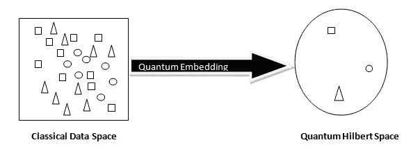

## 将数据嵌入希尔伯特空间的技术

我们可以从量子嵌入中实现表征学习，这就是嵌入的妙处。让我们看下面使用上述嵌入的例子，并分成 3 个不同的类别(即，在量子性质中使用希尔伯特空间)。

一个非常简单完整的量子神经网络的例子，它预处理，训练和分类给定的数据为 3 个三类。

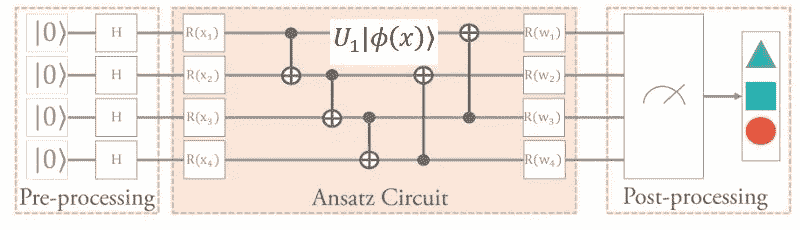

**Source from this research paper [3]**

在上图中，ansatz 对 n 量子位系统的作用如下

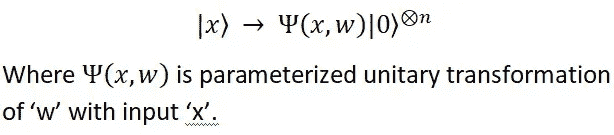

反向传播将设置权重'**' w '**'，该权重将通过训练过程被学习以最小化成本函数。

在上述电路中，

1.  用于纠缠建立的原始门是 CNOT 门，它为系统中的所有量子比特提供了一个高度纠缠的状态。单一的基本门包括控制旋转门，

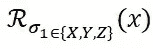

Parameterized by the input x

2.量子表示被前馈到固定的酉块中，该酉块包括在一定数量的量子位上有效的多个纠缠模式。

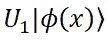

Quantum representation

3.ansatz 电路的最后一个模块包括控制旋转门

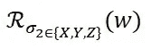

Control rotation gates parameterized by w

## 量子嵌入的纠缠模式(编码方案)

纠缠布局可以表示为有向多图，其中顶点是量子位，边是门(特别是 CNOT)。

使用这个有向图，我们可以在给定的数据集上找到缠绕模式的最佳结构。

有向图->纠缠布局->邻接矩阵

## 有向图

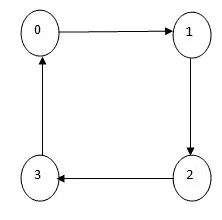

**Directed Graph with vertices (qubits) and edges (gates)**

纠缠布局可以用 CNOT 门及其邻接矩阵来定义。

## 缠结布局

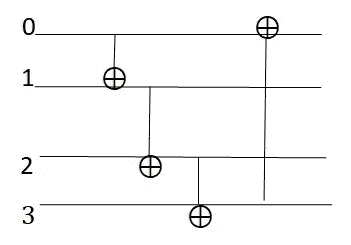

在上述电路中，0–1 连接、1–2 连接、2–3 连接和 3–0 连接使用 CNOT 门。

## 邻接矩阵

上述电路邻接矩阵定义如下。

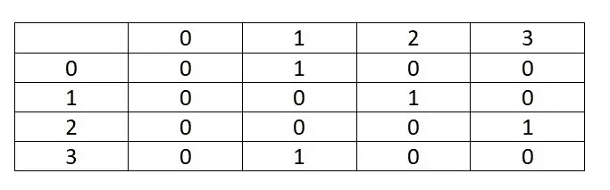

邻接矩阵表示以一种简单且不太稳定的方式说明了复杂性分析。

用同样的方法，你可以试着为下面的有向图定义电路和邻接矩阵。

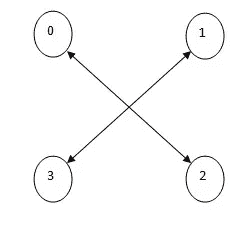

Directed Graph with qubits and CNOT gates

## 结论

量子嵌入的妙处在于，它会将数据嵌入到量子位中(在希尔伯特空间中)，并基于表示学习对标签进行分类。为量子算法设计电路有多种方法，我们刚刚学习了两种为量子嵌入设计电路的方法。

如果对你有用就鼓掌吧。感谢您阅读我的文章，感谢您的反馈、评论和分享。

## 参考

1.  QAOA 中针对最大切割的深度优化 Ansatz 电路—[https://arxiv.org/abs/2110.04637](https://arxiv.org/abs/2110.04637)
2.  【https://arxiv.org/abs/2103.07585 号
3.  量子嵌入搜索量子机器学习-【https://arxiv.org/abs/2105.11853 
4.  一种量子近似优化算法—[https://arxiv.org/pdf/1411.4028.pdf](https://arxiv.org/pdf/1411.4028.pdf)

 [## Mlearning.ai 提交建议

### 如何成为 Mlearning.ai 上的作家

medium.com](/mlearning-ai/mlearning-ai-submission-suggestions-b51e2b130bfb) 

[成为作家](/mlearning-ai/mlearning-ai-submission-suggestions-b51e2b130bfb)