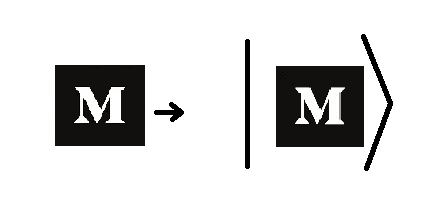
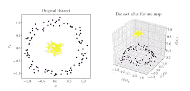
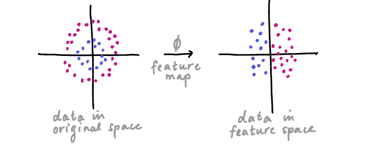
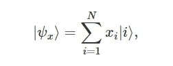
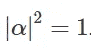
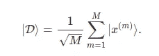
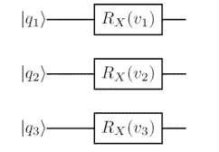
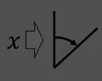

# 量子嵌入| QML

> 原文：<https://medium.com/mlearning-ai/quantum-embedding-qml-e5204e0b6ef2?source=collection_archive---------3----------------------->

是的，你，我们是巡回者，探索量子技术。跟我来。

参观:[amitnikhade.com](https://amitnikhade.com/)

Photo by [JEONGUK](https://unsplash.com/@u66kie?utm_source=unsplash&utm_medium=referral&utm_content=creditCopyText) — on [Unsplash](https://unsplash.com/s/photos/translation?utm_source=unsplash&utm_medium=referral&utm_content=creditCopyText)

在我们上一篇 quantum ML 帖子中，我们看到了量子机器学习的基础知识以及如何开始学习。当然，我们将会检查 QML 中的每个术语，因此在这里，我将解释量子 ML 中的嵌入是如何发生的，以及它与经典方法有何不同。

## 介绍

量子机器学习提供了精确的速度，因此它显然是人工智能的未来。因为我们通常以嵌入式格式向神经网络输入，所以让它最初是文本格式、图像或音频格式。输入只能以嵌入向量的形式被神经网络接受，因此同样地，量子神经网络需要在将输入加入机器学习循环之前将其嵌入。

## 现象

source: [medium.com](/) logo

**量子机器学习涉及嵌入(编码)，通过量子特征图将经典数据点转换为** [**希尔伯特空间**](https://en.wikipedia.org/wiki/Hilbert_space) **中的量子态来进行。**

让我们再深入一点定义。

我希望你可能熟悉**量子态**，如果不熟悉，我推荐你浏览下面的快速指南。

 [## 量子计算中的术语，你必须知道。

### 让我们以光速穿越量子时代😉

medium.com](/mlearning-ai/basic-terminologies-in-quantum-computing-you-must-know-f7e0191e3f96) 

我希望你现在不需要太多关于量子态的解释。量子态为系统上每个可能测量的最终结果提供了一个概率分布。它们可以是波函数、一组量子数或希尔伯特空间中的向量。

> **{∣0⟩、∣1⟩}这两个正交基态合称为计算基。**

**什么是希尔伯特空间？**

简单地说，希尔伯特空间是一个线性向量空间，它具有一些方向性。向量空间是由向量或标量的集合组成的空间。

希尔伯特空间具有内积运算，它在本质上是完全可分的。这意味着它涉及向量*(ψ.φ)*的乘法运算，即内积运算。具有第一个自变量内的共轭线性内积，对称共轭值，且自内积≥ 0。你现在只需要关注什么是希尔伯特空间。

**量子特征图**

[source](https://encrypted-tbn0.gstatic.com/images?q=tbn:ANd9GcTR2Ww2Uils_DJ9HyEW9Mz9OdZXSj1lMx0yEg&usqp=CAU)

量子特征图是将数据转换到更容易处理的空间的特征图。它在描述大量数据的同时减少了资源的消耗。它可以被称为一种降维形式。

考虑任何机器学习问题的例子，一个分类问题。在初始阶段，我们尝试使用多种技术来重构数据，如特征选择、移除异常值和空值，这使得模型更容易处理数据，甚至还提高了准确性。同样，要素地图使数据变得可行。

[Pennylane](https://pennylane.ai/)

该图示出了特征图ϕ，其将数据从原始空间映射到向量空间。其中，空间是向量空间(希尔伯特空间),转换到希尔伯特空间的数据是状态向量，就像它从 x 映射到|ϕ(x)⟩.一样我希望我没有让你感到困惑，这很简单。这是借助于幺正变换(Uϕ(x)完成的，即所谓的变分电路或量子电路。传递给电路的参数(正如我们在上一篇关于如何构造参数化量子电路的文章中所看到的)取决于数据的种类。

理解量子嵌入需要这些概念。如果还没有，再看一遍。

因此，在量子市场上有各种各样的嵌入技术，让我们看看其中的一些。

## 振幅嵌入

fig: [Pennylane](https://pennylane.ai/)

振幅嵌入也称为波函数嵌入。简单来说，振幅就是波的高度。在这种嵌入中，数据点被转换成量子态的振幅。上图代表振幅编码。

Normalized data

让我们考虑一个数据集α *= { a1，a2……..an}* 有 *n* 个维度，数据集最初被规范化为长度 1，因为可能有不同的数字数据类型。如图所示，量子态振幅的平方模数总和必须为 1。要编码的振幅数是维数和样本数的乘积。与基本编码或角度编码相比，编码更密集。

## 基础嵌入

在基本嵌入中，数据必须以二进制字符串的形式嵌入。基嵌入背后的思想是使用计算基。将标量值近似为二进制形式，然后将其转换为量子状态。

该算法包括——第一步是用一个二进制位串来逼近一个数，第二步是用一个计算基态来编码它。例如:x=1001 由 4 量子比特量子态|1001⟩表示

[Pennylane](https://pennylane.ai/)

变换为基嵌入的数据集可以表示为上面的等式。其中 M 是样本数，M 是 n 维向量。量子子系统的数量必须至少等于 N 位二进制串中的N。幅度向量在嵌入期间是分散的。

## 角度嵌入

Angle embedding preparation

角度编码是一种简单有效的嵌入数据的方法，从根本上说，它是将经典数据转换成量子态的最基本的编码形式之一，但它并不鲁棒。角度嵌入通过使用量子门以及必须编码的值在 x 轴或 y 轴上应用旋转来执行。如果我们想要在数据集上应用角度嵌入，旋转次数将与数据集中的要素数相同。n 维样本将采用 n 个量子位来生成量子状态集。

[source](https://encrypted-tbn0.gstatic.com/images?q=tbn:ANd9GcQuIkHMJ1lgylFwozBzJqV8SmXBltGd2sO4BQ&usqp=CAU)

量子人工智能是即将到来的技术趋势，我们必须为这种炒作做好准备。我希望你已经为更深入地进入量子人工智能建立了你的基础结构。如果你还没有清楚地理解这个概念，只要浏览一遍，你就能掌握它们。

## 参考

 [## PennyLane

### 一个 Python 库，用于量子机器学习、自动微分和混合量子-经典优化…

pennylane.ai](https://pennylane.ai/)  [## 谷歌图片

### 谷歌图片。网上最全面的图像搜索。

www.google.com](https://www.google.com/imghp?hl=EN) 

## 关于我

 [## Amit Nikhade -人工智能工程师-自由职业者| LinkedIn

### 在我的杯子里装了很多咖啡，为普通智力革命而工作。我是一个 AI 爱好者，一个博主，还有…

www.linkedin.com](https://www.linkedin.com/in/theamitnikhade/)  [## AmitNikhade -概述

### 🂮 |人工智能和机器人爱好者|机器学习、深度学习、NLP、物联网、机器人| LinkedIn…

github.com](https://github.com/AmitNikhade)