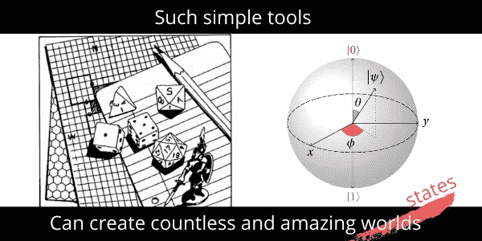
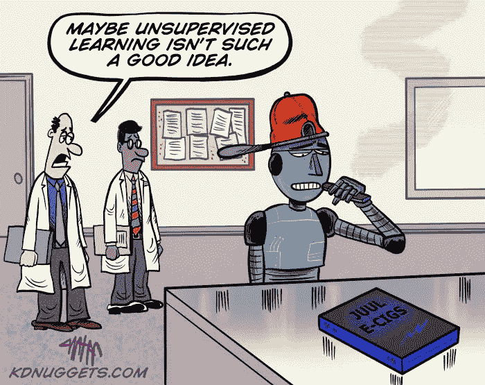
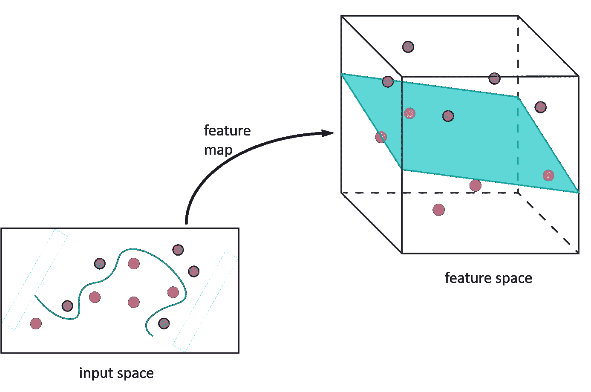

# 量子核机器学习—简介

> 原文：<https://medium.com/mlearning-ai/quantum-kernel-machine-learning-introduction-fbf133afebc2?source=collection_archive---------1----------------------->

机器学习(ML)是机器识别数据中的模式。模式可以是数据点可以分组或分段的类或簇。ML 旨在让机器从数据中直接自动识别这些模式(无需人类编程)。机器可以使用预先标记的(标记很可能由人类完成)数据进行训练，然后留给它自己的设备对新数据进行分类。这就是所谓的监督学习。或者，机器被给予未标记的数据，并被分派任务来识别有效的聚类并自己创建标签。这就是无监督学习。

在许多情况下，数据很难以原始形式理解。通常对数据进行一些变换，以帮助识别模式。例如，表格列中的数据被转换成二维图形，从而更容易发现趋势。前面的例子是一个可以扩展的类比。如果我们将数据转换到更高的维度，事实证明模式在更高的维度中更容易识别和表达。支持向量机使用这种思想作为它们如何执行分类和聚类的基础。YouTube 上有非常好的关于内核(以及使用内核的支持向量机)的教程。我推荐这个[关于支持向量机的三部分系列](https://youtu.be/efR1C6CvhmE)。

基本思想是采用数据点，并使用特征图将它们从较低的 m 维特征空间转换到较高的 n 维特征空间。图 1 显示了将数据从 2D 转换到 3D 的过程，其中一个简单的平面就可以分割数据，而在 2D 则需要“蜿蜒”的直线。

Figure 1\. A feature map transforms data points from a lower m dimensional (here 2 dimensions) to a higher n dimensional (3 dimensions) feature space. Here, the data segmentation in 2D was a ‘wiggly’ complex pattern, but simplified to a plane in 3D.

我们把数据点叫做 *x* 和*x’。*这些由特征映射 *f* 映射到特征空间，成为 *f(x)* 和*f(x’)*。在这个更高维度的特征空间中，我们可以通过取两者之间的点积即内积来检查 *f(x)* 和*f(x’)*， *< f(x)，f(x’)>*。于是，一个核 *k(x，x')* 是 *f(x)* 和*f(x ')*之间相似性的度量，即 *k(x，x') = < f(x)，f(x') >。*对于一个有限的数据集，这可以对所有的数据点对进行，并组合成一个矩阵。

现在谈谈“量子”方面。有趣的是,“量子”方面可以从符号模式中识别出来。在量子力学中，两个量子态 *S(x)* 和 *S(x')* 之间的重叠可以用所谓的 bra-ket 符号表示为 *< S(x)|S(x') >，*与一个核非常相似！事实证明，相似之处(或者更确切地说是类比？)不仅仅是符号。量子计算涉及从输入空间中取出一些数据点 *x* ，通过映射状态 *|S(x) >* 将其转换到更高维度的希尔伯特空间。高维空间是通过测量来访问的，这类似于内核。关于详细的讨论，我推荐 Maria Schuld 在 YouTube 上关于量子增强内核方法的视频。

只有当特征图高度复杂，而不仅仅是产品状态时，核方法才能获得量子优势。这已经在几篇标志性论文中进行了研究。我们将在教程中使用玩具数据模型、sklearn 和 Qiskit 来跟踪这些调查。

# Qiskit + sklearn 教程

1.  [教程—使用量子核和各种编码进行分类。](https://verreaux.medium.com/classification-using-quantum-kernels-tutorial-8a2f442fd188)
2.  [教程—使用量子内核和各种编码进行聚类。](https://verreaux.medium.com/clustering-using-quantum-kernels-tutorial-dcd90bf6440c)
3.  教程—在真实硬件上实现。

## 参考

1.  havlíek，v .，Córcoles，A.D .，Temme，K. *等*利用量子增强特征空间的监督学习。*性质* **567，**209–212(2019)。[https://doi.org/10.1038/s41586-019-0980-2](https://doi.org/10.1038/s41586-019-0980-2)
2.  [arXiv:2101.11020](https://arxiv.org/abs/2101.11020) **【定量 ph】**
3.  、y、矢野、h、高、Q. *等*基于核的量子分类器的特征图分析与合成。*量子马赫。智能。* **2、** 9 (2020)。[https://doi.org/10.1007/s42484-020-00020-y](https://doi.org/10.1007/s42484-020-00020-y)
4.  [量子内核机器学习— Qiskit 机器学习 0.1.0 文档](https://qiskit.org/documentation/machine-learning/tutorials/03_quantum_kernel.html)