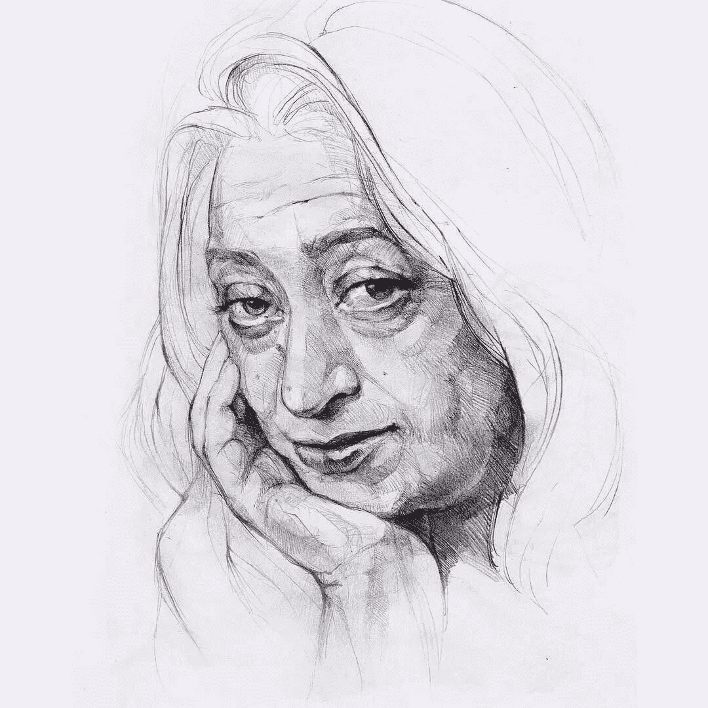

# 女王于 2021 年 5 月 1 日接受采访

> 原文：<https://medium.com/mlearning-ai/queen-was-interviewed-on-may-1-2021-1f5a991fb67a?source=collection_archive---------1----------------------->

## [扎哈·哈迪德](https://mlearning.substack.com/p/how-can-i-design-like-a-top-architect?r=z7zu8&s=w&utm_campaign=post&utm_medium=web)，下一个世纪的[建筑](/mlearning-ai/what-does-an-architect-do-615e733ac679)

[instagram.com/next_top_architects](https://mlearning.substack.com/p/how-can-i-design-like-a-top-architect?r=z7zu8&s=w&utm_campaign=post&utm_medium=web)

**在她去世 5 年后**，NTA [#next_top_architects](https://www.instagram.com/next_top_architects/) 采访了**女爵士扎哈·哈迪德**