# 与罗伯塔一起回答问题

> 原文：<https://medium.com/mlearning-ai/question-answering-in-association-with-roberta-a11518e70507?source=collection_archive---------0----------------------->

喝一口 chaii，用谷歌的[chaii——北印度语和泰米尔语问答](https://www.kaggle.com/c/chaii-hindi-and-tamil-question-answering),刷新你的心情。

## 【amitnikhade.com 号


A beautiful click by [nukelarburrito](https://www.flickr.com/photos/nukelarburrito/)

## 介绍

愿上帝保佑你掌握所有的数据结构技能。变形金刚一直是革命性的模型，产生了像伯特、GPT、mt5、t5、塔帕斯、阿尔伯特、罗伯特以及更多来自他们家族的艺术变体。[拥抱脸](https://huggingface.co/)库为各种真实场景的实现提供了优秀的文档。

这里，我们将尝试实现问答系统的 [Roberta](https://arxiv.org/pdf/1907.11692.pdf) 模型。我们不会直接深入我们的代码，我们将修改一些理解代码所必须的理论概念。相信我，对于一个自然语言处理的新手来说，理解代码背后的逻辑需要稍微长一点的时间。我尽力从概念上解释它。读者也有责任通过同时浏览代码来理解代码，直到你不理解为止，浏览你在本文中不知道的东西肯定会对你有用。

## 你应该熟悉的术语

*   **记号**:记号是自然语言处理的构建块。标记是在对文本进行标记化之后创建的。标记化主要可以分为词、字符和子词，即 n 元字符标记化。
*   **输入标识**:输入标识为令牌索引；它们是记号的数字表示；这些表示的列表被称为序列，用作模型的输入。

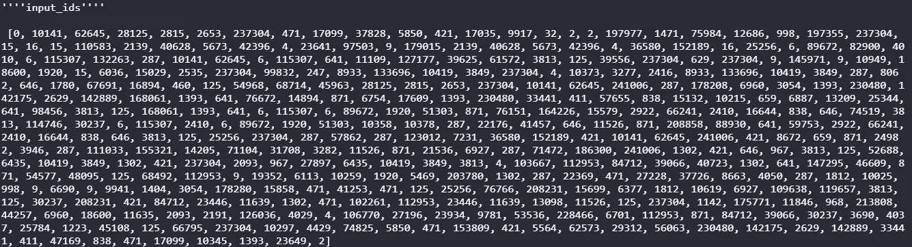

input_ids

*   **Sequence _ id:**Sequence _ id 告诉我们序列中的哪一部分是问题，哪一部分是答案。唯一标记编码为 None，其中 0 表示问题，1 表示上下文。

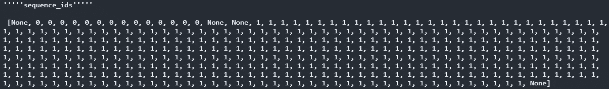

*   **offset _ mapping:**offset _ mapping 参数为我们提供了记号的位置，这是记号的开始和结束索引的元组，便于找到它们的原始位置。

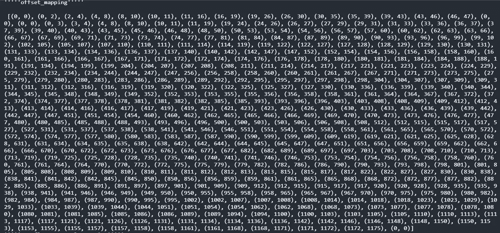

*   **overflow_sampling** :就像示例(即上下文)是如何由于 max_length 限制而被截断的，因此被修剪的部分以可靠的步幅率在下面的序列中继续，溢出样本是上下文被拟合了多少分裂的映射。如下图所示，0 是数据集中的第一个上下文，数据足够大，因此包含在许多拆分中。

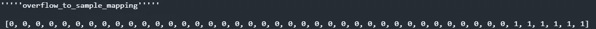

*   **max_length:** 为要处理的序列定义的恒定长度，并馈入模型。
*   **填充:**填充满足具有给定 max_length 的序列，比如如果 max_length 是 20，而我们的文本只有 15 个单词，那么在对其进行标记化之后，文本将被填充 1，从而得到长度为 20 的序列。填充可以从序列的前端开始，也可以从序列的末端开始。
*   **Stride:** Stride 是截断序列与下一个序列进行修补的令牌长度速率。它基本上用于处理溢出。
*   **截断:**达到 max_length 后切割序列。
*   **start _ token/end _ _ token:**需要取一个特定观察的起始标记，比如上下文中答案的起始标记，类似的就是结束标记，也就是那个答案的结束标记。
*   **Attention _ mask:**Attention mask 告诉模型中的注意机制排除不是实际标记的填充。这使得我们很容易区分组合序列中的实际标记和填充。

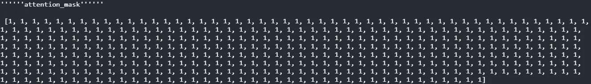

## 罗伯塔标记化风格

罗伯塔使用从 [GPT-2](https://openai.com/blog/better-language-models/) 派生的字节级[字节对编码](https://en.wikipedia.org/wiki/Byte_pair_encoding)方法。词汇表由 50000 个单词组成。\U0120 作为字节对编码中使用的唯一字符，还没有通过拥抱脸让我们看到。BPE 就像一种数据压缩算法，其中最常见的一对连续数据字节被替换为该数据中不存在的字节。

在对数据进行编码时，考虑数据**ggghghghgh**。字节对 **gg** 出现的频率最高，所以我们会用 **K 来代替它**生僻字被分解成更多的子字令牌。这是 BPE 背后的一个基本理念。

## 模型

Roberta 代表[**R**obustable**O**optimized**BERT**Pre-training**A**pproach](https://arxiv.org/abs/1907.11692)在 160 GB 的数据上进行训练，如图书语料库(朱等，2015)、维基百科以及一些附加数据。罗伯特只是一个熟悉动态掩蔽的伯特，而没有下一句预测，就像伯特通常如何预先训练掩蔽语言建模和下一句预测一样，在罗伯特模型的情况下，NSP 被消除。我不会详述内部模型的工作原理，我在以前的文章中已经解释过了。

## 履行

> *在这次比赛中，你将预测印地语和泰米尔语问题的答案。答案直接从有限的上下文中得出(详见评估页)。我们提供了少量样本来检查您的代码。还有一个隐藏的测试集。*
> 
> *所有文件应编码为 UTF-8。*

**项目包含的步骤:**

*   **加载我的案例中已经给出的训练和测试数据。**
*   预处理数据似乎是整个问题中最具挑战性的部分之一。这包括准备培训和验证功能。
*   **根据我们预处理的数据训练模型**
*   **后处理**
*   **预测**

数据取自谷歌主办的 Kaggle 竞赛**“chaii——印地语和泰米尔语问答”**。这是[数据](https://www.kaggle.com/c/chaii-hindi-and-tamil-question-answering/data)的链接。我们的任务是识别在数据集中的印度语言段落中发现的问题的答案。数据中的列包括 id 上下文问题答案 _ 文本答案 _ 开始语言。

训练集有 747 个印地语和 368 个泰米尔语示例。在测试数据中，我们提供了 5 个例子；我们没有*回答 _ 正文*和*回答 _ 开始*。我们已经获得了上下文、问题、答案文本和答案开始。我们只需要在使用开始和结束跨度的上下文中找到答案。我们只需要预测答案文本。

**依赖关系**

```
pip install transformers
pip install tensorflow
pip install Dataset
pip uninstall fsspec -qq -y
pip install --no-index --find-links ../input/hf-datasets/wheels datasets -qq
```

**导入库**

您需要在您的系统上安装 transformers 库。

```
import pandas as pd
import numpy as np

from transformers import *
import tensorflow as tf
import collection
from datasets import Dataset
```

加载数据

```
train = pd.read_csv('../input/chaii-hindi-and-tamil-question-answering/train.csv')
train.head()test = pd.read_csv('../input/chaii-hindi-and-tamil-question-answering/test.csv')
test.head()
```

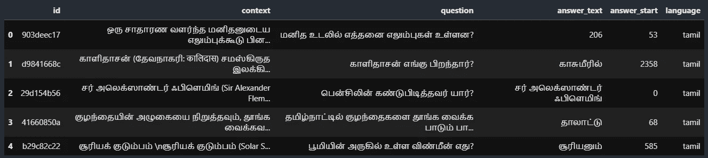

train data

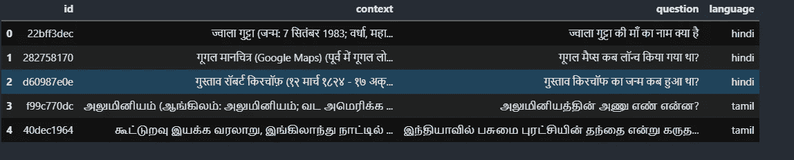

test data

记号赋予器类

```
tokenizer = AutoTokenizer.from_pretrained("../path-to-pretrained-tokenizer/xlm-roberta-large-squad2")
```

设置最大长度、批量大小和

```
batch_size = 4
max_length = 384 
doc_stride = 128
```

定义一个为我们准备训练数据的函数。

```
def prepare_train_features(examples):

    examples["question"] = [q.lstrip() for q in examples["question"]] tokenized_examples = tokenizer(
        examples["question" if pad_on_right else "context"],
        examples["context" if pad_on_right else "question"],
        truncation="only_second" if pad_on_right else "only_first",
        max_length=max_length,
        stride=doc_stride,
        return_overflowing_tokens=True,
        return_offsets_mapping=True,
        padding="max_length",
    ) sample_mapping = tokenized_examples.pop("overflow_to_sample_mapping")

    offset_mapping = tokenized_examples.pop("offset_mapping") tokenized_examples["start_positions"] = []
    tokenized_examples["end_positions"] = []for i, offsets in enumerate(offset_mapping):

        input_ids = tokenized_examples["input_ids"][i]
        cls_index = input_ids.index(tokenizer.cls_token_id) sequence_ids = tokenized_examples.sequence_ids(i) sample_index = sample_mapping[i]
        answers = examples["answers"][sample_index]

        if len(answers["answer_start"]) == 0:
            tokenized_examples["start_positions"].append(cls_index)
            tokenized_examples["end_positions"].append(cls_index)
        else:

            start_char = answers["answer_start"][0]
            end_char = start_char + len(answers["text"][0]) token_start_index = 0
            while sequence_ids[token_start_index] != (1 if pad_on_right else 0):
                token_start_index += 1 token_end_index = len(input_ids) - 1
            while sequence_ids[token_end_index] != (1 if pad_on_right else 0):
                token_end_index -= 1 if not (offsets[token_start_index][0] <= start_char and offsets[token_end_index][1] >= end_char):
                tokenized_examples["start_positions"].append(cls_index)
                tokenized_examples["end_positions"].append(cls_index)
            else:

                while token_start_index < len(offsets) and offsets[token_start_index][0] <= start_char:
                    token_start_index += 1
                tokenized_examples["start_positions"].append(token_start_index - 1)
                while offsets[token_end_index][1] >= end_char:
                    token_end_index -= 1
                tokenized_examples["end_positions"].append(token_end_index + 1)
                breakreturn tokenized_examples
```

让我们看看这个函数到底是如何工作的。

我们将把训练数据传递给这个函数。首先，空白将被删除，它出现在训练数据中一些问题的左边。接下来是在每个转换器模型中使用的广泛步骤之一，即记号赋予器。分词器将句子分词成组块，如下所示。

```
**<s> sequence_1 </s></s> sequence_2 </s>** 
```

其中~~是分类符标记，~~是分隔符标记。我们将问题和上下文传递给记号赋予器，检查记号赋予器填充位置是在右边还是左边，但默认情况下是在左边。因此，记号赋予器将对序列进行记号化，并用 max_length 填充序列，以满足给定的序列限制。我们在记号赋予器中添加了一个截断参数，它在超过 max_length 限制后截断序列。跨距指定了该序列应该与先前溢出的序列重叠多少长度的标记。截断序列时，我们可能会丢失大量数据，从数据科学的角度来看，这不是一个好的做法。为了克服这个问题，我们需要返回溢出的序列，以将它们转发给进一步的序列，从而与它们重叠。我们还返回偏移量映射，这为我们提供了标记位置的映射。

在下一步中，我们提取样本映射，该样本映射对它所做的一对分割进行计数。众所周知，offset_mapping 给出了序列的位置信息。最后，我们开始收集开始和结束标记，并在循环中应用一些逻辑。我们提取 sequence _ ids，这有助于我们区分问题和上下文。cls_index 是分类器标记索引。上面的函数一次处理一个样本。在上下文中不存在答案的情况下，我们放置开始和结束位置。sample_index 是包含该文本范围的示例的索引，即样本映射索引。最后，我们将收集循环中特定实例的开始和结束索引；如果答案不在示例中，我们将用 CLS 令牌标记它；否则，我们将把开始和结束索引移动到答案的开始和结束点。该函数返回预处理示例的列表。

```
def convert_answers(r):
    start = r[0]
    text = r[1]
    return {
        'answer_start': [start],
        'text': [text]
    }train = train.sample(frac=1, random_state=42)
train['answers'] = train[['answer_start', 'answer_text']].apply(convert_answers, axis=1)df_train = train[:-64].reset_index(drop=True)
df_valid = train[-64:].reset_index(drop=True)train_dataset = Dataset.from_pandas(df_train)
valid_dataset = Dataset.from_pandas(df_valid)
```

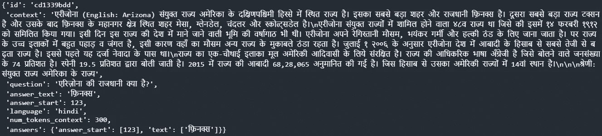

在将训练数据传递给特征准备函数之前，我们需要创建一个名为 answers 的维度，由 answer_start 和 answer_text 组成；此外，我们生成数据的随机样本，并从 pandas 数据帧中表示 Dataset 对象。

```
train_tokenized_dataset = train_dataset.map(prepare_train_features, batched=True, remove_columns=train_dataset.column_names)test_tokenized_dataset = test_dataset.map(prepare_train_features, batched=True, remove_columns=test_dataset.column_names)
```

通过对其应用 prepare_train_feature 函数，上述代码将用于预处理训练和测试数据。

```
args = TrainingArguments(
    f"chaii-qa",
    evaluation_strategy = "epoch",
    save_strategy = "epoch",
    learning_rate=3e-5,
    warmup_ratio=0.1,
    gradient_accumulation_steps=8,
    per_device_train_batch_size=batch_size,
    per_device_eval_batch_size=batch_size,
    num_train_epochs=1,
    weight_decay=0.01,
)
```

配置训练参数。data_collator 自动对一批模型输入执行填充，填充到数据集中最大扩展示例的长度，这样就不需要设置通常是固定的最大序列长度，从而提高了性能。

```
from transformers import default_data_collatordata_collator = default_data_collatortrainer = Trainer(
    model,
    args,
    train_dataset=tokenized_train_ds,
    eval_dataset=tokenized_valid_ds,
    data_collator=data_collator,
    tokenizer=tokenizer,
)trainer.train()
trainer.save_model("chaii-bert-trained")
```

**trainer.train()** 开始训练，之后保存模型。

```
def prepare_validation_features(examples):

    examples["question"] = [q.lstrip() for q in examples["question"]] tokenized_examples = tokenizer(
        examples["question" if pad_on_right else "context"],
        examples["context" if pad_on_right else "question"],
        truncation="only_second" if pad_on_right else "only_first",
        max_length=max_length,
        stride=doc_stride,
        return_overflowing_tokens=True,
        return_offsets_mapping=True,
        padding="max_length",
    )
    sample_mapping = tokenized_examples.pop("overflow_to_sample_mapping")
    tokenized_examples["example_id"] = []for i in range(len(tokenized_examples["input_ids"])):

        sequence_ids = tokenized_examples.sequence_ids(i)
        context_index = 1 if pad_on_right else 0 sample_index = sample_mapping[i]
        tokenized_examples["example_id"].append(examples["id"][sample_index]) tokenized_examples["offset_mapping"][i] = [
            (o if sequence_ids[k] == context_index else None)
            for k, o in enumerate(tokenized_examples["offset_mapping"][i])
        ]return tokenized_examples
```

为了验证，我们不需要计算开始和结束位置；相反，我们将收集组合成一个特征的例子。sample_mapping 关键字为我们提供了一个映射，该映射提供了关于上下文和由于 max_length 限制而从中分割的特征之间的对应关系的信息。我们将使用 sequence _ ids 来了解问题和上下文在序列中的确切位置。pad_to_right 为真，因此上下文索引将为 1。最后，我们将把不包含在上下文中的 offset_mapping 设置为 None，这样可以更简单地检测上下文。

与训练集一样，我们将对数据应用 prepare_validation_features 函数。

```
validation_features = valid_dataset.map(
    prepare_validation_features,
    batched=True,
    remove_columns=valid_dataset.column_names
)valid_feats_small = validation_features.map(lambda example: example, remove_columns=['example_id', 'offset_mapping'])
```

预言

```
raw_predictions = trainer.predict(valid_feats_small)
```

下面的代码块告诉我们一个例子被分成了多少个特性，并给出了例子及其特性的列表。

```
max_answer_length = 30examples = valid_dataset
features = validation_features

example_id_to_index = {k: i for i, k **in** enumerate(examples["id"])}
features_per_example = collections.defaultdict(list)
for i, feature **in** enumerate(features):
    features_per_example[example_id_to_index[feature["example_id"]]].append(i)
```

**后处理:**后处理将问答模型的预测转换成作为原始上下文子串的答案。后处理代码由示例上的嵌套循环组成。它收集循环中正在进行的例子的特征的索引以及上下文。此外，它循环遍历连续示例中的每个要素，并从由分别包含开始逻辑和结束逻辑的两个数组组成的模型中收集对相同要素的预测。min_null_score 是 None，它必须在训练第二组数据时使用。空答案的得分是与作为我们最小空分数的[CLS]令牌相关联的 start_logit 和 end_logit 之和。开始和结束逻辑的任何合理组合，即 start_logit + end_logit，都可以被认为是一个可能的答案。组合得分越高，获得最佳答案的信心越高。如果结束标记在开始标记之前，在这种情况下，应该将其排除。开始或结束标记与问题标记相关联的答案也被排除，因为我们知道问题的答案在问题中不是显而易见的。可以使用-n _ best _ size 参数调整每个示例的最佳预测数；代码遍历所有的可能性以得到最佳答案。长度小于 0 或大于 max_answer_length 的答案不包括在内；不考虑超出范围的答案。

```
from tqdm.auto import tqdm

def postprocess_qa_predictions(examples, features, raw_predictions, n_best_size = 20, max_answer_length = 30):
    all_start_logits, all_end_logits = raw_predictions

    example_id_to_index = {k: i for i, k **in** enumerate(examples["id"])}
    features_per_example = collections.defaultdict(list)
    for i, feature **in** enumerate(features):
        features_per_example[example_id_to_index[feature["example_id"]]].append(i)

    predictions = collections.OrderedDict()

    for example_index, example **in** enumerate(tqdm(examples)):

        feature_indices = features_per_example[example_index]

        min_null_score = None 
        valid_answers = []

        context = example["context"]

        for feature_index **in** feature_indices:

            start_logits = all_start_logits[feature_index]
            end_logits = all_end_logits[feature_index]

            offset_mapping = features[feature_index]["offset_mapping"]

            cls_index = features[feature_index]["input_ids"].index(tokenizer.cls_token_id)
            feature_null_score = start_logits[cls_index] + end_logits[cls_index]
            if min_null_score **is** None **or** min_null_score < feature_null_score:
                min_null_score = feature_null_score

            start_indexes = np.argsort(start_logits)[-1 : -n_best_size - 1 : -1].tolist()
            end_indexes = np.argsort(end_logits)[-1 : -n_best_size - 1 : -1].tolist()
            for start_index **in** start_indexes:
                for end_index **in** end_indexes:

                    if (
                        start_index >= len(offset_mapping)
                        **or** end_index >= len(offset_mapping)
                        **or** offset_mapping[start_index] **is** None
                        **or** offset_mapping[end_index] **is** None
                    ):
                        continue

                    if end_index < start_index **or** end_index - start_index + 1 > max_answer_length:
                        continue

                    start_char = offset_mapping[start_index][0]
                    end_char = offset_mapping[end_index][1]
                    valid_answers.append(
                        {
                            "score": start_logits[start_index] + end_logits[end_index],
                            "text": context[start_char: end_char]
                        }
                    )

        if len(valid_answers) > 0:
            best_answer = sorted(valid_answers, key=lambda x: x["score"], reverse=True)[0]
        else:

            best_answer = {"text": "", "score": 0.0}

        predictions[example["id"]] = best_answer["text"]

    return predictions
```

我们将把 valid_dataset、validation_features、raw_predictions 传递给 postprocess_qa_predictions 函数，以获得最终预测。

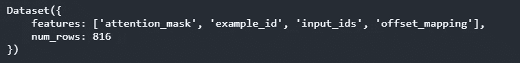

validation features

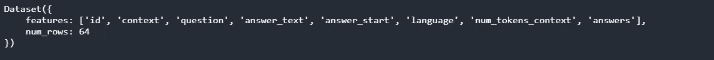

valid dataset

```
final_predictions = postprocess_qa_predictions(valid_dataset, validation_features, raw_predictions.predictions)
```

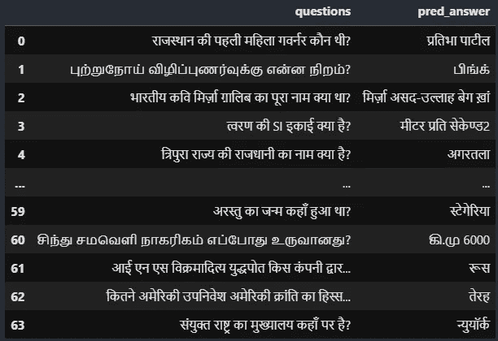

这就是了，如果你还不明白这一点，我建议你至少看三遍整篇文章。并且试着在网上浏览你不理解的话题，我相信你会的。

*链接到* [*GitHub*](https://github.com/AmitNikhade/Kaggle/blob/main/chaii%20-%20Hindi%20and%20Tamil%20Question%20Answering/question-answering-roberta-starter-explained.ipynb) *。*

## 参考

[](https://www.kaggle.com/c/chaii-hindi-and-tamil-question-answering) [## chaii -印地语和泰米尔语问答

### 找出印度语文章中问题的答案

www.kaggle.com](https://www.kaggle.com/c/chaii-hindi-and-tamil-question-answering) 

[https://arxiv.org/pdf/1907.11692.pdf](https://arxiv.org/pdf/1907.11692.pdf)/

[](https://huggingface.co/) [## 拥抱脸-人工智能社区建设未来。

### 我们正在通过开源和开放科学来推进和民主化人工智能的旅程。

huggingface.co](https://huggingface.co/) 

_____________________________ 感谢 __________________________ 感谢

