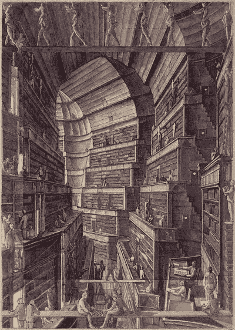

# 质疑一切——包括你的存在:计算视角

> 原文：<https://medium.com/mlearning-ai/question-everything-including-your-existence-577d88af05bc?source=collection_archive---------8----------------------->

# 生命、宇宙和万物的答案:

当一个人第一次冒险走出洞穴的时候，当他凝视天空的时候，心里会有很多疑问。问一个问题，保持好奇，寻找答案，寻求不仅仅是生存，这是人类的一种倾向。

这些问题以及寻找答案的好奇心催生了科学和宗教。这只是人类寻找问题答案的渴望，无论在哪里都能找到答案。

每一个普通或非凡的人，无论是谁找到了任何问题的答案，他们实际上都为不断扩展和增长的人类知识库增加了一页。从穴居人到柏拉图到亚里士多德到阿基米德到达芬奇到莎士比亚到牛顿到达尔文到麦克斯韦尔到爱因斯坦到 RN 泰戈尔到斯蒂芬霍金到你和我，我们都为这个人类知识库增加了一些内容。但是，我们是否回答了所有的问题。我们有所有的答案吗？我们有生命、宇宙和万物的答案吗？我们找到的答案越多，问题就越多。

# 我们有无限的疑问吗？

正常的想法是，所有的人类加在一起会有无限的想法和问题，因此我们永远不可能得到所有事情的答案。无限是有原因的。但是真正的问题(讽刺)是，**我们真的有无限的问题吗？**

自从智人物种出现以来，大约有 1100 亿人曾经生活过。**今天的世界人口仅占有史以来人类总数的 7-8%**。

考虑到人的数量是有限的，他们的寿命也是有限的。如果他们在各自的生活中每秒钟产生一个想法或问题，那么想法或问题的数量也将是有限的。这将是一个很大的数字，但仍然是有限的。

人类平均寿命为 22 亿秒。如果有 1100 亿人活到现在，如果所有人每秒产生 1 个想法，那么仍然是 22 亿乘以 1100 亿。这是一个很大的数字，但也是一个有限的数字。

那些我们没有时间理解或思考的问题或答案呢？我们没有想到某些问题，并不意味着那些问题不存在。这些问题有待发现。这是不是让知识库无限了？

# 什么是无限？

很难理解无限。它永远不会结束。有许多问题和悖论，像罗斯-利特伍德悖论或无限旅馆悖论，足以让任何人困惑。

让我用一个新的视角来介绍 infinite。让我们以 1 米为尺度。现在，让我们将天平分成 100 等份。我们将得到每一部分测量 1 厘米。或者，我们可以将比例分成 1000 份，或者 100000 份，或者 31415926 份。很容易说，我们可以用无限的方式打破规模，但每种方式只会产生有限的片段。以无限的方式打破天平既不会使天平无限，也不会使碎片无限。

# 生命、宇宙和万物的答案:

画任意半径的圆。测量圆的周长和直径。圆、它的周长和直径都是有限值。但是，如果你试图取出周长和直径的比值，那么这个值突然变成无穷大。**圆周率的值。**

法布里斯·贝拉保持着找到圆周率最高位数的记录。计算机程序员法布里斯·贝拉计算圆周率到小数点后的 **2.7 万亿位。所以，到目前为止没有观察到**数字的重复模式**，而且第 n 个数字也是不可预测的。这意味着圆周率是一个真正的无理数。如果数字既没有重复，也没有任何顺序或模式，如果圆周率真的是无限的，那么圆周率数字就掌握了世界上的每一个信息。**

我们可以用任何数字系统来表示信息或数据。在电子设备中，我们用二进制(基数为 2)来表示信息。其他流行的数字系统是八进制(基数 8)和十六进制(基数 16)。同样，我们也可以用十进制(以 10 为基数)数字系统来表示每一个信息、每一个数据。圆周率中的数字也是十进制的。这意味着 **Pi 在某处有所有问题的数字表示，所有答案**。圆周率中的数字包含了所有曾经存在的或将来可能存在的信息和数据。一切的答案。圆周率并不是唯一包含所有信息的数字，还有其他一些数字，如 e 或 2 的平方根。

# 巴别塔图书馆

为我们的综合知识库建立一个中央图书馆，这难道不是一个绝妙的主意吗？包含一切的**库。**不仅是我们过去的知识，**还有**我们将来会获得的知识****，**每个问题，每个答案，每个可能性，每个人的每个想法。它应该已经在图书馆里了，只是等着被某个人看到或阅读。听起来像是幻想或不可能。**

如果我说这样的库已经存在。一个图书馆，其中包含每个人的每个想法，所有电影/戏剧/情景喜剧(过去或未来)的每个剧本，每个科学原理，每个阴谋论，每个问题，每个答案，每个交替的历史，每首歌，每首交响乐，诗歌，文章，科学论文，发现，公式，发明，想法，软件代码，每个新闻，未来，某一天将在这个地球上和一个平行宇宙中发生什么，治愈每种疾病，对你出生的描述，对你死亡的每一种可能的描述，直到宇宙末日可能存在的每一个数据或信息。这些都是现成的，只是在等着有人来看。

介绍巴别塔的**图书馆。最初由 Jorge Luis Borges 设计，后来由 Jonathan Basile 以网站的形式实现。他创造了一种算法，通过迭代 29 个字符的每一种排列生成一本书，这 29 个字符是 26 个字母、空格、逗号和句号。**

**巴别塔图书馆里的每本书都可以通过它的位置找到。图书馆有许多六边形房间。每个六边形有 4 面墙，每面墙有 5 个书架，每个书架有 32 本书，每本书有 410 页。**

**所以，一个特定的书可以定位为 0e-w1-s2-v18:1，其中 0e 是六边形的名称，w1 是墙 1，s2 是书架 2，v18 是书架 2 上的书 18，冒号后的 1 代表页码。**

这是巴别塔图书馆的链接—[https://libraryofbabel.info/](https://libraryofbabel.info/)

为了获得更好的体验，请使用笔记本电脑或台式机打开所有链接。

**如果你去链接，点击浏览部分—**[**https://libraryofbabel.info/browse.cgi**](https://libraryofbabel.info/browse.cgi)

然后输入以下十六进制

第三季 第 7 集 第 7 集 第 7 集 第 7 集 第 7 集 第 7 集 第 7 集 第 7 集 第 7 集 第 7 集 第 7 集 第 7 集 第 7 集 第 7 集 第 7 集 第 7 集 第 7 集 第 7 集 第 7 集 第 7 集 第 7 集 第 7 集 第 7 集 第 7 集 第 7 集 第 7 集 第 7 集 第 7 集 第 7 集 第 7 集 第 7 集 第 7 集 第 7 集 第 7 集 第 7 集 第 7 集 第 7 集 第 7 集 第 7 集 第 7 集 第 7 集 第 7 集 第 7 集 第 7 集 第 7 集 第 7 集 第 7 集 第 8 集 第 7 集 第 8 集 第 7 集 第 7 集 第 8 集 第 7 集 第 8 集 第 7 集 第 8 集 第 8 集 第 8 集 第 8 集 第 8 集 第 8 集 第 8 集 第 8 集 第 8 集 第 8

**转到第二面墙**

**去 5 号货架**

**转到第 31 卷**

**第 162 页**

你会找到你正在阅读的这篇文章的第一段。第一段真的是我自己写的吗？但是我的想法或思想已经在上面提到的巴别塔图书馆的书里出现了。 **它意味着我们所有的想法，每一个可能的结果，每一个可能的替代现实，每一个答案和解决方案都已经存在。它正等着我们去寻找。**

这是有趣的一个。另一个平行宇宙中的另一段历史。转到下面的十六进制

第三季 第 2 集 第 3 集 第 3 集 第 3 集 第 4 集 第 3 集 第 4 集 第 4 集 第 4 集 第 4 集 第 4 集 第 4 集 第 4 集 第 4 集 第 4 集 第 4 集 第 4 集 第 4 集 第 4 集 第 4 集 第 4 集 第 4 集 第 4 集 第 4 集 第 4 集 第 4 集 第 4 集 第 4 集 第 4 集 第 4 集 第 4 集 第 4 集 第 4 集 第 4 集 第 4 集 第 4 集 第 4 集 第 4 集 第 4 集 第 4 集 第 4 集 第 4 集 第 4 集 第 4 集 第 4 集 第 4 集 第 4 集 第 4 集 第 4 集 第 4 集 第 4 集 第 4 集 第 4 集 第 4 集 第 4 集 第 4 集 第 4 集 第 4 集 第 4 集 第 4 集 第 4 集 第 4 集 第 4 集 第 4 集 第 4 集 第 4

2 号墙

1 号货架

第 26 卷

第 227 页

# 图书馆的规模

**巴别塔图书馆**几乎包含了 **10 ^ 4679 页，**包含了一切。

相比之下，**人类平均拥有 7 * 10 个^ 27 个原子。** **可观测的宇宙有 10 个^ 80 个原子。这个图书馆包含的页数比宇宙中的原子还多。这怎么可能呢？**

这一切都是因为一个奇妙的算法。

*   在十进制中，每页都有一个唯一的连续页码。
*   每页上的文本都包含在这个唯一的连续页码中，或者说是被散列化了。
*   该算法使用这个序列号作为种子来创建一个唯一的大数。
*   这个唯一的大数字然后被转换成基数 29 (26 个字符加上逗号空格和句号)。
*   这种以 29 为基数的转换数据写在每一页上。
*   因此，相同的页码每次都会产生相同的输出。

这意味着每一页都已经写好了。每一页都是预先确定的，每一页都知道它将包含什么文本。所以，每一页都已经存在，已经写好了，需要有人去发现或阅读。

页数比宇宙中的原子还多，所以我们不可能阅读每一页。但是如果我们从随机的书架上随机的阅读随机的书页，我们可能会有所发现。你可能会有所发现。你可能会找到能源危机的解决方案，或 P 对 NP，或生命宇宙和一切的答案。

就像寻宝一样，去发现一些东西。

# 还有更多…

巴别塔图书馆也包含图像图书馆。图像库包含 **10 张^ 961755 独特图像**。它包含了所有可能存在的图像。每一幅画，每一部电影，每一个想象，我和史蒂芬·霍金坐在火箭里去仙女座星系旅行的场景…任何你能想象的事情。这些图片不是任何人上传的，它已经存在于库中。

例子——图像库已经有了火星的图像。这张照片是最近由美国国家航空和宇宙航行局的坚持号火星车拍摄的。它已经存在于图书馆里，甚至当“坚持不懈”号漫游者号还没有在纸上的时候。这一形象正等待被发现。同样，它也包含了每一个可能的任务，每一个可能的灾难，每一幅可能的杰作，每一幅毕加索或达芬奇从未画过的画。

[https://babelia.libraryofbabel.info/imagebookmark2.cgi?火星时刻:1](https://babelia.libraryofbabel.info/imagebookmark2.cgi?mars_moment:1)

# 巴别塔图书馆的一些有趣发现:

为了获得更好的体验，请使用笔记本电脑或台式机打开所有链接。

1.  艾丽，我爱你——一封情书——[https://libraryofbabel.info/bookmark.cgi?loveletter](https://libraryofbabel.info/bookmark.cgi?loveletter)
2.  向上帝提问—【https://libraryofbabel.info/bookmark.cgi?questions_for_god 
3.  广袤无垠——【https://libraryofbabel.info/bookmark.cgi?thevastness】T4
4.  猫在动物王国的地位—[https://libraryofbabel.info/bookmark.cgi?cat](https://libraryofbabel.info/bookmark.cgi?cat)
5.  你内心的邪恶——https://libraryofbabel.info/bookmark.cgi?thedevil
6.  使用谷歌翻译将文本从荷兰语翻译成英语—[https://libraryofbabel.info/bookmark.cgi?babel](https://libraryofbabel.info/bookmark.cgi?babel)
7.  再见——总有一天有人会在我们或其他宇宙中写下这段文字—[https://libraryofbabel.info/bookmark.cgi?goodbye](https://libraryofbabel.info/bookmark.cgi?goodbye)
8.  寻宝游戏—[https://libraryofbabel.info/bookmark.cgi?scavengerhunt](https://libraryofbabel.info/bookmark.cgi?scavengerhunt)
9.  生命的意义—[https://libraryofbabel.info/bookmark.cgi?meaning_of_life:1](https://libraryofbabel.info/bookmark.cgi?meaning_of_life:1)
10.  一幅杰作——可能是未来画家的作品，甚至是在他/她作画之前。[https://babelia.libraryofbabel.info/imagebookmark2.cgi?an_actual_image](https://babelia.libraryofbabel.info/imagebookmark2.cgi?an_actual_image)
11.  吉他宝贝—[https://babelia.libraryofbabel.info/imagebookmark2.cgi?吉他 _ 宝贝](https://babelia.libraryofbabel.info/imagebookmark2.cgi?Guitar_Baby)
12.  一个 YouTube 链接—[https://babelia.libraryofbabel.info/imagebookmark2.cgi?扫描我](https://babelia.libraryofbabel.info/imagebookmark2.cgi?Scan_me)
13.  https://babelia.libraryofbabel.info/imagebookmark2.cgi?小精灵[鼠兔 _groudon](https://babelia.libraryofbabel.info/imagebookmark2.cgi?Pika_groudon)
14.  一个谜——https://babelia.libraryofbabel.info/imagebookmark2.cgi?babelia_4810300...93910381