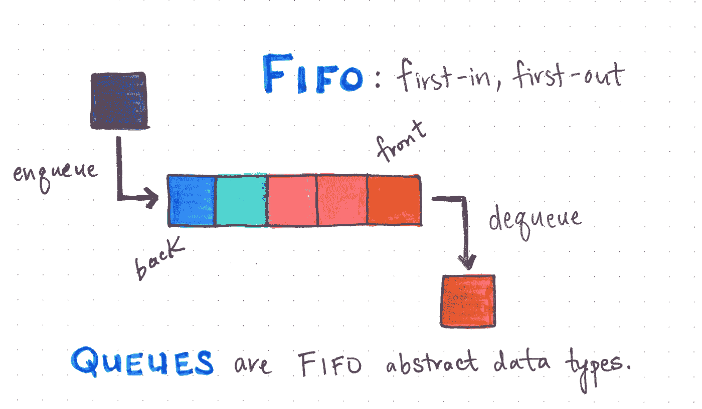
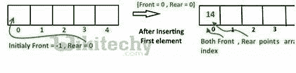
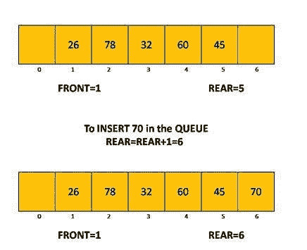
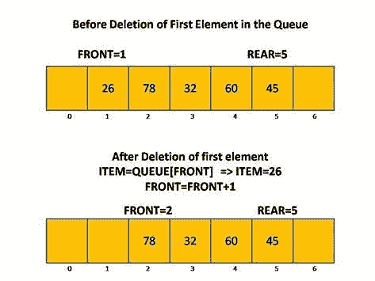
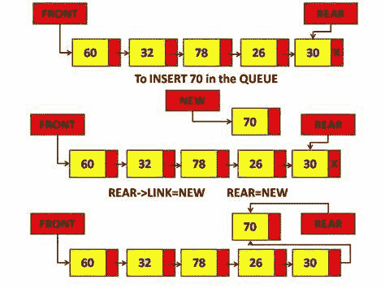
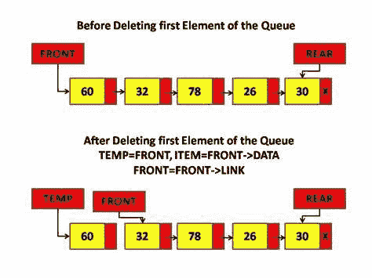
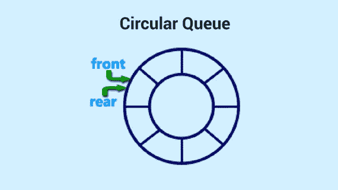
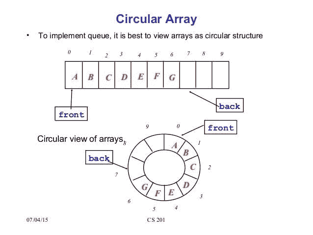
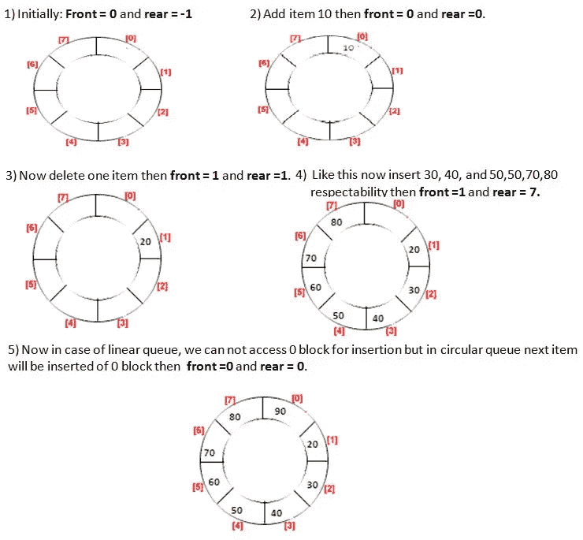
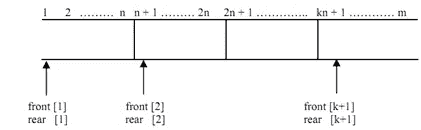

# 队列数据结构

> 原文：<https://medium.com/mlearning-ai/queue-data-structure-65cc3a1edc02?source=collection_archive---------10----------------------->

**队列**

"队列是计算机应用中广泛使用的一种重要数据结构."

非原始线性数据结构。

队列使用的机制叫做**先进先出(FIFO)**

在称为**后端**的一端添加新元素，在称为**前端**的另一端删除现有元素

队列中元素在称为**“后”**的一端被添加，并从称为**前”的另一端被移除。**

*   在队列中插入元素的过程称为**入队**，从队列中删除元素的过程称为**出列。**
*   **队列中的元素总数=后-前+1。**
*   队列的数组实现可以实现为一个**数组**或一个**链表。**

**Array Implementation Of Queue**

**对队列执行的操作**

*   **前置:**用于从队列中获取前置元素。
*   **后置:**用于从队列中获取后置元素。
*   **enQueue():** 这个函数用来在队列中插入新值。新元素总是从后端插入。
*   **deQueue():** 这个函数从队列中删除一个元素。队列中的删除总是发生在前端。

**1.Insertion/Enqueue**

***入队算法***

**Step.1:** 如果 rear=max-1，则写“溢出”并退出。[if 循环结束]

**Step.2** :如果 front=-1，rear=-1，则设置 front=0，rear=0，否则 rear=rear+1。[if 循环结束]

**步骤 3** :设定队列【后方】=数量。

**步骤 4** :退出

**Insertion In Queue**

**2。删除操作/退出**

***删除/去队列算法***

**步骤:1。**如果 front=-1 或 front > rear，则写“下溢”。

**步骤:2** 。else 设置值=queue[front]。

**步骤:3** 。设置正面=正面+1。

[if 结束]

**第四步。**退出。

**Deletion In Queue**

**联动队列的实现**

在链接队列中，每个元素有两部分，一部分存储数据，另一部分存储下一个元素的地址。

开始指针用作第一个，另一个指针称为后指针，用于队列中的最后一个元素。

*   如果 front=rear=null，则表明队列为空

1.  **使用链表插入/入队**

***算法***

*   步骤 1: 为新节点 PTR 分配空间
*   **第二步:**设置 PTR - > DATA = VAL
*   **第三步:**IF FRONT = NULL
    SET FRONT = REAR = PTR
    SET FRONT->NEXT = REAR->NEXT = NULL
    ELSE
    SET REAR->NEXT = PTR
    SET REAR = PTR
    SET REAR->NEXT = NULL
    【IF 结束】
*   **第四步:**结束

**Insertion/Enqueue using linked list**

**2。删除操作/出列**

***算法***

*   **步骤 1:** 如果 FRONT = NULL
    写“下溢”
    转到步骤 5
    【IF 结束】
*   **第二步:**设置 PTR = FRONT
*   **第三步:**设置 FRONT = FRONT - >下一步
*   **第四步:**释放 PTR
*   **第五步:**结束

**Deletion operation/Dequeue**

# 环形队列

“环形队列类似于线性队列，因为它也基于 **FIFO(先进先出)**原则，除了最后一个位置连接到形成一个圆圈的环形队列的第一个位置。它也被称为*。”*

*   *元素在队列的后端添加，在队列的前端删除。*

*前后指针都指向数组的开头。*

**

***循环队列可以通过三种方式创建:***

1.  *使用单链表*
2.  *使用双向链表*
3.  *使用数组*

***使用数组的循环队列***

**

***Circular queue using arrays***

***在循环队列中插入元素的算法***

***第一步:** IF (REAR+1)%MAX = FRONT
写“溢出”
【IF 结束】*

***第二步:**如果 FRONT = -1 和 REAR = -1
设置 FRONT = REAR = 0
否则如果 REAR = MAX — 1 和 FRONT！= 0
SET REAR = 0
ELSE
SET REAR =(REAR+1)% MAX
[IF 结束]*

***第三步:**设置队列[后方] = VAL*

***第四步:**退出*

***从循环队列中删除一个元素的算法***

***步骤 1:** 如果 FRONT = -1
写“下溢”*

*[IF 结束]*

***第二步:**设置 VAL = QUEUE[FRONT]*

***第三步:**IF FRONT = REAR
SET FRONT = REAR =-1
ELSE
IF FRONT = MAX-1
SET FRONT = 0
ELSE
SET FRONT = FRONT+1
【IF 结束】
【IF 结束】*

***第四步:**退出*

***循环队列的实现***

**

***Implementation Of Circular Queue***

# *优先队列*

*   *优先级队列是一种数据结构，其中每个元素都被分配了一个优先级。*
*   *每个元素的优先级将用于确定元素的处理顺序。*

# *多个队列*

*多队列是**维护多个队列的数据结构***

*它可以用一维数组或多维数组来表示多队列*

**

***Multiple Queue In Array***

***队列的应用***

*   *管理单个共享资源上的请求，如 CPU 调度和磁盘调度*
*   *处理硬件或实时系统中断*
*   *处理网站流量*
*   *网络中的路由器和交换机*
*   *维护媒体播放器中的播放列表*

# ***常见问题解答***

***Q1。用什么数据结构可以实现优先级队列？***

*Ans。我们可以使用各种数据结构来实现优先级队列，比如链表、数组、二叉查找树或堆。然而，堆是实现优先级队列的最有效的数据结构。*

***Q2。队列数据结构是用来做什么的？***

*Ans。队列数据结构有多种应用。队列数据结构用于服务单个共享资源上的请求，即当单个资源在多个消费者之间共享时，例如打印机和 CPU 任务调度。队列数据结构还用于管理硬件或实时系统中断、管理网站流量以及网络中的路由器和交换机。*

***Q3。栈和队列在数据结构上有什么区别？***

*Ans。堆栈和队列是线性数据结构，其中的元素按顺序存储并在一次运行中被访问。堆栈和队列在数据结构上的主要区别是堆栈遵循 LIFO 原则，而队列遵循 FIFO 方法。在 LIFO 或后进先出中，将首先处理插入堆栈的最后一个元素，而在 FIFO 或先进先出中，将首先处理队列中的第一个元素。*

***Q4。什么是数据结构中的双端队列？***

*Ans。双端队列是一种队列数据结构，其中元素的插入和移除可以发生在两端，即前端和后端。*

# *结论*

*我们希望这篇文章对你有用。深入理解队列数据结构的重要概念、类型、实现和应用程序将有助于提高您的技能。*

* [## Mlearning.ai 提交建议

### 如何成为 Mlearning.ai 上的作家

medium.com](/mlearning-ai/mlearning-ai-submission-suggestions-b51e2b130bfb) 

🔵 [**成为作家**](/mlearning-ai/mlearning-ai-submission-suggestions-b51e2b130bfb)*