# 反事实回归(CFR)快速介绍

> 原文：<https://medium.com/mlearning-ai/quick-introduction-to-counterfactual-regression-cfr-382521eaef21?source=collection_archive---------0----------------------->


Photo by [Alex Knight](https://www.pexels.com/@agk42/) from [Pexels](https://www.pexels.com/photo/high-angle-photo-of-robot-2599244/):

日语里有个有趣的短语“Deep de Pon！(Deepでポン！)".这句话本意是贬损把深度学习应用于一切和任何事物的态度。

虽然深度学习在 NLP 和 CV 等领域的表现确实令人印象深刻，但它在因果推理方面的活动似乎有限。在因果推断中，仔细讨论识别策略是最重要的，然后只是选择一个合适的估计方法。显然，出于这个目的，提出深度学习是大材小用。这就像“深德邦！”。

不过最近在因果推理领域出现了一些使用深度学习的有趣论文。今天我们要介绍其中的一种，**反事实回归**(以下简称 **CFR** )。

本帖描述的模型原纸如下:

**【沙利特等人，2017】沙利特，尤里，弗雷德里克·d·约翰逊，大卫·桑塔格。"估计个体治疗效果:一般化界限和算法."机器学习国际会议。PMLR，2017。**

**【约翰松等人，2016】约翰松、弗雷德里克、尤里·沙利特、大卫·桑塔格。"学习反事实推理的表征."机器学习国际会议。PMLR，2016。**

我们特别关注【Shalit et al. 2017】。【Johansson et al .，2016】不是主要关注点，但这里有一些比较容易理解的数字和解释，我们酌情参考

## **目录和摘要**

由于这篇文章的篇幅有点大，所以先提供一个目录和摘要。我们希望你只阅读你需要知道的东西。

```
**1\. Motivation :** 
CFR is a model for causal inference and was developed specifically for estimating ITE (Individualized Treatment Effect).
We will discuss its estimation difficulties.**2\. CFR’s Solution :** This section describes the CFR's solution.
If you would like to get at least a rough idea of this model, we hope you will read this section alone!**3\. Theoretical Bound :** This chapter discusses the theoretical bound for errors in estimated causal effects. This is a detailed discussion and can be skipped; we will only introduce the conclusion.**4\. Let's do it with PyTorch :**
Since the implementation in the original paper was in TensorFlow, a simple rewrite in PyTorch is presented here. Even if you are not good at mathematics, you should be able to understand it better by reading the python code.**5\. Experiments and discussion on hyperparameters :** Here we perform several experiments on hyperparameters. Although there is a problem that the sample data selected for this blog was not very suitable for this model, we would like to share the difficulty of tuning α as a practical issue.**6\. Why do we need CFR?**
Although CFR has some practical difficulties, such as the difficulty of adjusting alpha, I would like to show what the benefits of CFR are. Although this is a somewhat personal and subjective view, we hope that the expressive power of DeepLearning will broaden the scope of causal inference. we are looking forward to further breakthroughs in the future.
```

# 1.动机

首先，下面是我们希望寻求的估计。我们在这里提出的模型是用来无偏地估计 ITE(个体化治疗效果)的；我们感兴趣的是每个个体的因果效应，而不是对群体的效应，如 ATE(平均治疗效应)和 ATT(平均治疗效应)。(当然，ATE 和 ATT 可以通过合计 ITE 来计算。

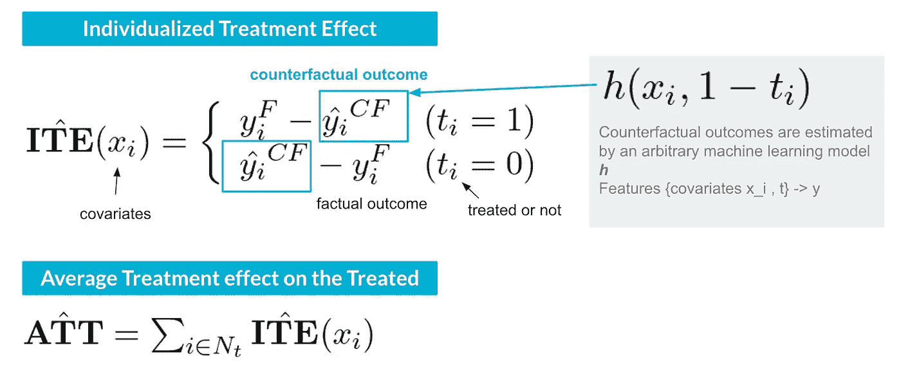

Figure 1: “ITE” Based on [Johansson et al., 2016], with additional explanations added by the author.

和上面 ITE 的定义一样，ITE 由 yF 和 yCF 组成。前者是实际观察到的结果，而后者是治疗相反的世界中的潜在结果(反事实结果)。yCF 不是直接观测到的，所以可以用任何机器学习模型来估计。

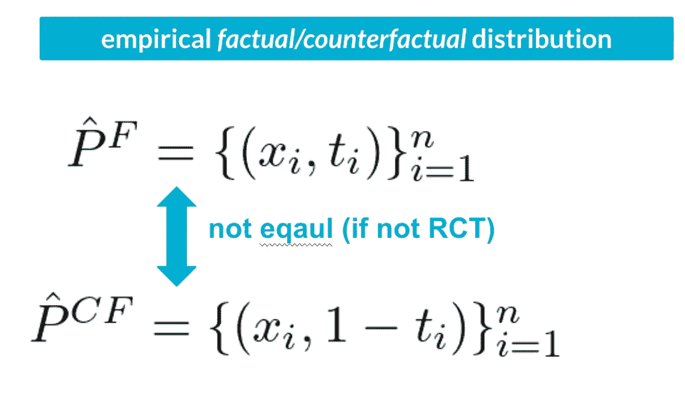

Figure 2: “empirical factual/counterfactual distribution” Based on [Johansson et al., 2016], with additional explanations added by the author.

然而，很难正确预测 yCF。这是因为经验事实分布不等于经验反事实分布。

CFR 概念的有趣之处在于，它将这个问题视为一个**协变量转移**。

> “通过反事实预测进行因果推断的问题可能需要对不同于给出样本的分布进行推断。在机器学习术语中，这意味着测试集的特征分布不同于训练集的特征分布。这是协变量移位的一个例子，是域适应的一个特例”[Johansson et al .，2016]

# **2。CFR 的解决方案**

以下来自[Johansson et al. 2016]的概念性图解是理解 CFR 的最佳方式。

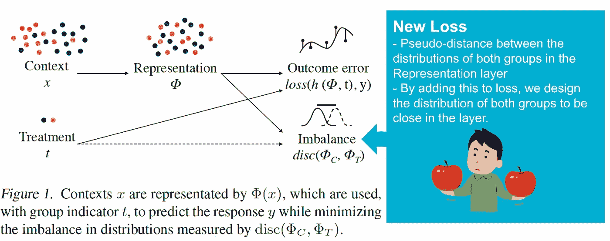

Figure 3: “CFR concept” Based on [Johansson et al., 2016], with additional explanations added by the author.

值得注意的是，新增了一个**损失**。
这是一种损失，它在从协变量 x 到 y 的网络中间创建了一个**表示层**，并调整 t=1 和 t=0 的分布，使其尽可能相似。

更具体的架构如下:

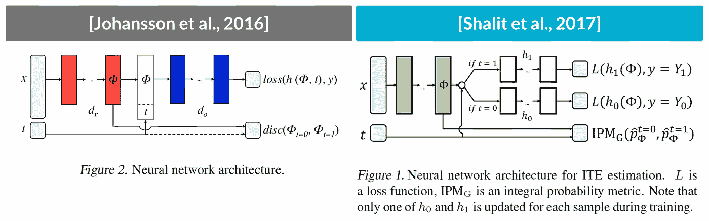

Figure 4: “CFR architectures” Based on [Johansson et al., 2016] and [Shalit er al., 2017], with additional explanations added by the author.

网络定义
- *repnet* :从协变量 x 到表示层的网络
- *outnet* :从表示层到结果 y 的网络

在[Johansson et al .，2016]中， *outnet* 很简单:一个 MLP(多层感知器)，将表示层和处理变量作为输入( *`split_outnet=False`* )。
另一方面，*out net*in【Shalit er al。，2017]基于治疗的存在或不存在构建两个 MLP(*` split _ outnet = true `*)。

下面我们基本采用[Shalit er al]的架构。2017].

目标函数如下:

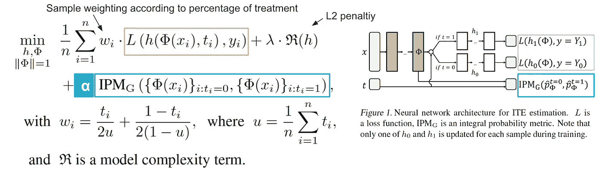

Figure 5: “CFR’s object function” Based on [Shalit er al., 2017], with additional explanations added by the author.

*   上图中的红框是正常监督学习的损失。
*   蓝色外壳是 CFR 专用损耗；表示层中处理和控制分布的伪距离(IPM)被视为损失。
*   **α** 是一个超参数，用于调整 IPM 损失(惩罚)的贡献

*此处仅供参考，有困惑的可以不看，但 CFR 将因果推理视为领域适应。
从下面可以看出，确实很清楚，架构和目标函数类似于领域对抗性神经网络(DANN)【Ganin et al .，2016】。*


Figure 6: “DANN vs. CFR” Based on *[Ganin et al., 2016] and* [Shalit er al., 2017], with additional explanations added by the author.

# **3。理论界限**

虽然这一章有些详细，但我们之所以介绍它，是因为它是 CFR 的有趣特性之一。首先，我们定义 ITE 误差。

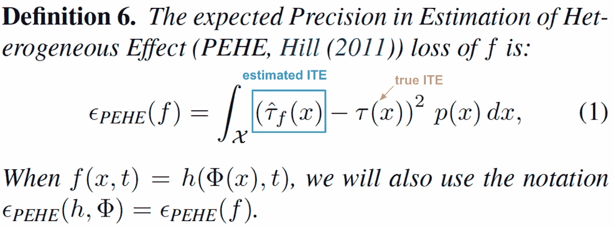

Figure 7: “the expected PEHE loss” Based on [Shalit er al., 2017], with additional explanations added by the author.

这是一个明显但**不可测量的指标。**(不可能知道真实的 ITE τ(x))。但是，CFR 告诉我们，存在一个**理论界限**！！

为了得出界限，我们将“**例外反事实损失**定义如下:与“预期实际处理/控制损失”(下图左侧)不同，后者实际上也无法观察到。

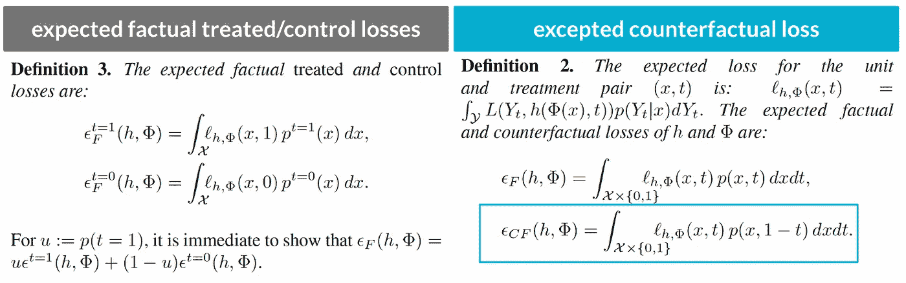

Figure 8: “the expected counterfactual loss” Based on [Shalit er al., 2017], with additional explanations added by the author.

通过设定例外反事实损失的上限，我们能够证明 ITE 损失(PEHE 损失)与预期实际处理/控制损失和 IPM 损失(两者都是可观察损失)有一个上限。

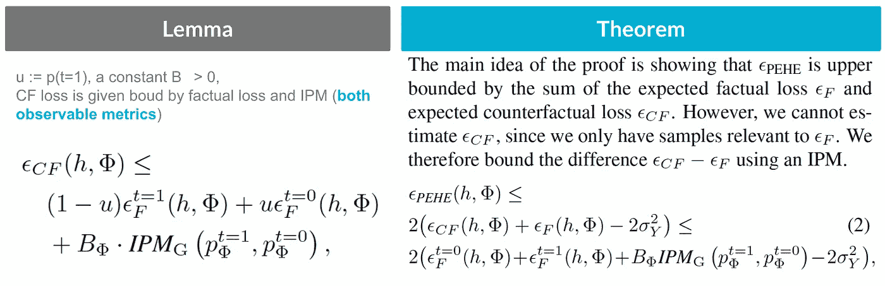

Figure 9: “a theoretical bound” Based on [Shalit er al., 2017], with additional explanations added by the author.

以上引理的证明请参考原论文的附录[Shalit er al ., 2017].

# 4.让我们用 PyTorch 做吧

以下两个 github 存储库用作参考。

*   https://github.com/clinicalml/cfrnet
*   https://github.com/koh-t/SC-CFR

前者([cfrnet])是原版的正式实现；在 TensorFlow 中实现。里面的算法作为参考。后者([SC-CFR])是用 PyTorch 实现的，和我的一样。模型的架构是不同的，但是我使用了许多类定义等等。作为参考。

我的资源库如下:【https://github.com/MasaAsami/introduction_to_CFR】T5


## cfr.py

cfr.py

*   第 139 行定义了 *repnet* 。
*   149 和 152 线为 *outnet* ，分别用于处理和控制。
*   第 73~91 行是 CFR 中新增的 IPM 损耗。在本实验中，**线性最大均值差异**(线性 MMD)被用作 IPM 损失。

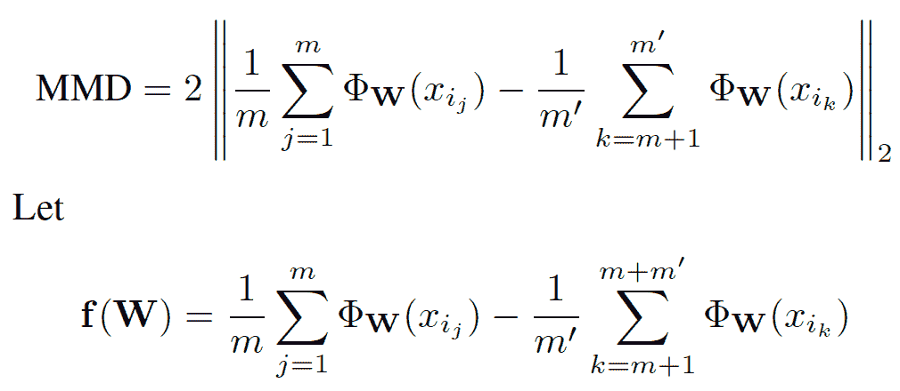

Figure 10: “linear MMD” Based on [Shalit er al., 2017]

*   原始论文中的形式算法具有收敛判定机制，但是为了简单起见，我们上面的实现使用了固定数量的历元(在第 35 行)。

## 数据集:

在这里，正如我们之前的文章一样，我们使用了 LaLonde 数据集(失业者职业培训数据集)；国家支持工作演示(NSW)数据集是一个 RCT，因此真实的 ATT 是可以确定的。(ATT=1676.3426)
我们采用非实验数据(CPS:当前人口调查)作为对照组，并移除新南威尔士州对照组，以创建数据进行验证。

(详见[上一篇](https://python.plainenglish.io/comparison-of-estimation-methods-in-causal-inference-16f5ac9ed122)和本文末尾的附录。)

## 配件:

超参数设置如下:

```
cfg **=** {
    "alpha": 10 ****** 6,
    "lr": 1e-3,
    "wd": 0.5,
    "sig": 0.1,
    "epochs": 1000,
    "ipm_type": "mmd_lin",
    "repnet_num_layers": 3,
    "repnet_hidden_dim": 48,
    "repnet_out_dim": 48,
    "repnet_dropout": 0.145,
    "outnet_num_layers": 3,
    "outnet_hidden_dim": 32,
    "outnet_dropout": 0.145,
    "gamma": 0.97,
    "split_outnet": **True**,
}
```

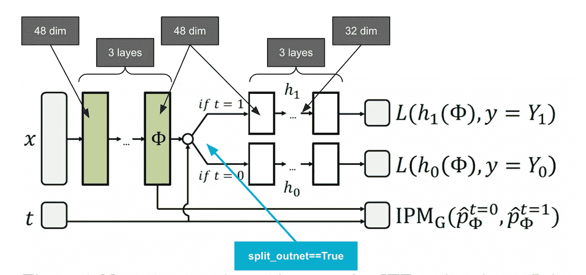

Figure 11: “temp hyperparams” Based on [Shalit er al., 2017], with additional explanations added by the author.

```
model **=** CFR(in_dim**=**8, out_dim**=**1, cfg**=**cfg)

within_result, outof_result, train_mse, ipm_result **=** model**.**fit(
    dataloader, X_train, y_train, t_train, X_test, y_test, t_test, logger
)
```

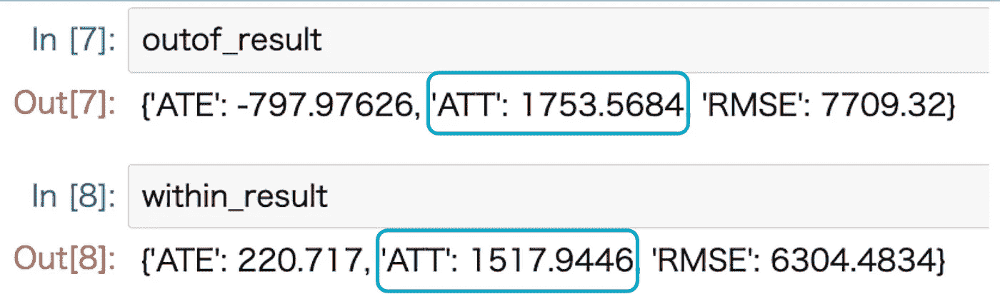

Figure 12: “fitting results” by the author.

真正的 ATT 是 1676.3426。看起来应该不远了。

## **表现层可视化:**

通过 t-SNS(*` sk learn . manifold . tsns `*)对表示层分布情况进行二维汇总，然后可视化。原始数据位于左侧，制图表达图层位于右侧。

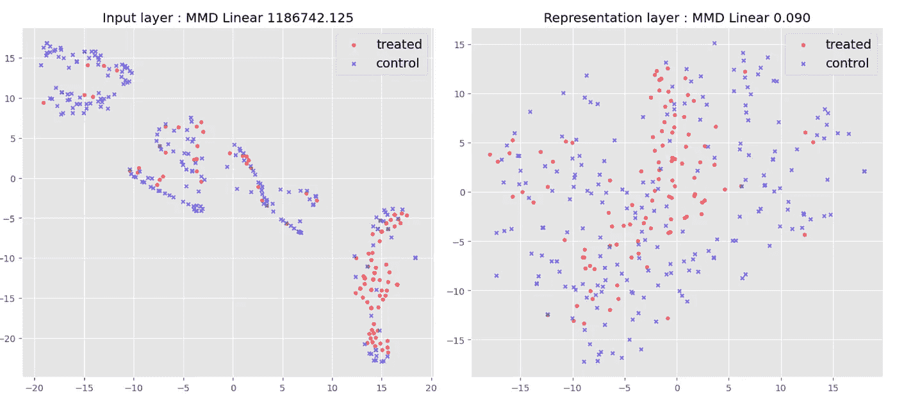

Figure 13: “visualization of representation layer” by the author.

# **5。超参数的实验和讨论**

使用“ [**九头蛇**](https://hydra.cc/docs/intro/) 和“ [**mlflow**](https://mlflow.org/) 建立实验环境

基础超参数在 yaml 文件(*` config/experiments . YAML`*)中描述，实验结果在 mlflow 中管理。
验证的参数如下
-通过 outnet_split 的真/假验证 ATT 变化多少
-通过按以下顺序改变α验证 ATT 的变化

```
$ python experiment_run.py -m alpha=0,0.1,0.01,0.001,0.0001,1,100,10000,100000,1000000,10000000,100000000,1000000000,10000000000,100000000000 split_outnet=True,False
```

以下命令启动 mlflow 浏览器，并允许您检查结果。

```
$ mlflow ui
```

然后:

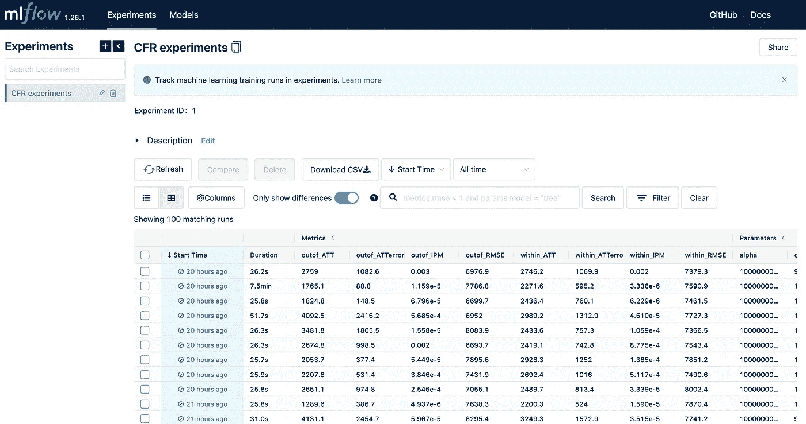

Figure 14: “MLflow UI” by the author.

## 实验结果

结果如下。
-顶行:样本内，底行:样本外
-左:ATT 估计值(虚线为真实的 ATT)，右:结果预测误差(RMSE)

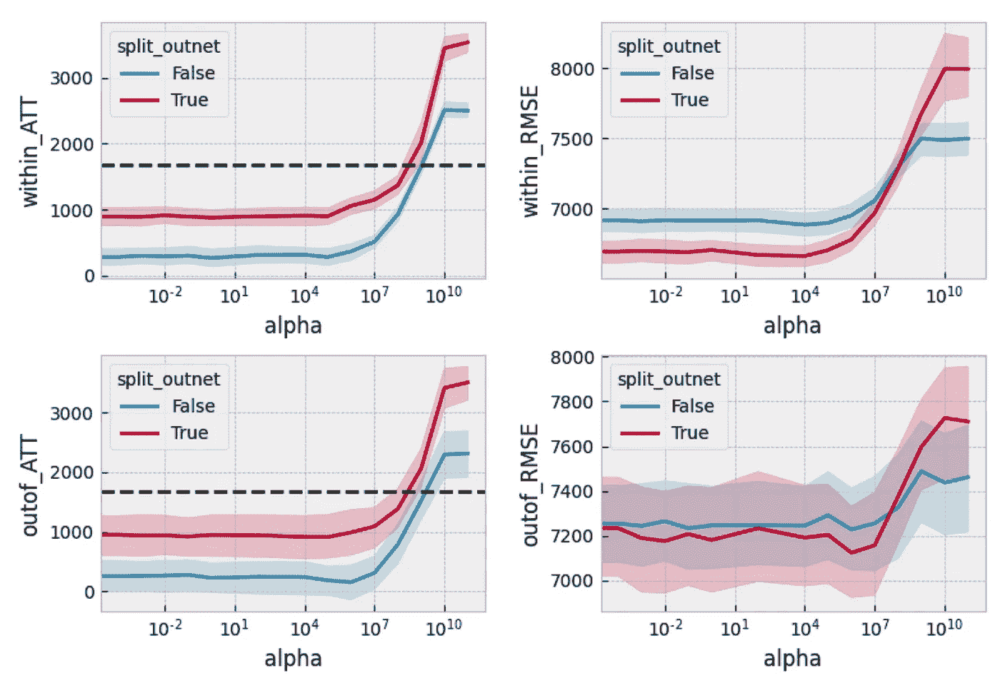

Figure 15: “Experiments Results” by the author.

## **讨论(1/2) split_outnet:**

当 split_net==False 时(即 *outnet* 未分割)，治疗效果始终被估计为较低。

这可能是由于正则化偏差(收缩估计)的影响。

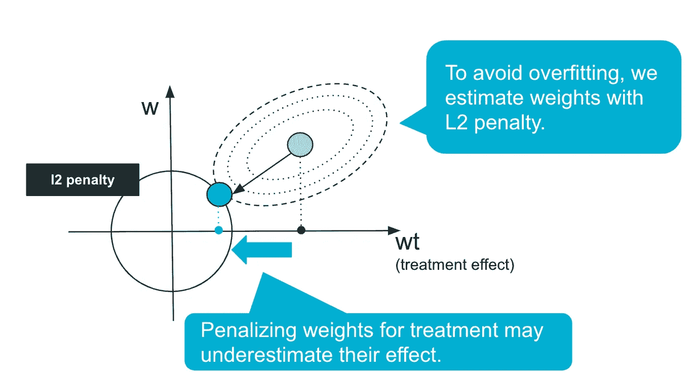

Figure 16: “shrinkage estimation with L2 penalty” by the author.

顺带一提，这个结果并没有直接批评【Johansson et al. 2016】。【Johansson et al .，2016】的目标函数与【Shalit et al .，2017】的目标函数一开始就有些不同，所以这不是一个公平的比较。
我们还认为这不是架构本身的缺陷，因为低估因果效应可能可以通过设计一种不在 *outnet* 中包含正则项的方法来避免。
但是，由于【Shalit et al .，2017】通过有无处理来分离*outnet*，对 *outnet* 本身的正则化惩罚不应该应用于处理效果，我们认为有可能构建更复杂的 *outnet* 。

## 讨论(2/2) α:

在这些数据中，几乎没有阿尔法收益。原始论文[Shalit 等人，2017 年]也使用了 LaLonde 作业数据集，并指出:

> “在就业方面，我们认为使用 IPM 惩罚措施的收益比 IHDP 要小。我们相信这是事实，因为当我们最小化我们对观察数据的限制并考虑这种偏差时，我们只是在随机子集上评估预测，其中治疗组分布相同。”[沙利特等人，2017 年]

无论如何，α的调谐难度是很高的。
在大多数情况下，真实的治疗效果是未知的，因此我们别无选择，只能根据 IPM 和结果损失做出模糊决策。

这个问题在原文中也被定位为**未决问题**:

> “重要的开放性问题是选择 IPM 权重α时的理论考虑，如何最好地获得我们模型预测的置信区间，以及如何将我们的工作与更复杂的因果模型(如具有隐藏混杂变量或工具变量的模型)相集成。”[沙利特等人，2017 年]

# 6.为什么我们需要 CFR？

这一章是**我的个人观点**，所以我希望你可以随意阅读……
当我第一次了解 CFR 的时候，我很不尊重地认为它是矫枉过正。(在我看来这是一个“深 de Pon！”努力的类型，正如我在这篇文章开头所说的。)

α的寻找太难了，再加上还有其他模型来估算 ITE，所以我不好意思说，我个人并没有特别看到 CFR 的重要性。

不过最近有 CFR 应用的论文，我觉得很吸引人。如你所知，深度学习是一个非常有表现力的模型，并且**不再需要成为表格数据**。

[Takeuchi 等人，2021]的以下应用将协变量作为图像进行处理。

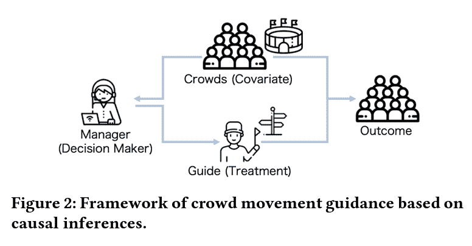

Figure 17: “covariates as images” by[Takeuchi et al., 2021].

*   疏散引导被认为是一种治疗，干预的概率用剧院的拥挤程度来解释(**图像数据**)。
*   决策者看着拥挤的人群，决定是否治疗。


Figure 18: “SC-CFR” by [Takeuchi et al., 2021].

以上是 SC-SCR [Takeuchi et al .，2021]的架构，它使用一个 CNN(卷积神经网络)用于 *repnet* ，允许协变量作为图像处理并用于偏差调整。

希望深度学习的表达能力能够拓宽因果推理的范围。期待未来能有进一步的突破。

# 参考

## (论文)

*   [Shalit 等人，2017 年] Shalit、Uri、Fredrik D. Johansson 和 David Sontag。[估计个体治疗效果:推广范围和算法。](https://proceedings.mlr.press/v70/shalit17a/shalit17a.pdf)“机器学习国际会议。2017 年，PMLR
*   【Johansson et al .，2016】Johansson，Fredrik，Uri Shalit，和 David Sontag。[学习反事实推理的表征。](http://proceedings.mlr.press/v48/johansson16.pdf)“机器学习国际会议。PMLR，2016。
*   [Takeuchi 等人，2021 年] Takeuchi，Koh 等人.“[抓住人群的缰绳:使用因果推理估计人群运动引导的效果](https://arxiv.org/abs/2102.03980)” *arXiv 预印本 arXiv:2102.03980，* 2021。
*   【加宁等人，2016】加宁，y；乌斯季诺瓦，e；阿贾坎，h；日尔曼，p。拉罗歇尔；拉维奥莱特，f；马尔尚，m。和 Lempitsky，v . .[神经网络的领域对抗训练](https://jmlr.org/papers/volume17/15-239/15-239.pdf)机器学习研究杂志 17(1):2096–2030，2016。

## (Python 代码)

*   https://github.com/clinicalml/cfrnet
*   https://github.com/koh-t/SC-CFR

## **(我的 github** 资源库 **)**

*   https://github.com/MasaAsami/introduction_to_CFR

# 我的幻灯片

# 附录:数据集

## 描述

该工作数据集是 Dehejia 和 Wahba (1999)用于评估倾向得分匹配方法的国家支持工作示范数据集之一。该数据集和其他相关数据集(如 CPS)可在[http://users.nber.org/~rdehejia/data/nswdata2.html](http://users.nber.org/~rdehejia/data/nswdata2.html)获得。

## python 代码

```
import pandas as pd# LaLonde dataset(RCT)
RCT_DATA = "[http://www.nber.org/~rdehejia/data/nsw_dw.dta](http://www.nber.org/~rdehejia/data/nsw_dw.dta)"# Data limited to cps surveys that were unemployed at the time of the survey.
CPS_DATA = "[http://www.nber.org/~rdehejia/data/cps_controls3.dta](http://www.nber.org/~rdehejia/data/cps_controls3.dta)"df = pd.concat(
    [
        pd.read_stata(RCT_DATA).query(
            "treat>0"
        ),  # RCT data, only treated data is extracted.
        pd.read_stata(CPS_DATA),
    ]
).reset_index(drop=True)del df["data_id"]df["treat"] = df["treat"].astype(int)df.sample(5)
```

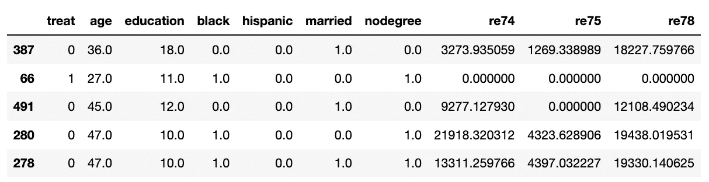

Figure 19: “dataset sample” from NSW + CPS.

```
df.groupby("treat")["re78"].count()
```

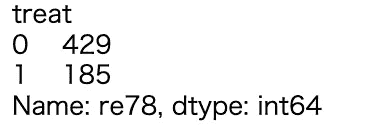

Figure 20: “sample size” from NSW + CPS.

## 格式

治疗分配指示符是数据帧的第一个变量:`treat` (1 =已治疗；0 =控制)。接下来的 7 列是协变量:

*   `age`，以年计量；
*   `education`，以年计量；
*   `black`，表示人种(黑人为 1，其他为 0)；
*   `hispanic`，表示种族(如果是西班牙裔为 1，否则为 0)；
*   `married`，表示婚姻状况(已婚为 1，否则为 0)；
*   `nodegree`，表示高中毕业证(无学位为 1，否则为 0)；
*   `re74`，1974 年的真实收益；
*   `re75`，1975 年真实收益。

最后一个变量是`re78`，1978 年的真实收益(`outcome`)。

## 来源

[http://users.nber.org/~rdehejia/data/nswdata2.html](https://users.nber.org/~rdehejia/data/)

## 数据参考

*   Dehejia，r .和 Wahba，s .,“非实验研究中的因果效应:重新评价培训计划的评估”，*美国统计协会杂志*，94，1053–1062，1999 年。
*   拉隆德，“评估培训项目的计量经济学评估”，*《美国经济评论》*，76，604–620，1986 年。
*   安井翔太（著）株式会社ホクソエム（監修）.『効果検証入門：正しい比較のための因果推論／計量経済学の基礎』技術評論社, 2020.

[](/mlearning-ai/mlearning-ai-submission-suggestions-b51e2b130bfb) [## Mlearning.ai 提交建议

### 如何成为 Mlearning.ai 上的作家

medium.com](/mlearning-ai/mlearning-ai-submission-suggestions-b51e2b130bfb)